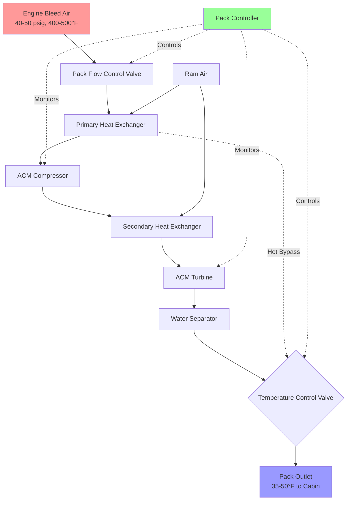
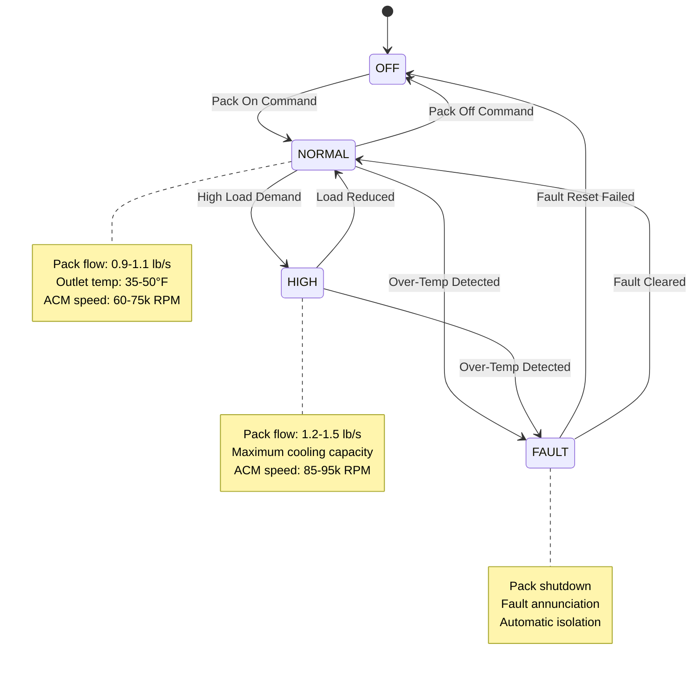

Aircraft air conditioning pack operation involves precise thermodynamic control of the air cycle refrigeration process to deliver conditioned air across widely varying flight conditions. The pack controller manages multiple interdependent variables including bleed air pressure, heat exchanger effectiveness, turbine expansion ratio, and moisture removal to maintain cabin comfort while preventing ice formation and ensuring system protection. Understanding pack operational modes and control strategies is essential for system optimization, troubleshooting, and performance analysis.

## Operational Cycle Analysis

The complete pack operational cycle transforms high-energy bleed air into conditioned cabin supply air through a series of thermodynamic processes governed by fundamental gas laws and heat transfer principles.

### Complete Thermodynamic Process

The air conditioning pack executes the following process sequence during normal operation:

**Stage 1: Bleed Air Conditioning**
- High-pressure bleed air (40-50 psig, 400-500°F) from engine compressor stages
- Flow regulation via pack flow control valve (FCV)
- Pressure reduction through orifice or control valve to optimize ACM inlet conditions
- Temperature remains elevated due to isenthalpic expansion

**Stage 2: Primary Heat Rejection**
- Hot bleed air enters primary heat exchanger (PHX)
- Ram air or fan-driven cooling air provides heat sink
- Effectiveness typically 60-75% depending on ram air conditions
- Temperature reduced to 150-250°F depending on flight regime

**Stage 3: Compression (Bootstrap Cycle)**
- Pre-cooled air enters ACM compressor wheel
- Pressure ratio 1.8-2.2:1 increases air pressure and temperature
- Compression work provided by turbine via common shaft
- Isentropic efficiency 75-85% for modern ACM compressors

The compressor work relationship:

$$W_c = \dot{m} \cdot c_p \cdot (T_{c,out} - T_{c,in})$$

Where compressor outlet temperature for isentropic compression:

$$T_{c,out} = T_{c,in} \cdot \left(\frac{P_{c,out}}{P_{c,in}}\right)^{\frac{\gamma-1}{\gamma}} \cdot \frac{1}{\eta_c}$$

**Stage 4: Secondary Heat Rejection**
- Compressed air (now 250-350°F) enters secondary heat exchanger
- Additional heat rejection to ram air stream
- Critical for achieving sub-freezing turbine inlet temperatures
- Exit temperature 100-180°F depending on conditions

**Stage 5: Turbine Expansion**
- High-pressure air expands across turbine wheel
- Pressure ratio 2.5-3.5:1 converts thermal energy to shaft work
- Temperature drops dramatically due to expansion cooling
- Turbine isentropic efficiency 80-90%

The expansion process follows:

$$T_{t,out} = T_{t,in} \cdot \left[1 - \eta_t \cdot \left(1 - \left(\frac{P_{t,out}}{P_{t,in}}\right)^{\frac{\gamma-1}{\gamma}}\right)\right]$$

**Stage 6: Water Separation**
- Turbine discharge air (35-50°F) enters high-efficiency water separator
- Centrifugal and coalescing forces extract condensed moisture
- Prevents ice formation in distribution ducts
- Water extraction system removes collected liquid

**Stage 7: Temperature Trim and Mixing**
- Cold turbine air may be mixed with hot bypass air via temperature control valve
- Provides precise outlet temperature control independent of pack capacity
- Prevents excessive cooling and ice formation risks
- Final pack outlet temperature delivered to mixing manifold

### Energy Balance and Coefficient of Performance

The pack thermodynamic efficiency can be expressed as a coefficient of performance (COP) comparing refrigeration effect to input energy:

$$COP_{pack} = \frac{Q_{cooling}}{\Delta h_{bleed}}$$

Where the cooling effect represents the enthalpy reduction from bleed air to pack discharge, and the input energy is the enthalpy of the bleed air extracted from the engine. Typical aircraft pack COP values range from 0.5-0.8, significantly lower than vapor compression systems but acceptable given the constraints of aircraft operation.

The total refrigeration capacity delivered:

$$Q_{total} = \dot{m}_{pack} \cdot c_p \cdot (T_{bleed} - T_{pack,out})$$

For a typical narrow-body aircraft pack with 1.0 lb/s flow, 450°F bleed temperature, and 45°F pack outlet temperature, the refrigeration capacity equals approximately 115,000 BTU/hr per pack.

## Pack Control Modes and Strategies

Modern pack controllers implement sophisticated control algorithms to optimize performance across the flight envelope while ensuring system protection and passenger comfort.

### Flow Control Modes

Pack flow control represents the primary capacity modulation method, regulating the mass flow rate of air processed through the pack.

| Flow Mode | Typical Flow Rate | Application | Bleed Impact |
|-----------|------------------|-------------|--------------|
| OFF | 0 lb/s | Pack shutdown, APU start | Zero bleed extraction |
| LOW | 0.6-0.8 lb/s | Light passenger load, cool OAT | Minimal engine performance impact |
| NORMAL | 0.9-1.1 lb/s | Standard operations | Normal bleed extraction |
| HIGH | 1.2-1.5 lb/s | High load, hot OAT, single pack | Maximum bleed extraction |

Flow control is achieved through pack flow control valve positioning, which modulates the pressure drop upstream of the pack to control mass flow. The relationship between pressure drop and flow follows:

$$\dot{m} = C_d \cdot A \cdot \sqrt{\rho \cdot \Delta P}$$

Where $C_d$ is the discharge coefficient, $A$ is the flow area, $\rho$ is the air density, and $\Delta P$ is the pressure drop across the control valve.

### Temperature Control Strategies

Pack outlet temperature control utilizes multiple control loops to maintain desired discharge temperature despite varying ambient conditions and system loads.

**Primary Control Loop:**
- Monitors pack discharge temperature sensor
- Compares to temperature demand signal (typically 35-50°F)
- Modulates ram air doors or temperature control valve
- Response time 2-5 seconds for typical disturbances

**Bypass Mixing Control:**
The temperature control valve (TCV) mixes hot bypass air with cold turbine discharge to achieve precise temperature control:

$$T_{pack,out} = T_{turbine} \cdot (1 - x) + T_{bypass} \cdot x$$

Where $x$ represents the bypass fraction (0 to 0.3 typical range). This allows independent control of pack temperature from refrigeration capacity, enabling operation at maximum cooling capacity while delivering warmer air when required.

**Ram Air Modulation:**
Alternative control method varies heat exchanger effectiveness by controlling ram air flow:
- Ram air doors modulate from fully closed to fully open
- Reduced ram air flow decreases heat rejection
- Increases turbine inlet temperature, reducing refrigeration effect
- Common on older aircraft designs

### ACM Speed Control

Turbine shaft speed represents a key performance variable controlled through inlet pressure regulation and load management.

**Speed Control Parameters:**

| Condition | Typical ACM Speed | Control Action |
|-----------|------------------|----------------|
| Ground operations, high OAT | 85,000-95,000 RPM | Maximum cooling demand |
| Cruise, moderate load | 60,000-75,000 RPM | Normal operations |
| Descent, low load | 45,000-60,000 RPM | Reduced cooling demand |
| Ice protection mode | Variable | Prevent sub-freezing turbine outlet |

Higher ACM speeds increase both compressor pressure ratio and turbine expansion ratio, enhancing refrigeration capacity. Speed is controlled by regulating pack inlet pressure via the flow control valve and through turbine inlet pressure via heat exchanger bypass valves on some systems.

The centrifugal stress on ACM components increases with speed squared:

$$\sigma = \rho \cdot \omega^2 \cdot r^2$$

This limits maximum operational speeds and requires careful speed monitoring to prevent over-speed conditions that could cause mechanical failure.

## System Protection Logic

Pack controllers implement multiple protection schemes to prevent damage from out-of-limit conditions while maintaining maximum operational availability.

### Temperature Limit Protection

**Compressor Discharge Over-Temperature:**
- Limit: 390-400°F (varies by aircraft type)
- Cause: Excessive bleed temperature, insufficient ram air cooling
- Response: Pack automatically shuts down, fault annunciation
- Recovery: Automatic restart after temperature normalizes

**Turbine Outlet Temperature Limits:**
- High limit: 75-85°F (ice formation prevention)
- Low limit: -10 to 0°F (excessive cooling, ice blockage risk)
- Response: TCV modulation, ram air door adjustment
- If limits cannot be maintained: Pack flow reduction or shutdown

**Duct Over-Temperature:**
- Limit: 225-250°F in distribution ducts
- Indicates control valve failure or hot air leak
- Triggers pack shutdown and fire detection system alert

### Pressure Protection

**Compressor Surge Protection:**
Compressor surge occurs when the pressure ratio exceeds the compressor's stable operating range, causing flow reversal and mechanical vibration. Protection includes:
- Inlet pressure regulation to maintain operating point
- Compressor bypass valves on some designs
- Automatic flow reduction if surge detected

**Over-Pressure Protection:**
- Pack relief valves protect against excessive pressure buildup
- Typically set 10-15% above normal maximum operating pressure
- Prevents structural damage to pack components and ducting

### Ice Formation Prevention

Ice can form at multiple locations within the pack when air temperature drops below freezing in the presence of moisture:

**Water Separator Ice Blockage:**
- Most common icing location
- Occurs when turbine outlet temperature <32°F with high humidity
- Prevention: Maintain turbine outlet temperature >35°F via TCV
- Some systems use water separator heaters

**Heat Exchanger Frost:**
- Can occur on ram air side during ground operations
- Reduces heat transfer effectiveness
- Prevention: Ram air door positioning, pack cycling

**Condenser Ice Accumulation:**
Systems with condensing heat exchangers require:
- Periodic defrost cycles
- Temperature cycling to prevent frost buildup
- Drain system freeze protection

## Operational Diagrams

## Performance Optimization Across Flight Envelope

Pack performance requirements vary significantly across different flight phases, requiring adaptive control strategies.

### Ground Operations

**Challenges:**
- High ambient temperatures (up to 125°F)
- Zero or low ram air velocity
- APU bleed limitations (lower pressure/temperature than engine bleed)
- Maximum passenger heat load during boarding

**Optimization Strategies:**
- Operate both packs in HIGH flow mode
- Maximize ram air fan speed (3-wheel, 4-wheel ACM)
- Position aircraft to maximize natural wind exposure to ram air inlets
- Pre-cool cabin before boarding in extreme heat

### Takeoff and Climb

**Characteristics:**
- High bleed air availability from engines at high power
- Increasing ram air velocity enhances heat exchanger performance
- Reducing cabin altitude requires maximum pack flow
- Engine performance priority may limit bleed extraction

**Control Approach:**
- Packs typically in NORMAL or HIGH flow
- Automatic pack shutdown on engine failure for performance recovery
- Progressive improvement in cooling capacity as airspeed increases

### Cruise

**Conditions:**
- Stable ambient temperature (-40 to -65°F at altitude)
- Maximum ram air effectiveness due to airspeed
- Reduced cabin load after initial cool-down
- Optimal pack efficiency region

**Optimization:**
- Packs operate in NORMAL flow mode
- Minimal TCV bypass required due to cold ambient
- Lowest bleed air extraction rate, minimal engine performance penalty
- Some systems reduce to single-pack operation for fuel savings

### Descent and Landing

**Considerations:**
- Increasing ambient temperature as altitude decreases
- Potential for rapid cabin pressure changes
- Decreasing airspeed reduces ram air effectiveness
- Need to maintain comfortable cabin temperature

**Control Strategy:**
- Progressive TCV adjustment for warming ambient
- Maintain adequate pack flow for pressurization control
- Prepare for ground operations by increasing flow if needed

## Integration with Flight Management System

Advanced aircraft integrate pack control with the flight management system (FMS) for optimized performance:

**Automatic Load Management:**
- FMS communicates passenger count, cargo load, and flight duration
- Pack controller adjusts flow mode and temperature based on predicted loads
- Reduces unnecessary pack operation during light loads

**Fuel Optimization:**
- Bleed air extraction reduces engine efficiency
- FMS calculates optimal pack scheduling for minimum fuel burn
- May recommend single-pack operation during cruise when acceptable

**Predictive Control:**
- Weather data provides advance notice of ambient temperature changes
- Pack controller pre-adjusts settings for smooth transitions
- Prevents passenger discomfort from rapid temperature changes

## Troubleshooting Pack Operational Issues

Common operational problems and diagnostic approaches:

| Symptom | Probable Cause | Diagnostic Action |
|---------|----------------|-------------------|
| Insufficient cooling capacity | Restricted ram air flow, heat exchanger contamination | Inspect ram air inlet/outlet, measure pressure drops |
| Excessive cabin temperature cycling | TCV hunting, failed temperature sensor | Monitor TCV position, verify sensor calibration |
| Pack compressor over-temperature trips | Insufficient heat exchanger cooling, high bleed temperature | Check ram air system, verify bleed precooler operation |
| Ice formation in water separator | Turbine outlet temperature too low | Verify TCV operation, check ice protection logic |
| High ACM bearing noise | Bearing wear, inadequate lubrication | Vibration analysis, oil quantity/quality check |
| Pack fails to maintain flow | FCV malfunction, upstream blockage | Verify valve operation, check bleed air supply pressure |

Effective pack troubleshooting requires understanding the interrelationships between bleed air supply, heat exchanger performance, ACM thermodynamic operation, and control system logic. Performance degradation often results from cumulative effects of heat exchanger fouling, component wear, and seal deterioration rather than single-point failures.

Aircraft pack operation represents the practical application of gas turbine thermodynamics to environmental control, requiring precise management of compression, heat rejection, expansion, and moisture removal processes to deliver reliable cabin conditioning across extreme operating conditions from arctic cold to desert heat.
