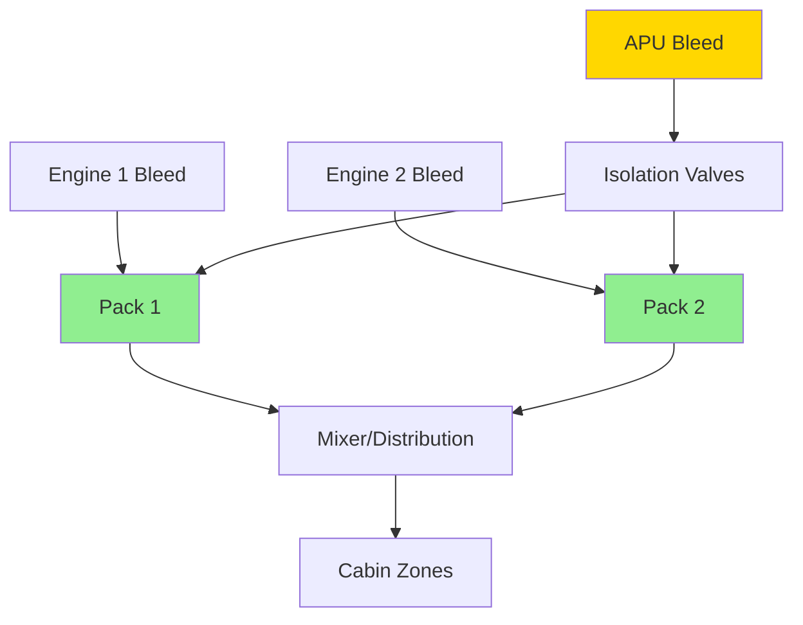
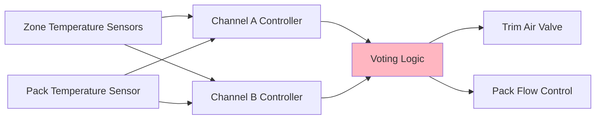

Aircraft air conditioning packs operate in a safety-critical environment where system availability directly impacts flight operations, passenger comfort, and regulatory compliance. Redundancy architectures and reliability engineering principles ensure continuous environmental control under various failure scenarios.

## Redundancy Architectures

Commercial aircraft typically employ multiple air conditioning packs to provide fault tolerance and maintain cabin pressurization under single-point failures.

### Dual-Pack Configuration

Twin-engine aircraft standard configuration:

| Pack | Bleed Source | Normal Capacity | Emergency Capacity |
|------|--------------|-----------------|-------------------|
| Pack 1 | Engine 1 | 50% cabin load | 100% essential zones |
| Pack 2 | Engine 2 | 50% cabin load | 100% essential zones |
| APU | Auxiliary | Ground/backup | 70% cabin load |

Each pack dimensions for 100% cabin load capacity at single-pack operation, with reduced passenger capacity or altitude restrictions.

### Triple-Pack Configuration

Wide-body aircraft with enhanced redundancy:

- Three independent packs serving cabin zones
- Any two packs maintain full cabin conditioning
- Single-pack operation limits altitude and passenger load
- Cross-bleed capability from all engines and APU

## Reliability Analysis

### Mean Time Between Failures (MTBF)

Air conditioning pack reliability targets:

$$MTBF = \frac{\text{Total Operating Hours}}{\text{Number of Failures}}$$

Typical commercial aircraft pack MTBF: 8,000–12,000 flight hours.

### System Availability

For dual-pack configuration with independent failure modes:

$$A_{system} = 1 - (1 - A_{pack})^2$$

Where $A_{pack}$ represents individual pack availability (typically 0.995–0.999).

For $A_{pack} = 0.998$:

$$A_{system} = 1 - (1 - 0.998)^2 = 1 - 0.000004 = 0.999996$$

This translates to 99.9996% system availability, meeting regulatory requirements for dispatch reliability.

## Failure Modes and Effects

### Component-Level Failures

| Component | Failure Mode | Effect on Pack | System Impact |
|-----------|--------------|----------------|---------------|
| Primary heat exchanger | Tube leak | Reduced cooling capacity | Single-pack operation |
| Compressor | Bearing seizure | Complete pack shutdown | Immediate switchover |
| Turbine | FOD damage | Reduced efficiency | Gradual degradation |
| Temperature control valve | Stuck closed | No temperature modulation | Fixed cold air output |
| Ram air inlet door | Jam closed | Insufficient cooling on ground | APU pack operation |

### Degraded Mode Operation

Pack performance under partial failures:

$$Q_{degraded} = Q_{nominal} \times \eta_{degradation}$$

Where $\eta_{degradation}$ ranges from 0.3 to 0.8 depending on failure severity.

## Dispatch Deviation Guide (DDG)

Minimum Equipment List (MEL) provisions for air conditioning pack failures:

### Category A Aircraft (>180 passengers)

- **Both packs operative**: Normal operations, no restrictions
- **One pack inoperative**: Maximum altitude 25,000 ft, passenger load reduction 30%
- **Both packs inoperative**: Ground operations only, 30-minute limit

### Category B Aircraft (100–180 passengers)

- **Single-pack operation**: Maximum altitude 31,000 ft, passenger load reduction 20%
- **Time limitations**: 10-day extension for pack repair

### ETOPS Considerations

Extended-range twin-engine operations require enhanced reliability:

- Both packs must be operative for ETOPS dispatch
- No MEL relief for pack failures on ETOPS flights
- Demonstrated dispatch reliability >99.5% over 12-month period

## Redundant Control Systems

### Dual-Channel Architecture

Temperature control employs redundant sensing and actuation:

Voting logic employs median selection to reject single-sensor failures.

### Cross-Channel Monitoring

Continuous comparison of channel outputs:

$$\Delta T_{channels} = |T_{channel A} - T_{channel B}|$$

If $\Delta T_{channels} > 5°F$ for >30 seconds, fault annunciation occurs with automatic switchover to healthy channel.

## Maintenance Monitoring

### Health and Usage Monitoring Systems (HUMS)

Real-time pack performance tracking:

- Outlet temperature deviation from setpoint
- Compressor discharge pressure trends
- Turbine inlet temperature monitoring
- Flow rate deviations

### Predictive Maintenance Triggers

| Parameter | Normal Range | Caution Threshold | Action Required |
|-----------|--------------|-------------------|-----------------|
| Outlet temperature | ±3°F of setpoint | ±6°F of setpoint | Calibration check |
| Compressor pressure ratio | 2.8–3.2 | <2.5 or >3.5 | Compressor inspection |
| Turbine efficiency | >80% | <75% | Turbine overhaul |
| Heat exchanger effectiveness | >85% | <80% | Cleaning or replacement |

## Operational Considerations

### Single-Pack Operation Limitations

Physical constraints under degraded conditions:

$$\dot{m}_{required} = \frac{Q_{cabin}}{c_p (T_{supply} - T_{cabin})}$$

With one pack inoperative, reduced mass flow requires either:
- Lower cabin occupancy (reduced $Q_{cabin}$)
- Lower altitude (higher bleed air density)
- Higher supply temperature (reduced comfort)

### Ground Cooling Redundancy

APU pack provides backup for ground operations:

- Capacity: 70–80% of engine-driven pack
- Response time: 90 seconds from APU start
- Automatic switchover on engine pack failure

## Reliability-Centered Maintenance

### On-Condition Monitoring

Pack components transition from scheduled replacement to condition-based maintenance:

- Continuous vibration monitoring detects bearing degradation
- Oil quality analysis predicts lubrication system failures
- Performance trending identifies gradual efficiency loss

This approach reduces unnecessary maintenance while improving dispatch reliability through early anomaly detection.

## Certification Requirements

FAR 25.831 mandates environmental control system reliability:

- Dual-independent systems for pressurized aircraft
- Any single failure must not prevent continued safe flight
- Demonstrated reliability through extensive flight testing
- Dispatch deviation guides approved by regulatory authorities

Pack redundancy architectures and robust reliability engineering ensure that aircraft environmental control systems maintain passenger comfort and safety across all operational scenarios, from routine flights to extended-range operations over remote regions.