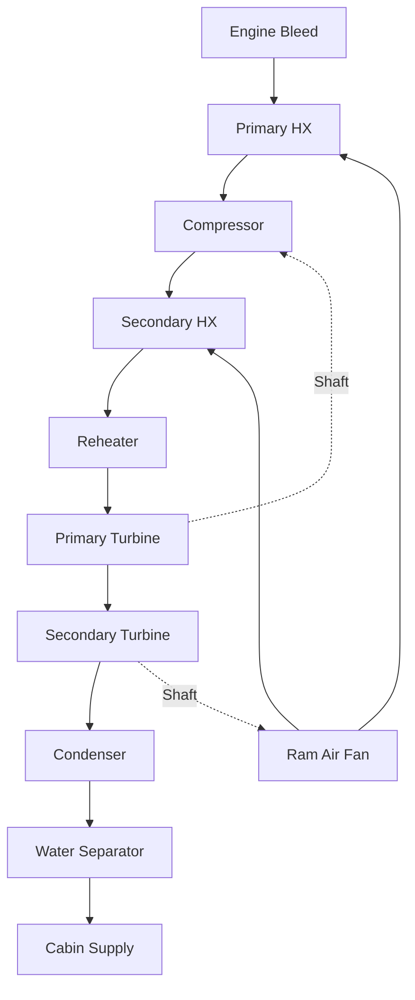

## Fundamental Operating Principles

Air cycle systems dominate aircraft environmental control due to their high reliability, lightweight construction, and elimination of flammable refrigerants. These systems operate on the reverse Brayton cycle, using air as the working fluid and achieving cooling through expansion in a turbine.

The fundamental cooling mechanism relies on the temperature drop that occurs when compressed air expands through a turbine. Unlike vapor compression systems, air cycle machines (ACMs) maintain the working fluid in the gaseous phase throughout the entire cycle, simplifying system design and enhancing safety in aviation applications.

### Thermodynamic Foundation

The isentropic expansion process in the turbine follows the relationship:

$$
\frac{T_2}{T_1} = \left(\frac{P_2}{P_1}\right)^{\frac{\gamma-1}{\gamma}}
$$

where T₁ and P₁ represent inlet conditions, T₂ and P₂ represent outlet conditions, and γ is the specific heat ratio for air (1.4).

The actual expansion incorporates turbine efficiency:

$$
T_2 = T_1 - \eta_t(T_1 - T_{2s})
$$

where η_t is turbine isentropic efficiency (typically 0.75-0.85) and T₂ₛ is the isentropic discharge temperature.

## Bootstrap Air Cycle Configuration

The bootstrap cycle represents the most common aircraft air cycle system, featuring two compressor stages and one turbine. This configuration achieves superior cooling performance by extracting work from the turbine to drive a secondary compressor.

### Bootstrap Cycle Analysis

The coefficient of performance for the bootstrap cycle:

$$
COP = \frac{h_5 - h_6}{(h_3 - h_2) - (h_4 - h_5)}
$$

where subscripts correspond to state points through the cycle. The bootstrap compressor increases pressure after initial heat rejection, enabling a second heat exchange that significantly improves cooling capacity.

The net cooling effect:

$$
Q_{cooling} = \dot{m}_{air}(h_1 - h_6) - W_{fan}
$$

This configuration typically achieves discharge temperatures of -20°C to 5°C from bleed air at 200-250°C.

## Simple Air Cycle System

The simple cycle represents the most basic configuration, consisting of a single heat exchanger followed by turbine expansion. While less efficient than bootstrap systems, simple cycles offer advantages in weight and mechanical simplicity for smaller aircraft.

### Performance Characteristics

| Parameter | Simple Cycle | Bootstrap Cycle | Three-Wheel |
|-----------|-------------|-----------------|-------------|
| Cooling COP | 0.3-0.5 | 0.5-0.8 | 0.7-1.0 |
| Discharge Temp | 0-15°C | -20-5°C | -30-0°C |
| Weight (kg/ton) | 8-12 | 12-18 | 18-25 |
| Complexity | Low | Medium | High |
| Typical Application | Regional jets | Narrow-body | Wide-body |

The simple cycle cooling capacity:

$$
Q_{simple} = \dot{m}_{air} c_p (T_{in} - T_{out})
$$

where the temperature drop depends primarily on expansion ratio and heat exchanger effectiveness.

## Three-Wheel Air Cycle Machine

Advanced three-wheel systems incorporate an additional turbine driving a dedicated cooling fan, maximizing heat exchanger performance at low aircraft speeds. This configuration provides superior ground cooling when ram air is insufficient.

### Advanced Performance Metrics

The three-wheel system achieves enhanced dehumidification through controlled condensation. The moisture removal rate:

$$
\dot{m}_{condensate} = \dot{m}_{air}(\omega_1 - \omega_2)
$$

where ω represents humidity ratio at inlet (1) and outlet (2) conditions.

## Heat Exchanger Effectiveness

Heat exchanger performance critically affects air cycle efficiency. The effectiveness parameter:

$$
\varepsilon = \frac{T_{air,in} - T_{air,out}}{T_{air,in} - T_{ram,in}}
$$

Modern aircraft heat exchangers achieve effectiveness values of 0.85-0.95 using plate-fin construction with aluminum alloys. The Number of Transfer Units (NTU) method predicts performance:

$$
\varepsilon = 1 - \exp\left[\frac{NTU^{0.22}}{C_r}\left(\exp(-C_r \cdot NTU^{0.78}) - 1\right)\right]
$$

for cross-flow configurations with both fluids unmixed, where C_r is the heat capacity ratio.

## Turbine-Compressor Unit Design

The mechanical design of the turbine-compressor unit (TCU) determines system reliability and efficiency. Rotational speeds range from 40,000-80,000 RPM, requiring precision air bearings and dynamic balancing.

### Turbine Work Extraction

The specific work extracted by the turbine:

$$
w_t = c_p T_1 \left[1 - \left(\frac{P_2}{P_1}\right)^{\frac{\gamma-1}{\gamma}}\right] \eta_t
$$

This work directly drives the bootstrap compressor, with excess capacity absorbed by the alternator or dissipated through system losses.

## Water Separation Requirements

Cooling air below its dew point produces liquid water that must be removed before cabin distribution. ASHRAE Standard 161 (Air Quality Within Commercial Aircraft) requires effective moisture separation to prevent ice formation and maintain comfort.

The condensate formation rate depends on psychrometric conditions:

$$
\dot{m}_{water} = \dot{m}_{air} \frac{(h_{vapor,in} - h_{vapor,out})}{h_{fg}}
$$

Centrifugal water separators achieve 95-99% removal efficiency through high-speed rotation (10,000-15,000 RPM).

## Altitude Performance Considerations

Air cycle system performance varies with flight altitude due to changing bleed air conditions and ram air availability. At cruise altitude (35,000-43,000 ft), reduced ambient density decreases heat exchanger capacity by 40-60% compared to sea level.

The altitude correction factor for cooling capacity:

$$
Q_{altitude} = Q_{sea\_level} \left(\frac{\rho_{altitude}}{\rho_{sea\_level}}\right)^{0.8}
$$

This necessitates increased bleed air flow at altitude, reducing engine efficiency by 2-5% during cruise.

## Comparison with Vapor Cycle Systems

| Characteristic | Air Cycle | Vapor Cycle |
|----------------|-----------|-------------|
| Working Fluid | Air | R-134a, R-1234yf |
| Operating Pressure | 20-50 psia | 150-350 psia |
| COP | 0.3-1.0 | 2.0-4.0 |
| Weight/Capacity | High | Low |
| Flammability Risk | None | Low to Moderate |
| Maintenance Interval | 5,000 hrs | 2,000 hrs |
| Altitude Sensitivity | High | Low |

Air cycle systems accept lower efficiency in exchange for safety, reliability, and weight advantages critical in aviation applications.

## Integration with Bleed Air Systems

Air cycle machines receive compressed air from engine compressor stages at 200-450°C and 30-50 psia. The bleed extraction reduces engine thrust by 1-3% and specific fuel consumption by 0.5-1.5%.

Modern bleed-less systems using electric compressors eliminate this penalty but increase electrical system weight and complexity. The selection depends on aircraft size, range, and mission profile requirements
