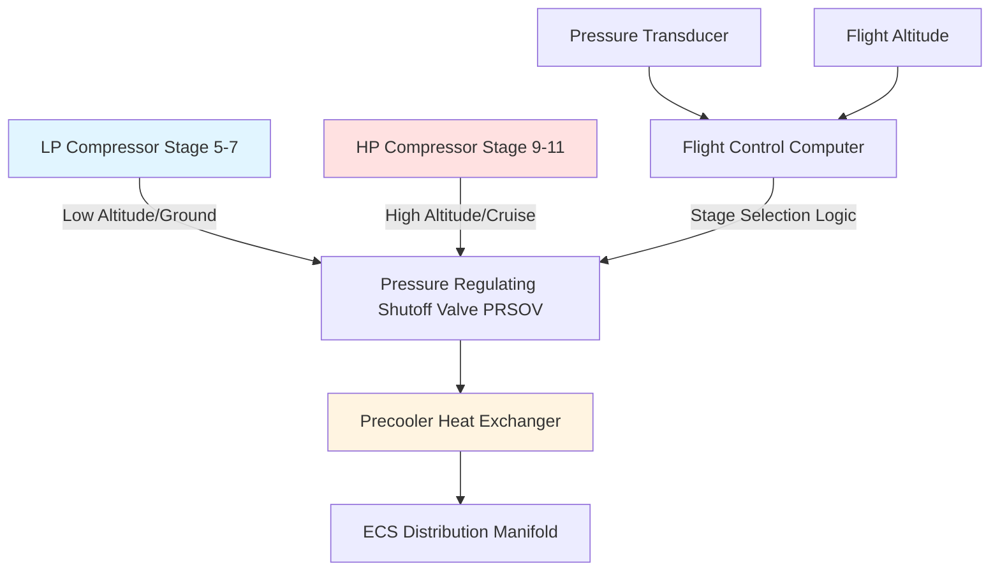
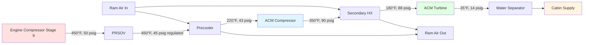

## Bleed Air Integration with Environmental Control Systems

Aircraft environmental control systems utilizing engine bleed air extract pneumatic energy from gas turbine compressor stages to drive air cycle machines, provide cabin pressurization, and deliver conditioned air. This integration represents a fundamental coupling between propulsion thermodynamics and environmental control requirements, requiring careful balancing of engine performance, system efficiency, and operational constraints.

The bleed air system serves as the primary energy source for conventional aircraft ECS, supplying high-pressure, high-temperature air that undergoes thermodynamic conditioning before entering the air cycle machine bootstrap cycle. System design must accommodate extreme variations in ambient conditions, flight phases, and engine operating states while maintaining safety margins and component longevity.

## Compressor Stage Bleed Extraction Thermodynamics

### Stage Selection and Pressure Availability

Bleed air extraction occurs at specific compressor stages determined by pressure requirements, temperature constraints, and engine operability limits. The compressor pressure ratio distribution across stages follows:

$$P_n = P_{inlet} \times \pi_{overall}^{(n/N)}$$

Where:
- $P_n$ = pressure at stage $n$
- $P_{inlet}$ = compressor inlet pressure (varies with altitude)
- $\pi_{overall}$ = overall compressor pressure ratio (25:1 to 40:1)
- $n$ = compressor stage number
- $N$ = total number of compressor stages

For a typical high-bypass turbofan with $\pi_{overall}$ = 30:1 and $N$ = 14 stages, the 9th stage provides a pressure ratio of approximately 6.5:1 relative to inlet conditions. At cruise altitude (35,000 ft, $P_{ambient}$ = 3.46 psia), this yields:

$$P_{bleed,stage9} = 3.46 \times 6.5 = 22.5 \text{ psia (7.8 psig)}$$

This pressure proves insufficient for ECS requirements, necessitating extraction from higher stages or dual-stage bleed systems that switch extraction points based on flight phase.

### Temperature Rise Across Compression

Compressor stage temperature follows isentropic compression relationships with efficiency corrections:

$$T_{n} = T_{inlet} \times \left[1 + \frac{1}{\eta_{c}} \left(\pi_{n}^{(\gamma-1)/\gamma} - 1\right)\right]$$

Where:
- $\eta_{c}$ = polytropic compressor efficiency (0.85-0.92)
- $\gamma$ = specific heat ratio for air (1.4)
- $\pi_{n}$ = pressure ratio to stage $n$

For 9th stage extraction at cruise with $T_{inlet}$ = -56.5°C (-69.7°F) and $\pi_{9}$ = 6.5:

$$T_{9} = 216.65 \times \left[1 + \frac{1}{0.88} \left(6.5^{0.286} - 1\right)\right] = 403 \text{ K (260°F)}$$

This temperature exceeds material limits for downstream ducting and ECS components, requiring immediate heat rejection through precooler heat exchangers.

### Dual-Stage Bleed Architecture

Modern aircraft employ dual-stage extraction to optimize pressure availability across the flight envelope:

The stage selection logic switches extraction points based on:

| Flight Phase | Extraction Stage | Pressure (psig) | Temperature (°F) | Rationale |
|--------------|------------------|-----------------|-------------------|-----------|
| Ground/Takeoff | LP Stage 5-7 | 45-65 | 350-450 | High ambient pressure, lower stage sufficient |
| Climb | Transition | 35-55 | 300-400 | Gradual transition to maintain pressure |
| Cruise | HP Stage 9-11 | 35-50 | 400-500 | Low ambient pressure requires higher stage |
| Descent | Transition | 40-60 | 350-450 | Return to LP stage as ambient increases |

## Precooler Heat Exchanger Design

### Heat Transfer Requirements

The precooler (primary heat exchanger) reduces bleed air temperature from 400-500°F to 200-250°F before entering the air cycle machine. Heat rejection capacity must accommodate maximum bleed flow conditions:

$$\dot{Q}_{precooler} = \dot{m}_{bleed} \times c_{p,air} \times (T_{bleed,in} - T_{bleed,out})$$

For a typical wide-body aircraft pack at maximum cooling demand:
- $\dot{m}_{bleed}$ = 1.8 lb/sec
- $c_{p,air}$ = 0.24 BTU/(lb·°F)
- $T_{bleed,in}$ = 450°F
- $T_{bleed,out}$ = 220°F

$$\dot{Q}_{precooler} = 1.8 \times 0.24 \times (450 - 220) = 99.4 \text{ BTU/sec (351 kW)}$$

### Ram Air Side Thermodynamics

The precooler uses ram air or fan bypass air as the cooling medium. Heat exchanger effectiveness depends on flow configuration and surface area:

$$\epsilon = \frac{T_{bleed,in} - T_{bleed,out}}{T_{bleed,in} - T_{ram,in}}$$

For cruise conditions with $T_{ram,in}$ = -69.7°F and target effectiveness $\epsilon$ = 0.80:

$$0.80 = \frac{450 - T_{bleed,out}}{450 - (-69.7)}$$

$$T_{bleed,out} = 450 - 0.80(519.7) = 34.2°F$$

This calculation reveals that high effectiveness at cruise produces excessive cooling, requiring modulated ram air flow to maintain target bleed temperature of 200-250°F. Actual cruise effectiveness operates at 0.60-0.70 to prevent over-cooling and ice formation.

### Heat Exchanger Construction

Aircraft precoolers employ plate-fin or primary surface heat exchangers with:

| Parameter | Specification | Design Rationale |
|-----------|--------------|------------------|
| Core Type | Plate-fin, cross-flow | Maximum surface area per unit volume |
| Material | Aluminum alloy 3003-H14 | Corrosion resistance, thermal conductivity |
| Fin Density | 12-18 fins per inch | Balance pressure drop and heat transfer |
| Effectiveness | 0.60-0.85 | Varies with ram air modulation |
| Pressure Drop (bleed side) | 1.5-3.0 psi | Minimize system pressure loss |
| Pressure Drop (ram side) | 0.5-1.5 psi | Critical during ground operations |
| Weight | 25-45 lb per pack | Minimize aircraft weight penalty |

Ram air flow modulation uses variable-geometry ram air inlet doors controlled by bleed air temperature feedback, maintaining target precooler outlet temperature across flight conditions.

## Pressure Regulation and Control

### Pressure Regulating Shutoff Valve (PRSOV)

The PRSOV performs dual functions: isolation and pressure regulation. Valve operation maintains constant downstream pressure despite variations in upstream bleed pressure:

$$P_{downstream} = P_{setpoint} = 45 \text{ psig (typical)}$$

The valve modulates position based on pneumatic feedback from the regulated manifold pressure. Control loop dynamics follow:

$$\frac{dA_{valve}}{dt} = K_{p} (P_{setpoint} - P_{measured}) + K_{i} \int (P_{setpoint} - P_{measured}) dt$$

Where:
- $A_{valve}$ = effective valve flow area
- $K_{p}$ = proportional gain
- $K_{i}$ = integral gain

Fast response (100-200 millisecond time constant) prevents pressure oscillations during rapid load changes, such as pack start-up or switching extraction stages.

### Overpressure and Overtemperature Protection

The bleed system incorporates multiple protective devices:

**Overpressure Relief Valve:**
- Set pressure: 60-75 psig
- Flow capacity: 150% of maximum bleed flow
- Relief path: overboard discharge

**Overtemperature Detection:**
- Trip temperature: 260-290°F
- Sensor type: Thermocouples (Type K)
- Response: Automatic PRSOV closure

**Leak Detection:**
- Method: Duct temperature monitoring
- Trip logic: Temperature rise in normally cool zones
- Response: Flight deck caution, isolation capability

## Bleed Air Distribution and Ducting

### Duct Design Requirements

Bleed air ducting must withstand continuous high-temperature operation while minimizing thermal losses and maintaining structural integrity:

$$\sigma_{thermal} = E \times \alpha \times \Delta T$$

Where:
- $\sigma_{thermal}$ = thermal stress (psi)
- $E$ = elastic modulus (30 × 10⁶ psi for stainless steel)
- $\alpha$ = coefficient of thermal expansion (9.6 × 10⁻⁶ /°F for SS321)
- $\Delta T$ = temperature difference from installation

For a duct heated from 70°F to 450°F:

$$\sigma_{thermal} = 30 \times 10^{6} \times 9.6 \times 10^{-6} \times (450 - 70) = 109,440 \text{ psi}$$

This stress approaches yield strength for stainless steel, necessitating expansion joints every 3-5 feet of straight run to accommodate thermal growth without inducing excessive mechanical stress.

### Insulation and Heat Loss

Bleed ducting requires insulation to prevent heat transfer to surrounding aircraft structure:

$$\dot{Q}_{loss} = \frac{2\pi L k}{\ln(r_{o}/r_{i})} (T_{duct} - T_{ambient})$$

Where:
- $L$ = duct length (ft)
- $k$ = insulation thermal conductivity (0.03-0.05 BTU/(hr·ft·°F) for fiberglass)
- $r_{o}$ = outer insulation radius (in)
- $r_{i}$ = inner duct radius (in)

For a 20-foot duct section at 450°F with 1-inch thick insulation:

$$\dot{Q}_{loss} = \frac{2\pi (20) (0.04)}{\ln(2.5/1.5)} (450 - 70) = 236 \text{ BTU/hr (69 W)}$$

Total aircraft bleed system heat loss ranges from 2-5 kW, representing negligible thermal penalty but requiring careful routing to avoid hot zones near electrical systems and hydraulic lines.

## Integration with Air Cycle Machine

### Bleed Air Conditioning Sequence

The conditioned bleed air enters the air cycle machine at precisely controlled pressure and temperature:

### Bleed Flow Modulation

Air cycle machine cooling capacity directly depends on bleed air mass flow. The system modulates flow through:

1. **Ram air door position** (primary control at high loads)
2. **Temperature control valve** (trim control)
3. **Pack flow control valve** (discrete high/medium/low settings)

The relationship between bleed flow and cooling capacity follows:

$$\dot{Q}_{cooling} = \dot{m}_{bleed} \times c_{p} \times (T_{cabin,return} - T_{supply})$$

For typical cabin temperature rise of 20°F and supply temperature of 55°F:

$$\dot{Q}_{cooling} = \dot{m}_{bleed} \times 0.24 \times 20 = 4.8 \dot{m}_{bleed} \text{ (BTU/sec)}$$

Maximum pack flow of 2.0 lb/sec delivers 9.6 BTU/sec (34 kW) cooling capacity, sufficient for half-cabin zone control on wide-body aircraft (two packs total).

## Bleed Air Quality and Contamination

### Contaminant Sources

Bleed air contamination occurs through bearing seal leakage, introducing engine lubricating oil into the bleed stream. Oil composition includes:

- Synthetic ester base stock
- Tricresyl phosphate (TCP) additives
- Phenyl-alpha-naphthylamine antioxidants

Contamination concentrations typically remain below 0.01 mg/m³ during normal operation but may spike during seal degradation events to 1-10 mg/m³.

### Filtration Limitations

Conventional bleed air systems lack filtration due to:
- High operating temperatures (>400°F) exceeding filter media limits
- Particle size distribution (submicron aerosols) requiring HEPA-grade filtration
- Pressure drop constraints in high-flow pneumatic systems
- Weight and maintenance penalties

Emerging bleed air quality monitoring systems employ:
- **Mass spectrometry** (real-time VOC detection)
- **CO/CO₂ sensors** (combustion product monitoring)
- **Photoionization detectors** (total organic compound measurement)

## Performance Trade-offs and Fuel Impact

### Bleed Extraction Fuel Penalty

Extracting bleed air reduces core mass flow available for thrust generation, imposing a direct fuel consumption penalty:

$$\Delta SFC = k_{bleed} \times \frac{\dot{m}_{bleed}}{\dot{m}_{core}}$$

Where:
- $\Delta SFC$ = specific fuel consumption increase (%)
- $k_{bleed}$ = bleed penalty factor (1.5-2.0)
- $\dot{m}_{bleed}$ = bleed extraction rate (lb/sec)
- $\dot{m}_{core}$ = core engine mass flow (lb/sec)

For a twin-engine aircraft extracting 1.8 lb/sec per engine with core flow of 120 lb/sec:

$$\Delta SFC = 1.8 \times \frac{1.8}{120} = 2.7\%$$

This continuous fuel penalty drives the transition to bleedless electric ECS architectures on new aircraft platforms, where electric motor-driven compressors eliminate engine bleed extraction at the cost of increased electrical generation requirements.

## Applicable Standards and Regulations

Aircraft bleed air systems must comply with:

- **SAE AS8908:** Bleed Air System Terminology
- **SAE ARP85F:** Air Conditioning Systems for Subsonic Airplanes (bleed interface requirements)
- **FAA 14 CFR 25.1309:** Equipment, systems, and installations (failure probability requirements)
- **FAA 14 CFR 25.831:** Ventilation (air quality requirements)
- **SAE ARP1826:** Cabin Air Quality (contaminant limits)
- **DO-160G:** Environmental Conditions and Test Procedures (temperature, vibration, EMI)

System reliability must achieve failure probability less than 10⁻⁵ per flight hour for hazardous conditions, requiring redundant bleed sources (dual-engine extraction) and automatic isolation upon contamination detection.

## Conclusion

Aircraft bleed air systems represent a thermodynamically efficient method of extracting pneumatic energy from gas turbine engines to power environmental control systems. The extraction, conditioning, and distribution of high-pressure, high-temperature air requires careful integration of heat exchangers, pressure regulation, and control systems to maintain performance across the flight envelope.

The fundamental trade-off between engine performance penalty and ECS capability drives ongoing evolution toward bleedless electric architectures. However, conventional bleed air systems remain dominant due to proven reliability, reduced electrical system complexity, and mature certification basis. Understanding compressor stage thermodynamics, heat exchanger design, and pressure regulation principles is essential for ECS optimization and troubleshooting on current-generation aircraft.
