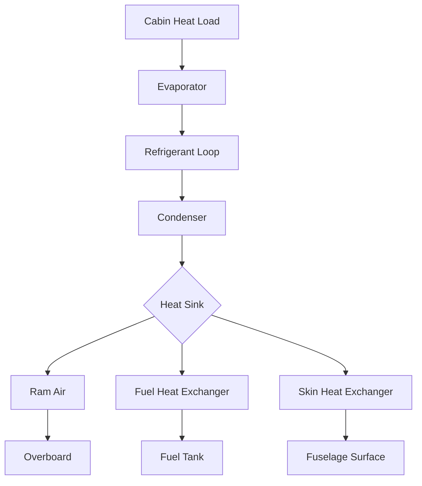

## Overview

Electric environmental control systems (E-ECS) represent a paradigm shift from traditional bleed air-based systems, using electrically-driven vapor cycle refrigeration and electric heat pumps to condition aircraft cabin air. This architecture eliminates engine bleed air extraction, improving fuel efficiency by 2-5% while providing precise temperature control and enhanced reliability. Electric systems dominate modern commercial aircraft design, including Boeing 787 and Airbus A350 platforms.

## Fundamental Operating Principles

### Vapor Cycle Refrigeration

Electric ECS employs conventional vapor compression refrigeration adapted for aerospace constraints:

$$Q_c = \dot{m}_r \left[ h_1 - h_4 \right]$$

Where:
- $Q_c$ = cooling capacity (kW)
- $\dot{m}_r$ = refrigerant mass flow rate (kg/s)
- $h_1$ = enthalpy at evaporator outlet (kJ/kg)
- $h_4$ = enthalpy at expansion valve outlet (kJ/kg)

The coefficient of performance for electric vapor cycle systems:

$$COP = \frac{Q_c}{W_{comp}} = \frac{h_1 - h_4}{h_2 - h_1}$$

Where $W_{comp}$ represents compressor power input and subscript 2 denotes compressor discharge state.

### Electric Power Architecture

Electric ECS integrates with aircraft electrical distribution:

$$P_{total} = P_{comp} + P_{fans} + P_{controls} + P_{aux}$$

Typical cabin cooling requires 40-60 kW electrical power per air cycle machine equivalent, with compressor power representing 70-80% of total consumption.

## System Components and Configuration

### Primary Equipment

| Component | Function | Power Range | Critical Parameters |
|-----------|----------|-------------|---------------------|
| Electric Compressor | Refrigerant compression | 25-45 kW | Speed 15,000-45,000 rpm, efficiency 85-92% |
| Air-Cooled Condenser | Heat rejection | N/A | Airside ΔT 20-35°C, effectiveness 0.75-0.85 |
| Expansion Valve | Pressure reduction | <0.5 kW | Superheat control 3-8°C |
| Evaporator | Air cooling | N/A | Approach 2-5°C, frosting limit 0°C |
| Inverter/Controller | Power conversion | 2-5 kW | Efficiency 96-98%, THD <5% |

### Refrigerant Selection

Modern electric ECS utilizes refrigerants optimized for aerospace applications:

- **R-134a**: Legacy systems, GWP 1430, operating range -40°C to +70°C
- **R-1234yf**: Low GWP alternative (GWP <1), similar thermophysical properties
- **R-515B**: Emerging replacement, GWP 299, azeotropic blend

Refrigerant charge quantities range from 3-8 kg per pack, with leak rates maintained below 2% annually.

## Thermal Management Architecture

### Heat Rejection Methods

Electric systems employ multiple heat rejection paths:

Heat rejection capacity requirements:

$$Q_{rej} = Q_c + W_{comp} = Q_c \left(1 + \frac{1}{COP}\right)$$

For typical cruise conditions with COP = 3.5, rejected heat equals 1.29 times cooling capacity.

### Ram Air System Sizing

Ram air flow requirements depend on altitude and flight regime:

$$\dot{m}_{ram} = \frac{Q_{rej}}{c_p \Delta T_{ram}}$$

At cruise altitude (35,000-43,000 ft), ram air density reduces to 0.25-0.30 kg/m³, requiring inlet areas of 0.15-0.25 m² per cooling pack to achieve necessary mass flow with acceptable pressure drop (150-250 Pa).

## Performance Characteristics

### Operating Envelope

Electric ECS must function across extreme flight conditions:

| Flight Phase | Altitude (ft) | OAT (°C) | Load (kW) | COP Range |
|--------------|---------------|----------|-----------|-----------|
| Ground Ops | 0 | -40 to +50 | 60-80 | 2.0-2.8 |
| Takeoff | 0-10,000 | -30 to +45 | 50-70 | 2.5-3.2 |
| Climb | 10,000-40,000 | -55 to +20 | 40-60 | 3.0-3.8 |
| Cruise | 35,000-43,000 | -55 to -45 | 30-45 | 3.2-4.0 |
| Descent | 40,000-0 | -50 to +30 | 35-55 | 2.8-3.5 |

### Efficiency Optimization

Compressor speed modulation enables efficiency optimization:

$$\eta_{system} = \eta_{comp} \times \eta_{motor} \times \eta_{inverter} \times \frac{COP}{COP + 1}$$

Variable speed operation maintains system efficiency above 60% across 30-100% capacity range, compared to 45-70% for fixed-speed bleed air systems.

## Control Strategies

### Temperature Regulation

Electric ECS employs cascade control architecture:

1. **Primary loop**: Cabin temperature feedback with ±0.5°C deadband
2. **Secondary loop**: Evaporator outlet temperature control (5-12°C setpoint)
3. **Tertiary loop**: Compressor speed regulation (15,000-45,000 rpm)

Control response time achieves 30-60 seconds for 2°C setpoint changes, superior to 90-180 second response of pneumatic systems.

### Fault Management

Electric systems incorporate comprehensive diagnostics:

- Refrigerant pressure monitoring (high/low limits)
- Compressor motor temperature protection (<155°C winding)
- Inverter overcurrent/overvoltage protection
- Evaporator freeze protection (coil temperature >-2°C)
- Condenser airflow verification

## Integration with Aircraft Systems

### Electrical Load Management

Electric ECS represents 8-12% of total aircraft electrical load during cruise. Load shedding hierarchy prioritizes flight-critical systems:

1. Flight controls, avionics (never shed)
2. Anti-ice, pressurization (shed in emergency only)
3. ECS cooling (shed to 50% capacity)
4. Galley, entertainment (shed completely)

### Weight and Volume Trade-offs

Electric ECS equipment comparison:

| System Type | Specific Weight (kg/kW) | Volume (L/kW) | Reliability (MTBF hrs) |
|-------------|-------------------------|---------------|------------------------|
| Bleed Air ACM | 1.2-1.8 | 8-12 | 8,000-12,000 |
| Electric Vapor | 2.5-3.5 | 12-18 | 15,000-25,000 |
| Hybrid System | 1.8-2.8 | 10-15 | 10,000-18,000 |

Despite higher specific weight, electric systems eliminate bleed ducting (200-350 kg), precooler systems (150-200 kg), and pneumatic controls (50-80 kg), achieving net weight reduction of 150-300 kg per aircraft.

## Standards and Certification

Electric ECS design follows aerospace environmental control standards:

- **SAE AS5127**: Environmental control systems terminology
- **SAE ARP85**: Air conditioning systems for subsonic airplanes
- **RTCA DO-160**: Environmental conditions and test procedures for airborne equipment
- **MIL-STD-810**: Environmental engineering considerations

Testing protocols verify operation from -55°C to +70°C ambient, altitude capability to 51,000 ft, and electromagnetic compatibility per DO-160 Section 15-21.

## Future Development Directions

Advanced electric ECS technologies under development:

- **Magnetic bearing compressors**: Eliminate lubrication, increase reliability
- **Microchannel heat exchangers**: 30-40% volume reduction
- **CO₂ transcritical cycles**: High efficiency at altitude, natural refrigerant
- **Thermoelectric supplemental cooling**: Localized temperature control, no moving parts
- **Integrated thermal management**: Combined cooling for cabin, avionics, and power electronics

Research focuses on achieving COP >4.5 at cruise conditions while reducing specific weight below 2.0 kg/kW through advanced materials and control optimization.