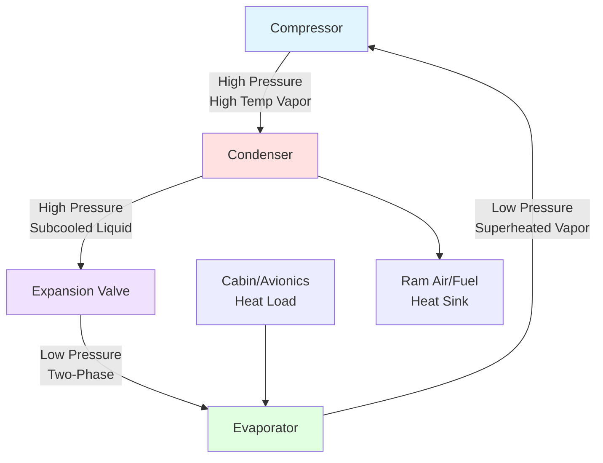
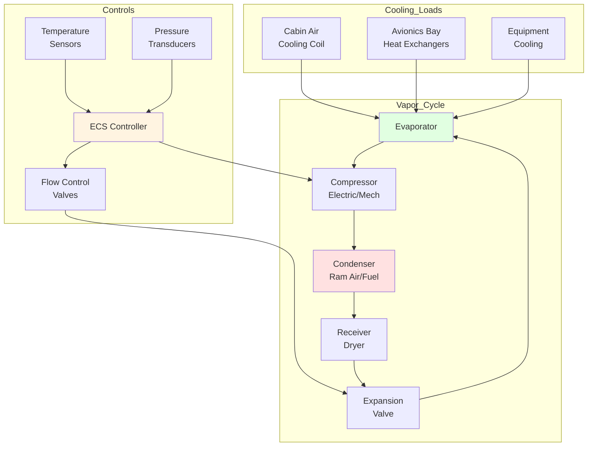

# Vapor Cycle Air Conditioning Systems

Vapor cycle air conditioning systems represent the primary cooling technology for modern commercial and military aircraft where cabin and avionics thermal management requires efficient, reliable refrigeration independent of bleed air availability. These systems operate on the standard vapor-compression cycle adapted for aerospace constraints including weight, volume, reliability, and operation across extreme altitude and temperature ranges.

## Thermodynamic Cycle Analysis

Aircraft vapor cycle systems follow the fundamental refrigeration cycle with specialized adaptations for aerospace applications.

### Basic Refrigeration Cycle

The ideal vapor-compression cycle consists of four processes:

**Cooling capacity:**

$$Q_c = \dot{m}_r \cdot (h_1 - h_4)$$

Where:
- $Q_c$ = cooling capacity (W)
- $\dot{m}_r$ = refrigerant mass flow rate (kg/s)
- $h_1$ = enthalpy at evaporator outlet (kJ/kg)
- $h_4$ = enthalpy at expansion valve outlet (kJ/kg)

**Coefficient of performance:**

$$COP = \frac{Q_c}{W_{comp}} = \frac{h_1 - h_4}{h_2 - h_1}$$

Where:
- $W_{comp}$ = compressor power input (W)
- $h_2$ = enthalpy at compressor discharge (kJ/kg)

**Heat rejection:**

$$Q_h = Q_c + W_{comp} = \dot{m}_r \cdot (h_2 - h_3)$$

Where:
- $Q_h$ = condenser heat rejection (W)
- $h_3$ = enthalpy at condenser outlet (kJ/kg)

## System Components

### Compressor Types

Aircraft vapor cycle systems employ specialized compressors optimized for aerospace requirements:

| Compressor Type | Power Range | Speed (RPM) | Weight/kW | Applications |
|----------------|-------------|-------------|-----------|--------------|
| Scroll | 3-15 kW | 3000-6000 | 2.5-3.5 kg/kW | Regional aircraft, business jets |
| Rotary vane | 5-25 kW | 4000-8000 | 2.0-3.0 kg/kW | Commercial aircraft, military |
| Reciprocating | 2-10 kW | 1500-3000 | 3.0-4.0 kg/kW | Small aircraft, older systems |
| Centrifugal | 25-150 kW | 15000-40000 | 1.5-2.5 kg/kW | Large commercial aircraft |

Drive methods include:
- **Engine-driven:** Accessory gearbox connection, mechanical efficiency 85-92%
- **Electric motor-driven:** AC or DC motors, 90-95% efficiency, more-electric aircraft trend
- **Hydraulic motor-driven:** Used in some military applications, 75-85% efficiency

### Condenser Design

Aircraft condensers reject heat to available heat sinks under challenging conditions.

**Heat transfer effectiveness:**

$$\epsilon = \frac{Q_h}{Q_{max}} = \frac{Q_h}{\dot{m}_{air} \cdot c_p \cdot (T_{cond} - T_{amb})}$$

Condenser types:
- **Ram air condensers:** Primary heat sink at altitude, effectiveness 0.6-0.8
- **Fuel-cooled condensers:** Utilize fuel as heat sink before combustion, effectiveness 0.7-0.85
- **Hybrid systems:** Combine ram air and fuel cooling for optimization

### Evaporator Configuration

Evaporators provide cooling to cabin air or avionics equipment with minimal pressure drop and weight.

**Air-side heat transfer:**

$$Q_c = \dot{m}_{air} \cdot c_p \cdot (T_{in} - T_{out}) = U \cdot A \cdot LMTD$$

Where:
- $U$ = overall heat transfer coefficient (W/m²·K), typically 25-50 for aircraft evaporators
- $A$ = heat transfer area (m²)
- $LMTD$ = log mean temperature difference (K)

Evaporator types:
- **Plate-fin:** High surface area density, 800-1200 m²/m³
- **Microchannel:** Reduced refrigerant charge, 20-30% weight savings
- **Shell-and-tube:** Legacy systems, higher reliability

### Expansion Device Selection

| Device Type | Control Range | Response Time | Superheat Control | Applications |
|------------|---------------|---------------|-------------------|--------------|
| Thermostatic expansion valve | 3:1 | 10-30 s | ±2-4 K | Most aircraft systems |
| Electronic expansion valve | 10:1 | 1-5 s | ±0.5-1 K | Advanced systems, precise control |
| Capillary tube | Fixed | N/A | No control | Simple systems, constant load |
| Orifice | Fixed | N/A | No control | Military, high reliability |

## Refrigerant Selection

Aircraft vapor cycle systems use refrigerants selected for safety, performance, and environmental considerations.

### Refrigerant Comparison

| Refrigerant | ODP | GWP | Critical Temp (°C) | Safety Class | Status |
|-------------|-----|-----|-------------------|--------------|--------|
| R-134a | 0 | 1430 | 101.1 | A1 | Current standard |
| R-1234yf | 0 | 4 | 94.7 | A2L | Emerging commercial |
| R-744 (CO₂) | 0 | 1 | 31.0 | A1 | Research/military |
| R-407C | 0 | 1774 | 86.0 | A1 | Limited use |
| R-410A | 0 | 2088 | 71.3 | A1 | Not typical for aircraft |

R-134a remains the dominant refrigerant in aircraft applications due to:
- Non-flammable (A1 safety rating)
- Well-established service history
- Compatible with standard materials
- Good thermodynamic properties across flight envelope

### Performance Considerations

**Altitude effects on cycle performance:**

As aircraft altitude increases:
- Ambient pressure decreases, reducing condenser effectiveness
- Ram air temperature decreases (standard atmosphere: -56.5°C at 11 km)
- Available ram air mass flow may be limited
- Compressor power requirements vary with suction pressure

**System capacity modulation:**

$$\dot{m}_r = \eta_v \cdot \frac{V_d \cdot N \cdot \rho_1}{60}$$

Where:
- $\eta_v$ = volumetric efficiency (0.75-0.90)
- $V_d$ = compressor displacement (m³/rev)
- $N$ = compressor speed (RPM)
- $\rho_1$ = refrigerant density at suction (kg/m³)

## System Architecture

## Design Requirements and Standards

Aircraft vapor cycle systems must meet rigorous aerospace standards:

### FAA/EASA Requirements

- **FAR/CS 25.831:** Ventilation and cooling requirements
- **FAR/CS 25.1309:** Equipment, systems, and installations (reliability)
- **MIL-STD-810:** Environmental engineering considerations
- **RTCA DO-160:** Environmental conditions and test procedures for airborne equipment

### Performance Specifications

**Cooling capacity requirements:**

Typical aircraft cooling loads:
- Cabin cooling: 30-80 W/passenger
- Avionics cooling: 15-40 kW for commercial aircraft
- Flight deck equipment: 5-12 kW
- Peak loads: 1.5-2.0 times cruise loads

**Reliability targets:**
- Mean time between failures (MTBF): >20,000 flight hours
- Dispatch reliability: >99.5%
- Service life: 30,000-60,000 flight hours

**Weight efficiency:**

$$\text{Specific Power} = \frac{\text{Cooling Capacity (kW)}}{\text{System Weight (kg)}}$$

Target: 0.15-0.25 kW/kg for complete system including installation

## Operational Characteristics

### Ground Operation

Ground cooling presents maximum heat rejection challenges:
- High ambient temperatures (ISA+15°C to ISA+30°C)
- Limited ram air availability (ground cart or APU-powered fans)
- Maximum solar heat loads on fuselage
- All systems operational (highest avionics load)

**Ground cooling augmentation:**

$$Q_{ground} = Q_{flight} \cdot \left(1 + \frac{\Delta T_{ambient}}{30} + \frac{Q_{solar}}{Q_{cabin}}\right)$$

Typically requires 130-150% of cruise cooling capacity.

### High Altitude Operation

Cruise conditions favor vapor cycle efficiency:
- Cold ambient temperatures enhance condenser performance
- Lower cabin cooling loads (reduced solar, stabilized occupancy)
- Reduced avionics heat loads (lower power operation)

COP typically increases 15-25% at cruise altitude compared to ground operation.

### Transient Conditions

Critical design cases:
- **Hot day takeoff:** Maximum ambient temperature, high power demand, limited ram air
- **Rapid descent:** Increasing cabin heat loads, changing pressure conditions
- **Quick turnaround:** Minimal ground cooling time before next departure

## Integration with Bleed Air Systems

Many aircraft employ hybrid systems combining vapor cycle and bleed air:

| System Type | Cooling Method | Heating Method | Advantages | Disadvantages |
|-------------|----------------|----------------|------------|---------------|
| Pure vapor cycle | Refrigeration | Electric heaters | No bleed air penalty, efficient | Higher electrical load, complex |
| Pure bleed air | Bootstrap cycle | Bleed air | Simple, proven | 2-3% engine efficiency penalty |
| Hybrid | Both | Both | Optimized efficiency | System complexity, weight |

## Maintenance and Serviceability

### Service Requirements

Scheduled maintenance intervals:
- Refrigerant charge verification: Every 500 flight hours
- Compressor oil analysis: Every 1000 flight hours
- Filter-dryer replacement: Every 2000-3000 flight hours or 5 years
- Complete system inspection: Every 8000-12000 flight hours

### Common Failure Modes

| Component | Failure Mode | Detection | MTBF (hours) |
|-----------|--------------|-----------|--------------|
| Compressor | Bearing wear, seal leakage | Vibration, pressure loss | 25,000-40,000 |
| Condenser | Tube fouling, leaks | High head pressure | 50,000-80,000 |
| Evaporator | Coil icing, leaks | Low suction pressure | 40,000-70,000 |
| Expansion valve | Hunting, sticking | Temperature fluctuation | 30,000-50,000 |
| Controls | Sensor drift, valve failure | Out-of-range readings | 20,000-35,000 |

### Leak Detection and Repair

Aircraft systems require zero tolerance for refrigerant leaks:
- Electronic leak detectors: 0.5 oz/year sensitivity
- Fluorescent dye: Visual inspection under UV light
- Pressure decay testing: Hold 150% working pressure for 24 hours

## Advanced Technologies

### Variable Speed Compressors

Modern systems employ variable frequency drives (VFD) for compressor speed control:

**Power savings:**

$$P_{variable} = P_{rated} \cdot \left(\frac{N_{actual}}{N_{rated}}\right)^3$$

Provides 30-50% energy savings during part-load operation.

### Microchannel Heat Exchangers

Benefits:
- 30-40% weight reduction compared to conventional designs
- 20-30% refrigerant charge reduction
- 15-20% heat transfer improvement per unit volume
- Reduced pressure drop (10-15%)

### Enhanced Control Algorithms

- Model predictive control for load anticipation
- Health monitoring and prognostics
- Multi-zone temperature optimization
- Integration with aircraft thermal management system

---

*Related Topics: [Bleed Air Systems](/specialty-applications-testing/specialty-hvac-applications/aircraft-environmental-control/bleed-air-systems/), [Avionics Cooling](/specialty-applications-testing/specialty-hvac-applications/aircraft-environmental-control/equipment-cooling-aircraft/avionics-cooling/), [Temperature Control Aircraft](/specialty-applications-testing/specialty-hvac-applications/aircraft-environmental-control/temperature-control-aircraft/)*
