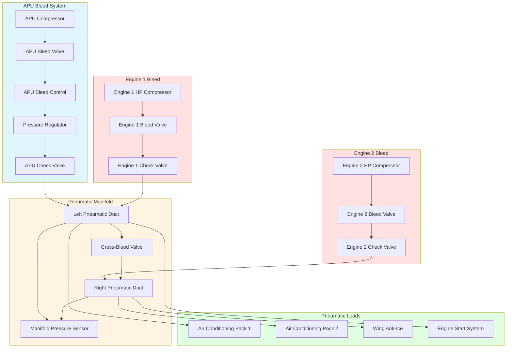

## APU Bleed Air Function

The Auxiliary Power Unit (APU) provides an independent source of high-pressure, high-temperature bleed air for aircraft environmental control systems, engine starting, and wing anti-ice systems. The APU operates as a small gas turbine engine, typically located in the tail cone, extracting compressed air from its compressor section to supply pneumatic services when main engines are unavailable or to supplement engine bleed during high-demand conditions.

## APU Bleed Air Capacity and Operating Envelope

APU bleed air capacity varies significantly by aircraft type and APU model, with typical outputs ranging from 30 to 150 lb/min depending on the installation:

**Typical APU Bleed Specifications:**

| Aircraft Category | APU Bleed Flow | Pressure | Temperature |
|-------------------|----------------|----------|-------------|
| Regional Jet | 30-50 lb/min | 40-50 psi | 375-425°F |
| Narrow-Body | 60-90 lb/min | 45-55 psi | 400-450°F |
| Wide-Body | 100-150 lb/min | 50-60 psi | 425-475°F |

The APU bleed air mass flow rate can be calculated using compressor performance characteristics:

$$\dot{m}_{APU} = \rho_{inlet} \cdot V_{inlet} \cdot A_{compressor} \cdot \eta_{volumetric}$$

where $\rho_{inlet}$ is inlet air density, $V_{inlet}$ is inlet velocity, $A_{compressor}$ is compressor face area, and $\eta_{volumetric}$ is volumetric efficiency (typically 0.85-0.92).

The bleed air extraction ratio determines the percentage of compressor airflow available for pneumatic services:

$$BER = \frac{\dot{m}_{bleed}}{\dot{m}_{compressor}} \times 100$$

Typical APU bleed extraction ratios range from 60-75%, significantly higher than main engine bleed systems (15-25%) due to the APU's dedicated pneumatic supply function.

## Ground Operation vs In-Flight Capability

APU bleed air systems exhibit different performance characteristics between ground and in-flight operations due to changes in inlet air density, ambient temperature, and cooling airflow:

**Ground Operations:**
- Maximum bleed air capacity available
- Ambient temperature limits: -40°F to 120°F
- Sea level to 10,000 ft airport elevation
- Full pneumatic capacity for air conditioning and engine starting
- Inlet door fully open for maximum airflow
- No ram air effect, relying on inlet design for airflow

**In-Flight Operations:**
- Reduced bleed capacity above 20,000-25,000 ft
- Ram air effect improves inlet pressure recovery
- Lower ambient temperatures increase mass flow potential
- Limited by exhaust back-pressure at higher altitudes
- Typically used for emergency backup or supplemental bleed
- Maximum operating altitude: 35,000-41,000 ft (aircraft dependent)

The available bleed flow decreases with altitude according to:

$$\dot{m}_{altitude} = \dot{m}_{sea level} \cdot \sqrt{\frac{\rho_{altitude}}{\rho_{sea level}}}$$

At 25,000 ft, ambient density is approximately 45% of sea level, reducing APU bleed capacity to roughly 67% of ground-level performance.

## Altitude Limitations for APU Bleed

APU bleed air systems face several altitude-related constraints:

1. **Maximum Operating Altitude:** Most APUs are certified for operation up to 35,000-43,000 ft, with some modern units capable of 51,000 ft operation
2. **Bleed Air Envelope Limit:** Bleed air availability typically restricted to 20,000-25,000 ft for full capacity
3. **Starting Envelope:** APU starting capability limited to lower altitudes (15,000-25,000 ft) due to combustion requirements
4. **EGT Limitations:** Exhaust gas temperature increases with altitude, limiting bleed extraction

The pressure ratio across the APU compressor varies with altitude:

$$PR = \left(1 + \frac{\eta_{compressor} \cdot \Delta h}{C_p \cdot T_{inlet}}\right)^{\frac{\gamma}{\gamma-1}}$$

where $\eta_{compressor}$ is compressor efficiency (0.80-0.85), $\Delta h$ is specific enthalpy rise, $C_p$ is specific heat at constant pressure, $T_{inlet}$ is inlet temperature, and $\gamma$ is the specific heat ratio (1.4 for air).

## Integration with Main Engine Bleed System

APU bleed air integrates with the main engine bleed system through a coordinated pneumatic manifold with check valves, isolation valves, and pressure regulating valves:

The pneumatic system architecture ensures that APU bleed air can supply all pneumatic loads when engines are not running, while check valves prevent backflow and pressure regulators maintain consistent delivery pressure regardless of source.

## APU Load Sharing with Engine Bleed

Load sharing between APU and engine bleed systems follows specific operational priorities:

**Priority Sequence:**
1. APU bleed used exclusively during ground operations before engine start
2. Engine bleed takes over after engine stabilization
3. APU bleed provides supplemental capacity during high-demand conditions
4. APU serves as emergency backup if engine bleed fails in flight

The total pneumatic load is distributed according to:

$$\dot{m}_{total} = \dot{m}_{APU} + \dot{m}_{engine1} + \dot{m}_{engine2}$$

With load allocation prioritizing engine bleed to minimize APU fuel consumption and wear. The bleed management system automatically modulates APU bleed valve position based on manifold pressure requirements:

$$P_{manifold,target} = P_{regulated} \pm \Delta P_{tolerance}$$

where typical regulated pressure is 45-50 psi with tolerance of ±2-3 psi.

## Temperature and Pressure Output Characteristics

APU bleed air exits the compressor at elevated temperature and pressure, requiring regulation before distribution to pneumatic loads:

**Raw APU Bleed Characteristics:**
- Temperature: 375-550°F (depends on APU model and load)
- Pressure: 50-80 psi (at compressor discharge)
- Mass flow: Variable based on extraction valve position

**Regulated APU Bleed Characteristics:**
- Temperature: 400-450°F (after pressure regulation)
- Pressure: 45-50 psi (regulated for pneumatic manifold)
- Mass flow: Controlled by bleed valve modulation

The relationship between pressure, temperature, and mass flow follows the ideal gas law modified for real gas behavior:

$$P \cdot V = n \cdot Z \cdot R \cdot T$$

where $Z$ is the compressibility factor (approximately 1.0 for air at these conditions).

## APU Bleed vs Engine Bleed Comparison

| Parameter | APU Bleed | Engine Bleed | Notes |
|-----------|-----------|--------------|-------|
| **Flow Capacity** | 30-150 lb/min | 150-450 lb/min | Engine bleed significantly higher |
| **Pressure Output** | 45-60 psi | 40-70 psi | Similar regulated pressure |
| **Temperature** | 375-475°F | 400-900°F | Engine bleed hotter, requires precooler |
| **Efficiency** | 60-75% extraction | 15-25% extraction | APU optimized for bleed |
| **Fuel Consumption** | 200-400 lb/hr | Marginal engine impact | APU dedicated fuel burn |
| **Availability** | Ground + limited altitude | All flight conditions | Engine bleed preferred in-flight |
| **Response Time** | 60-90 seconds start | Immediate (if running) | APU requires startup |
| **Altitude Limit** | 20,000-25,000 ft bleed | 43,000+ ft | Engine bleed altitude advantage |

APU bleed systems provide essential pneumatic independence for ground operations and emergency backup capability, while engine bleed systems deliver higher capacity and altitude performance during flight operations. The integration of both sources ensures pneumatic system reliability across all phases of flight.