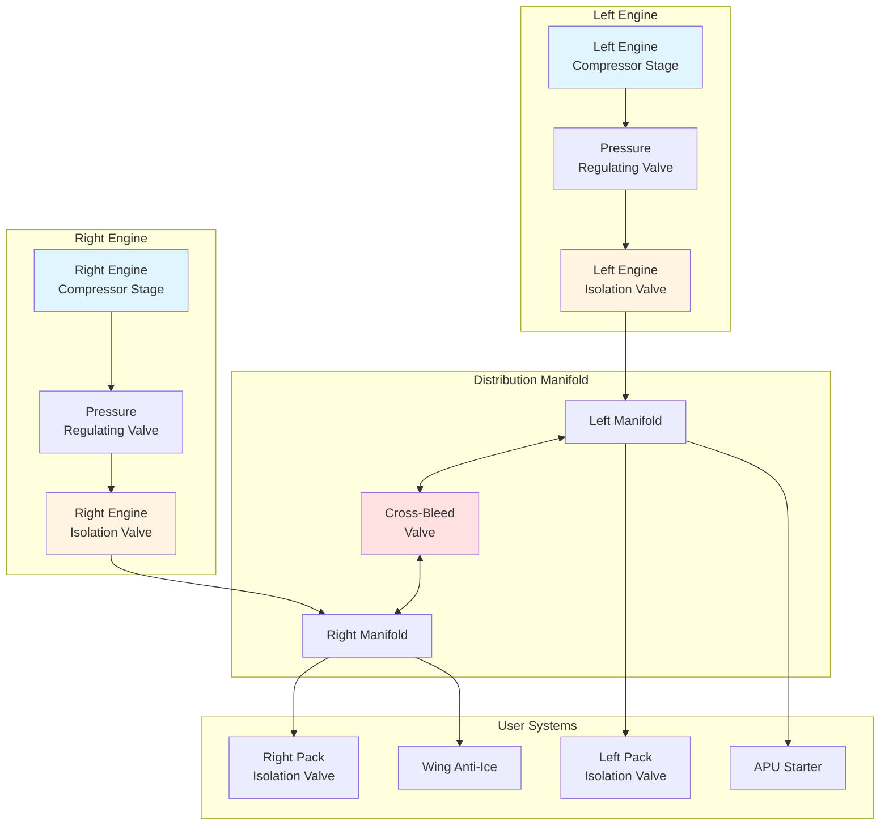

Aircraft bleed air distribution systems deliver high-temperature, high-pressure air from engine compressors to various aircraft systems including environmental control, anti-icing, and engine starting. The distribution network must maintain thermal integrity, provide operational flexibility, and ensure crew and passenger safety through redundancy and isolation capabilities.

## Distribution Manifold Design and Routing

The bleed air manifold serves as the primary distribution backbone, typically consisting of stainless steel or titanium ducting routed through the aircraft fuselage. The manifold design follows these principles:

**Primary routing considerations:**
- Shortest practical path to minimize pressure losses and thermal exposure
- Physical separation from hydraulic lines, electrical systems, and fuel tanks
- Accessibility for inspection and maintenance
- Protection from foreign object damage and mechanical impact
- Adequate clearance from structural members to accommodate thermal expansion

**Manifold architecture** typically employs a dual-channel design with left and right engine feeds. This configuration enables cross-feed capability during single-engine operations or engine bleed failures. Branch connections from the main manifold supply individual systems through dedicated tapping points.

**Pressure regulation stations** reduce high-pressure bleed air (200-450 psig) to intermediate levels appropriate for downstream equipment. Multiple regulation stages prevent excessive temperature drops across single-stage pressure reduction valves.

## Cross-Bleed Valve Operation and Control

The cross-bleed valve represents the critical interconnection between left and right bleed air systems, enabling operational flexibility and redundancy.

**Valve functions:**
- **Engine start operations:** Directs bleed air from operating engine to pneumatic starter of opposite engine
- **Single-engine taxi:** Supplies both air conditioning packs from single engine bleed source
- **Bleed source isolation:** Separates left and right systems during contamination events or maintenance

**Control logic** integrates cockpit switches, automatic pressure sensing, and interlock circuits. Typical operation sequence:

1. Pilot selects cross-bleed valve to OPEN position
2. Control system verifies no overpressure condition exists
3. Valve actuator receives power signal
4. Position feedback confirms full travel
5. System pressure equalizes across manifolds

**Butterfly or ball valve designs** provide full-bore flow with minimal pressure drop. Pneumatic or electric actuators position the valve, with manual override capability for emergency operation.

## Isolation Valve Functions and Locations

Isolation valves segment the bleed air distribution system to contain failures, enable maintenance, and protect downstream equipment.

**Engine bleed isolation valves** mount directly on engine pylons, separating engine bleed ports from aircraft manifolds. These valves automatically close during:
- Engine fire detection
- Bleed air overpressure conditions
- Bleed air overtemperature events (typically >260°C)
- Flight crew manual shutdown

**Pack isolation valves** protect air conditioning packs from contaminated or excessively hot bleed air. Location immediately upstream of each pack enables independent system operation.

**Wing anti-ice isolation valves** control bleed air delivery to wing leading edge piccolo tube systems. These valves prevent ice formation during flight through clouds with visible moisture at temperatures below 10°C.

## Duct Sizing for Bleed Air Flow

Bleed air duct sizing balances pressure drop limitations against weight and space constraints. The fundamental relationship follows compressible flow principles.

For subsonic flow (Mach number < 0.3), the pressure drop can be estimated:

$$\Delta P = f \cdot \frac{L}{D} \cdot \frac{\rho V^2}{2}$$

Where:
- $\Delta P$ = pressure drop (Pa)
- $f$ = Darcy friction factor (dimensionless)
- $L$ = duct length (m)
- $D$ = duct diameter (m)
- $\rho$ = air density (kg/m³)
- $V$ = flow velocity (m/s)

The mass flow rate through circular ducts:

$$\dot{m} = \rho \cdot V \cdot A = \rho \cdot V \cdot \frac{\pi D^2}{4}$$

**Design criteria** typically limit velocity to 30-50 m/s to minimize pressure losses and acoustic noise. Pressure drop targets remain below 5% of absolute supply pressure between bleed source and user equipment.

**Duct diameter selection** considers:
- Required mass flow rate (0.05-2.0 kg/s depending on application)
- Allowable pressure drop budget
- Installation space constraints
- Weight optimization
- Standardization with available fittings

## Thermal Insulation Requirements

Bleed air temperatures reach 200-260°C at typical cruise conditions, requiring comprehensive thermal protection.

**Insulation materials** include:
- Fiberglass blankets with stainless steel foil facing
- Ceramic fiber wraps for high-temperature zones
- Aerogel-based lightweight insulation for space-constrained areas
- Silicone rubber boots for flexible connections

**Design objectives:**
- Limit external duct surface temperature to <80°C in passenger compartments
- Prevent thermal damage to adjacent structures and systems
- Maintain minimum clearance (typically 25-50 mm) to combustible materials
- Reduce heat loss to improve system efficiency

**Installation practices** require continuous insulation coverage with no gaps at flanges, supports, or penetrations. Compression-resistant materials at clamp locations prevent insulation crushing and hot spots.

## Bleed Air Duct Materials and Operating Conditions

| Material | Maximum Temperature | Typical Application | Weight (kg/m for 50mm duct) | Corrosion Resistance |
|----------|-------------------|---------------------|---------------------------|---------------------|
| 321 Stainless Steel | 650°C | High-pressure manifolds | 2.8 | Excellent |
| Inconel 625 | 980°C | Engine pylon ducts | 3.4 | Excellent |
| Titanium (Ti-6Al-4V) | 430°C | Weight-critical sections | 1.6 | Excellent |
| 304 Stainless Steel | 540°C | Low-temperature branches | 2.7 | Very Good |
| Aluminum 6061 | 200°C | Cold air distribution | 0.9 | Good (anodized) |

## Leak Detection Systems and Sensors

Bleed air leaks pose fire hazards and reduce system efficiency, requiring continuous monitoring.

**Detection methods:**

**Loop-type detectors** consist of inconel tubing filled with eutectic salt that becomes conductive when heated above threshold temperature (typically 260°C). The detection loop routes through fire zones near bleed air ducts. Resistance monitoring circuits identify conductor continuity changes.

**Discrete temperature sensors** mount at strategic locations including:
- Duct flanges and mechanical joints
- Valve bodies and actuator interfaces
- Structural penetration points
- Areas with vulnerable adjacent systems

**Acoustic leak detection** employs ultrasonic sensors that identify high-frequency noise signatures characteristic of high-pressure gas escaping through small orifices. This technology enables leak identification during ground maintenance when thermal detection remains inactive.

**System response** to leak detection:
1. Flight crew receives "BLEED AIR LEAK" warning with zone identification
2. Automated systems may close isolation valves depending on leak severity
3. Crew follows procedures to identify affected system and isolate bleed source
4. Maintenance personnel inspect indicated zone before next flight

**Inspection intervals** for distribution systems typically follow 600-1200 flight hour schedules, with visual examination of external duct condition, insulation integrity, and clamp security. Pressure decay testing during heavy maintenance checks verifies leak-tight integrity of the complete system.

The bleed air distribution system represents the circulatory network of pneumatic power throughout the aircraft, demanding robust design, precise control, and continuous monitoring to ensure safe and efficient operation across all flight phases.
