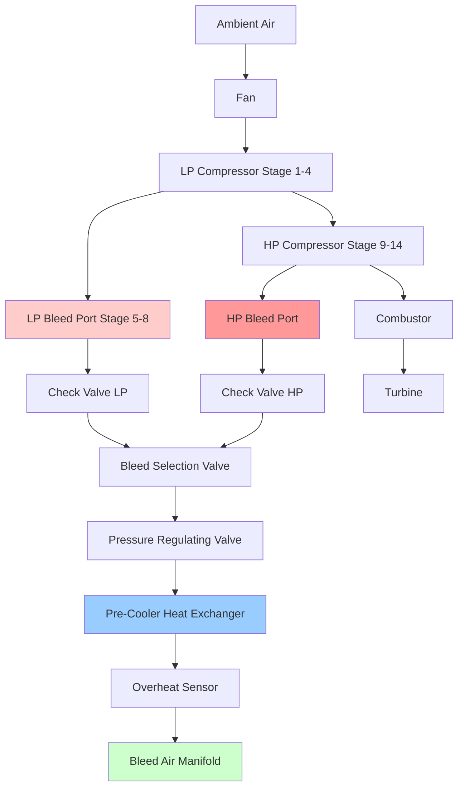

## Engine Bleed Air Extraction Physics

Aircraft turbine engines extract bleed air from specific compressor stages to supply pneumatic power for environmental control, anti-ice protection, and other aircraft systems. This extraction creates a direct thermodynamic penalty on engine performance but provides high-pressure air without requiring additional compression equipment.

The selection of extraction points balances the competing requirements of adequate pressure availability, acceptable temperature levels, minimal engine performance impact, and operational flexibility across the flight envelope.

### Compressor Stage Thermodynamics

The thermodynamic state of air at any compressor stage depends on the overall pressure ratio and the polytropic compression efficiency. For an isentropic compression process, the relationship between pressure and temperature follows:

$$\frac{T_2}{T_1} = \left(\frac{P_2}{P_1}\right)^{\frac{\gamma-1}{\gamma}}$$

Where $\gamma = 1.4$ for air. In actual compressors, polytropic efficiency ($\eta_p = 0.88$ to $0.92$) modifies this relationship:

$$\frac{T_2}{T_1} = \left(\frac{P_2}{P_1}\right)^{\frac{\gamma-1}{\gamma \eta_p}}$$

Modern high-bypass turbofan engines achieve overall compressor pressure ratios of 30:1 to 50:1, with individual stage pressure ratios of 1.15 to 1.30. The compressor work per stage follows:

$$w_{stage} = c_p \times (T_{out} - T_{in})$$

Where $c_p = 0.24$ BTU/(lb·°F) for air at typical compressor conditions.

## Bleed Air Extraction Points

Turbine engines provide bleed air from multiple compressor locations to accommodate varying aircraft requirements and flight conditions.

### High-Pressure Compressor Bleed

High-pressure (HP) bleed extraction occurs at the 9th to 14th compressor stage, depending on engine design. This location provides:

**Pressure characteristics:**
- Ground idle: 25-35 psig
- Flight idle at cruise altitude: 35-45 psig
- Maximum continuous power: 55-75 psig

**Temperature characteristics:**
- Ground conditions: 450-550°F (232-288°C)
- Cruise conditions: 400-500°F (204-260°C)
- High power settings: 550-650°F (288-343°C)

The HP bleed port provides sufficient pressure at all flight conditions but requires substantial pre-cooling before use. The mass flow extraction penalty directly reduces compressor discharge pressure and overall engine efficiency.

### Low-Pressure/Intermediate-Pressure Bleed

Low-pressure (LP) or intermediate-pressure (IP) bleed extraction occurs at the 5th to 8th compressor stage. This location offers:

**Pressure characteristics:**
- Ground idle: 15-25 psig
- Flight idle at cruise altitude: 20-30 psig
- High power: 35-50 psig

**Temperature characteristics:**
- Ground conditions: 250-350°F (121-177°C)
- Cruise conditions: 200-300°F (93-149°C)

LP bleed provides adequate pressure at high-power conditions with lower temperature, reducing pre-cooler thermal load. However, at low engine speeds (ground idle, descent), LP bleed pressure may be insufficient for pneumatic system demands.

## Bleed Valve Control and Scheduling

The bleed air control system manages extraction to maintain required pressure and temperature while minimizing engine performance penalties.

### Pressure Regulating Valve (PRV)

The PRV maintains constant downstream pressure (typically 45-50 psig) regardless of upstream variations. The valve operates as a pressure-balanced, spring-loaded device:

**Control equation:**

$$P_{downstream} \times A_{sense} = F_{spring} + F_{control}$$

Where the sensing area ($A_{sense}$) provides feedback to modulate valve position. Modern systems employ electrically-actuated PRVs with FADEC control for precise regulation and diagnostic capability.

### High-Stage/Low-Stage Valve Selection

The bleed control system automatically selects between HP and LP sources based on engine operating conditions:

**Selection logic:**
1. **Ground and low-altitude operations:** LP bleed provides adequate pressure with lower temperature
2. **High-altitude cruise at low thrust:** HP bleed required as LP pressure drops below threshold
3. **Engine starting:** HP bleed closed to preserve compressor surge margin
4. **Single-pack operation:** HP bleed selected to ensure adequate flow

The transfer between LP and HP sources occurs through staged valve sequencing to prevent pressure transients. The LP valve begins closing before the HP valve opens, with a 1-2 second overlap period.

### FADEC Integration

Full Authority Digital Engine Control (FADEC) systems integrate bleed valve scheduling with engine operability limits:

- **Surge margin protection:** Limits bleed extraction during rapid thrust transients
- **Efficiency optimization:** Minimizes bleed extraction when sufficient from alternative sources
- **Redundancy management:** Controls bleed distribution during asymmetric operation
- **Diagnostic monitoring:** Tracks valve position, response time, and leakage

## Pre-Cooler Operation

Pre-cooler heat exchangers reduce bleed air temperature to acceptable levels for downstream pneumatic ducting and equipment. The primary pre-cooler uses fan discharge air or ram air as the cooling medium.

### Heat Exchanger Thermodynamics

The pre-cooler operates as a crossflow heat exchanger with the effectiveness determined by:

$$\varepsilon = \frac{T_{bleed,in} - T_{bleed,out}}{T_{bleed,in} - T_{cooling,in}}$$

Typical effectiveness ranges from 0.60 to 0.75 depending on cooling airflow conditions. The heat rejection requirement follows:

$$\dot{Q} = \dot{m}_{bleed} \times c_p \times (T_{bleed,in} - T_{bleed,out})$$

For a bleed flow of 1.5 lb/sec at 500°F requiring cooling to 250°F:

$$\dot{Q} = 1.5 \times 0.24 \times (500 - 250) = 90 \text{ BTU/sec} = 324,000 \text{ BTU/hr}$$

The required cooling airflow depends on the temperature rise acceptable in the cooling stream:

$$\dot{m}_{cooling} = \frac{\dot{Q}}{c_p \times \Delta T_{cooling}}$$

Assuming a 100°F temperature rise in the cooling air:

$$\dot{m}_{cooling} = \frac{90}{0.24 \times 100} = 3.75 \text{ lb/sec}$$

This cooling flow represents 2.5 times the bleed mass flow, creating significant ram air drag during high-bleed operations.

### Ground Operation Considerations

During ground operations, ram air velocity is insufficient for adequate pre-cooler performance. The fan air pre-cooler valve modulates to increase cooling flow, drawing air directly from the engine fan discharge. This arrangement:

- Increases cooling effectiveness to 0.70-0.80
- Creates additional engine performance penalty (0.3-0.5% thrust loss)
- Generates elevated pre-cooler exit temperatures (280-320°F) during hot day operations

Ground crews must monitor bleed air temperature carefully during extended APU-off operations when engine bleed provides all environmental control, particularly in hot ambient conditions exceeding 100°F.

## Engine Performance Impact

Bleed air extraction creates multiple performance penalties that accumulate to significant fuel consumption increases.

### Direct Thrust Loss

Extracting mass flow from the compressor reduces the air available for combustion and thrust production. The first-order approximation:

$$\Delta F_{thrust} \approx -1.2 \times \frac{\dot{m}_{bleed}}{\dot{m}_{engine}}$$

For a typical extraction of 2.5% of engine airflow:

$$\Delta F_{thrust} \approx -1.2 \times 0.025 = -3.0\%$$

This represents a continuous 3% thrust deficit that must be compensated by increased throttle setting, raising fuel consumption.

### Compressor Efficiency Degradation

Bleed extraction disrupts the compressor aerodynamic design point, reducing stage matching and overall compression efficiency. The off-design operation creates:

- Increased compressor work per unit mass flow (2-3% increase in specific work)
- Reduced surge margin requiring conservative operating limits
- Non-uniform flow distribution in downstream stages

The combined efficiency penalty adds 0.5-1.0% to specific fuel consumption beyond the direct mass flow penalty.

### Bleed Extraction Impact Comparison

| Flight Condition | Bleed Flow (lb/sec) | Thrust Penalty | Fuel Flow Increase | Total System Penalty |
|------------------|---------------------|----------------|--------------------|--------------------|
| Ground idle, hot day | 1.8 | 4.2% | 2.1% | 6.3% |
| Takeoff | 1.5 | 2.8% | 1.4% | 4.2% |
| Cruise, normal ECS | 1.0 | 2.4% | 1.2% | 3.6% |
| Cruise, reduced ECS | 0.6 | 1.4% | 0.7% | 2.1% |
| Descent, idle thrust | 0.8 | 5.5% | 2.8% | 8.3% |

The descent condition shows the highest percentage penalty because bleed extraction at low engine power represents a larger fraction of total engine airflow.

## Contamination Prevention and Detection

Bleed air quality directly impacts cabin air safety, requiring robust contamination prevention and detection systems.

### Contamination Sources

Potential contaminants entering the bleed air stream include:

**Engine oil seepage:**
- Main bearing carbon seals allow microscopic oil migration
- Degraded seals increase leakage from 0.5 quarts/hour to 2-3 quarts/hour
- Synthetic turbine oils contain tricresyl phosphate (TCP) additives with toxicity concerns

**Hydraulic fluid intrusion:**
- Hydraulic lines routed near bleed ducting may leak onto hot surfaces
- Phosphate ester fluids (Skydrol) produce toxic pyrolysis products above 300°F
- Fluid decomposition creates acrid odors detectable at concentrations below 1 ppm

**Combustion products:**
- Incomplete combustion during engine starting introduces CO and unburned hydrocarbons
- Reverse flow during compressor stalls can draw combustion products forward
- Engine internal fires contaminate bleed air until extinguished

### Seal Design and Maintenance

Modern turbofan engines employ multiple-stage carbon seals at main bearing locations. The seal arrangement includes:

1. **Buffered seal cavity:** Pressurized with compressor air at higher pressure than bearing oil pressure
2. **Carbon face seals:** Two or three stages with minimal leakage (0.1-0.3 quarts/hour per bearing)
3. **Scavenge system:** Oil mist separators prevent pressure buildup in bearing sumps

Seal degradation indicators include:
- Rising oil consumption (> 0.5 quarts/hour increase)
- Visible oil streaking on engine exterior
- Oil odor in cabin air (described as "dirty socks" or "wet dog" smell)

Seal replacement typically occurs at overhaul intervals (15,000-25,000 flight hours) but may require premature replacement if contamination events occur.

### Detection and Monitoring Systems

Current detection systems provide limited direct contamination sensing:

**Temperature monitoring:**
- Overheat detection at 260-280°F triggers bleed air shutoff
- Prevents thermal decomposition of contaminants
- Does not detect contamination at normal operating temperatures

**Pressure monitoring:**
- High pressure (> 60 psig) indicates PRV failure
- Low pressure (< 25 psig) indicates system leakage or inadequate supply
- Pressure anomalies may indicate duct blockage from debris

**Emerging sensor technologies:**
- CO sensors detect combustion product contamination (threshold: 50 ppm)
- Total volatile organic compound (VOC) sensors measure oil vapor concentrations
- Particle counters detect oil mist and other aerosols

Advanced systems under development combine multiple sensor types with pattern recognition algorithms to distinguish contamination events from normal system variations. These systems target detection within 30-60 seconds of contamination entry, enabling rapid corrective action before cabin air quality degrades.

### Operational Procedures

Flight crews respond to suspected bleed air contamination through established procedures:

1. **Isolate affected bleed source:** Close engine bleed valve or shift to opposite engine
2. **Increase pack flow:** Dilute contaminants with higher air circulation rates
3. **Deploy emergency oxygen:** If contamination severity threatens crew capability
4. **Land at nearest suitable airport:** Minimize passenger exposure time

Maintenance actions following contamination events include:
- Bleed duct borescope inspection for oil deposits
- Bearing seal condition assessment through oil consumption trending
- Air quality testing using portable VOC analyzers
- Pre-cooler inspection and cleaning if deposits found

## System Integration and Future Trends

Modern aircraft bleed systems integrate with multiple aircraft systems requiring coordinated control:

- **Anti-ice systems:** Wing and engine anti-ice demand 3-5 lb/sec during icing conditions
- **Hydraulic reservoir pressurization:** Continuous low flow (0.05 lb/sec) maintains 40-50 psig
- **Water tank pressurization:** Intermittent flow during water system operation
- **Engine starting:** Cross-bleed starting consumes 2-3 lb/sec for 30-90 seconds

The industry trend toward more-electric aircraft architectures eliminates engine bleed for environmental control, retaining bleed only for anti-ice applications on some platforms. The Boeing 787 represents the first large commercial aircraft with complete elimination of ECS bleed extraction, demonstrating 3-4% fuel savings from this architectural change alone.

Remaining bleed air applications (engine and wing anti-ice) may transition to electric heating as power electronics and electrical generation systems advance, potentially eliminating all bleed extraction by 2035-2040 for new aircraft designs.
