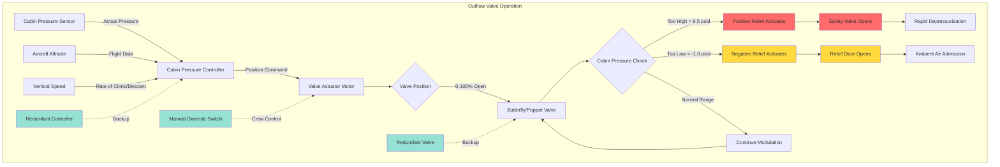

Aircraft cabin outflow valves serve as the primary means of controlling cabin pressure by modulating the discharge of air from the pressurized fuselage. These critical components maintain the pressure schedule commanded by the cabin pressure controller while providing essential safety relief functions.

## Operating Principles

Outflow valves operate on a mass balance principle where the rate of air leaving the cabin equals the rate supplied by the ECS packs minus the cabin pressurization rate. The valve modulates between fully open and fully closed positions to maintain the target cabin altitude.

The fundamental relationship governing outflow valve operation is:

$$\dot{m}_{outflow} = \dot{m}_{supply} - \rho_{cabin} V_{cabin} \frac{dP_{cabin}}{dt}$$

where $\dot{m}_{outflow}$ is the mass flow through the outflow valve, $\dot{m}_{supply}$ is the supply air mass flow, $\rho_{cabin}$ is cabin air density, $V_{cabin}$ is cabin volume, and $\frac{dP_{cabin}}{dt}$ is the rate of cabin pressure change.

The flow through the outflow valve follows:

$$\dot{m}_{outflow} = C_d A_{valve} \sqrt{2 \rho_{cabin} \Delta P}$$

where $C_d$ is the discharge coefficient (typically 0.6-0.8), $A_{valve}$ is the effective valve opening area, and $\Delta P$ is the pressure differential across the valve.

## Valve Types and Construction

Aircraft outflow valves utilize several mechanical configurations, each offering distinct advantages for different applications.

| Valve Type | Operating Range | Response Time | Typical Application | Advantages | Limitations |
|------------|-----------------|---------------|---------------------|------------|-------------|
| Butterfly | 0-90° rotation | 2-5 seconds | Large commercial aircraft | High flow capacity, simple design | Non-linear flow characteristic |
| Poppet | Linear stroke 0-3 inches | 3-8 seconds | Business jets, regional aircraft | Tight shutoff, linear flow | Limited flow capacity |
| Iris | Radial closure | 4-10 seconds | Small aircraft | Compact, smooth modulation | Complex mechanism |
| Sliding Gate | Linear translation | 2-6 seconds | Wide-body aircraft | Very high capacity | Requires significant actuation force |

**Butterfly Valves** employ a circular disc mounted on a rotating shaft. The disc rotates from perpendicular to the flow (closed) to parallel with the flow (open). These valves provide excellent flow capacity in a compact package, making them the preferred choice for large commercial aircraft with high air circulation rates.

**Poppet Valves** feature a plug or disc that lifts away from a seat to allow flow. The linear motion provides more predictable flow characteristics and superior sealing when closed. The valve position directly correlates to flow area, simplifying control algorithms.

**Iris Valves** use overlapping segments that open and close radially, similar to a camera aperture. This design offers smooth modulation and compact installation but requires more complex mechanical actuation.

## Automatic Control Modes

In automatic mode, the cabin pressure controller commands the outflow valve position based on sensor inputs including cabin altitude, aircraft altitude, vertical speed, and ambient pressure. The controller implements a proportional-integral-derivative (PID) algorithm to minimize pressure deviations:

$$u(t) = K_p e(t) + K_i \int_0^t e(\tau) d\tau + K_d \frac{de(t)}{dt}$$

where $u(t)$ is the valve command signal, $e(t)$ is the pressure error, and $K_p$, $K_i$, $K_d$ are the PID gains.

The controller continuously adjusts valve position to maintain the programmed cabin altitude throughout the flight profile. During climb, the valve gradually closes to maintain cabin pressure as ambient pressure decreases. During descent, the valve opens to allow cabin pressure to decrease in a controlled manner.

Modern digital controllers sample pressure sensors at 10-50 Hz and update valve commands at similar rates, providing smooth pressure control without oscillations. Rate limiting prevents abrupt valve movements that could cause passenger discomfort.

## Manual Control Modes

Manual mode allows flight crew direct control of outflow valve position through cockpit switches or rotary controls. This backup mode activates when:

- Automatic controller failure occurs
- Abnormal pressure conditions require crew intervention
- System testing or troubleshooting is underway
- Smoke/fume evacuation necessitates rapid depressurization

In manual mode, the crew commands valve position directly, overriding automatic control signals. Most systems provide discrete positions (fully open, partially open, fully closed) rather than continuous modulation. Training emphasizes smooth valve movements to prevent rapid pressure changes exceeding 300-500 ft/min cabin altitude change rate.

## Negative Pressure Relief Function

Negative pressure relief prevents cabin pressure from dropping below ambient pressure, which could cause structural damage by applying loads in the opposite direction of design intent. The outflow valve incorporates a spring-loaded mechanism or separate negative relief door that opens when cabin pressure falls approximately 0.5-1.0 psi below ambient.

The relief mechanism operates passively without electrical power. As the pressure differential reverses, aerodynamic forces and spring preload cause the valve to open, admitting ambient air until pressures equalize.

## Positive Pressure Relief Function

Positive pressure relief protects against excessive cabin pressure that could exceed fuselage structural limits. This function activates at a pressure differential typically 0.5-1.0 psi above the maximum operating differential (usually 8.5-9.5 psid total).

When cabin pressure reaches the relief threshold, a separate safety valve or the outflow valve itself opens fully to rapidly vent cabin air. This mechanical backup operates independently of the electronic control system, providing fail-safe protection even during complete electrical failure.

## Cabin Pressure Controller Integration

The outflow valve receives position commands from the cabin pressure controller via electrical signals. Most modern systems use:

- **Analog signals:** 0-5 VDC or 4-20 mA current loops for valve position command
- **Digital communications:** ARINC 429 or CAN bus data transmission
- **Feedback signals:** Valve position sensors (RVDT or potentiometer) report actual position to the controller

The controller implements closed-loop control by comparing commanded cabin altitude to actual cabin altitude and adjusting valve position to minimize error. Anti-windup algorithms prevent integral term saturation during transient conditions.

## Redundancy and Fail-Safe Requirements

Aircraft certification standards require extensive redundancy in cabin pressure control systems:

**Dual Outflow Valves:** Most commercial aircraft install two independent outflow valves. Either valve can maintain cabin pressure alone, providing continued operation after single valve failure. The valves typically install in different fuselage sections to prevent common-mode failures.

**Redundant Controllers:** Dual cabin pressure controllers provide automatic failover. The backup controller monitors primary controller operation and assumes control if anomalies are detected. Some systems employ voting logic where two of three controllers must agree.

**Independent Power Sources:** Outflow valve actuators connect to separate electrical buses. Battery backup ensures valve operation during total generator failure, allowing controlled depressurization.

**Mechanical Fail-Safe:** Spring mechanisms bias the valve toward a safe position (typically mid-position or fully open) if actuator power is lost. This prevents trapped cabin pressure while maintaining some pressurization capability.

**Position Monitoring:** Dual position sensors on each valve provide position feedback. Disagreement between sensors triggers fault annunciation and may activate backup systems.

The overall system reliability target exceeds 10^-9 probability of loss of cabin pressure control per flight hour, achieved through these multiple layers of redundancy.

## Maintenance and Testing

Outflow valve maintenance includes:

- Functional testing during aircraft C-checks (every 18-24 months)
- Position sensor calibration verification
- Actuator motor current draw measurement
- Seal inspection and replacement at overhaul intervals
- Full stroke testing under pressure differential conditions
- Response time verification to commanded positions

Proper outflow valve operation is essential for passenger comfort, safety, and aircraft structural integrity throughout the flight envelope.
