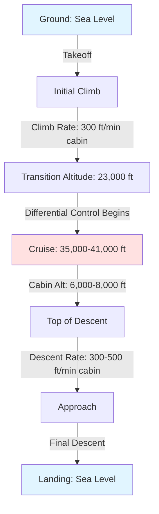

Aircraft cabin pressure schedules define the programmed relationship between flight altitude and cabin altitude throughout all phases of flight. These schedules balance physiological requirements for passenger comfort, structural limitations of the aircraft fuselage, and operational efficiency.

## Cabin Altitude Programming

The cabin pressure control system follows a predetermined schedule that varies cabin altitude as a function of aircraft altitude. During climb, the cabin altitude increases at a controlled rate that is significantly slower than the aircraft's rate of climb. A typical schedule maintains sea level cabin pressure up to approximately 23,000 ft flight altitude, after which cabin altitude begins to increase proportionally.

The mathematical relationship during cruise can be expressed as:

$$P_{cabin} = P_{ambient} + \Delta P_{max}$$

where $P_{cabin}$ is cabin absolute pressure, $P_{ambient}$ is outside ambient pressure, and $\Delta P_{max}$ is the maximum allowable pressure differential.

Cabin altitude $h_{cabin}$ relates to cabin pressure through the standard atmosphere equation:

$$P_{cabin} = P_0 \left(1 - \frac{0.0065 \cdot h_{cabin}}{T_0}\right)^{5.2561}$$

where $P_0 = 14.696$ psi (sea level pressure) and $T_0 = 288.15$ K (sea level temperature).

## Maximum Cabin Altitude Limits

Regulatory requirements establish maximum cabin altitude limits to ensure adequate oxygen partial pressure for passengers without supplemental oxygen. FAA regulations (14 CFR Part 25) specify:

- Maximum normal cabin altitude: 8,000 ft
- Emergency depressurization limit: 15,000 ft
- Supplemental oxygen required above 15,000 ft

At 8,000 ft cabin altitude, the atmospheric pressure is approximately 10.9 psia, providing an oxygen partial pressure of 2.3 psia—sufficient for normal physiological function in healthy individuals. The typical cruise cabin altitude ranges from 6,000 to 8,000 ft depending on flight altitude and aircraft type.

## Pressure Differential Limits

The pressure differential $\Delta P$ between cabin interior and outside ambient air is constrained by structural design limits of the fuselage. Modern commercial aircraft typically operate with maximum differentials between 8.6 and 9.4 psi:

| Aircraft Type | Max Differential (psi) | Max Cruise Cabin Alt (ft) |
|---------------|----------------------|--------------------------|
| Boeing 737 | 8.35 | 8,000 |
| Boeing 747 | 8.90 | 8,000 |
| Boeing 787 | 9.40 | 6,000 |
| Airbus A320 | 8.70 | 8,000 |
| Airbus A380 | 9.10 | 7,000 |
| Airbus A350 | 9.40 | 6,000 |

The pressure differential creates hoop stress in the cylindrical fuselage:

$$\sigma_{hoop} = \frac{\Delta P \cdot r}{t}$$

where $r$ is fuselage radius and $t$ is skin thickness. This stress drives structural weight and fatigue considerations.

## Control Modes

### Isobaric Control Mode

In isobaric mode, the cabin pressure controller maintains constant cabin altitude regardless of aircraft altitude changes. This mode is typically used during cruise when the aircraft maintains a relatively stable flight altitude. The outflow valve modulates to maintain:

$$\frac{dP_{cabin}}{dt} = 0$$

### Differential Control Mode

Differential control mode maintains a constant pressure differential between cabin and ambient. This mode activates when the maximum allowable differential is reached, preventing structural overstress. The controller maintains:

$$\Delta P = P_{cabin} - P_{ambient} = constant$$

As aircraft altitude increases beyond the point where maximum differential is reached, cabin altitude must increase proportionally to prevent exceeding structural limits.

## Rate of Change Limits

Passenger comfort requires limiting the rate of cabin altitude change. Excessive rates cause ear discomfort due to inability of the Eustachian tubes to equalize middle ear pressure rapidly enough.

Typical rate limits:

- Climb: 300-500 ft/min cabin altitude increase
- Descent: 300-500 ft/min cabin altitude decrease
- Emergency descent: up to 2,000 ft/min (temporary)

The rate of pressure change is controlled by the outflow valve position:

$$\frac{dP_{cabin}}{dt} = \frac{\dot{m}_{in} - \dot{m}_{out}}{V_{cabin}} RT$$

where $\dot{m}_{in}$ is bleed air mass flow rate, $\dot{m}_{out}$ is outflow valve mass flow, $V_{cabin}$ is cabin volume, $R$ is gas constant, and $T$ is cabin temperature.

## Flight Profile Pressure Schedule

The complete pressure schedule coordinates cabin altitude with flight profile:

## Correlation Between Flight and Cabin Altitude

The relationship between flight altitude $h_{flight}$ and cabin altitude $h_{cabin}$ varies by flight phase:

**Below transition altitude** (typically < 23,000 ft):
$$h_{cabin} = \text{sea level to } 2,000 \text{ ft}$$

**Above transition altitude**:
$$h_{cabin} = h_{flight} - \frac{\Delta P_{max}}{\rho g}$$

where the effective altitude difference is determined by maximum pressure differential capability.

**At maximum cruise altitude** (41,000 ft):
- Conventional aircraft: $h_{cabin} = 8,000$ ft, $\Delta P = 8.6$ psi
- Advanced aircraft: $h_{cabin} = 6,000$ ft, $\Delta P = 9.4$ psi

## Programming Considerations

Modern digital cabin pressure controllers use lookup tables and algorithms to optimize the pressure schedule based on:

- Flight plan cruise altitude
- Aircraft climb and descent performance
- Weather conditions and turbulence
- Passenger comfort priorities
- Structural fatigue management

The controller anticipates altitude changes and begins cabin altitude adjustments before aircraft altitude changes, providing smooth transitions and minimizing rapid pressure changes that affect passenger comfort.

Advanced systems incorporate predictive algorithms that interface with the flight management system, receiving real-time flight plan updates to optimize pressurization schedules for each flight segment.
