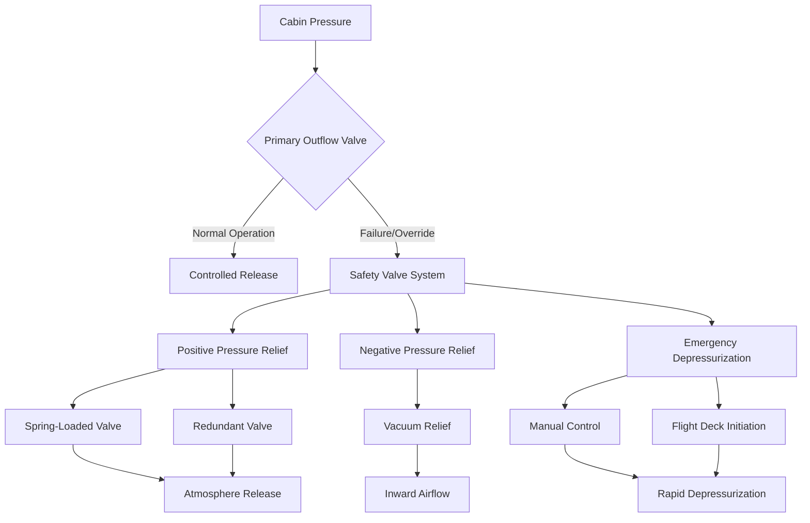

# Safety Valves in Aircraft Cabin Pressurization

Safety valves constitute critical protection systems in aircraft cabin pressurization, preventing structural damage from excessive differential pressure and ensuring controlled emergency depressurization. These devices operate independently of primary pressurization controls, providing redundant protection through mechanical and pneumatic mechanisms.

## Differential Pressure Protection

Aircraft pressure vessels must withstand maximum differential pressure without exceeding structural design limits. The safety valve system maintains pressure within certified boundaries.

### Maximum Differential Pressure Limits

The structural design differential pressure determines safety valve settings:

$$\Delta P_{max} = P_{cabin,max} - P_{ambient,min}$$

For commercial transport aircraft:

$$\Delta P_{design} = 8.6 \text{ to } 9.1 \text{ psid}$$

Safety valve opening pressure typically set at:

$$P_{relief} = 0.95 \times \Delta P_{design}$$

This provides margin before structural limits while accounting for valve response time and flow capacity requirements.

### Pressure Relief Valve Sizing

Relief valve flow capacity must handle maximum pressurization rate to prevent overpressure. The required flow area derives from:

$$\dot{m}_{relief} = \dot{m}_{pack} - \dot{m}_{leak} - \dot{m}_{depressurization}$$

Valve flow area calculation:

$$A_{valve} = \frac{\dot{m}_{relief}}{C_d \cdot P_{cabin} \cdot \sqrt{\frac{\gamma}{R \cdot T_{cabin}} \cdot \left(\frac{2}{\gamma + 1}\right)^{\frac{\gamma + 1}{\gamma - 1}}}}$$

Where discharge coefficient $C_d$ ranges from 0.65 to 0.85 depending on valve geometry, and choked flow conditions apply when pressure ratio exceeds critical value.

## Safety Valve Types and Configurations

Aircraft employ multiple safety valve configurations to ensure redundant protection and operational reliability.

### Positive Pressure Relief Valves

Spring-loaded mechanical valves open automatically when cabin pressure exceeds preset differential:

- **Primary relief valve**: Opens at 8.1 to 8.3 psid
- **Secondary relief valve**: Opens at 8.5 to 8.7 psid
- **Spring preload**: Adjusted during manufacture and verified during maintenance
- **Flow capacity**: Sized to handle maximum pack output with outflow valve failure

### Negative Pressure Relief Valves

Prevents cabin pressure falling below ambient during descent or depressurization events:

- **Opening differential**: 0.3 to 0.5 psid negative
- **Lightweight flapper design**: Minimal resistance to inward flow
- **Location**: Multiple valves distributed around pressure vessel
- **Function**: Allows atmospheric air inflow to equalize pressure

### Emergency Depressurization System

Flight crew-initiated rapid depressurization for emergency situations (smoke, fumes, fire):

$$t_{depressurization} = \frac{V_{cabin}}{C_v \cdot A_{valve} \cdot \sqrt{\rho_{cabin} \cdot \Delta P}}$$

Target depressurization time: 10 to 45 seconds depending on aircraft type and altitude.

## Safety Valve Performance Characteristics

| Parameter | Positive Relief | Negative Relief | Emergency Depressurization |
|-----------|----------------|-----------------|---------------------------|
| **Opening Pressure** | 8.1-8.7 psid | -0.3 to -0.5 psid | Manual activation |
| **Flow Capacity** | 15-25 lb/min | 50-100 lb/min | 200-500 lb/min |
| **Response Time** | 50-100 ms | <10 ms | 200-500 ms |
| **Valve Type** | Spring-loaded poppet | Flapper/check | Butterfly or iris |
| **Redundancy** | Dual valves | Multiple valves | Dual controls |
| **Maintenance Interval** | 2000-4000 flight hours | 4000-6000 flight hours | 1000-2000 flight hours |

## Fail-Safe Design Principles

Safety valve systems incorporate multiple layers of protection and failure mode analysis.

### Redundancy Architecture

- **Dual independent valves**: Each capable of full pressure relief
- **Separate mounting locations**: Physical separation prevents common-cause failure
- **Different actuation mechanisms**: Spring-loaded and pneumatic pilot-operated
- **Continuous monitoring**: Pressure sensors with flight deck indication

### Failure Mode Effects Analysis

Critical failure scenarios and design mitigation:

1. **Outflow valve stuck closed**: Safety valves open automatically at relief pressure
2. **Safety valve seat leakage**: Redundant valve maintains protection, increased pack load
3. **Safety valve stuck open**: Cabin altitude warning, manual pressurization control
4. **Control system failure**: Mechanical valves function independently of electronics

### Structural Protection

The pressure vessel design incorporates safety factors accounting for:

$$SF = \frac{\sigma_{ultimate}}{\sigma_{operating}} \geq 1.5$$

Where ultimate stress exceeds operating stress by minimum factor of 1.5 per FAR 25.365, providing margin for pressure excursions before safety valve actuation.

## Testing and Certification Requirements

Safety valve systems undergo rigorous qualification testing per FAA regulations.

### Ground Testing Protocol

- **Functional test**: Verify opening pressure within tolerance (±0.1 psid)
- **Flow capacity test**: Measure discharge rate at various pressure differentials
- **Leak test**: Maximum allowable leakage at 0.95 × relief pressure
- **Cycle endurance**: 10,000 cycle test simulating operational life
- **Environmental exposure**: Temperature range -65°F to +160°F, vibration, humidity

### In-Service Inspection

Maintenance programs include periodic safety valve inspection:

- **Visual examination**: Corrosion, damage, foreign object contamination
- **Leak check**: Pressurize cabin to maximum normal differential, monitor for leakage
- **Functional test**: Verify opening pressure using calibrated test equipment
- **Replacement criteria**: Any valve failing tolerance limits or showing damage

### Certification Standards

Aircraft pressurization safety systems comply with:

- **FAR 25.365**: Pressurized compartment loads
- **FAR 25.841**: Pressurized cabins, including safety valve requirements
- **TSO-C116**: Pressure relief valves for aircraft
- **RTCA DO-160**: Environmental conditions and test procedures

## Operational Considerations

Flight operations and maintenance procedures ensure safety valve system reliability.

### Flight Crew Procedures

- **Pressurization system monitoring**: Continuous observation of cabin altitude and differential pressure
- **Abnormal situations**: Recognition of safety valve opening through cabin altitude change or pack flow increase
- **Emergency depressurization**: Proper activation sequence and protective actions
- **Descent procedures**: Controlled depressurization prevents negative pressure relief activation

### Maintenance Best Practices

- **Rigging verification**: Ensure proper valve preload and opening pressure
- **Seal replacement**: Periodic seal renewal prevents leakage and maintains performance
- **Corrosion prevention**: Protective coatings and inspection of aluminum valve bodies
- **Calibration records**: Document testing results and maintain traceability

The safety valve system provides essential protection for aircraft pressure vessels, operating as the final mechanical safeguard against overpressurization while enabling emergency depressurization when required by flight crew. Proper design, testing, and maintenance ensure these critical components perform reliably throughout the aircraft service life.
