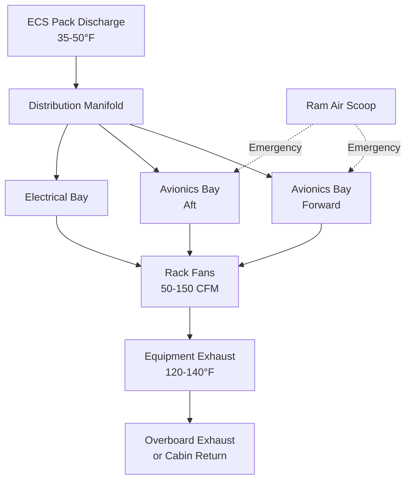
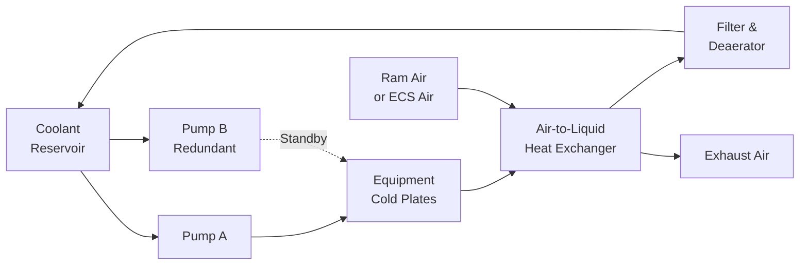

Aircraft equipment cooling systems maintain operational temperatures for avionics, electrical components, galley equipment, and cargo conditioning across ambient extremes from -65°F at cruise altitude to +125°F on desert tarmacs. These specialized thermal management systems employ air cooling, liquid cooling, and hybrid approaches tailored to equipment heat dissipation requirements, weight constraints, and reliability mandates established by FAA 14 CFR Part 25 and DO-160G environmental standards.

## Equipment Cooling Requirements

Aircraft electronic and mechanical equipment generates substantial heat that must be removed to maintain component temperatures within specified operating ranges. Failure to provide adequate cooling results in reduced reliability, shortened service life, and potential safety hazards from thermal-induced malfunctions.

### Thermal Load Categories

**Avionics Equipment:**
- Flight control computers: 200-500 W per unit
- Navigation systems: 150-300 W per rack
- Communication transceivers: 100-250 W per unit
- Weather radar processors: 300-600 W
- Flight management systems: 250-400 W
- Display units: 50-150 W per screen

**Electrical Systems:**
- Power distribution units: 500-1200 W per cabinet
- Transformer rectifier units: 1000-2500 W
- Battery charging systems: 400-800 W
- Emergency power systems: 300-700 W

**Galley Equipment:**
- Ovens and warming drawers: 2000-4000 W per unit
- Coffee makers and beverage heaters: 800-1500 W
- Refrigeration units: 500-1200 W cooling load
- Trash compactors: 200-400 W

**Cargo Compartment:**
- Live animal compartments: 2-4 CFM/ft² ventilation
- Temperature-controlled cargo: 35-75°F maintenance
- Special cargo cooling: pharmaceutical shipments requiring 36-46°F

### Temperature Limits and Design Criteria

Equipment operating temperature limits per DO-160G environmental testing specifications:

| Equipment Type | Operating Range | Maximum Case Temp | Cooling Method |
|----------------|-----------------|-------------------|----------------|
| Avionics racks | 0-55°C | 70°C | Forced air |
| Power electronics | -40-85°C | 95°C | Liquid or forced air |
| Flight displays | -20-55°C | 65°C | Conduction/convection |
| Batteries | 0-50°C | 60°C | Ventilation |
| Galley ovens | 0-75°C | 200°C (external) | Insulation/ventilation |

## Air Cooling Systems

Air cooling represents the primary method for aircraft equipment thermal management due to simplicity, reliability, and integration with environmental control system architecture.

### Ventilation Air Sources

**Conditioned Air from ECS:**

Cold air extracted from air conditioning pack discharge (35-50°F) provides the highest cooling capacity. Air routing:

1. Pack discharge manifold → Equipment bay distribution
2. Fans force air through avionics racks
3. Warm exhaust air (120-140°F) returns to cabin or overboard
4. Flow rates: 50-150 CFM per avionics rack

The cooling capacity available from conditioned air depends on temperature differential and mass flow:

$Q = \dot{m} \cdot c_p \cdot (T_{out} - T_{in})$

Where:
- $Q$ = cooling capacity (BTU/hr)
- $\dot{m}$ = mass flow rate (lb/hr)
- $c_p$ = specific heat of air (0.24 BTU/lb·°F)
- $T_{out}$ = equipment exhaust temperature (°F)
- $T_{in}$ = supply air temperature (°F)

For 100 CFM (approximately 750 lb/hr) with 40°F inlet and 130°F exhaust:

$Q = 750 \times 0.24 \times (130 - 40) = 16,200 \text{ BTU/hr (4.75 kW)}$

**Ram Air Cooling:**

Ram air drawn directly from ambient atmosphere cools equipment when ECS capacity is insufficient or for emergency backup. Ram air scoops capture dynamic pressure at aircraft cruise speeds, forcing ambient air through heat exchangers and equipment bays before exhausting overboard.

**Advantages:**
- No conditioning energy required
- High mass flow availability
- Independence from ECS operation
- Low system weight

**Limitations:**
- Temperature varies with altitude and flight phase (-65°F cruise to +125°F ground)
- Moisture and contaminant ingestion risk
- Icing potential at low temperatures
- Aerodynamic drag penalty from scoops and exhaust openings

**Recirculated Cabin Air:**

Lower-priority cooling loads use cabin return air (75-80°F) when pack discharge air is unavailable. This provides moderate cooling capacity with no aerodynamic penalty but limited temperature differential.

### Equipment Bay Ventilation Architecture

**Flow Distribution:**

Equipment cooling air distribution prioritizes critical avionics first, with secondary systems receiving downstream air. Typical distribution hierarchy:

1. **Primary**: Flight control computers, navigation systems
2. **Secondary**: Communication equipment, display units
3. **Tertiary**: Power distribution, utility systems

Pressure drops through equipment racks range from 0.5-2.0 in. H₂O, requiring fans to generate sufficient static pressure to overcome system resistance.

### Forced Air Cooling Design

Avionics racks employ forced convection with standardized mounting configurations per ARINC 404A, ARINC 600, and ARINC 628 specifications. Line replaceable units (LRUs) mount in chassis with directed airflow paths.

**Design considerations:**

**Air velocity through equipment:** 400-800 fpm for adequate convective heat transfer coefficient (h = 3-6 BTU/hr·ft²·°F)

**Component spacing:** Minimum 0.5-inch gaps between modules for airflow

**Filter requirements:** 25-35% ASHRAE efficiency to prevent dust accumulation while minimizing pressure drop

**Fan reliability:** Redundant fans with automatic switchover upon failure detection

**Acoustic limits:** Fan noise <70 dBA in equipment bays per occupational health standards

## Liquid Cooling Systems

High heat density electronics in modern aircraft (>5 W/in³) require liquid cooling for adequate thermal management. Liquid cooling systems use cold plates, heat exchangers, and pumped coolant loops.

### Liquid Cooling Fluids

**Polyalphaolefin (PAO) Fluids:**
- Operating range: -65°F to +275°F
- Low viscosity at low temperatures
- Non-corrosive, compatible with aluminum
- Typical fluid: MIL-PRF-87257

**Ethylene Glycol/Water Mixtures:**
- 50/50 mixture provides -34°F freeze protection
- Higher heat capacity than PAO fluids
- Corrosion inhibitors required
- Common in ground support equipment

**Dielectric Fluids:**
- Direct immersion cooling applications
- Electrical isolation properties
- High cost limits use to specialized equipment
- Typical fluid: 3M Fluorinert

### Cold Plate Design

Cold plates mounted to equipment provide conductive heat transfer interface between electronics and coolant loop. Aluminum cold plates with internal flow channels achieve thermal resistance of 0.02-0.05 °F·in²/W.

**Heat Transfer Analysis:**

Total thermal resistance from junction to coolant:

$R_{total} = R_{junction-case} + R_{interface} + R_{cold\ plate} + R_{convection}$

Where:
- $R_{junction-case}$ = component internal resistance (specified by manufacturer)
- $R_{interface}$ = thermal interface material resistance (0.01-0.03 °F·in²/W)
- $R_{cold\ plate}$ = conduction through plate material (0.01-0.02 °F·in²/W)
- $R_{convection}$ = coolant film coefficient (0.005-0.015 °F·in²/W)

Temperature rise from coolant to component junction:

$\Delta T = Q \cdot R_{total}$

For 500W dissipation with $R_{total}$ = 0.06 °F·in²/W per square inch contact area:

$\Delta T = 500 \times 0.06 = 30°F$

With 40°F coolant, junction temperature reaches 70°F—well within typical semiconductor operating limits.

### Liquid Cooling Loop Architecture

Aircraft liquid cooling systems employ closed-loop configurations with redundant pumps, heat exchangers, and expansion reservoirs.

**Primary Components:**

**Coolant pump:** Centrifugal or gear pumps providing 5-15 GPM at 30-60 psi

**Air-to-liquid heat exchanger:** Rejects heat to ECS pack air or ram air, effectiveness 0.70-0.85

**Expansion reservoir:** Accommodates coolant thermal expansion and maintains system pressure

**Filters and deaerators:** Remove particulates and dissolved air

**Flow sensors and temperature monitors:** Provide system health monitoring and fault detection

**Leak detection:** Conductive sensors detect coolant leakage in critical areas

### Hybrid Cooling Approaches

Advanced systems combine air and liquid cooling to optimize weight, reliability, and performance:

**Primary liquid cooling:** High heat density components (power electronics, processors)

**Secondary air cooling:** Lower power devices, power supplies, interface modules

**Spray cooling:** Experimental systems for extreme heat flux (>50 W/cm²)

## Galley and Service Equipment Cooling

Aircraft galleys require cooling for food service equipment including refrigerators, freezers, and chilled beverage storage.

### Galley Refrigeration Systems

**Vapor Compression Units:**

Standard galley carts and refrigerators use hermetic compressor systems with R-134a refrigerant, operating from 115V AC aircraft power.

- Cooling capacity: 200-600 BTU/hr per cart
- Temperature maintenance: 38-42°F refrigerator, 0-10°F freezer
- Compressor power: 150-400 W
- Air-cooled condensers exhausting to galley or cabin

**Thermoelectric Coolers:**

Solid-state Peltier devices provide small-capacity cooling for beverage chillers and specialty applications. Lower efficiency (COP = 0.4-0.8) limits use to <100W cooling loads.

### Galley Ventilation Requirements

High-power galley ovens generating 2000-4000W each require substantial ventilation to prevent galley overheating:

- Ventilation rate: 100-200 CFM per oven
- Heat removal: 7,000-14,000 BTU/hr per oven
- Exhaust temperature limit: <180°F to cabin
- Separate ventilation system isolates galley loads from main ECS

## Cargo Compartment Conditioning

Cargo cooling systems maintain temperature-controlled environments for pharmaceutical shipments, perishables, and live animal transport.

### Temperature-Controlled Cargo Systems

**Passive Insulation:**

Insulated cargo containers (ULDs) with phase change materials maintain temperature for 8-12 hours without active cooling. Thermal mass and insulation R-value determine hold time.

**Active Cooling:**

Dedicated cargo air conditioning systems extract cold air from main packs or use independent vapor cycle units:

- Temperature range: 35-75°F (pharmaceutical), 40-50°F (perishables)
- Air change rate: 15-25 air changes per hour
- Distribution: Overhead ducting with floor-level returns
- Monitoring: Continuous temperature recording for chain-of-custody

## System Performance and Reliability

Equipment cooling system reliability directly impacts aircraft dispatch availability and operational safety. Typical failure modes and mitigation strategies:

| Failure Mode | Impact | Mitigation |
|--------------|--------|------------|
| Fan failure | Equipment overheat in 5-15 minutes | Redundant fans, automatic switchover |
| Coolant leak | Liquid cooling loss | Leak detection, automatic isolation, air cooling backup |
| Heat exchanger blockage | Reduced capacity | Inlet filters, scheduled inspection |
| Pump failure | Loop circulation loss | Dual redundant pumps |
| Flow sensor fault | Loss of monitoring | Self-test diagnostics, backup sensors |

Built-in test equipment (BITE) provides continuous health monitoring, with automatic shutdowns preventing equipment damage from thermal excursions.

## Standards and Testing Requirements

Aircraft equipment cooling systems must demonstrate compliance with:

- **DO-160G Section 4 and 5:** Temperature and altitude testing
- **SAE AS50881:** Wiring and component derating
- **MIL-STD-810:** Environmental engineering considerations
- **FAA AC 25-7D:** Flight test procedures for equipment qualification
- **ARINC 600/628:** Avionics equipment form factors and cooling interfaces

Testing validates thermal performance across the operational envelope including:

- Ground operations: -40°F to +125°F ambient
- Cruise altitude: -65°F ambient, reduced convective cooling
- Emergency depressurization: Rapid pressure/temperature transients
- Single-point failure: Operation with degraded cooling capacity

Aircraft equipment cooling systems represent a critical interface between environmental control systems and mission-essential avionics, electrical, and service equipment. Proper thermal management ensures equipment reliability, optimizes system performance, and maintains operational safety across all flight phases and environmental conditions.
