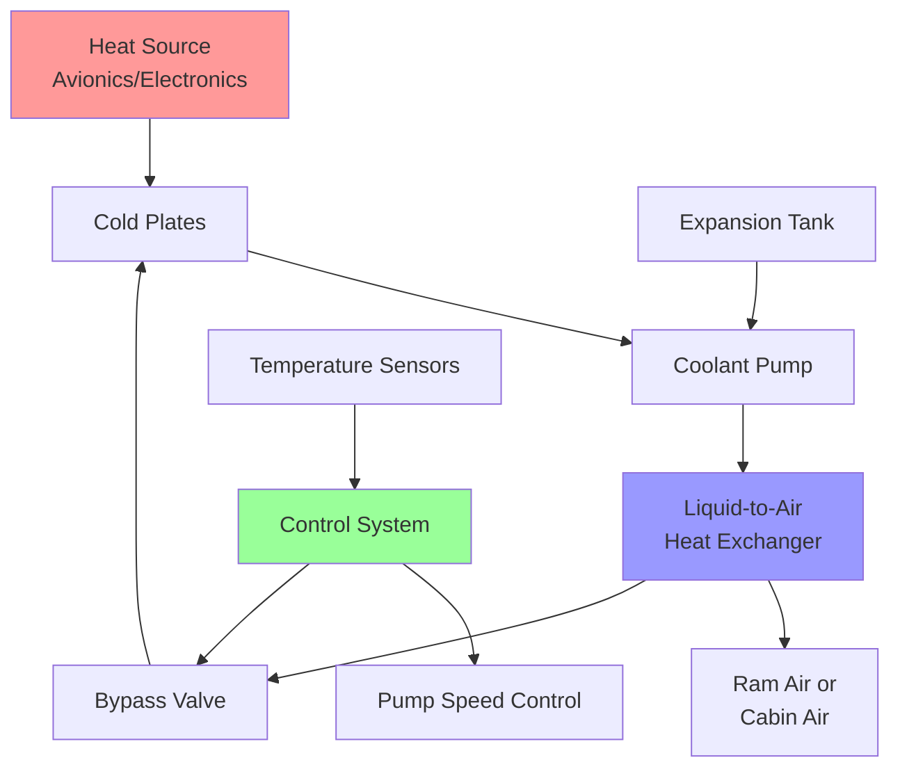

## Overview

Liquid cooling systems provide high-capacity thermal management for aircraft avionics, power electronics, and radar systems where air cooling proves insufficient. These closed-loop systems transfer heat from equipment to air-cooled or fuel-cooled heat exchangers, offering superior heat removal capacity per unit volume compared to direct air cooling.

## Fundamental Heat Transfer Principles

The convective heat transfer from equipment to coolant follows Newton's law of cooling:

$$Q = h \cdot A \cdot (T_s - T_f)$$

Where:
- $Q$ = heat transfer rate (W)
- $h$ = convective heat transfer coefficient (W/m²·K)
- $A$ = surface area (m²)
- $T_s$ = surface temperature (K)
- $T_f$ = fluid temperature (K)

Liquid coolants achieve heat transfer coefficients 10-100 times higher than air, enabling compact thermal management solutions critical for space-constrained aircraft installations.

## Coolant Selection and Properties

Aircraft liquid cooling systems employ specialized coolants selected for thermal performance, stability, and safety characteristics.

### Coolant Comparison

| Coolant Type | Specific Heat (kJ/kg·K) | Thermal Conductivity (W/m·K) | Operating Range (°C) | Flash Point (°C) |
|--------------|-------------------------|-------------------------------|---------------------|------------------|
| PAO (Polyalphaolefin) | 2.1 | 0.14 | -54 to 135 | 260 |
| EGW (Ethylene Glycol/Water) | 3.5 | 0.45 | -40 to 107 | 111 |
| HFE (Hydrofluoroether) | 1.3 | 0.07 | -80 to 160 | None (non-flammable) |
| PAG (Polyalkylene Glycol) | 2.4 | 0.16 | -45 to 150 | 235 |

PAO-based coolants dominate military aircraft applications due to excellent thermal stability, wide temperature range, and compatibility with aircraft materials. Commercial aircraft increasingly utilize non-flammable HFE coolants for enhanced safety in passenger compartments.

## System Architecture

The closed-loop system maintains coolant flow through cold plates mounted to heat-generating equipment, then to heat exchangers where thermal energy transfers to air or fuel.

## Heat Exchanger Design

Aircraft liquid cooling systems utilize compact heat exchangers optimized for weight and volume constraints.

### Effectiveness-NTU Method

Heat exchanger performance follows the effectiveness-NTU relationship:

$$\varepsilon = \frac{Q_{actual}}{Q_{max}} = \frac{1 - e^{-NTU(1-C_r)}}{1 - C_r \cdot e^{-NTU(1-C_r)}}$$

Where:
- $\varepsilon$ = heat exchanger effectiveness
- $NTU$ = number of transfer units = $\frac{UA}{C_{min}}$
- $C_r$ = capacity ratio = $\frac{C_{min}}{C_{max}}$
- $U$ = overall heat transfer coefficient (W/m²·K)
- $A$ = heat transfer area (m²)

Plate-fin and microchannel heat exchangers achieve effectiveness values of 0.75-0.90 while minimizing weight and envelope.

## Pump Selection and Sizing

Coolant pumps must overcome system pressure drop while delivering required flow rates.

### Pump Power Requirement

$$P_{pump} = \frac{\dot{m} \cdot \Delta P}{\rho \cdot \eta_{pump}}$$

Where:
- $P_{pump}$ = pump power (W)
- $\dot{m}$ = mass flow rate (kg/s)
- $\Delta P$ = system pressure drop (Pa)
- $\rho$ = coolant density (kg/m³)
- $\eta_{pump}$ = pump efficiency (typically 0.4-0.6 for aircraft pumps)

### Flow Rate Determination

Required coolant flow rate derives from heat load and temperature rise:

$$\dot{m} = \frac{Q}{c_p \cdot \Delta T}$$

Where:
- $c_p$ = specific heat capacity (J/kg·K)
- $\Delta T$ = coolant temperature rise (K)

Typical aircraft liquid cooling loops maintain 5-15°C temperature rise across the cold plates, balancing flow rate requirements against pump power consumption.

## Pressure Drop Calculations

System pressure drop includes contributions from piping, fittings, cold plates, and heat exchangers.

### Total Pressure Drop

$$\Delta P_{total} = \Delta P_{pipe} + \Delta P_{fittings} + \Delta P_{coldplate} + \Delta P_{HX}$$

For turbulent flow in circular pipes:

$$\Delta P_{pipe} = f \cdot \frac{L}{D} \cdot \frac{\rho \cdot V^2}{2}$$

Where:
- $f$ = Darcy friction factor
- $L$ = pipe length (m)
- $D$ = pipe diameter (m)
- $V$ = flow velocity (m/s)

Aircraft systems minimize pressure drop through careful routing, large-radius bends, and streamlined fittings to reduce parasitic pump power.

## Control Strategies

Temperature control maintains coolant supply temperature within specified limits while minimizing power consumption.

### Variable Speed Pump Control

Pump speed modulation provides proportional flow control:

$$\dot{V}_2 = \dot{V}_1 \cdot \frac{N_2}{N_1}$$

$$P_2 = P_1 \cdot \left(\frac{N_2}{N_1}\right)^3$$

Where:
- $\dot{V}$ = volumetric flow rate
- $N$ = pump speed (rpm)
- $P$ = pump power

Pump speed reduction during low thermal loads yields cubic power savings, significantly reducing electrical demand.

### Bypass Valve Modulation

Three-way bypass valves divert coolant around heat exchangers during cold starts and low-load conditions, accelerating warm-up and preventing overcooling. Proportional control maintains target coolant temperature:

$$\dot{m}_{bypass} = K \cdot (T_{target} - T_{actual})$$

## Integration with Aircraft Systems

Liquid cooling systems interface with aircraft environmental control through secondary heat exchangers.

### Fuel-Cooled Heat Exchangers

High-performance military aircraft reject heat to fuel before combustion, utilizing fuel thermal capacity and eliminating ram air drag penalties. Heat transfer to fuel remains limited by maximum allowable fuel temperature (typically 65-70°C) to prevent vapor lock and thermal degradation.

### Ram Air Heat Exchangers

Commercial aircraft employ ram air heat exchangers, trading aerodynamic drag for simpler integration. NACA ducts and flush inlets minimize drag while providing adequate airflow across heat exchanger cores.

## Reliability and Maintenance

Aircraft liquid cooling systems require leak detection, coolant quality monitoring, and periodic servicing.

### Leak Detection Methods

- Visual inspection at fittings and connections
- Pressure decay testing during maintenance
- Fluorescent dye addition for UV leak detection
- Moisture monitoring in expansion tanks

### Coolant Condition Monitoring

Coolant degradation indicators include:
- pH shift (acidification from oxidation)
- Particulate contamination
- Viscosity changes
- Thermal stability reduction

ASHRAE Standard 147 provides guidance on coolant maintenance practices adapted for aircraft applications.

## Design Considerations

Effective aircraft liquid cooling system design addresses:

1. **Weight optimization**: Minimize coolant volume and structural mass
2. **Redundancy**: Dual-loop configurations for critical systems
3. **Altitude effects**: Account for reduced air-side heat transfer at cruise altitude
4. **G-loading**: Ensure pump operation during maneuvering
5. **Flammability**: Non-flammable coolants near passenger areas
6. **EMI shielding**: Prevent electromagnetic interference with avionics

## Performance Optimization

System optimization balances thermal performance, weight, power consumption, and reliability. Computational fluid dynamics (CFD) modeling enables cold plate and heat exchanger optimization before prototyping. Transient thermal analysis validates system response during rapid power cycling and mission profile variations.

Aircraft liquid cooling systems represent sophisticated thermal management solutions enabling next-generation avionics and power electronics in demanding aerospace environments.
