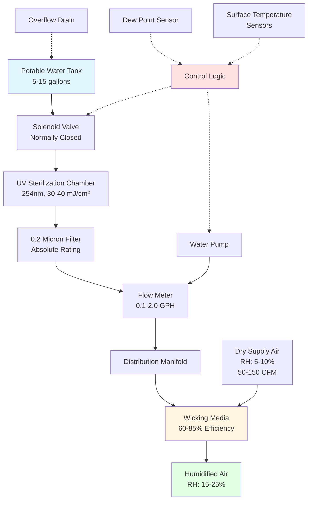
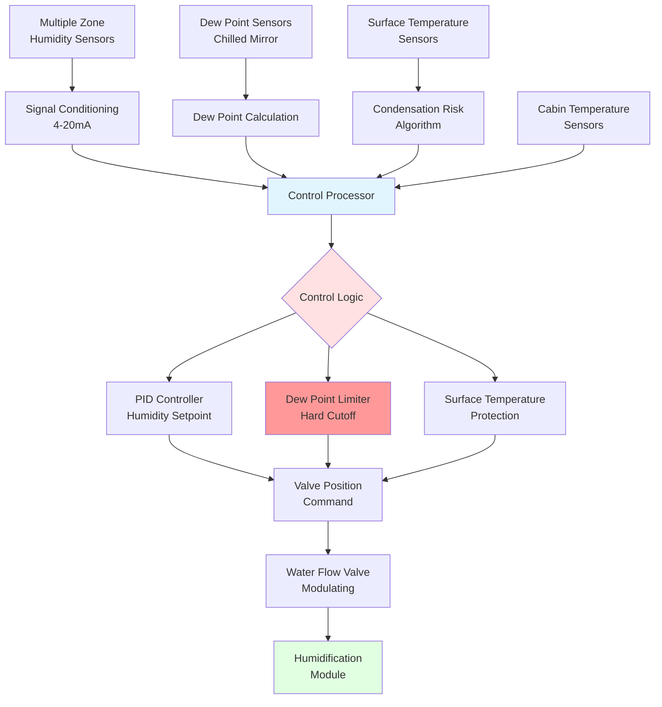

Aircraft cabin humidification systems address the extreme low-humidity conditions inherent to aviation environmental control while navigating stringent weight, power, and condensation constraints. These systems employ specialized technologies fundamentally different from ground-based humidification due to altitude, structural limitations, and safety requirements.

## Evaporative Humidification Technology

Evaporative humidification dominates aircraft applications due to its passive nature, reliability, and inherent self-limiting behavior. The technology introduces moisture through direct contact between dry cabin air and wetted media surfaces.

### Physical Principles

The evaporation rate from a wetted surface into moving air follows mass transfer relationships:

$$
\dot{m}_w = h_d A_s (W_s - W_a)
$$

Where:
- $\dot{m}_w$ = moisture evaporation rate (lb/hr)
- $h_d$ = mass transfer coefficient (lb/hr·ft²)
- $A_s$ = wetted surface area (ft²)
- $W_s$ = humidity ratio at surface (lb/lb_da)
- $W_a$ = humidity ratio of air stream (lb/lb_da)

The mass transfer coefficient relates to airflow velocity and media geometry through empirical correlations. For typical aircraft humidification modules operating at 100 to 200 FPM face velocity:

$$
h_d = 0.15 \times V^{0.8}
$$

Where $V$ represents air velocity in FPM, yielding $h_d$ values of 7 to 11 lb/hr·ft² for standard operating conditions.

### Evaporative Media Design

Aircraft humidification modules utilize specialized wicking materials optimized for weight, surface area, and bacterial resistance.

**Media specifications:**

| Media Type | Surface Area (ft²/ft³) | Water Retention (lb/ft³) | Weight (lb/ft³) | Life Expectancy |
|------------|------------------------|--------------------------|-----------------|-----------------|
| Ceramic matrix | 250-350 | 8-12 | 15-25 | 5,000+ hours |
| Polymer fiber | 300-450 | 10-16 | 8-15 | 3,000-4,000 hours |
| Cellulose composite | 400-600 | 12-20 | 10-18 | 2,000-3,000 hours |
| Titanium oxide coated | 280-380 | 9-14 | 18-28 | 7,000+ hours |

The titanium oxide coating provides photocatalytic antibacterial properties under UV exposure, critical for water quality maintenance during extended operation.

### System Configuration

A complete evaporative humidification module integrates water storage, treatment, media wetting, and control:

### Evaporation Efficiency

The effectiveness of evaporative humidification depends on air velocity, media wetted area, and entering air conditions:

$$
\eta_{evap} = \frac{W_{out} - W_{in}}{W_{sat} - W_{in}}
$$

Where:
- $\eta_{evap}$ = evaporation efficiency (dimensionless)
- $W_{out}$ = leaving air humidity ratio (lb/lb_da)
- $W_{in}$ = entering air humidity ratio (lb/lb_da)
- $W_{sat}$ = saturation humidity ratio at entering dry-bulb temperature (lb/lb_da)

For aircraft modules operating with 70°F supply air at 8% RH:
- $W_{in}$ = 0.0011 lb/lb_da
- $W_{sat}$ = 0.0157 lb/lb_da (at 70°F, 100% RH)
- Target $W_{out}$ = 0.0033 lb/lb_da (20% RH at 70°F)
- Required $\eta_{evap}$ = 15%

This low efficiency requirement enables passive operation without forced water atomization, critical for minimizing power consumption and mechanical complexity.

## Ultrasonic Humidification Systems

Ultrasonic humidification generates fine water droplets through high-frequency mechanical vibration. While less common than evaporative systems in aircraft, ultrasonic technology offers advantages in rapid response and compact packaging.

### Operating Principles

Ultrasonic transducers operating at 1.6 to 2.4 MHz create cavitation at the water surface, ejecting droplets 1 to 5 microns in diameter. The droplet generation rate relates to transducer power and frequency:

$$
\dot{m}_d = \frac{P_{trans} \times \eta_{conv}}{h_{fg}}
$$

Where:
- $\dot{m}_d$ = droplet generation rate (lb/hr)
- $P_{trans}$ = transducer power (Btu/hr)
- $\eta_{conv}$ = conversion efficiency (0.25-0.40 typical)
- $h_{fg}$ = latent heat of vaporization (1,060 Btu/lb at 70°F)

### Ultrasonic System Components

**Critical design elements:**

1. **Piezoelectric transducer**
   - Material: Lead zirconate titanate (PZT) ceramic
   - Operating frequency: 1.65 MHz (typical)
   - Power density: 5-10 W/cm²
   - Service life: 8,000-12,000 hours continuous operation

2. **Droplet evaporation section**
   - Air velocity: 300-500 FPM minimum
   - Residence time: 0.5-1.0 seconds
   - Complete evaporation required before cabin injection
   - Incomplete evaporation causes condensate accumulation

3. **Water level control**
   - Float valve or capacitance sensing
   - Tolerance: ±2mm water depth
   - Critical for consistent transducer coupling

### Performance Comparison

| Parameter | Evaporative | Ultrasonic |
|-----------|-------------|------------|
| Moisture output | 0.5-2.0 lb/hr | 1.0-4.0 lb/hr |
| Power consumption | 50-150W | 200-400W |
| Response time | 5-10 minutes | 30-90 seconds |
| Water quality sensitivity | Moderate | High |
| Maintenance interval | 2,000-3,000 hrs | 1,000-1,500 hrs |
| Droplet size | N/A (vapor) | 1-5 microns |
| Mineral dust generation | None | Present without demineralization |
| Weight (dry) | 15-30 lb | 20-35 lb |

Ultrasonic systems require demineralized water to prevent white dust formation from mineral content. This necessitates reverse osmosis or deionization treatment, adding system complexity and weight.

## Water Treatment Requirements

Water quality determines system reliability, prevents bacterial growth, and ensures passenger safety. Aircraft humidification systems must meet stringent microbiological and chemical standards.

### Treatment Process Stages

**Multi-barrier approach:**

1. **Source water quality**
   - Aircraft potable water system per ARP1616
   - Periodic testing: bacteria, pH, chlorine residual
   - Storage tank material: stainless steel (316L) or titanium

2. **UV sterilization**
   - Wavelength: 254 nm (germicidal)
   - Dose: 30-40 mJ/cm² minimum
   - Flow-through reactor design
   - Lamp life: 9,000-12,000 hours
   - UV intensity monitoring with automatic shutdown

3. **Fine filtration**
   - Absolute rating: 0.2 micron
   - Material: pleated polypropylene or PTFE membrane
   - Differential pressure monitoring
   - Replacement indicator: 15 psid typical

4. **Optional demineralization** (ultrasonic systems)
   - Ion exchange resin cartridges
   - Mixed bed or two-stage configuration
   - Conductivity monitoring: <10 μS/cm target
   - Capacity: 300-500 gallons per cartridge

### Microbiological Control

Bacterial proliferation in stagnant water systems poses health risks. Control strategies include:

$$
\text{UV Dose} = I \times t = \frac{P_{lamp}}{A_{cross}} \times \frac{V_{chamber}}{Q_{flow}}
$$

Where:
- $I$ = UV intensity (μW/cm²)
- $t$ = exposure time (seconds)
- $P_{lamp}$ = lamp output power (W)
- $A_{cross}$ = chamber cross-sectional area (cm²)
- $V_{chamber}$ = irradiation chamber volume (cm³)
- $Q_{flow}$ = water flow rate (cm³/s)

For a typical 15W UV lamp in a 100 cm³ chamber processing 30 ml/min:
- Residence time: 200 seconds
- UV dose: 40 mJ/cm² (exceeds 30 mJ/cm² requirement)

**Supplemental biocide options:**
- Silver ion release: 20-50 ppb concentration
- Periodic hydrogen peroxide shock: 50 ppm for 30 minutes
- Thermal pasteurization: 160°F for 15 minutes (ground maintenance)

## Moisture Injection Control

Precise control of moisture addition prevents condensation while maintaining target humidity levels. Control algorithms balance response speed with safety margins.

### Control Strategy Architecture

### Control Algorithms

**Primary humidity control** employs proportional-integral (PI) regulation:

$$
u(t) = K_p e(t) + K_i \int_0^t e(\tau) d\tau
$$

Where:
- $u(t)$ = control signal (valve position, 0-100%)
- $K_p$ = proportional gain (5-15 typical)
- $K_i$ = integral gain (0.5-2.0 typical)
- $e(t)$ = error signal (setpoint - measured RH)

**Dew point limiting** overrides humidity control when approaching condensation risk:

$$
\text{If } T_{dp,cabin} > (T_{surface,min} - \Delta T_{safety}) \text{, then } u = 0
$$

Where:
- $T_{dp,cabin}$ = measured cabin air dew point (°F)
- $T_{surface,min}$ = minimum monitored surface temperature (°F)
- $\Delta T_{safety}$ = safety margin (5-10°F typical)

### Sensor Placement and Redundancy

Critical for reliable control:

- **Humidity sensors:** 3-5 locations per humidified zone
  - Technology: capacitive polymer thin-film
  - Accuracy: ±2% RH (10-90% range)
  - Drift: <0.5% RH per year
  - Response time: T63 < 15 seconds

- **Dew point sensors:** 2-3 chilled mirror type
  - Accuracy: ±0.5°F
  - Repeatability: ±0.2°F
  - Contamination resistance: automatic optical surface cleaning

- **Surface temperature sensors:** 5-10 locations at cold spots
  - Type: RTD (Pt1000) or thermistor
  - Accuracy: ±0.5°F
  - Mounting: direct contact with monitored surface

## Condensation Prevention Strategies

Moisture accumulation on cold surfaces threatens structural integrity and requires absolute prevention through multi-layered control.

### Critical Condensation Zones

**High-risk areas requiring monitoring:**

1. **Window assemblies**
   - Inner pane temperature: 35-55°F at cruise
   - Reveals and frames: thermal bridges to outer skin
   - Maximum allowable dew point: 45°F

2. **Door seals and frames**
   - Temperature varies with insulation gaps
   - Moisture intrusion risk during ground operations
   - Heating elements integrated in some designs

3. **Fuselage skin penetrations**
   - Fasteners create localized cold spots
   - Air distribution outlets
   - Cargo compartment interfaces

### Thermal Analysis for Condensation

The condensation risk requires calculating minimum surface temperature:

$$
T_{surface} = T_{cabin} - \frac{(T_{cabin} - T_{ambient})}{R_{total} \times h_{conv}}
$$

Where:
- $T_{surface}$ = interior surface temperature (°F)
- $T_{cabin}$ = cabin air temperature (°F)
- $T_{ambient}$ = outside air temperature (°F)
- $R_{total}$ = thermal resistance of insulation assembly (hr·ft²·°F/Btu)
- $h_{conv}$ = convective heat transfer coefficient, cabin side (Btu/hr·ft²·°F)

For typical wide-body insulation at cruise:
- $T_{cabin}$ = 72°F
- $T_{ambient}$ = -60°F
- $R_{total}$ = 8-12 hr·ft²·°F/Btu
- $h_{conv}$ = 1.5 Btu/hr·ft²·°F (still air near surface)

Minimum surface temperature: 48-52°F

Maximum safe dew point: 40-45°F (maintaining 5-8°F safety margin)

### Active Condensation Prevention

**Heated surfaces at critical locations:**

- Window heating: 10-25 W per window assembly
- Door frame heating: resistive trace heating, 50-150W
- Targeted air curtains: directed warm air at cold surfaces

**Drainage provisions:**

- Bilge areas below floor panels collect condensate
- Drain masts route water overboard during flight
- Check valves prevent backflow
- Ground inspection requirements after long flights

## Installation and Maintenance Considerations

Aircraft humidification systems require careful integration and periodic service to maintain certification compliance.

### Installation Requirements

**Weight and balance impact:**
- Water system dry weight: 30-60 lb
- Full water load: 40-125 lb additional
- CG shift calculation required
- Structural mounting analysis for vibration

**Electrical integration:**
- 115V AC or 28V DC power supplies
- Dedicated circuit breakers
- Emergency shutoff controls accessible to crew
- Power consumption: 250-600W total system

**Plumbing integration:**
- Connection to potable water system
- Overflow provisions to bilge or drain
- Shutoff valves for maintenance isolation
- Material compatibility: stainless steel, titanium, PTFE

### Maintenance Schedule

| Task | Interval | Requirements |
|------|----------|--------------|
| Water quality test | Every 30 days | Bacteria, pH, chlorine residual per ARP1616 |
| Filter replacement | 500-1,000 hours | Differential pressure monitoring |
| UV lamp replacement | 9,000-12,000 hours | UV intensity verification |
| Media inspection | 1,000 hours | Visual inspection, efficiency test |
| Media replacement | 2,000-5,000 hours | Type-dependent, performance-based |
| System leak test | Every 100 hours | Pressure decay test |
| Control calibration | Every 6 months | Humidity and dew point sensor verification |
| Complete system inspection | Annual | FAA/EASA requirements per STC |

### Troubleshooting Common Issues

**Insufficient humidification:**
- Media drying: water flow verification, valve function
- Reduced airflow: filter pressure drop, duct blockage
- Sensor drift: calibration verification
- Water quality degradation: biofilm formation on media

**Condensation detection:**
- Immediate system shutdown per design
- Surface inspection at reported location
- Dew point sensor calibration check
- Control algorithm parameter review

**Water system contamination:**
- UV lamp function verification
- Filter integrity test
- Tank cleaning and sanitization
- Distribution system flush

## Regulatory Compliance and Certification

Aircraft humidification systems require supplemental type certificate (STC) approval demonstrating compliance with airworthiness standards.

### Certification Requirements

**FAA regulations:**
- 14 CFR Part 25.831: Ventilation system design and performance
- 14 CFR Part 25.1309: Equipment, systems, and installations
- Failure mode effects analysis (FMEA) required
- Demonstration of no hazardous failure conditions

**Testing protocols:**
- Ground testing across ambient temperature range: -40°F to 120°F
- Altitude chamber testing: sea level to 43,000 feet
- Condensation testing at maximum humidity output
- Water quality maintenance verification
- EMI/EMC testing per DO-160

**Documentation requirements:**
- Installation instructions approved by FAA
- Maintenance manual supplements
- Component life limits and replacement schedules
- Pilot operating handbook revisions

### Industry Standards

**SAE Aerospace Recommended Practices:**
- ARP85G: Air conditioning systems for subsonic airplanes
- ARP1616: Aircraft potable water system guidelines
- ARP1270: Aircraft cabin pressurization control systems
- AIR1168: Aircraft fuel weight penalty due to air conditioning

These standards provide design guidance, testing methodology, and performance criteria for humidification system development and certification.

Aircraft cabin humidification systems demonstrate specialized engineering addressing the unique constraints of aviation environments. Proper design, installation, and maintenance ensure passenger comfort enhancement while maintaining absolute protection against structural moisture damage.
