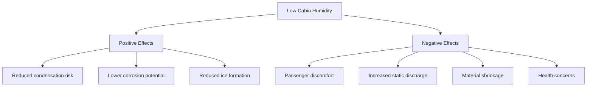

## Overview

Aircraft cabin humidity represents a critical environmental control challenge. Commercial aircraft typically maintain relative humidity levels between 5-15% during cruise, significantly below the 30-60% range recommended by ASHRAE Standard 55 for occupied spaces. This extreme dryness results from the fundamental physics of environmental control systems using high-altitude bleed air and the absence of active humidification.

## Physical Basis of Low Cabin Humidity

### Moisture Content at Altitude

The absolute humidity of outside air decreases dramatically with altitude due to temperature reduction and lower atmospheric water vapor capacity:

$$
\omega = 0.622 \frac{P_v}{P_{atm} - P_v}
$$

where:
- $\omega$ = humidity ratio (lb moisture/lb dry air)
- $P_v$ = partial pressure of water vapor (psi)
- $P_{atm}$ = atmospheric pressure at altitude (psi)

At 35,000 ft cruise altitude, outside air temperature approaches -55°F with near-zero moisture content. When this air is compressed, heated, and introduced to the cabin without humidification, relative humidity drops to extremely low levels.

### Cabin Moisture Balance

Cabin humidity results from the balance between moisture generation and removal:

$$
\dot{m}_{moisture,cabin} = \dot{m}_{gen,passengers} + \dot{m}_{gen,galley} - \dot{m}_{out,ventilation} - \dot{m}_{out,leakage}
$$

Typical moisture generation rates:

| Source | Rate | Notes |
|--------|------|-------|
| Sedentary passenger | 0.12-0.15 lb/hr | Respiration and perspiration |
| Active crew | 0.20-0.25 lb/hr | Increased metabolic rate |
| Galley operations | 0.5-2.0 lb/hr | Cooking, beverage service |
| Lavatory usage | 0.1-0.3 lb/hr per unit | Hand washing, flushing |

## Physiological Effects

### Respiratory Tract Impact

Low humidity affects the respiratory system through multiple mechanisms:

1. **Mucosal Drying**: Nasal and throat mucosa require moisture film for proper function
2. **Ciliary Action Impairment**: Reduced effectiveness of particulate clearance
3. **Increased Susceptibility**: Compromised first-line immune defense

The relationship between relative humidity and mucosal moisture loss:

$$
\dot{Q}_{evap} = h_{fg} \cdot A \cdot k \cdot (P_{sat,mucosa} - P_v)
$$

where:
- $\dot{Q}_{evap}$ = evaporative heat loss (Btu/hr)
- $h_{fg}$ = latent heat of vaporization (≈1060 Btu/lb)
- $A$ = exposed mucosal surface area (ft²)
- $k$ = mass transfer coefficient
- $P_{sat,mucosa}$ = saturation pressure at body temperature

### Ocular Discomfort

Contact lens wearers experience accelerated tear film evaporation. The evaporation rate from the eye surface increases linearly with vapor pressure deficit:

$$
E_{eye} = k_{eye}(RH_{tear} - RH_{cabin})
$$

At 10% cabin RH compared to 40% RH, evaporation rate approximately triples, causing significant discomfort during long-duration flights.

### Dermal Effects

Skin moisture loss follows Fick's law of diffusion through the stratum corneum:

$$
J = -D \frac{\partial C}{\partial x}
$$

Low cabin humidity increases the moisture concentration gradient, accelerating transepidermal water loss (TEWL) and causing:
- Dry, flaky skin
- Increased static electricity generation
- Reduced thermal comfort perception

## Operational Consequences

### Aircraft Systems Impact

### Static Electricity Generation

Surface charge accumulation increases exponentially as RH decreases below 30%:

$$
\sigma = \sigma_0 \cdot e^{-k \cdot RH}
$$

where:
- $\sigma$ = surface charge density
- $\sigma_0$ = baseline charge density
- $k$ = material-dependent constant
- $RH$ = relative humidity (%)

Static discharge events can damage sensitive avionics and create passenger discomfort.

## Mitigation Strategies

### Engineering Solutions

| Approach | Implementation | Effectiveness | Weight Penalty |
|----------|---------------|---------------|----------------|
| Direct humidification | Steam/evaporative systems | High (40-50% RH achievable) | 200-400 lb |
| Increased ventilation | Higher fresh air exchange | Low (12-18% RH) | Fuel burn increase |
| Membrane humidifiers | Selective water transfer | Medium (20-30% RH) | 50-150 lb |
| Personal humidity zones | Localized moisture delivery | Medium (local benefit) | Minimal |

### Active Humidification Systems

Water evaporation load required to achieve target humidity:

$$
\dot{m}_{water} = \dot{m}_{air} (\omega_{target} - \omega_{ambient})
$$

For a typical wide-body aircraft (15,000 CFM ventilation at cruise):

$$
\dot{m}_{air} = 15,000 \frac{ft^3}{min} \times 0.049 \frac{lb}{ft^3} = 735 \text{ lb/min}
$$

To increase humidity from 10% to 30% RH at 75°F cabin temperature requires approximately 8-12 lb/hr of water addition, depending on ventilation rates and leakage.

### Operational Procedures

Flight crew can minimize humidity-related discomfort through:

1. **Temperature Management**: Maintaining cabin temperature at lower end of comfort range (72-74°F) reduces perception of dryness
2. **Ventilation Optimization**: Balancing fresh air supply to minimize over-drying
3. **Passenger Education**: Encouraging hydration and use of saline nasal sprays

## Design Considerations

### Material Selection

Low humidity environments require materials resistant to:
- Dimensional change with moisture content variation
- Embrittlement and cracking
- Excessive static charge accumulation

### Moisture Sensor Placement

Humidity monitoring locations should represent:
- Bulk cabin conditions (mid-cabin, passenger level)
- Critical condensation zones (flight deck windows, cargo holds)
- Humidification system performance (downstream of moisture addition)

Sensor accuracy requirements: ±3% RH in the 5-30% range, with response time <60 seconds.

## Future Technologies

Advanced environmental control systems under development:

- **Fuel cell water recovery**: Converting hydrogen fuel cell byproduct water to cabin moisture
- **Desiccant-based humidity buffering**: Absorbing galley moisture during meal service, releasing during dry periods
- **Personal environmental controls**: Individual humidity control at passenger seat level

These technologies balance the competing requirements of passenger comfort, system weight, energy consumption, and aircraft operational efficiency.

## Standards and Guidelines

While ASHRAE Standard 55 recommends 30-60% RH for thermal comfort, aircraft environmental control must consider:
- FAA certification requirements (14 CFR Part 25)
- Maximum condensation prevention
- System weight and complexity constraints
- Fuel efficiency impacts

The aircraft industry continues to evaluate the cost-benefit relationship between enhanced humidification systems and improved passenger comfort for long-duration flights exceeding 8 hours.
