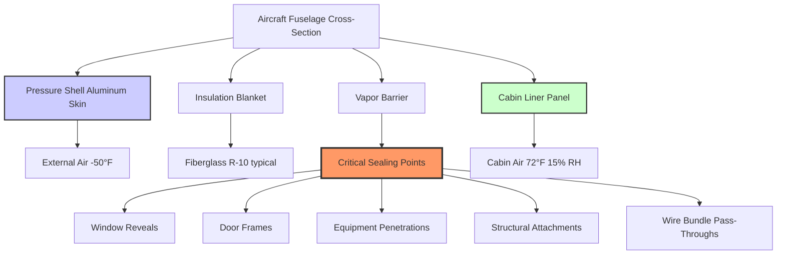
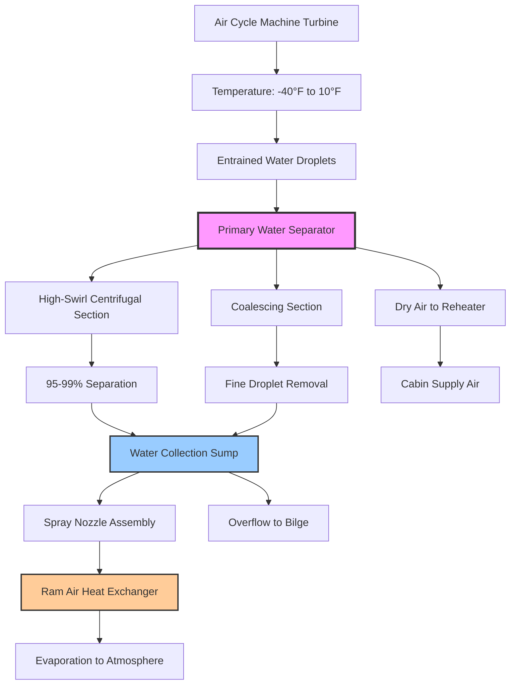
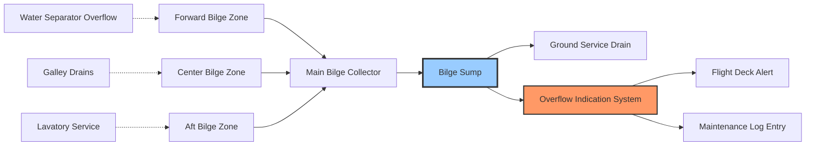

Aircraft moisture control represents a critical engineering challenge where uncontrolled condensation threatens structural integrity, increases weight, and accelerates corrosion. Unlike ground-based HVAC systems, aircraft operate across extreme temperature gradients with zero tolerance for moisture accumulation within structural cavities.

## Condensation Physics in Aircraft Structures

The fundamental moisture control challenge stems from the severe temperature differential between cabin air and external surfaces during cruise flight.

### Temperature Gradient Analysis

At typical cruise altitude (35,000 to 41,000 ft), the fuselage skin temperature reaches -40°F to -60°F while cabin air maintains 68°F to 75°F. This creates a thermal gradient across the insulation system that drives moisture migration and condensation.

**Heat transfer through fuselage:**

$$q = \frac{T_{cabin} - T_{ambient}}{R_{total}}$$

where:
- $q$ = heat flux through fuselage (BTU/hr·ft²)
- $T_{cabin}$ = cabin air temperature (°F)
- $T_{ambient}$ = outside air temperature (°F)
- $R_{total}$ = total thermal resistance (hr·ft²·°F/BTU)

For typical wide-body aircraft insulation (R-8 to R-12):

$$q = \frac{72 - (-50)}{10} = 12.2 \text{ BTU/hr·ft}^2$$

### Dew Point and Condensation Temperature

Moisture condenses when air contacts surfaces below its dew point temperature. The dew point depression determines the safety margin against condensation.

**Saturation vapor pressure (Magnus-Tetens formula):**

$$e_s(T) = 6.112 \times e^{\frac{17.67T}{T + 243.5}}$$

where:
- $e_s$ = saturation vapor pressure (mb)
- $T$ = temperature (°C)

**Dew point temperature:**

$$T_d = \frac{243.5 \ln(e/6.112)}{17.67 - \ln(e/6.112)}$$

where $e$ = actual vapor pressure (mb)

For cabin air at 72°F and 15% RH, dew point equals approximately 25°F. Any surface below this temperature will accumulate condensation if exposed to cabin air.

## Vapor Barrier Design and Requirements

Vapor barriers prevent moisture-laden cabin air from penetrating insulation blankets and reaching cold aluminum skin.

### Vapor Barrier Materials

Aircraft insulation systems employ multiple barrier technologies:

| Material Type | Permeance (perms) | Application | Temperature Range |
|---------------|-------------------|-------------|-------------------|
| Metallized polyester film | 0.02-0.05 | Primary vapor barrier | -65°F to 250°F |
| Aluminum foil laminate | 0.001-0.01 | Critical zones | -65°F to 300°F |
| Polyimide film | 0.03-0.08 | High-temperature areas | -65°F to 400°F |
| Coated fiberglass | 0.1-0.3 | Secondary barriers | -65°F to 350°F |

Per SAE ARP85G, vapor barriers must maintain permeance below 0.1 perm to prevent moisture accumulation during typical flight operations.

### Moisture Migration Mechanisms

Three primary mechanisms drive moisture through insulation systems:

**1. Vapor diffusion through materials**

Fick's first law governs vapor transmission:

$$J = -D \frac{dc}{dx}$$

where:
- $J$ = moisture flux (lb/hr·ft²)
- $D$ = diffusion coefficient (ft²/hr)
- $dc/dx$ = concentration gradient (lb/ft³/ft)

**2. Air leakage through penetrations**

Pressure differential forces moisture-laden air through gaps, seams, and penetrations:

$$\dot{m} = C_d A \sqrt{2\rho\Delta P}$$

where:
- $\dot{m}$ = mass flow rate (lb/hr)
- $C_d$ = discharge coefficient (0.6-0.8 for aircraft penetrations)
- $A$ = leak area (ft²)
- $\rho$ = air density (lb/ft³)
- $\Delta P$ = pressure differential (psf)

At cruise cabin pressure (10.9 to 11.3 psi) versus external pressure (2.7 to 3.5 psi), this differential drives significant air movement through any unsealed penetration.

**3. Capillary action in insulation**

Fibrous insulation materials exhibit capillary moisture transport when partially wetted, redistributing condensed water throughout the blanket.

### Critical Sealing Zones

## Water Extraction Systems

Environmental control systems incorporate water separators to remove condensed moisture from process air before it enters the cabin.

### Water Separator Technologies

**High-swirl separator (centrifugal type):**

Air from the turbine expansion exits at -40°F to 10°F with entrained water droplets. The separator imparts tangential velocity, using centrifugal force to collect droplets.

$$F_c = \frac{m v^2}{r}$$

where:
- $F_c$ = centrifugal force (lbf)
- $m$ = droplet mass (lb)
- $v$ = tangential velocity (ft/s)
- $r$ = separator radius (ft)

Typical performance parameters:

| Parameter | Value | Notes |
|-----------|-------|-------|
| Inlet air temperature | -40°F to 10°F | Post-turbine expansion |
| Swirl velocity | 100-200 ft/s | Generated by vanes |
| Separation efficiency | 95-99% | For droplets >10 microns |
| Pressure drop | 0.3-0.8 psi | Across separator |
| Water collection rate | 10-40 lb/hr | Per pack, cruise condition |

**Coalescing separator (impingement type):**

Fine droplets contact mesh or corrugated surfaces, coalescing into larger drops that gravity drains to collection sumps.

Efficiency follows target theory:

$$\eta = 1 - e^{-K \cdot Stk}$$

where:
- $\eta$ = collection efficiency
- $K$ = empirical constant (1.5-3.0 for aircraft separators)
- $Stk$ = Stokes number = $\frac{\rho_p d_p^2 v}{18 \mu D_c}$

Parameters:
- $\rho_p$ = particle density (62.4 lb/ft³ for water)
- $d_p$ = particle diameter (ft)
- $v$ = approach velocity (ft/s)
- $\mu$ = air viscosity (lb/ft·s)
- $D_c$ = collector diameter (ft)

### Water Extraction System Architecture

### Water Disposal Methods

Separated water requires disposal through one of three methods:

**1. Spray evaporation (primary method)**

Water sprays onto ram air heat exchanger, evaporating into ram airflow. Evaporation rate:

$$\dot{m}_{evap} = h_m A (W_{sat} - W_{\infty})$$

where:
- $\dot{m}_{evap}$ = evaporation rate (lb/hr)
- $h_m$ = mass transfer coefficient (lb/hr·ft²)
- $A$ = wetted surface area (ft²)
- $W_{sat}$ = humidity ratio at surface (lb/lb)
- $W_{\infty}$ = humidity ratio of ram air (lb/lb)

**2. Drain mast discharge (backup method)**

Gravity-fed drain mast extends below fuselage. Water drains overboard when hydrostatic pressure exceeds ambient:

$$\Delta P = \rho g h$$

Mast design prevents ice blockage and ram air ingestion.

**3. Bilge collection (overflow protection)**

Excess water routes to aircraft bilge areas for ground servicing removal. Bilge capacity sized for maximum flight duration plus 100% safety margin.

## Condensation Prevention Strategies

Multiple layers of protection prevent condensation within aircraft structures.

### Active Dew Point Control

Environmental control systems continuously monitor and limit cabin air dew point.

**Control algorithm:**

1. Measure cabin temperature and relative humidity at multiple zones
2. Calculate current dew point temperature
3. Estimate minimum structure temperature (fuselage skin, window reveals)
4. Maintain dew point at least 10°F below coldest anticipated surface
5. Reduce humidification or increase ventilation if dew point approaches limit

**Safety margins by zone:**

| Location | Minimum Surface Temp | Maximum Dew Point | Safety Margin |
|----------|---------------------|-------------------|---------------|
| Cabin sidewall | 50°F (insulated) | 40°F | 10°F |
| Window reveal | 35°F (thermal bridge) | 25°F | 10°F |
| Door frame | 45°F (insulated) | 35°F | 10°F |
| Floor panel | 55°F (cargo heat) | 45°F | 10°F |

### Surface Temperature Monitoring

Critical aircraft incorporate temperature sensors at condensation-prone locations:

- Window inner surface (thermal bridging)
- Door seal areas (air leakage paths)
- Equipment bay boundaries (temperature differential)
- Galley drain locations (moisture sources)

Sensor placement follows thermal modeling to identify cold spots where insulation compression, thermal bridging, or air circulation patterns create low surface temperatures.

### Ventilation and Air Circulation

Proper air circulation prevents localized humidity increases and maintains uniform cabin dew point.

**Recirculation strategy:**

Modern aircraft recirculate 40% to 60% of cabin air, mixing with fresh supply from ECS packs. This approach:

- Reduces moisture removal load on ECS
- Maintains consistent humidity throughout cabin
- Prevents dead zones where moisture accumulates
- Improves energy efficiency

**Air change rate requirements:**

Per 14 CFR Part 25.831 and SAE ARP85G:
- Minimum fresh air: 0.55 lb/min per occupant
- Total air change: 15-20 air changes per hour (passenger cabin)
- Equipment bays: 8-12 air changes per hour (heat removal focus)

## Moisture Damage Mechanisms and Prevention

Uncontrolled moisture causes multiple failure modes in aircraft structures.

### Corrosion Processes

Aluminum alloys used in aircraft construction (2024-T3, 7075-T6) exhibit accelerated corrosion when exposed to moisture, particularly with salt contamination.

**Corrosion rate factors:**

| Condition | Relative Corrosion Rate | Mitigation |
|-----------|------------------------|------------|
| Dry air (<30% RH) | 1.0 (baseline) | Maintain low humidity |
| Condensation cycles | 5-10× | Eliminate moisture exposure |
| Salt-contaminated moisture | 20-50× | Prevent salt ingestion, seal barriers |
| Continuous immersion | 15-25× | Drainage systems, corrosion inhibitors |

**Galvanic corrosion in multi-metal structures:**

Electrochemical potential differences between aluminum and titanium/steel fasteners accelerate corrosion in wet conditions:

$$i_{corr} = \frac{E_{cathode} - E_{anode}}{R_{electrolyte}}$$

where corrosion current increases with moisture conductivity.

### Weight Penalty from Moisture Accumulation

Water trapped in insulation blankets adds significant weight. A wide-body aircraft with compromised vapor barriers can accumulate 200 to 500 lb of water during normal operations.

**Weight impact calculation:**

For 4,000 ft² of fuselage insulation at 0.5 inch thickness:
- Insulation volume: 167 ft³
- Fiberglass density: 0.6 lb/ft³ (dry)
- Water retention: 30% by volume when saturated
- Moisture weight: 167 ft³ × 0.3 × 62.4 lb/ft³ = 3,128 lb

This extreme case demonstrates the criticality of vapor barrier integrity.

### Inspection and Detection Methods

Regular inspections identify moisture accumulation before structural damage occurs:

**1. Visual inspection**
- Water staining on cabin panels
- Corrosion products (white powder on aluminum)
- Deformed or sagging insulation blankets
- Bilge water accumulation

**2. Moisture detection instruments**
- Capacitance-based moisture meters (non-destructive)
- Infrared thermography (identifies wet insulation)
- Ultrasonic testing (detects hidden corrosion)

**3. Boroscope inspection**
- Direct viewing of inaccessible areas
- Through inspection ports in cabin floor
- Assessment of vapor barrier condition

## Bilge and Drainage System Design

Aircraft bilge systems collect and manage water from multiple sources.

### Water Sources and Volumes

Typical water ingress points:

| Source | Volume (gallons/flight) | Notes |
|--------|------------------------|-------|
| Galley drain overflow | 0.5-2.0 | Normal operations |
| Lavatory leaks | 0.1-1.0 | Seal deterioration |
| Cargo compartment condensation | 1.0-3.0 | Baggage moisture |
| ECS water separator overflow | 0.5-1.5 | Malfunction condition |
| Rain intrusion (ground ops) | 0.2-1.0 | Door seals, service panels |

### Bilge System Architecture

### Drainage System Requirements

Per SAE ARP85G and airframe manufacturer specifications:

- Bilge capacity: Minimum 5 gallons plus expected moisture load for longest flight segment
- Drain rate: Complete bilge drainage in <15 minutes during ground service
- Slope: Minimum 1° toward collection points throughout fuselage floor
- Material: Corrosion-resistant (typically titanium or stainless steel)
- Freeze protection: Heating provisions for drain lines in uninsulated areas

## Regulatory Standards and Certification

Moisture control systems must demonstrate compliance with multiple regulatory requirements.

### FAA Requirements

**14 CFR Part 25:**
- §25.831: Ventilation (includes moisture control provisions)
- §25.1439: Protective breathing equipment (moisture effects on oxygen systems)

**Advisory Circulars:**
- AC 25-20: Enhanced airworthiness standards for transport category airplanes
- AC 20-62E: Eligibility, quality, and identification of aeronautical replacement parts

### Industry Standards

**SAE Aerospace Recommended Practices:**
- **ARP85G:** Air conditioning systems for subsonic airplanes (comprehensive moisture control requirements)
- **ARP1270:** Aircraft cabin pressurization control systems (condensation effects on pressure control)
- **ARP994F:** Insulation blankets, aircraft (vapor barrier specifications)

**Testing requirements:**
- High-humidity ground testing: 95°F at 95% RH for 6 hours
- Altitude chamber testing: Full flight profile including descent/humidity spike scenarios
- Cold soak testing: -65°F external, +75°F internal for condensation verification
- Long-duration cruise simulation: 16-hour flight simulation for moisture accumulation assessment

### Certification Demonstration

New humidification systems or moisture control modifications require:

1. Analysis showing no condensation under worst-case conditions (temperature, humidity, altitude profile)
2. Testing demonstrating vapor barrier integrity across full operational envelope
3. Inspection procedures for detecting moisture accumulation
4. Maintenance intervals for water separator servicing and bilge inspection
5. Flight manual limitations for dew point control

## Emerging Technologies

Next-generation aircraft incorporate advanced moisture control approaches:

- **Active vapor barriers:** Electrically-heated barrier films maintain surface temperature above dew point at critical locations
- **Desiccant-enhanced insulation:** Silica gel or molecular sieve integrated into insulation blankets absorbs moisture before reaching cold surfaces
- **Smart sensors:** Distributed moisture sensors throughout structure provide real-time wet/dry mapping
- **Predictive algorithms:** Machine learning models predict condensation risk based on flight profile, weather, and system parameters

These technologies enable higher cabin humidity levels while maintaining structural protection, improving passenger comfort on long-haul flights.
