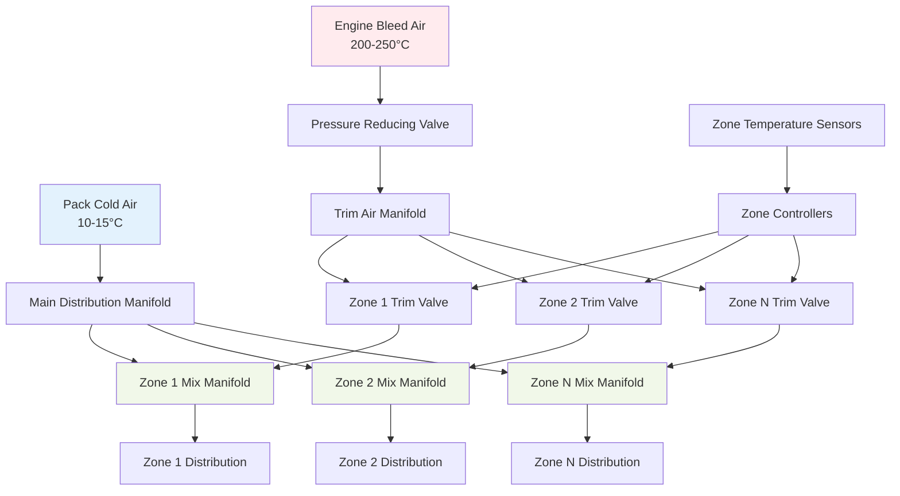
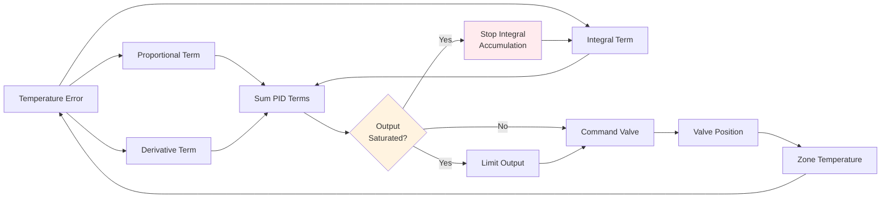

Cabin zone control represents the fundamental architecture enabling individual climate management across different sections of an aircraft. Modern commercial aircraft divide the cabin into 6-12 independent temperature zones, each maintaining precise thermal conditions through modulation of trim air valves that blend hot engine bleed air with cold pack discharge air. This zoned approach accommodates passenger preferences, varying heat loads, and operational requirements while optimizing energy efficiency and minimizing weight penalties.

## Multi-Zone Architecture Design

The division of aircraft cabins into discrete temperature zones follows both longitudinal and lateral patterns based on fuselage geometry, passenger density, and heat load distribution.

### Longitudinal Zone Configuration

Wide-body aircraft typically implement 8-12 longitudinal zones:

| Zone Location | Typical Length | Passenger Count | Control Priority |
|---------------|----------------|-----------------|------------------|
| Flight Deck | 3-5 m | 2-4 crew | Highest precision |
| Forward Entry | 2-3 m | 8-12 | Rapid response |
| Forward Cabin | 8-12 m | 30-50 | Premium comfort |
| Forward Mid | 10-15 m | 40-60 | Standard control |
| Center Mid | 10-15 m | 40-60 | High density |
| Aft Mid | 10-15 m | 40-60 | Galley proximity |
| Aft Cabin | 8-12 m | 30-50 | Standard control |
| Aft Entry | 2-3 m | 8-12 | Rapid response |

Narrow-body aircraft employ 4-6 zones with each zone serving 25-40 passengers. The reduced zone count simplifies control complexity but provides less granular temperature management.

**Zone Length Optimization:**

Zone length balances control precision against system complexity. Shorter zones provide better temperature uniformity but require additional trim air valves, sensors, and controllers. The optimal zone length follows:

$$L_{zone} = \sqrt{\frac{2kA_{cross}\Delta T_{max}}{q_{pass} \cdot n_{pass}}}$$

Where:
- $L_{zone}$ = optimal zone length (m)
- $k$ = cabin insulation conductivity (0.03-0.04 W/m·K)
- $A_{cross}$ = cabin cross-sectional area (m²)
- $\Delta T_{max}$ = maximum acceptable temperature variation (1.5-2.0°C)
- $q_{pass}$ = heat generation per passenger (75-100 W)
- $n_{pass}$ = passenger density (passengers/m)

### Vertical Distribution Strategy

Temperature control extends beyond simple longitudinal zones to address three-dimensional airflow patterns:

**Vertical Stratification:**
- Overhead distribution: 60-70% of zone airflow
- Underfloor distribution: 30-40% of zone airflow
- Mixing ratio adjusted to prevent thermal layering
- Target vertical gradient: ≤1.5°C from floor to overhead

**Lateral Distribution:**
- Window-side subzones receive additional solar load compensation
- Aisle-center areas benefit from mixing with adjacent zones
- Individual gasper outlets provide localized control (15-25 CFM)

## Trim Air Valve Operation

Trim air valves modulate hot bleed air flow into each zone's mix manifold, providing the primary temperature control mechanism. These pneumatic or electro-pneumatic valves operate continuously to maintain zone setpoint.

### Valve Design and Performance

**Pneumatic Trim Air Valve Specifications:**

| Parameter | Typical Value | Engineering Requirement |
|-----------|---------------|-------------------------|
| Inlet Pressure | 30-45 psig | Regulated from bleed air |
| Flow Capacity | 50-150 lb/hr | Per zone requirement |
| Response Time | 0.5-1.5 seconds | 10-90% travel |
| Positioning Accuracy | ±2% of full stroke | Repeatability |
| Operating Temperature | -55 to +250°C | Throughout flight envelope |
| Leakage Rate | <0.5% of maximum flow | Fully closed position |

The valve modulates from fully closed (0% hot air, maximum cooling) to fully open (100% hot air, maximum heating). Intermediate positions blend cold pack air with hot bleed air to achieve the precise temperature required for each zone.

**Valve Flow Characteristics:**

Trim air valves employ equal-percentage flow characteristics providing finer control at low openings where passenger comfort sensitivity is highest:

$$Q_{trim} = Q_{max} \cdot R^{(x-1)}$$

Where:
- $Q_{trim}$ = trim air flow rate (lb/hr)
- $Q_{max}$ = maximum valve flow capacity (lb/hr)
- $R$ = rangeability factor (20-50 typical)
- $x$ = valve position fraction (0-1)

This characteristic ensures that small valve movements at low openings produce proportionally smaller temperature changes than equivalent movements near full open, preventing overcorrection and hunting.

### Mix Manifold Thermodynamics

The mix manifold combines cold pack air with hot trim air through momentum-driven mixing:

$$T_{supply} = \frac{\dot{m}_{pack} \cdot c_p \cdot T_{pack} + \dot{m}_{trim} \cdot c_p \cdot T_{trim}}{\dot{m}_{pack} \cdot c_p + \dot{m}_{trim} \cdot c_p}$$

Simplifying with constant specific heat:

$$T_{supply} = \frac{\dot{m}_{pack} \cdot T_{pack} + \dot{m}_{trim} \cdot T_{trim}}{\dot{m}_{pack} + \dot{m}_{trim}}$$

Where:
- $T_{supply}$ = mixed supply air temperature (°C)
- $\dot{m}_{pack}$ = pack air mass flow rate (lb/hr)
- $T_{pack}$ = pack discharge temperature (10-15°C)
- $\dot{m}_{trim}$ = trim air mass flow rate (lb/hr)
- $T_{trim}$ = trim air temperature (200-250°C)
- $c_p$ = specific heat of air (constant)

**Practical Mixing Calculation:**

For a zone requiring 22°C supply air with pack air at 12°C and trim air at 230°C:

$$\frac{\dot{m}_{trim}}{\dot{m}_{pack}} = \frac{T_{supply} - T_{pack}}{T_{trim} - T_{supply}} = \frac{22 - 12}{230 - 22} = 0.048$$

This requires trim air flow equal to 4.8% of pack air flow. If the zone receives 800 lb/hr of pack air, trim air flow must be 38.4 lb/hr.

## Zone Temperature Sensing

Accurate temperature measurement is critical for effective zone control. Sensor placement, averaging strategies, and response time directly impact comfort and stability.

### Sensor Placement Strategy

Each zone typically incorporates 2-4 temperature sensors positioned to measure representative zone conditions:

**Primary Zone Sensor:**
- Location: Return air grille or ceiling plenum
- Measures: Mixed cabin air temperature
- Response time: 10-30 seconds
- Accuracy: ±0.5°C

**Secondary Zone Sensors:**
- Locations: Forward and aft zone boundaries
- Function: Detect thermal gradients and asymmetries
- Used for: Control enhancement and fault detection

**Supply Air Sensor:**
- Location: Downstream of mix manifold
- Measures: Actual supply air temperature
- Function: Valve position verification and trim air system diagnostics

### Temperature Averaging and Filtering

Zone controllers average multiple sensor inputs to prevent localized disturbances from causing control instability:

$$T_{zone} = \sum_{i=1}^{n} w_i \cdot T_i$$

Where:
- $T_{zone}$ = weighted average zone temperature (°C)
- $w_i$ = weighting factor for sensor $i$ (Σ$w_i$ = 1)
- $T_i$ = individual sensor temperature (°C)
- $n$ = number of sensors per zone (2-4)

Typical weighting assigns 60-70% to the primary return air sensor with remaining weight distributed among boundary and supply sensors.

**Digital Filtering:**

Raw sensor readings pass through first-order lag filters to eliminate transient noise:

$$T_{filtered}(t) = T_{filtered}(t-1) + \frac{\Delta t}{\tau + \Delta t} \cdot [T_{measured}(t) - T_{filtered}(t-1)]$$

Where:
- $\tau$ = filter time constant (20-60 seconds)
- $\Delta t$ = sampling interval (1-5 seconds)

Longer time constants improve noise rejection but reduce responsiveness to actual temperature changes.

## PID Control Implementation

Zone temperature controllers employ proportional-integral-derivative (PID) algorithms converting temperature error into trim air valve position commands.

### Control Algorithm Structure

$$u(t) = K_p \cdot e(t) + K_i \int_0^t e(\tau)d\tau + K_d \frac{de(t)}{dt}$$

Where:
- $u(t)$ = controller output (valve position command, 0-100%)
- $e(t)$ = temperature error = $T_{setpoint} - T_{zone}$ (°C)
- $K_p$ = proportional gain (% per °C)
- $K_i$ = integral gain (% per °C·s)
- $K_d$ = derivative gain (% per °C/s)

**Typical PID Tuning Parameters:**

| Control Gain | Value Range | Function |
|--------------|-------------|----------|
| $K_p$ | 15-30% per °C | Immediate response to error |
| $K_i$ | 0.5-2.0% per °C·min | Eliminate steady-state offset |
| $K_d$ | 2-8% per °C/min | Dampen oscillations |

### Anti-Windup Protection

Integral windup occurs when the valve reaches physical limits (fully open or closed) while temperature error persists. Anti-windup logic prevents excessive integral accumulation:

When output saturation occurs, integral accumulation pauses until the error changes direction, preventing excessive overshoot when conditions allow the valve to move off the limit.

### Gain Scheduling

PID gains adjust based on operating conditions to maintain consistent performance:

**Altitude-Based Scheduling:**
- Higher gains at cruise altitude (reduced air density improves response)
- Lower gains during ground operations (higher thermal mass)

**Load-Based Scheduling:**
- Increased integral gain during high passenger loads (faster disturbance rejection)
- Reduced derivative gain during boarding (prevents reaction to door opening)

## Zone Interaction and Coupling

Temperature control in one zone affects adjacent zones through thermal conduction through cabin structure and airflow mixing at zone boundaries.

### Thermal Coupling Model

Heat transfer between adjacent zones follows:

$$Q_{coupling} = U_{partition} \cdot A_{partition} \cdot (T_{zone1} - T_{zone2})$$

Where:
- $Q_{coupling}$ = inter-zone heat transfer (W)
- $U_{partition}$ = partition conductance (2-5 W/m²·K for cabin dividers)
- $A_{partition}$ = partition area (8-15 m² typical)

For a 2°C temperature difference between adjacent zones separated by a 12 m² partition with U = 3 W/m²·K:

$$Q_{coupling} = 3 \times 12 \times 2 = 72 \text{ W}$$

This represents approximately 1% of typical zone cooling capacity (5-8 kW), indicating weak thermal coupling between zones.

### Decoupling Strategies

**Feedforward Compensation:**
Zone controllers monitor adjacent zone temperatures and preemptively adjust trim air valves to counteract predicted coupling effects.

**Deadband Implementation:**
Control deadbands of ±0.5°C prevent hunting and reduce interaction:
- No valve adjustment for errors within deadband
- Gradual control action for errors just outside deadband
- Full PID control for errors >1.5°C from setpoint

## Performance Metrics

Zone control system effectiveness is measured through multiple performance criteria:

| Metric | Target Value | Measurement Method |
|--------|--------------|-------------------|
| Steady-State Accuracy | ±0.5°C from setpoint | 10-minute average at cruise |
| Response Time | <5 minutes for 3°C change | Step response test |
| Spatial Uniformity | ±1.0°C within zone | Multiple sensor comparison |
| Overshoot | <1.0°C | Transient response analysis |
| Energy Efficiency | Minimum trim air usage | Valve position trending |

Modern aircraft zone control systems achieve these targets through advanced sensor fusion, adaptive PID algorithms, and predictive compensation for flight phase transitions, solar loading, and passenger activity patterns.

## Integration with Aircraft Systems

Cabin zone control interfaces with broader environmental control and aircraft management systems:

- **Pack Controllers:** Coordinate pack temperature setpoints with zone trim air demand
- **Flight Management System:** Provides altitude, airspeed, and ambient temperature for gain scheduling
- **Passenger Service System:** Enables individual passenger temperature adjustment within zone limits
- **Maintenance Computers:** Log zone temperature performance and valve cycling for diagnostics

This multi-layered control architecture ensures consistent thermal comfort across all cabin zones throughout the flight envelope while optimizing energy consumption and component longevity.
