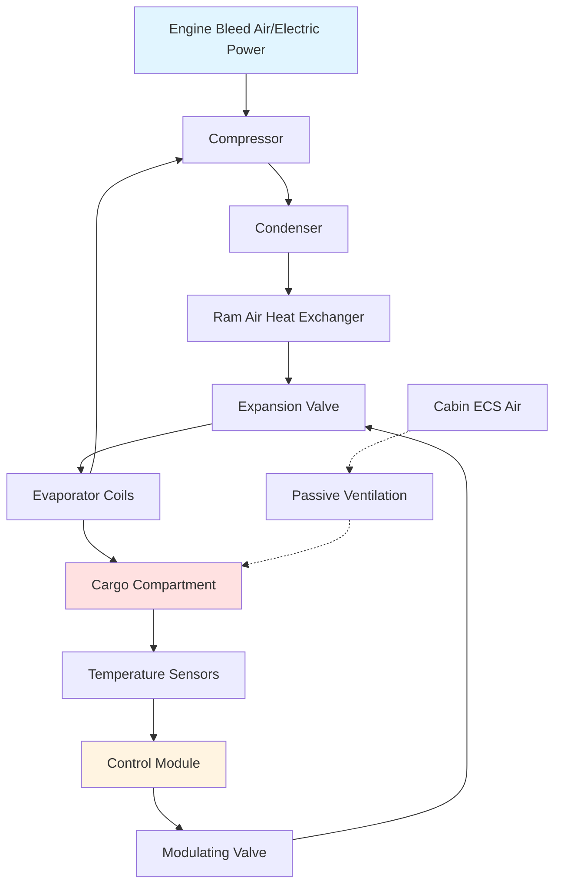

## Fundamental Principles

Aircraft cargo compartment temperature control systems maintain specified thermal environments for freight ranging from ambient ventilation to active refrigeration. The design challenge centers on minimizing weight and power consumption while providing reliable temperature control across varying ambient conditions and flight profiles.

Cargo temperature control operates under significantly different constraints than cabin conditioning. The absence of occupants eliminates ventilation requirements, allowing sealed compartments with recirculated air. Heat loads derive primarily from solar radiation on the fuselage, equipment heat gain, and conduction through boundaries rather than metabolic sources.

## System Configurations

### Passive Ventilation Systems

Bulk cargo compartments on many commercial aircraft employ passive ventilation using conditioned air from the cabin environmental control system. This approach exhausts cabin air into the cargo hold before overboard discharge, providing heating during cruise while limiting temperature extremes.

The heat transfer between cabin and cargo occurs through:

$$Q_{bulk} = UA(T_{cabin} - T_{cargo}) + \dot{m}c_p(T_{supply} - T_{cargo})$$

where $U$ represents the overall heat transfer coefficient through the compartment boundary (typically 0.8-1.2 Btu/hr·ft²·°F), $A$ is the surface area, and $\dot{m}$ is the ventilation air mass flow rate.

Passive systems maintain cargo temperatures between 45°F and 75°F during typical operations, with the lower limit preventing freezing of temperature-sensitive freight and the upper limit controlled by heat rejection from cabin air.

### Active Cargo Refrigeration

Temperature-controlled cargo compartments utilize vapor-compression refrigeration systems powered by engine bleed air or electrical systems. These systems maintain temperatures from -20°F to 75°F for pharmaceutical, perishable, and biological cargo.

The refrigeration cycle operates at high condenser pressures due to limited heat sink availability:

$$COP_{actual} = \frac{Q_{evap}}{W_{comp}} = \eta_{carnot} \cdot \frac{T_{evap}}{T_{cond} - T_{evap}}$$

Aircraft cargo refrigeration systems achieve COP values between 1.5 and 2.5, significantly lower than ground-based systems due to weight-optimized components and elevated condensing temperatures.

## Heat Load Calculations

Cargo compartment cooling loads include conduction through boundaries, solar radiation, equipment heat, and air infiltration during ground operations:

$$Q_{total} = Q_{cond} + Q_{solar} + Q_{equip} + Q_{infil}$$

### Conduction Loads

Heat transfer through the fuselage skin and bulkheads represents the dominant load component during cruise:

$$Q_{cond} = \sum UA(T_{ambient} - T_{cargo})$$

The overall heat transfer coefficient accounts for:
- Aluminum fuselage skin conductivity (k = 128 Btu/hr·ft·°F)
- Insulation layers (typically R-10 to R-15)
- Internal surface film coefficients
- External boundary layer effects

At cruise altitude, the external skin temperature reaches -40°F to -60°F, creating substantial heat loss from temperature-controlled compartments requiring continuous heating input.

### Solar Radiation

During ground operations, solar heat gain through the fuselage becomes critical:

$$Q_{solar} = \alpha \cdot A_{projected} \cdot I_{solar} \cdot SHGF$$

where $\alpha$ is the absorptivity of the exterior finish (0.3-0.5 for white paint), $A_{projected}$ is the projected area, and $I_{solar}$ represents incident solar radiation (250-300 Btu/hr·ft² maximum).

## System Architecture

## Temperature Zoning Strategies

Modern cargo aircraft implement multiple temperature zones to accommodate diverse freight requirements:

| Zone Type | Temperature Range | Application | Control Method |
|-----------|------------------|-------------|----------------|
| Ambient | 45°F - 75°F | General freight | Passive ventilation |
| Refrigerated | 35°F - 45°F | Perishables, pharmaceuticals | Active cooling |
| Frozen | -20°F - 0°F | Frozen goods, biological samples | Active refrigeration |
| Heated | 60°F - 75°F | Live animals, sensitive materials | Active heating |

Temperature stratification within compartments requires forced air circulation. The mixing effectiveness depends on:

$$\varepsilon_{mix} = \frac{T_{supply} - T_{exhaust}}{T_{supply} - T_{zone}}$$

Circulation fans consume 200-500 watts per compartment, representing significant electrical loads on wide-body freighters with multiple temperature zones.

## Control Systems

Cargo temperature controllers employ cascade control loops with outer temperature control and inner refrigerant flow control. The control algorithm adjusts compressor capacity and expansion valve position to maintain setpoint:

$$\dot{m}_{ref} = K_p(T_{setpoint} - T_{actual}) + K_i\int(T_{setpoint} - T_{actual})dt$$

Temperature sensors are strategically located to avoid thermal gradients near supply air registers and return grilles. Typical sensor accuracy requirements are ±2°F with 1-minute response time.

## Ground Operations

Ground-based cargo pre-conditioning units (PCU) connect to aircraft cargo systems during loading, providing conditioned air without operating aircraft systems. PCU capacity requirements depend on:

$$Q_{PCU} = Q_{pulldown} + Q_{infiltration} + Q_{solar}$$

Pull-down loads dominate when loading warm freight into refrigerated compartments. The required cooling capacity reaches 5-10 tons for wide-body freighter compartments, with pull-down times of 30-60 minutes.

## Performance Standards

ASHRAE Research Project RP-1596 established guidelines for cargo compartment environmental control, specifying:

- Temperature uniformity: ±5°F throughout compartment
- Recovery time: Return to setpoint within 15 minutes after door closure
- Altitude performance: Maintain capacity to 43,000 ft
- Reliability: 0.99+ dispatch availability

Federal Aviation Administration (FAA) regulations require temperature monitoring and alarming for cargo containing hazardous materials, with cockpit annunciation of temperature excursions beyond defined limits.

## Energy Considerations

Active cargo temperature control imposes significant electrical and bleed air demands. A typical wide-body freighter with three refrigerated cargo compartments consumes 15-25 kW of electrical power and 200-300 lb/hr of bleed air for cargo conditioning.

The specific energy consumption per unit cargo volume:

$$SEC = \frac{P_{total}}{V_{cargo}} = 0.3-0.5 \text{ kW/m}^3$$

Modern aircraft trend toward electrically-driven vapor compression systems powered by high-capacity generators, eliminating bleed air extraction penalties that reduce engine efficiency by 1-2%.

## Design Optimization

Weight minimization drives cargo system design. Every pound of HVAC equipment reduces payload capacity, creating economic pressure for lightweight components:

- Aluminum evaporator coils with microchannel geometry
- High-speed compressors (30,000-50,000 rpm) with magnetic bearings
- Thin-film insulation materials (0.5-1.0 inch thickness)
- Composite ducting replacing traditional aluminum

The power-to-weight ratio for aircraft cargo refrigeration systems reaches 100-150 W/lb, compared to 20-40 W/lb for ground-based systems, reflecting the premium on weight reduction in aerospace applications.

---

*This content provides engineering-level guidance for HVAC professionals involved in aircraft cargo temperature control system design, specification, and troubleshooting.*
