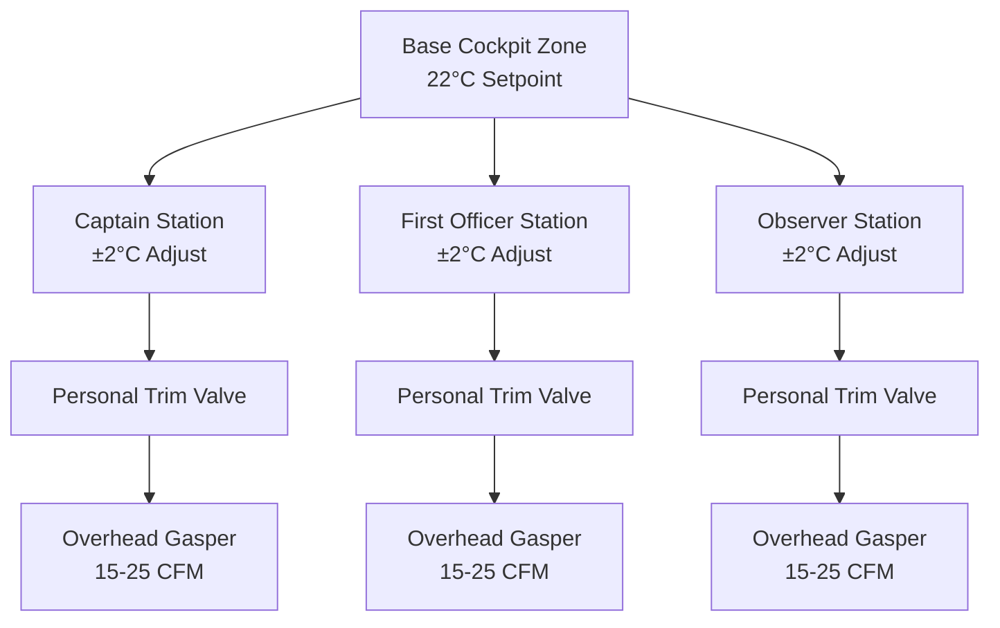
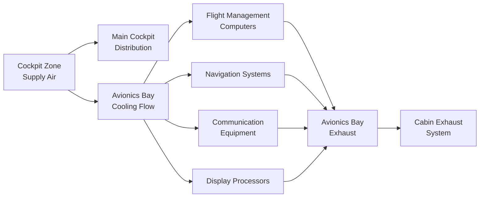
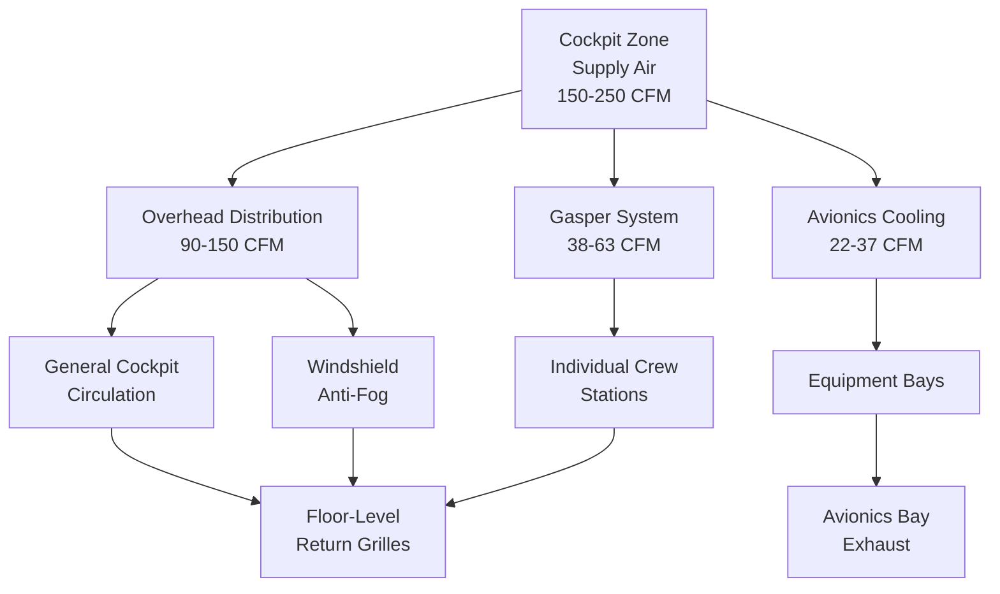

Cockpit climate control represents the most demanding temperature regulation requirement in aircraft environmental control systems. The flight deck environment directly impacts crew performance, decision-making capability, and safety. Unlike passenger cabin zones where ±1.5°C tolerance suffices, cockpit systems maintain ±0.5°C precision while integrating avionics thermal management, windshield anti-fog heating, and individual crew comfort adjustments. This specialized zone control operates continuously from tropical ground operations through high-altitude cruise and arctic approach conditions.

## Flight Deck Zone Architecture

### Independent Cockpit Zone Control

Modern commercial aircraft designate the flight deck as a separate environmental control zone with dedicated temperature regulation independent of passenger cabin management. This architecture provides:

**Dedicated Zone Components:**
- Isolated temperature sensor array: 3-5 sensors positioned at crew eye level
- Independent trim air valve: 0-100% modulation range with 1% resolution
- Dedicated mix manifold: blends cold pack air with hot trim air
- Zone controller: dual-channel redundant PID control with 0.1°C resolution
- Individual crew adjustment: ±2°C override capability per crew station

**Temperature Control Specifications:**

| Parameter | Cockpit Requirement | Passenger Cabin | Differential Advantage |
|-----------|---------------------|-----------------|------------------------|
| Temperature Tolerance | ±0.5°C | ±1.5°C | 3× precision |
| Setpoint Range | 18-29°C | 18-30°C | Narrower for consistency |
| Response Time (3°C step) | < 2 minutes | < 5 minutes | 2.5× faster |
| Control Resolution | 0.1°C | 0.5°C | 5× finer adjustment |
| Sensor Accuracy | ±0.3°C | ±0.5°C | Higher precision |

The cockpit zone receives priority in ECS pack output distribution. During high thermal load conditions (ground operations in hot climates), the environmental control system maintains cockpit temperature setpoint while allowing passenger cabin temperatures to drift up to 2°C above setpoint.

### Thermal Load Characteristics

Flight deck heat loads differ substantially from passenger cabin zones due to equipment density and solar radiation exposure:

**Heat Load Sources:**

| Source | Heat Load | Notes |
|--------|-----------|-------|
| Solar radiation through windshield | 500-1500 W | Varies with sun angle, latitude, time of day |
| Crew metabolic heat | 200-300 W | 2-3 crew members at 100-150 W each |
| Avionics equipment | 3000-8000 W | Flight management, navigation, communication systems |
| Lighting and displays | 200-500 W | Instrument panels, overhead panels, display screens |
| Windshield heating | 0-2000 W | Electrical resistance heating when activated |
| Side window heating | 0-800 W | Electrical heating to prevent ice and condensation |

Total cockpit heat load ranges from 4000-13000 W depending on flight phase and environmental conditions. Ground operations in direct sunlight impose maximum cooling loads, while high-altitude cruise with minimal solar exposure reduces cooling requirements substantially.

**Solar Load Calculation:**

Solar heat gain through the cockpit windshield follows:

$$Q_{solar} = A \times I \times \tau \times \cos(\theta)$$

Where:
- $A$ = windshield area (2.5-4.0 m² typical)
- $I$ = solar irradiance (up to 1000 W/m² direct sun)
- $\tau$ = glazing transmittance (0.5-0.7 for tinted windshields)
- $\theta$ = angle of incidence

A Boeing 737 windshield (approximately 3.0 m²) with direct sun exposure at 30° angle of incidence generates:

$$Q_{solar} = 3.0 \times 1000 \times 0.6 \times \cos(30°) = 1558 \text{ W}$$

This substantial solar load necessitates dedicated cooling strategies and dynamic temperature control adjustment.

## Individual Crew Climate Control

### Adjustable Temperature Zones

Each crew station (captain, first officer, observer) incorporates individual temperature adjustment capability allowing ±2°C deviation from the base cockpit zone setpoint. This personal control enhances crew comfort without compromising overall thermal management.

**Individual Control Implementation:**

**Personal Temperature Adjustment Mechanism:**

Individual crew stations modulate local airflow temperature through:
- Personal trim air valve: 10-20 W heating capacity
- Adjustable gasper flow: 0-25 CFM variable output
- Mix ratio control: blends main zone supply with personal trim air
- Temperature offset: adds/subtracts from zone setpoint

When a crew member selects +2°C adjustment, the personal control system increases trim air flow to the individual gasper outlets while slightly reducing main zone supply to that station. This localized adjustment occurs without affecting adjacent crew stations or overall zone balance.

### Gasper Outlet Distribution

Cockpit gasper systems provide adjustable, directional airflow at each crew station:

**Gasper Specifications:**

| Parameter | Specification | Purpose |
|-----------|---------------|---------|
| Flow Rate per Outlet | 15-25 CFM adjustable | Individual comfort control |
| Outlets per Crew Position | 2-3 adjustable nozzles | Directional air distribution |
| Supply Temperature | Zone temp ± 2°C | Personal temperature preference |
| Velocity Range | 0.5-2.5 m/s | Adjustable from gentle to vigorous |
| Noise Level | < 45 dBA | Minimal distraction |
| Adjustment Range | 360° rotation, 0-100% flow | Complete directional control |

Gasper outlets mount in the overhead panel directly above each crew position, allowing air direction toward the face, chest, or hands as preferred. The adjustable flow rate accommodates individual preferences ranging from minimal air movement to substantial cooling effect.

**Gasper Airflow Patterns:**

During typical operations:
- 60% of cockpit supply air delivers through overhead distribution ducting
- 25% supplies through gasper outlets (adjustable by crew)
- 15% provides instrument panel cooling and windshield anti-fog

This distribution maintains overall zone temperature control while accommodating individual crew comfort preferences.

## Avionics Cooling Integration

### Equipment Bay Thermal Management

Modern aircraft cockpits contain 3-8 kW of heat-generating avionics equipment requiring continuous cooling to maintain reliability and prevent overheating failures. Cockpit climate control integrates with avionics cooling to manage both crew comfort and equipment thermal limits.

**Avionics Bay Configuration:**

**Avionics Cooling Requirements:**

| Equipment Category | Heat Load | Supply Temperature | Airflow Required |
|--------------------|-----------|-------------------|------------------|
| Flight Management System | 800-1500 W | 15-20°C | 40-60 CFM |
| Navigation Computers | 600-1000 W | 15-20°C | 30-50 CFM |
| Communication Equipment | 500-800 W | 15-25°C | 25-40 CFM |
| Display Processors | 400-700 W | 15-20°C | 20-35 CFM |
| Autopilot Computers | 300-600 W | 15-20°C | 15-30 CFM |
| Total Avionics | 3000-8000 W | 15-20°C | 150-250 CFM |

Avionics equipment bays located beneath and behind the flight deck receive dedicated cooling flow extracted from the main cockpit zone supply. This cooling air passes through the equipment racks, absorbing heat from electronics, then exhausts into the cabin recirculation system or directly overboard.

### Equipment Temperature Limits

Avionics reliability decreases exponentially with temperature above rated limits. Equipment bay temperature control maintains:

**Operating Temperature Ranges:**
- Normal operation: 15-35°C (equipment specification)
- Optimal performance: 18-25°C (reduced failure rate)
- Maximum intermittent: 40°C (emergency operation)
- Shutdown threshold: 45°C (automatic protective shutdown)

The cockpit zone controller monitors avionics bay temperature through dedicated sensors. When equipment bay temperature approaches 35°C, the control system:

1. Increases cooling flow to avionics bay by 20-30%
2. Reduces cockpit setpoint by 1-2°C to lower supply air temperature
3. Opens trim air valves to maximum cooling position
4. Activates secondary cooling if available (recirculation fans)
5. Alerts crew through environmental control system display

This hierarchical response maintains equipment within operating limits while minimizing crew comfort impact.

## Windshield Anti-Fog Systems

### Thermal Anti-Fog Architecture

Cockpit windshields require continuous thermal management to prevent fogging and icing that would obscure crew vision. Anti-fog systems employ two complementary approaches:

**Electrical Windshield Heating:**
- Conductive coating embedded in windshield layers
- Power consumption: 1.0-2.5 kW per windshield panel
- Surface temperature: 30-45°C during operation
- Prevents ice formation and removes condensation
- Operates continuously during flight in visible moisture

**Hot Air Distribution:**
- Ducted hot air flow directed at windshield interior surface
- Flow rate: 20-40 CFM per windshield
- Supply temperature: 40-60°C
- Creates thermal barrier preventing condensation
- Supplements electrical heating during ground operations

### Anti-Fog Control Logic

The windshield anti-fog system activates based on multiple parameters:

**Activation Conditions:**

| Condition | Threshold | Anti-Fog Response |
|-----------|-----------|-------------------|
| Outside Air Temperature | < 10°C | Activate electrical heating |
| Visible Moisture | Rain/snow detected | Full heating + air distribution |
| Cockpit Humidity | > 50% RH | Increase air distribution flow |
| Windshield Temperature | < 15°C | Activate electrical heating |
| Ground Operations | Engine start | Activate full anti-fog system |

The control system modulates windshield heating power and hot air distribution flow to maintain the windshield interior surface 5-10°C above the cockpit dew point temperature, preventing condensation while minimizing energy consumption.

**Anti-Fog Airflow Pattern:**

Hot air distributes through narrow slots at the windshield base, creating an upward laminar flow across the interior surface. This air curtain serves triple functions:
1. Provides thermal energy to warm the windshield surface
2. Creates low-humidity air layer preventing moisture contact
3. Carries away any condensate that forms

Exhaust from the windshield air curtain mixes with main cockpit ventilation, contributing to overall zone thermal balance.

## Side Window Thermal Management

### Electrical Window Heating

Side cockpit windows (captain and first officer sliding windows, fixed side windows) incorporate electrical resistance heating elements to prevent icing and condensation:

**Side Window Heating Specifications:**

| Parameter | Specification | Operating Range |
|-----------|---------------|-----------------|
| Heating Power per Window | 200-400 W | Variable with conditions |
| Surface Temperature | 25-35°C | Prevents condensation |
| Heating Element Type | Transparent conductive coating | Maintains visibility |
| Control Method | Thermostat with overheat protection | Automatic regulation |
| Activation Temperature | Outside air < 5°C OR visible moisture | Preventive operation |

Sliding windows receive priority heating due to their emergency egress function. The heating system ensures these windows remain ice-free and operable throughout all flight conditions.

### Condensation Prevention Strategy

Side window thermal management prevents condensation through:

1. **Surface Temperature Elevation:** Maintains window interior surface above dew point
2. **Perimeter Air Curtains:** Distributes warm air along window edges from cockpit ventilation
3. **Thermal Breaks:** Insulated mounting frames reduce cold bridging from exterior
4. **Desiccant Drainage:** Channels any condensate away from optical surfaces

During ground operations in high-humidity conditions (tropical climates, rain), side window heating operates continuously. In-flight, the system modulates power based on outside air temperature and cockpit humidity levels.

## Cockpit Airflow Distribution

### Supply Air Architecture

Cockpit ventilation systems distribute conditioned air through a structured hierarchy optimizing crew comfort, equipment cooling, and anti-fog performance:

**Distribution Breakdown:**

**Airflow Rates by Function:**

| Distribution Path | Flow Rate | Temperature | Purpose |
|-------------------|-----------|-------------|---------|
| Overhead General | 60-100 CFM | Zone setpoint | Overall cockpit conditioning |
| Windshield Anti-Fog | 30-50 CFM | +20°C above zone | Prevent condensation |
| Crew Gaspers | 38-63 CFM | Zone ±2°C | Individual comfort |
| Avionics Cooling | 150-250 CFM | -5°C below zone | Equipment thermal management |
| Side Window Heating | 10-15 CFM | +15°C above zone | Supplemental anti-fog |
| Total Cockpit Supply | 300-500 CFM | Variable by path | Complete ECS function |

### Pressure Relationship

The cockpit maintains slight positive pressure (+0.05 to +0.10 inches water column) relative to the passenger cabin. This pressure differential:

- Prevents cabin air and odors from entering the flight deck
- Ensures clean, conditioned air environment for crew
- Supports door sealing between cockpit and cabin
- Maintains air quality independent of cabin contamination events

Pressure control occurs through restricted return air paths at floor level and modulation of cockpit supply air volume.

## Control System Architecture

### Dual-Channel Redundancy

Critical cockpit environmental control systems employ dual-channel redundant control architecture ensuring continued operation following single-point failures:

**Redundant Control Elements:**

| Component | Redundancy Method | Failure Response |
|-----------|-------------------|------------------|
| Temperature Sensors | 3-5 sensors, median value selection | Disregard outliers, use median |
| Zone Controller | Dual processors with cross-checking | Automatic switchover to backup |
| Trim Air Valves | Dual solenoids, independent control | Secondary valve assumes control |
| Avionics Cooling | Dual cooling paths, automatic switching | Backup path activates immediately |
| Power Supplies | Dual electrical feeds from separate buses | Automatic transfer to backup power |

This redundancy architecture ensures cockpit climate control continues operating even with component failures, maintaining crew environment and equipment cooling throughout the flight.

### Temperature Control Algorithm

Cockpit zone controllers implement sophisticated PID (Proportional-Integral-Derivative) control algorithms achieving precise temperature regulation:

**Control Loop Operation:**

The trim air valve position responds to temperature error through:

$$u(t) = K_p \cdot e(t) + K_i \int_0^t e(\tau) d\tau + K_d \frac{de(t)}{dt}$$

Where:
- $u(t)$ = trim air valve command (0-100%)
- $e(t)$ = temperature error (setpoint - actual)
- $K_p$ = proportional gain (typically 15-25%/°C)
- $K_i$ = integral gain (typically 2-4%/(°C·min))
- $K_d$ = derivative gain (typically 5-10%·min/°C)

**Control Loop Tuning:**

Cockpit temperature control employs more aggressive tuning than passenger zones:
- Response time: < 2 minutes for 3°C step change
- Overshoot: < 0.3°C
- Settling time: < 5 minutes
- Steady-state error: < 0.1°C

These performance specifications require careful PID tuning balancing rapid response against stability. The derivative term provides anticipatory control, beginning valve modulation as temperature approaches setpoint, reducing overshoot.

## Environmental Control Integration

### Pack Output Coordination

Cockpit zone control integrates with the broader aircraft environmental control system through coordinated pack operation:

**Priority Hierarchy:**
1. Cockpit temperature maintenance (highest priority)
2. Avionics cooling (equipment protection)
3. Passenger cabin temperature control
4. Cargo temperature regulation (when installed)

During high thermal load conditions (ground operations, hot day), the ECS pack controller allocates cooling capacity according to this hierarchy. The cockpit receives sufficient conditioned air to maintain setpoint while other zones may temporarily exceed target temperatures.

### Load Management Strategy

The environmental control system implements intelligent load management during pack capacity constraints:

**Capacity Allocation During Constraints:**
- Reduce passenger zone cooling flow by 10-15%
- Increase passenger zone setpoint by 1-2°C
- Maintain cockpit zone setpoint precisely
- Ensure avionics cooling flow remains adequate
- Alert crew to reduced passenger cabin cooling

This strategy protects critical cockpit and equipment thermal control while accepting temporary passenger comfort degradation during extreme conditions.

## Operational Considerations

### Ground Operations

Ground operations impose maximum cockpit thermal loads due to:
- Direct solar radiation through windshield and side windows
- Minimal ram air flow through heat exchangers (low/zero airspeed)
- Heat soak from hot ramp environment
- Full avionics equipment operation during preflight
- Crew metabolic load during checklist procedures

Ground cooling strategies include:
- Auxiliary power unit (APU) operation for full ECS capacity
- Ground air conditioning cart connection when available
- Pre-cooling prior to crew boarding when possible
- Maximum pack output during engine start and taxi

### High-Altitude Cruise

Cruise flight at 35,000-43,000 feet reduces cockpit thermal loads substantially:
- Minimal solar load (except during daytime cruise with direct sun exposure)
- Low avionics heat generation (steady-state operation)
- Reduced crew metabolic load (seated, relaxed)
- Cold ambient environment (-40 to -56°C outside air temperature)

The control system shifts from cooling mode to neutral or slight heating, maintaining comfortable cockpit environment while minimizing bleed air extraction and fuel consumption penalty.

### Cold Weather Operations

Arctic and winter operations require enhanced cockpit heating:
- Ground preheat to prevent equipment cold-soak
- Windshield and window heating at maximum output
- Trim air valves in heating mode
- Avionics bay heating to prevent equipment below minimum temperature
- Continuous hot air circulation preventing ice buildup

The ECS system provides adequate heating capacity to maintain cockpit temperature even with prolonged ground operations in -40°C conditions without external heating support.

## Performance Metrics

### Temperature Control Performance

Modern cockpit climate control systems achieve:

**Steady-State Performance:**
- Temperature tolerance: ±0.5°C from setpoint
- Spatial uniformity: < 1.5°C variation within cockpit volume
- Temporal stability: < 0.3°C variation over 10-minute periods

**Dynamic Performance:**
- Response time (3°C step): < 2 minutes to 90% of final value
- Recovery time (door opening): < 3 minutes return to setpoint
- Thermal shock rejection: maintains ±1.0°C during rapid ambient changes

**Crew Satisfaction Metrics:**
- Thermal comfort rating: 95% of crews rate acceptable or better
- Individual control effectiveness: 90% report satisfactory personal adjustment
- Noise level: < 45 dBA background (ECS contribution)
- Air quality: maintains CO₂ < 1000 ppm, particulates < 25 μg/m³

These performance characteristics ensure optimal crew comfort, alertness, and decision-making capability throughout all flight operations from tropical departures through arctic arrivals.

## Conclusion

Cockpit climate control represents specialized environmental management requiring precision temperature regulation, individual crew comfort accommodation, integrated avionics thermal management, and reliable anti-fog performance. The flight deck environment directly impacts safety through crew performance, making these systems critical to aircraft operation. Understanding the thermodynamic principles, control strategies, and integration requirements enables effective cockpit ECS design, troubleshooting, and optimization across diverse operational conditions.
