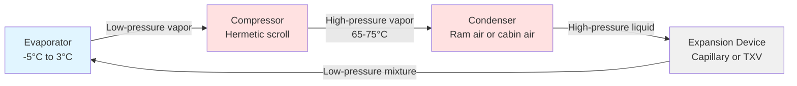
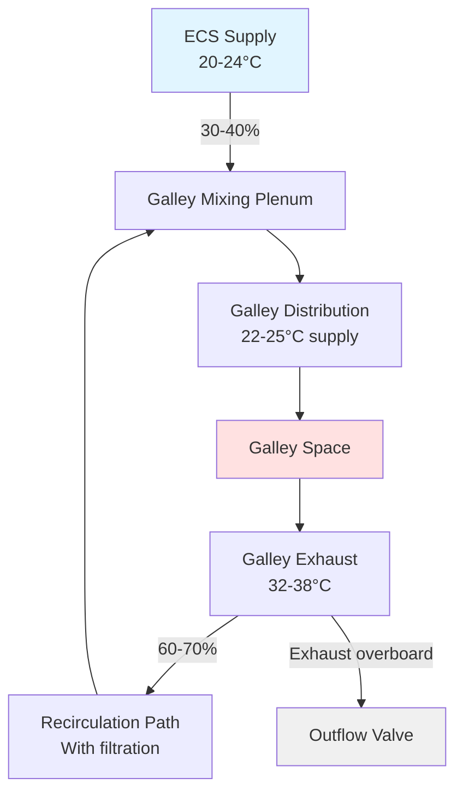

## Overview

Aircraft galley cooling systems represent specialized refrigeration applications operating under unique constraints: weight restrictions, high-altitude pressure variations, aircraft power limitations, and confined installation spaces. These systems must maintain food safety temperatures while withstanding vibration, rapid pressure changes, and variable ambient conditions throughout flight cycles.

Galley refrigeration integrates with the aircraft environmental control system (ECS) but operates independently to ensure food service reliability. Modern wide-body aircraft galleys dissipate 15-25 kW of heat during meal service, requiring dedicated cooling strategies that minimize impact on cabin comfort and aircraft electrical systems.

## Heat Load Components

Galley cooling loads derive from multiple simultaneous sources that vary throughout flight operations.

### Heat Generation Sources

| Source | Typical Load | Operating Pattern |
|--------|--------------|-------------------|
| Ovens (convection) | 2.5-3.5 kW each | Intermittent, pre-meal service |
| Coffee makers | 1.8-2.2 kW each | Continuous during service |
| Water boilers | 2.0-3.0 kW | Cyclic heating |
| Refrigerator compartments | 0.8-1.2 kW each | Continuous |
| Crew activity | 150-200 W per person | Variable |
| Lighting | 400-600 W | Continuous when galley occupied |

### Total Heat Load Calculation

The instantaneous galley heat load combines sensible and latent components:

$$Q_{total} = Q_{equipment} + Q_{occupants} + Q_{lighting} + Q_{infiltration} + Q_{refrigeration}$$

Where equipment heat accounts for duty cycle:

$$Q_{equipment} = \sum_{i=1}^{n} (P_i \times DF_i \times \eta_i)$$

- $P_i$ = nameplate power of device $i$ (W)
- $DF_i$ = duty factor (0-1) representing operating percentage
- $\eta_i$ = heat gain fraction entering galley space (0.6-0.9)

Peak loads occur during meal preparation when ovens, coffee makers, and water boilers operate simultaneously, typically 20-30 minutes before service.

## Refrigeration System Design

Aircraft galley refrigerators employ vapor-compression cycles adapted for aviation environments.

### Thermodynamic Cycle

The refrigeration process follows a modified vapor-compression cycle:

Coefficient of performance (COP) for galley refrigerators:

$$COP = \frac{Q_{evap}}{W_{comp}} = \frac{h_1 - h_4}{h_2 - h_1}$$

Typical galley refrigerator COP ranges from 1.8-2.4, lower than ground-based units due to:
- Higher condensing temperatures (limited cooling air)
- Compact heat exchangers with reduced surface area
- Variable altitude affecting refrigerant properties
- Lightweight compressor designs sacrificing efficiency

### Refrigerant Selection

Aircraft galley systems historically used R-134a, transitioning to low-GWP alternatives:

| Refrigerant | GWP | Operating Pressure (bar) | Application Status |
|-------------|-----|--------------------------|-------------------|
| R-134a | 1,430 | 6.2 evap / 15.7 cond (40°C) | Legacy systems |
| R-1234yf | 4 | 6.0 evap / 14.9 cond (40°C) | Current retrofit |
| R-513A | 631 | 6.3 evap / 15.5 cond (40°C) | New installations |

Refrigerant selection prioritizes flammability classification (A1 preferred for aircraft safety), pressure-temperature characteristics matching altitude operation, and compatibility with lightweight aluminum heat exchangers.

## Cooling Air Integration

Galley heat removal employs two primary strategies depending on aircraft design and galley location.

### Dedicated Galley Ventilation

Large galleys receive dedicated ventilation from the aircraft ECS:

$$\dot{m}_{air} = \frac{Q_{sensible}}{c_p \times \Delta T}$$

Where:
- $\dot{m}_{air}$ = required air mass flow rate (kg/s)
- $c_p$ = specific heat of air at cabin pressure (1.005 kJ/kg·K)
- $\Delta T$ = allowable temperature rise (typically 10-15°C)

For a 20 kW galley load with 12°C temperature rise:

$$\dot{m}_{air} = \frac{20,000}{1,005 \times 12} = 1.66 \text{ kg/s} = 5,976 \text{ kg/hr}$$

At typical cruise cabin pressure (0.75 bar), this corresponds to approximately 2,200 m³/hr of volumetric flow.

### Recirculation and Mixing

Galley ventilation systems balance fresh air introduction with recirculation:

Recirculation reduces ECS load but requires filtration to manage cooking odors and particulates. High-efficiency particulate air (HEPA) filters remove 99.97% of particles ≥0.3 μm, with activated carbon stages for odor control.

## Heat Rejection Strategies

Galley refrigeration condensers reject heat through limited pathways constrained by aircraft design.

### Condenser Cooling Methods

**Ram Air Cooling**: High-performance galleys on some aircraft route condenser heat to dedicated ram air heat exchangers. Effectiveness varies with flight speed and altitude:

$$Q_{reject} = \dot{m}_{ram} \times c_p \times (T_{out} - T_{in})$$

Ram air availability decreases during ground operations and low-speed flight, requiring supplemental cooling or load shedding.

**Cabin Air Cooling**: Most galley refrigerators discharge condenser heat directly into cabin airflow, relying on ECS to remove the combined galley and refrigeration heat loads. This approach eliminates separate heat exchangers but increases ECS demand during meal service periods.

**Hybrid Systems**: Advanced installations use cabin air cooling during cruise with automatic switchover to ram air during ground operations when cabin cooling capacity is limited.

## Temperature Control Requirements

Aircraft galley refrigeration maintains temperatures per food safety regulations and airline operational requirements.

### Compartment Temperature Zones

| Zone Type | Temperature Range | Application | Control Strategy |
|-----------|------------------|-------------|------------------|
| Deep chill | -2°C to 0°C | Fresh meats, seafood | Precise thermostat ±1°C |
| Standard refrigeration | 2°C to 5°C | Dairy, prepared meals | Thermostat ±2°C |
| High-humidity produce | 4°C to 7°C, 85-90% RH | Fresh vegetables | Humidity control |
| Freezer (optional) | -18°C to -15°C | Ice, frozen items | Defrost cycle required |

Temperature uniformity challenges arise from:
- Door opening frequency during meal service
- Uneven air distribution in compact compartments
- Heat leakage through thin insulation (weight constraints)
- Infiltration during pressure changes

## Power Management

Galley electrical loads impose significant demands on aircraft generating systems, requiring strategic load management.

### Electrical Load Profile

Aircraft electrical systems limit galley power availability:

$$P_{available} = P_{generator} - P_{essential} - P_{margin}$$

Typical wide-body aircraft allocate 80-120 kW for galley services from total generation capacity of 300-400 kW. Load shedding protocols automatically disable non-essential galley equipment during:
- Single generator operation
- APU operation on ground
- Emergency electrical configuration

Galley refrigerators operate continuously on essential bus circuits to maintain food safety, while ovens and water boilers connect to non-essential circuits subject to load management.

## Design Considerations

Aircraft galley cooling design addresses unique aviation requirements beyond conventional refrigeration.

### Weight Optimization

Every kilogram of HVAC equipment requires additional fuel:
- Lightweight aluminum construction for all heat exchangers
- Hermetic compressors minimize refrigerant piping mass
- Vacuum insulation panels (VIPs) provide R-30 to R-40 per inch versus R-4 for conventional foam
- Minimized ductwork through strategic galley placement near ECS distribution points

### Vibration and Shock Resistance

Equipment mounting withstands:
- In-flight turbulence: ±3g typical, ±6g extreme
- Landing impact: 9g vertical
- Continuous vibration: 5-50 Hz frequency range

Compressor isolation mounts, reinforced duct supports, and flexible refrigerant lines prevent fatigue failures over 50,000+ flight cycle service life.

### Altitude Performance

Reduced atmospheric pressure affects:
- Refrigerant saturation temperatures and pressures
- Compressor volumetric efficiency
- Heat exchanger air-side performance
- Electrical component cooling

Systems design accounts for operation from sea level to 45,000 ft (0.15 bar cabin altitude equivalent), maintaining performance across 6:1 pressure variation.

## Maintenance and Reliability

Aircraft galley cooling systems require high reliability with minimal maintenance access during short ground turnaround times.

### Preventive Maintenance

Scheduled inspection intervals:
- Daily: Temperature verification, visual leak inspection
- Weekly: Condenser coil cleaning (ground-based check)
- 500 flight hours: Filter replacement, refrigerant charge verification
- 5,000 flight hours: Compressor performance test, system evacuation and recharge
- 25,000 flight hours: Complete system overhaul or replacement

Built-in test equipment (BITE) monitors refrigerator performance, logging temperature excursions and compressor run time for predictive maintenance.

### Common Failure Modes

System failures typically result from:
- Refrigerant loss through vibration-induced fitting leaks (40% of failures)
- Compressor bearing wear from continuous operation (25%)
- Condenser airflow restriction from lint accumulation (20%)
- Control system electronics exposure to humidity and temperature extremes (15%)

Redundant refrigerator installation in large galleys ensures meal service continuity during component failures, with minimum two-unit configuration standard for long-haul operations.

## Regulatory Compliance

Aircraft galley refrigeration complies with multiple regulatory frameworks governing aviation safety and food handling.

### Aviation Standards

- **FAA TSO-C71**: Technical Standard Order for aircraft refrigeration equipment
- **RTCA DO-160**: Environmental conditions and test procedures for airborne equipment
- **SAE ARP85**: Air conditioning systems for subsonic airplanes (galley load calculations)

### Food Safety Requirements

- **FDA Food Code**: 5°C maximum for refrigerated foods during flight
- **EASA Part-M**: Continuing airworthiness maintenance requirements
- **Airline-specific HACCP**: Hazard Analysis Critical Control Points for in-flight food service

Galley refrigerators incorporate temperature data loggers providing continuous monitoring for regulatory compliance documentation.

## Future Developments

Emerging technologies target improved efficiency and reduced environmental impact.

**Thermoelectric Cooling**: Solid-state Peltier devices eliminate refrigerants and compressors, offering 50% weight reduction despite lower COP (0.8-1.2). Suitable for low-capacity applications like beverage chillers.

**Magnetic Refrigeration**: Magnetocaloric effect systems under development promise 30% efficiency improvement over vapor compression with zero-GWP operation and acoustic noise elimination.

**Waste Heat Recovery**: Integration with fuel cell auxiliary power units (APUs) enables absorption cycle galley cooling using fuel cell waste heat, reducing electrical generation requirements.

Aircraft galley cooling continues evolving toward lighter, more efficient systems that maintain rigorous food safety standards while minimizing aircraft operational costs and environmental impact.
