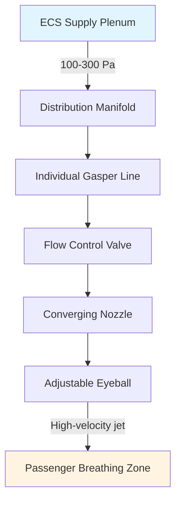

## Overview

Gasper outlets are individual air distribution devices in aircraft cabins that provide passengers with direct control over local airflow and temperature. These small, adjustable nozzles deliver conditioned air from the aircraft's environmental control system (ECS) directly to the passenger's immediate vicinity, serving as a critical component in achieving acceptable thermal comfort in the confined, high-density environment of commercial aviation.

The physics of gasper performance centers on high-velocity jet flow behavior, momentum transfer, and the interaction between primary supply air and entrained cabin air. Understanding these principles is essential for optimizing passenger comfort while minimizing energy consumption and noise generation.

## Fundamental Operating Principles

### Airflow Physics

Gasper outlets create a free turbulent jet that entrains surrounding cabin air as it travels toward the passenger. The velocity profile and temperature decay follow predictable patterns governed by conservation of momentum and energy.

The centerline velocity decay for a free jet is expressed as:

$$\frac{u_c}{u_0} = K \frac{d_0}{x}$$

Where:
- $u_c$ = centerline velocity at distance x (m/s)
- $u_0$ = initial exit velocity (m/s)
- $d_0$ = nozzle diameter (m)
- $x$ = distance from nozzle (m)
- $K$ = constant ≈ 6.2 for round jets

The entrainment ratio increases linearly with distance:

$$\frac{Q_x}{Q_0} = 0.32 \frac{x}{d_0}$$

This relationship demonstrates that a gasper jet entrains approximately 3.2 times its initial flow rate for every 10 nozzle diameters of travel, rapidly mixing cold supply air with warmer cabin air to prevent discomfort from direct impingement.

### Supply Air Characteristics

Typical gasper supply conditions:
- **Temperature**: 10-15°C (50-59°F)
- **Flow rate per outlet**: 3-10 L/s (6-21 CFM)
- **Supply pressure**: 100-300 Pa above cabin
- **Exit velocity**: 5-15 m/s (16-49 ft/s)

## Design Considerations

### Nozzle Geometry

Gasper nozzles employ specific geometric features to control jet characteristics:

**Converging nozzle design** produces a coherent, higher-velocity jet with greater throw distance. The contraction ratio (inlet area to outlet area) typically ranges from 4:1 to 9:1.

**Eyeball outlets** allow directional control through a spherical ball element with a circular or annular discharge opening. The ball rotates within a socket, providing approximately 60-90 degrees of angular adjustment.

### Thermal Performance

The effective draft temperature (EDT) at the passenger location depends on jet dilution:

$$\theta_{EDT} = \theta_0 + (\theta_c - \theta_0) \left(\frac{u_c}{u_0}\right)^2$$

Where:
- $\theta_{EDT}$ = effective draft temperature (°C)
- $\theta_0$ = supply air temperature (°C)
- $\theta_c$ = cabin air temperature (°C)

This quadratic relationship with velocity ratio means that temperature moderation occurs rapidly as the jet velocity decays through entrainment.

### Acoustic Considerations

Gasper outlets generate aerodynamic noise primarily from turbulent mixing. The sound power level scales with velocity:

$$L_W = 10 \log_{10}\left(\frac{u^8 d^2}{\rho_0 c_0^5}\right) + C$$

Higher velocities exponentially increase noise, making velocity limitation critical. Most designs target exit velocities below 12 m/s to maintain cabin noise below NC-45 criteria.

## Control Mechanisms

| Control Type | Mechanism | Flow Range | Advantages | Limitations |
|--------------|-----------|------------|------------|-------------|
| **On/Off** | Rotating shut-off valve | 0% or 100% | Simple, reliable | No modulation |
| **Variable flow** | Needle valve or iris | 0-100% continuous | Precise control | More complex |
| **Directional only** | Eyeball rotation | Fixed flow | Targeted delivery | No flow control |
| **Combined** | Flow valve + rotation | Full adjustment | Maximum flexibility | Highest cost |

## Installation Requirements

### Overhead Distribution System

Gaspers connect to a pressurized plenum above the ceiling panels, typically running longitudinally along the cabin centerline. The distribution network must maintain:

- **Pressure uniformity**: ±10% variation between outlets
- **Accessibility**: Service panels every 3-4 seat rows
- **Leak rate**: <2% of total flow at operating pressure

### Spacing and Layout

Typical installations provide one gasper per passenger seat, positioned 600-800 mm (24-31 inches) above the seated head position. This geometry ensures the jet reaches the breathing zone before excessive dilution occurs while avoiding uncomfortable direct impingement.

The throw-to-spread ratio for gasper jets typically ranges from 4:1 to 6:1, meaning a jet travels 4-6 times as far as its diameter spreads. This characteristic dictates optimal mounting heights and angles.

## Performance Evaluation

### Comfort Metrics

Gasper effectiveness is assessed using:

**Draft rating (DR)** from ISO 7730, which quantifies discomfort from air movement:

$$DR = (34 - T_a)(u - 0.05)^{0.62}(0.37 u T_u + 3.14)$$

Where:
- $T_a$ = local air temperature (°C)
- $u$ = local air velocity (m/s)
- $T_u$ = turbulence intensity (%)

**Predicted Percentage Dissatisfied (PPD)** increases rapidly when draft rating exceeds 20%, establishing design limits for velocity and temperature.

### Flow Measurement

Individual gasper flow rates are measured using:
- Hot-wire anemometry for velocity profiles
- Pitot-traverse methods for average velocity
- Capture hood techniques for total volumetric flow

## Maintenance and Troubleshooting

| Issue | Probable Cause | Diagnostic Method | Remedy |
|-------|----------------|-------------------|---------|
| **Low flow** | Valve restriction | Pressure measurement | Clean or replace valve |
| **No flow** | Supply blockage | Upstream pressure check | Clear obstruction |
| **Excessive noise** | High velocity | Velocity measurement | Reduce supply pressure |
| **Erratic operation** | Valve damage | Visual inspection | Replace assembly |
| **Temperature variation** | Plenum stratification | Multiple point sensing | Improve mixing |

## Integration with Main Cabin Systems

Gaspers operate in parallel with the main cabin distribution system, which provides general ventilation and temperature control. The combined system must satisfy ASHRAE Standard 161 requirements:

- **Total ventilation rate**: 0.25 L/s·m² (0.05 CFM/ft²) minimum
- **Per person ventilation**: 10 L/s (21 CFM) during cruise
- **Cabin pressure**: Equivalent to 2400 m (8000 ft) maximum altitude

Gasper flow represents 20-40% of total per-person ventilation, with the remainder delivered through overhead or sidewall diffusers for general mixing.

## Energy Considerations

The additional fan power required to overcome gasper system pressure drop is:

$$W = \frac{\Delta P \cdot Q}{\eta}$$

Where $\Delta P$ includes nozzle losses, valve losses, and distribution manifold friction. Typical gasper systems consume 5-15 W per passenger, representing 2-5% of total ECS power at cruise conditions.

## Future Developments

Emerging gasper technologies include electronically controlled motorized valves with preset comfort programs, antimicrobial coatings to reduce pathogen transmission, and low-turbulence nozzle designs that reduce noise while maintaining effectiveness. Research continues on personalized ventilation strategies that optimize individual comfort while minimizing overall system energy consumption.
