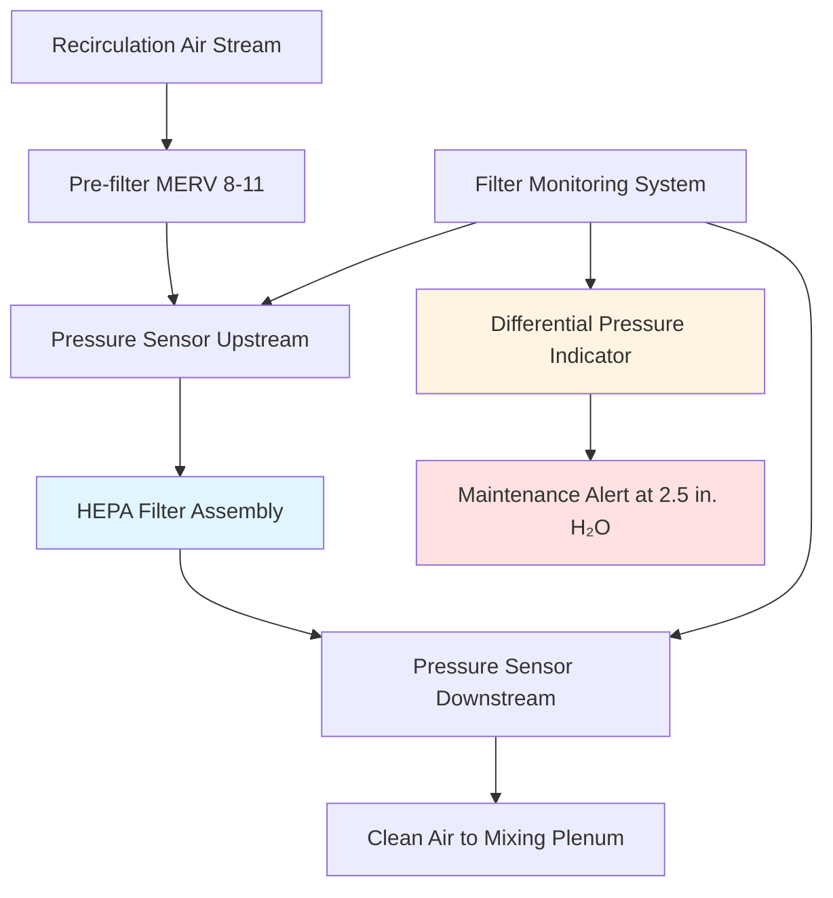

Aircraft HEPA filtration systems represent a critical component of cabin environmental control, removing 99.97% of airborne particles 0.3 micrometers and larger from recirculated air. These high-efficiency filters operate under unique constraints including variable cabin pressure, limited installation space, weight restrictions, and continuous operation requirements. Understanding the filtration physics, system integration, and performance characteristics enables proper specification and maintenance of these systems.

## HEPA Filter Performance Standards

Aircraft HEPA filters must meet rigorous efficiency standards derived from military specification MIL-STD-282 and commercial aviation requirements. The defining characteristic is minimum 99.97% removal efficiency at the most penetrating particle size (MPPS) of 0.3 micrometers, where filter mechanisms transition from interception-dominated to diffusion-dominated capture.

The particle removal efficiency follows combined filtration theory incorporating four primary mechanisms:

**Filtration mechanisms and effective size ranges:**

- **Inertial impaction:** Particles >1.0 μm deviate from streamlines
- **Interception:** Particles 0.3-1.0 μm contact fibers along streamlines
- **Diffusion:** Particles <0.3 μm undergo Brownian motion
- **Electrostatic attraction:** All sizes with residual charge

The total collection efficiency (η_total) combines individual mechanisms:

$$\eta_{total} = 1 - (1-\eta_{impaction})(1-\eta_{interception})(1-\eta_{diffusion})(1-\eta_{electrostatic})$$

At the MPPS of 0.3 μm, interception and diffusion contributions approach minimum values while inertial impaction remains negligible, creating the efficiency valley that defines HEPA performance requirements. Particles both larger and smaller than 0.3 μm achieve higher removal efficiencies, often exceeding 99.99%.

## Filter Construction and Media Properties

Aircraft HEPA filters utilize pleated borosilicate glass fiber media to maximize surface area within compact dimensions. The media consists of randomly oriented fibers ranging from 0.5 to 2.0 micrometers in diameter, creating a tortuous path through which air flows while particles contact and adhere to fiber surfaces.

Typical media specifications for aircraft applications:

| Parameter | Value | Engineering Basis |
|-----------|-------|-------------------|
| Fiber diameter | 0.5-2.0 μm | Optimizes capture efficiency |
| Media thickness | 0.4-0.6 mm | Balances capacity and pressure drop |
| Packing density | 8-12% | Fiber volume fraction |
| Pleat depth | 25-35 mm | Maximizes area in envelope |
| Pleat spacing | 3-5 mm | Prevents pleat collapse |
| Face area | 0.8-2.5 ft² | Depends on aircraft size |

The pleated configuration increases effective filtration area by 15-25 times compared to flat media occupying the same installation envelope. This extended surface area reduces face velocity and initial pressure drop, extending filter service life while maintaining compact dimensions critical for aircraft weight and space constraints.

Media support structures include upstream and downstream separator sheets that maintain pleat geometry under varying airflow and pressure conditions. Aerospace-grade sealants bond the media pack to the frame, preventing bypass flow that would compromise filtration efficiency.

## Pressure Drop Characteristics and Airflow Calculations

Pressure drop across HEPA filters represents the primary parasitic load in recirculation fan systems, directly impacting fan power requirements and system efficiency. The pressure drop follows the Darcy-Weisbach relationship modified for porous media flow:

$$\Delta P = \frac{\mu \cdot V \cdot t}{\alpha} + \frac{\rho \cdot V^2}{2K}$$

Where:
- ΔP = pressure drop across filter (Pa or in. H₂O)
- μ = air dynamic viscosity (1.81×10⁻⁵ Pa·s at 20°C)
- V = face velocity through media (m/s or fpm)
- t = media thickness (m or in.)
- α = media permeability coefficient (m²)
- ρ = air density (kg/m³ or lb/ft³)
- K = inertial flow resistance factor (dimensionless)

At typical aircraft recirculation velocities of 200-300 fpm face velocity, the viscous (first) term dominates, creating approximately linear pressure drop versus flow relationship. Initial clean filter pressure drop ranges from 0.8 to 1.2 in. H₂O at design flow rates.

As particulate loading accumulates on fiber surfaces, the permeability coefficient (α) decreases, increasing pressure drop. Manufacturers specify replacement when pressure drop reaches 2.5-3.0 in. H₂O, representing filter loading of 40-60 grams per square foot of media area.

## System Integration and Recirculation Loop Design

HEPA filters integrate into the recirculation airflow path between cabin return air extraction and the mixing plenum where filtered recirculated air combines with fresh air from ECS packs. This arrangement processes 100% of recirculated air while avoiding the temperature extremes and moisture content variations present in outside air streams.

The recirculation loop configuration follows this sequence:

1. **Return air collection:** Sidewall or floor grilles extract air at 1,200-3,500 cfm per zone
2. **Pre-filtration:** MERV 8-11 filters remove large particles and debris (>10 μm)
3. **Recirculation fan:** Centrifugal or mixed-flow fans provide 4-6 in. H₂O pressure rise
4. **HEPA filtration:** Primary particle removal at 99.97% efficiency
5. **Mixing plenum delivery:** Filtered air combines with outside air at 40-60% ratio

Recirculation fan sizing must account for HEPA filter pressure drop across the service interval from clean installation (0.8-1.2 in. H₂O) to replacement threshold (2.5-3.0 in. H₂O). Variable speed fans adjust rpm to maintain constant airflow as filter loading increases, preventing ventilation rate degradation.

Fan power requirements follow the standard relationship:

$$P_{fan} = \frac{Q \cdot \Delta P_{total}}{\eta_{fan} \cdot 6356}$$

Where:
- P_fan = fan brake horsepower (hp)
- Q = volumetric flow rate (cfm)
- ΔP_total = total system pressure drop (in. H₂O)
- η_fan = fan total efficiency (typically 0.65-0.75)
- 6356 = conversion constant

For a typical narrow-body zone handling 2,000 cfm with 5 in. H₂O total pressure including filters and ductwork at 70% fan efficiency, required fan power equals 2.27 hp. Dual-fan redundancy provides 100% backup capability with each fan sized for 60-75% of total flow.

## Particulate Removal Efficiency and Cabin Air Quality

The HEPA filtration system achieves cabin particulate concentrations comparable to ISO Class 6 cleanrooms (formerly Class 1,000), with particle counts below 10,000 particles per cubic foot at 0.5 μm and larger. This performance level far exceeds ASHRAE 62.1 indoor air quality standards and provides substantial margin above minimum aviation requirements.

Effectiveness of HEPA filtration in the complete ventilation system depends on recirculation fraction and outside air quality:

$$C_{cabin} = \frac{C_{OA} \cdot f_{OA} + C_{recirc} \cdot (1-f_{OA}) \cdot (1-\eta_{HEPA})}{1}$$

Where:
- C_cabin = steady-state cabin particle concentration
- C_OA = outside air particle concentration (typically very low at cruise altitude)
- f_OA = outside air fraction (0.4-0.6 typical)
- C_recirc = recirculation air entering filter
- η_HEPA = filter efficiency (0.9997)

The high HEPA efficiency reduces the recirculation contribution term to negligible levels. With 50% outside air at near-zero particulate concentration (high-altitude cruise) and 50% recirculation through HEPA filters, the system removes 99.985% of cabin-generated particles each air exchange cycle.

Air changes per hour (ACH) of 20-30 in typical configurations provide complete air exchange every 2-3 minutes, rapidly diluting and filtering airborne particles. The combination of high ACH and HEPA filtration achieves particle removal time constants of 1-2 minutes.

## Filter Service Life and Replacement Criteria

HEPA filter service intervals depend on particle loading rates, which vary substantially based on route structure, passenger load factors, and ambient air quality during ground operations. Typical service life ranges from 3,000 to 6,000 flight hours, equivalent to 12-24 months for aircraft operating 250 hours monthly.

**Factors affecting filter service life:**

- **Ground operations in dusty environments:** Accelerates loading during taxi and boarding
- **Passenger load factors:** Higher occupancy increases particle generation
- **Route length:** Short-haul operations involve more ground exposure per flight hour
- **Pre-filter efficiency:** Effective pre-filtration extends HEPA life
- **Cabin cleanliness:** Regular interior cleaning reduces particle resuspension

Filter replacement criteria include differential pressure monitoring as the primary indicator. Continuous measurement of pressure drop across the filter assembly provides real-time indication of loading status. When differential pressure reaches 2.5-3.0 in. H₂O, replacement becomes necessary to prevent:

- Excessive recirculation fan power consumption
- Potential flow reduction if fan capacity is insufficient
- Reduced system efficiency and increased operating costs
- Risk of media failure under high pressure differential

Secondary replacement indicators include scheduled calendar intervals (typically 24 months maximum) to address potential media degradation, seal aging, or moisture damage even if pressure drop remains acceptable.

## Performance Verification and Testing

Aircraft HEPA filter installations require verification testing to confirm proper installation, seal integrity, and performance compliance. Testing protocols derive from aerospace quality standards and cleanroom certification practices.

| Test Method | Parameter Measured | Acceptance Criteria |
|-------------|-------------------|---------------------|
| DOP penetration | Filter efficiency | <0.03% penetration at 0.3 μm |
| Pressure drop | Flow resistance | 0.8-1.2 in. H₂O clean, <3.0 in. H₂O maximum |
| Bypass flow | Seal integrity | <0.01% of total flow |
| Flow distribution | Velocity uniformity | ±15% across filter face |
| Vibration resistance | Structural integrity | No damage after FAR 25.1309 vibration |

Dioctyl phthalate (DOP) aerosol testing generates 0.3 μm particles upstream of the filter while measuring downstream concentration with photometric analysis. Penetration below 0.03% confirms 99.97% minimum efficiency. This test also identifies seal leaks that would allow bypass flow, compromising system performance.

Pressure drop measurement at design flow rate verifies proper filter selection and installation. Excessive initial pressure drop indicates incorrect filter specification, improper installation, or damage during handling.

## Weight and Space Optimization

Aircraft applications demand minimum weight and volume for all components, driving HEPA filter design toward maximum media packing density and efficient pleated geometries. Weight considerations include:

| Component | Weight Range | Design Drivers |
|-----------|--------------|----------------|
| HEPA filter assembly | 3-8 lb | Media area, frame material |
| Pre-filter | 0.5-1.5 lb | Lower efficiency, less dense media |
| Housing and mounting | 5-12 lb | Structural requirements |
| Ductwork connections | 2-5 lb | Pressure rating, flexibility |
| Total per zone | 10-25 lb | Aircraft size, redundancy |

Modern filter designs utilize composite frames replacing metal construction, reducing weight by 20-30% while maintaining structural integrity under vibration and pressure cycling. High-strength aluminum or polymer frames provide adequate support for the media pack while minimizing parasitic weight.

Installation volume occupies premium cabin or ceiling void space. Efficient packaging achieves 15-20 ft² of effective media area within 0.15-0.30 ft³ envelope volume through deep pleating and optimized pleat spacing.

## Operational Considerations and Best Practices

HEPA filter system performance requires attention to operational factors affecting filtration efficiency and service life:

**Ground operations management:**

- Minimize gate time with packs operating during high particle ambient conditions
- Use ground pre-conditioned air when available to reduce outside air contamination
- Close air intake during dust storms or volcanic ash events
- Schedule heavy maintenance during periods of favorable air quality

**In-flight optimization:**

- Operate recirculation fans continuously at design speed
- Maintain balanced airflow across multiple filter zones
- Monitor differential pressure trends to predict replacement timing
- Coordinate filter changes with scheduled maintenance intervals

**Maintenance procedures:**

- Handle replacement filters carefully to prevent media damage
- Inspect sealing surfaces and replace gaskets during filter changes
- Verify proper seating with bypass flow testing after installation
- Document pressure drop at installation for trend analysis

The recirculation system operating with HEPA filtration consumes 1.5-2.5 kW per zone for fan power, representing 10-15% of total ECS electrical load. This energy investment delivers substantial air quality improvement and enables higher recirculation fractions that reduce bleed air extraction and associated fuel consumption penalties.

## Comparison with Alternative Filtration Technologies

While HEPA filtration dominates aircraft applications, emerging technologies offer potential advantages for specific requirements:

| Technology | Efficiency | Pressure Drop | Weight | Microbial Kill | Status |
|------------|-----------|---------------|---------|----------------|--------|
| HEPA (glass fiber) | 99.97% @ 0.3 μm | 0.8-1.2 in. H₂O | 3-8 lb | Capture only | Standard |
| ULPA (ultra-low) | 99.999% @ 0.12 μm | 1.5-2.5 in. H₂O | 4-10 lb | Capture only | Specialty |
| Electrostatic | 95-99% | 0.2-0.4 in. H₂O | 5-12 lb | Some ionization | Limited use |
| UV-C germicidal | Variable | 0.1-0.2 in. H₂O | 8-15 lb | High (DNA damage) | Supplemental |
| Photocatalytic | 80-95% | 0.3-0.6 in. H₂O | 6-12 lb | Moderate | Developmental |

HEPA technology remains the preferred solution due to proven reliability, regulatory acceptance, and passive operation requiring no power beyond fan energy. The mechanical filtration mechanism operates independently of humidity, temperature, and particle type, providing consistent performance across all flight conditions.

Emerging applications combine HEPA filtration with supplemental UV-C germicidal irradiation targeting airborne pathogens. UV lamps installed downstream of HEPA filters provide additional microbial inactivation through DNA disruption at 254 nm wavelength. This layered approach addresses both particulate removal (HEPA) and pathogen inactivation (UV-C), though it adds weight, power consumption, and maintenance complexity.
