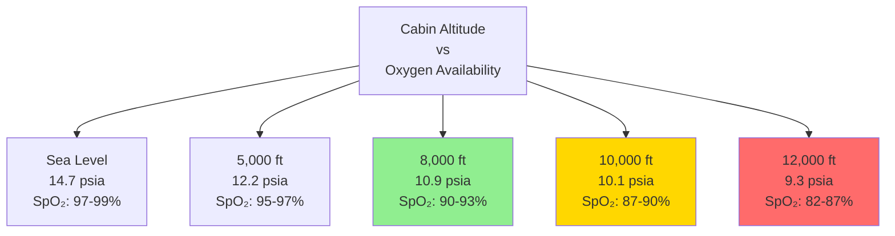

Aircraft outside air requirements represent the intersection of regulatory compliance, thermodynamic constraints, and physiological needs. Unlike ground-based HVAC systems where outside air is abundant and available at atmospheric pressure, aircraft must extract conditioned air from engine compressors at significant fuel penalty while operating in environments where ambient pressure drops to 20% of sea level and temperatures reach -56°C. The design challenge centers on delivering sufficient oxygen and dilution ventilation while minimizing the energy burden on propulsion systems.

## Regulatory Framework and Minimum Ventilation Standards

FAR 25.831 establishes prescriptive minimum outside air requirements for transport category aircraft operating under 14 CFR Part 25. The regulation specifies a minimum supply of 0.55 lb/min per occupant at maximum certificated passenger capacity, independent of altitude or operating condition.

Converting the mass-based requirement to volumetric flow requires accounting for air density at cabin conditions:

$$
\dot{Q}_{OA} = \frac{\dot{m}_{OA}}{\rho_{cabin}} = \frac{0.55 \text{ lb/min} \times N_{pax}}{\rho_{cabin}}
$$

At typical cabin conditions (75°F, 8,000 ft cabin altitude equivalent to 10.9 psia):

$$
\rho_{cabin} = \frac{P}{R \cdot T} = \frac{10.9 \times 144}{53.35 \times 534.7} = 0.0551 \text{ lb/ft}^3
$$

This yields approximately 10 cfm per occupant, establishing the baseline ventilation rate. Modern aircraft typically operate at 15-20 cfm per person to provide margin above regulatory minimums and improve perceived air quality.

**Regulatory compliance parameters:**

| Requirement | Limit | Measurement Condition |
|-------------|-------|----------------------|
| Outside air supply | 0.55 lb/min per occupant | Maximum passenger capacity |
| CO₂ concentration | <0.5% by volume | Any occupied zone |
| CO concentration | <1 part per 20,000 | Continuous monitoring required |
| Cabin altitude | ≤8,000 ft | Up to aircraft service ceiling |
| Oxygen partial pressure | ≥2.24 psia | Equivalent to 8,000 ft |

The carbon dioxide limit of 0.5% (5,000 ppm) provides significant margin above levels causing physiological effects, though perceived air quality degrades above 1,500-2,000 ppm. The oxygen partial pressure requirement ensures adequate blood oxygen saturation (SpO₂ ≥90%) for healthy passengers at maximum cabin altitude.

## Bleed Air Extraction and Thermodynamic Considerations

Outside air for cabin ventilation originates from engine compressor stages or auxiliary power unit (APU) compressors through bleed air extraction. This extraction occurs at high-pressure compressor stages where air reaches 200-450 psig and 400-700°F, conditions requiring substantial cooling before entering the cabin.

The thermodynamic cost of bleed air extraction manifests as increased specific fuel consumption (SFC). Each pound of air diverted from the combustion process reduces thrust-specific efficiency, with the magnitude depending on extraction point:

$$
\Delta SFC = k \cdot \frac{\dot{m}_{bleed}}{\dot{m}_{engine}} \cdot \left(1 + \frac{W_{comp}}{h_{fuel} \cdot \eta_{th}}\right)
$$

Where compression work from extraction point to delivery conditions represents 40-60 Btu/lb for typical high-stage bleeds. At cruise conditions, this translates to approximately 1% fuel burn increase per 100 lb/min of bleed air extraction.

**Bleed air extraction parameters:**

The environmental control system (ECS) pack processes bleed air through air cycle refrigeration, achieving supply temperatures of 35-45°F before mixing with recirculated air. This cooling requires 80-120 Btu per pound of outside air, representing 35-45% of total ECS thermal load during cruise.

## Altitude-Dependent Performance and Ventilation Strategies

Available bleed air pressure decreases with altitude as engine compressor discharge pressure reduces at lower ambient density. This characteristic necessitates careful system design to maintain required ventilation rates throughout the operational envelope.

Cabin pressure differential limits (8-9 psi for aluminum fuselage, 9-10 psi for composite structures) constrain maximum cabin pressure at high altitude. The relationship between flight altitude, cabin altitude, and required bleed air pressure determines system sizing:

$$
P_{bleed,req} = P_{cabin} + \Delta P_{system} = P_{amb} \cdot e^{\frac{-h_{cabin}}{29,000}} + \Delta P_{duct} + \Delta P_{pack}
$$

At maximum cruise altitude (FL410-FL450), ambient pressure drops to 2.5-2.1 psia. Maintaining 8,000 ft cabin altitude (10.9 psia) requires 6.4-8.8 psi differential. Adding system pressure losses of 3-5 psi yields minimum bleed air delivery pressure of 14-16 psig.

**Altitude performance envelope:**

| Flight Altitude | Ambient Pressure | Cabin Altitude | Pressure Differential | Bleed Air Required |
|-----------------|------------------|----------------|----------------------|-------------------|
| Sea level | 14.7 psia | Sea level | 0 psi | 25-35 psig |
| FL250 | 5.5 psia | 6,000 ft | 6.1 psi | 18-22 psig |
| FL350 | 3.5 psia | 7,500 ft | 7.8 psi | 16-20 psig |
| FL410 | 2.5 psia | 8,000 ft | 8.4 psi | 14-18 psig |
| FL450 | 2.1 psia | 8,000 ft | 8.8 psi | 14-18 psig |

Engine bleed pressure at cruise altitude typically ranges from 25-45 psig depending on engine type and throttle setting. This provides adequate margin for normal operations but limits ventilation rate increases during high-demand scenarios at maximum altitude.

## Oxygen Partial Pressure and Physiological Requirements

The critical parameter for human respiration is oxygen partial pressure, not absolute pressure or oxygen percentage. Cabin pressurization maintains oxygen partial pressure adequate for normal physiological function without supplemental oxygen.

At sea level, atmospheric oxygen partial pressure is:

$$
P_{O_2,SL} = X_{O_2} \cdot P_{atm} = 0.2095 \times 14.7 = 3.08 \text{ psia}
$$

At 8,000 ft cabin altitude:

$$
P_{O_2,8000} = 0.2095 \times 10.9 = 2.28 \text{ psia}
$$

This represents a 26% reduction in oxygen availability compared to sea level. Healthy individuals adapt through increased respiratory rate and cardiac output, maintaining arterial oxygen saturation (SpO₂) at 90-95%.

The relationship between cabin altitude and arterial oxygen saturation follows the oxygen-hemoglobin dissociation curve:

The 8,000 ft regulatory limit ensures SpO₂ remains above 90%, the threshold below which cognitive function begins degrading. Passengers with respiratory conditions may experience symptoms at these levels, prompting supplemental oxygen use for affected individuals.

## Mass Flow Calculations and System Sizing

Accurate sizing of outside air supply systems requires accounting for varying passenger loads, metabolic rates, and flight phases. The design calculation establishes maximum flow requirements:

$$
\dot{m}_{OA,total} = N_{pax,max} \times 0.55 + \dot{m}_{flight\,deck} + \dot{m}_{cargo,heated}
$$

For a representative narrow-body aircraft (150 passengers):

$$
\dot{m}_{OA,total} = 150 \times 0.55 + 4 \times 0.55 + 10 = 82.5 + 2.2 + 10 = 94.7 \text{ lb/min}
$$

Converting to volumetric flow at cabin conditions (0.0551 lb/ft³):

$$
\dot{Q}_{OA,total} = \frac{94.7}{0.0551} = 1,719 \text{ cfm}
$$

The ECS pack must deliver this flow at all operating conditions, requiring oversizing for worst-case scenarios:

- Maximum passenger capacity
- Maximum cabin altitude (8,000 ft)
- Maximum flight altitude (lowest bleed air pressure)
- Single-pack operation (redundancy requirement)
- Pack cooling capacity at hot-day ground operations

**System sizing factors:**

| Design Condition | Impact on Sizing | Typical Factor |
|-----------------|------------------|----------------|
| Full passenger load | Baseline requirement | 1.0× |
| Cabin altitude density reduction | Increases volumetric flow | 1.15× |
| Distribution losses | Pressure drop compensation | 1.10× |
| Single-pack operation | Redundancy requirement | 2.0× |
| Installation effects | Duct losses, altitude | 1.05-1.10× |
| Growth margin | Future modifications | 1.05-1.10× |

Combined design factors yield total pack capacity of 2.5-3.0 times the baseline outside air requirement, resulting in installed capacity of 4,000-5,000 cfm per pack for narrow-body aircraft.

## Recirculation Ratios and Air Quality Balance

While FAR 25.831 mandates minimum outside air, it permits recirculation provided air passes through HEPA filtration. The optimal outside air fraction balances air quality, energy consumption, and humidity control.

The ventilation effectiveness depends on mixing efficiency and contaminant removal:

$$
\eta_v = \frac{C_{exhaust} - C_{supply}}{C_{breathing\,zone} - C_{supply}}
$$

For well-mixed aircraft cabins with HEPA-filtered recirculation, ventilation effectiveness approaches 1.0, indicating perfect mixing. This allows reduced outside air fractions while maintaining equivalent contaminant dilution.

Carbon dioxide accumulation provides the limiting factor for recirculation ratio:

$$
C_{CO_2,ss} = C_{CO_2,OA} + \frac{G_{CO_2}}{\dot{Q}_{OA} + \dot{Q}_{recir} \cdot (1 - \eta_{filter})}
$$

Where $G_{CO_2}$ represents metabolic CO₂ generation (0.5-0.7 cfm per person at rest). With HEPA filtration removing particulates but not gases, the steady-state CO₂ concentration depends solely on outside air fraction and total ventilation rate.

**Recirculation strategy comparison:**

| Outside Air % | Recirculation % | Steady-State CO₂ | Fuel Impact | Applications |
|---------------|-----------------|------------------|-------------|--------------|
| 100% | 0% | 800-1,000 ppm | Baseline +8-10% | Ground operations, APU |
| 60% | 40% | 1,200-1,500 ppm | +3-4% | Typical cruise |
| 50% | 50% | 1,400-1,800 ppm | Reference | Standard cruise |
| 40% | 60% | 1,800-2,200 ppm | -2-3% | Economy cruise, light loads |
| 30% | 70% | 2,400-3,000 ppm | -4-5% | Not recommended |

Most modern aircraft operate at 50-60% outside air during cruise, achieving CO₂ levels of 1,200-1,800 ppm while minimizing fuel consumption. Ground operations with APU air conditioning often use 70-100% outside air due to lower energy cost and unlimited air availability.

## Humidity Control and Moisture Management

Outside air at cruise altitude contains minimal moisture (dewpoint -40 to -60°F), providing natural dehumidification for cabin air. The extremely dry bleed air mixes with moisture generated by passenger respiration and perspiration, establishing equilibrium humidity.

Moisture balance in the cabin:

$$
\dot{m}_{H_2O,generation} = N_{pax} \times G_{moisture} = \dot{m}_{OA} \times (W_{cabin} - W_{OA})
$$

Where $G_{moisture}$ is approximately 0.25-0.35 lb/hr per person at rest. For 150 passengers:

$$
\dot{m}_{H_2O,total} = 150 \times 0.30 = 45 \text{ lb/hr}
$$

This moisture must be removed by outside air ventilation or condense on cold surfaces (fuselage, windows). The required outside air humidity ratio increase:

$$
\Delta W = \frac{45}{94.7 \times 60} = 0.0079 \text{ lb}_w/\text{lb}_{da}
$$

If incoming outside air has $W_{OA}$ = 0.0001 lbw/lbda (typical cruise), cabin humidity ratio stabilizes at 0.0080 lbw/lbda, corresponding to 8-12% RH at 72°F cabin temperature. This extremely low humidity causes passenger discomfort on long flights but prevents condensation in aircraft structure.

Increasing outside air fraction above minimum requirements provides the only practical method for humidity control, as active humidification systems add unacceptable weight and complexity. Some modern widebody aircraft incorporate humidification systems for premium cabins, adding 20-40 lb/hr of moisture to raise local RH to 15-20%.

## Operational Considerations and System Management

Flight crews monitor and adjust outside air supply through ECS control panels, balancing comfort, air quality, and fuel efficiency. Automatic systems modulate recirculation fan speed and pack output based on passenger load sensors, ambient conditions, and flight phase.

Key operational parameters include:

- Pack flow selector: Low/Normal/High (50%/100%/150% of baseline)
- Recirculation fan status: On/Off/Auto
- Cabin temperature targets: 68-75°F typical range
- Cabin altitude: Automatic pressurization schedule
- Bleed air source selection: Engine or APU

During abnormal operations (single pack, single engine, or degraded bleed air), the system automatically reconfigures to maintain minimum ventilation rates while potentially relaxing cabin altitude or temperature targets. The pressurization system prevents cabin altitude from exceeding 8,000 ft under normal circumstances and 14,000-15,000 ft during emergency descent.

Temperature stratification and lateral uniformity depend on maintaining design airflow distribution. Reduced pack flow at light passenger loads can cause comfort complaints despite adequate average conditions, prompting manual override to normal or high flow settings.

Modern aircraft incorporate demand-controlled ventilation that adjusts total airflow based on actual passenger count rather than maximum certificated capacity. This optimization reduces fuel consumption by 1-3% on lightly loaded flights while maintaining regulatory compliance and comfort standards.
