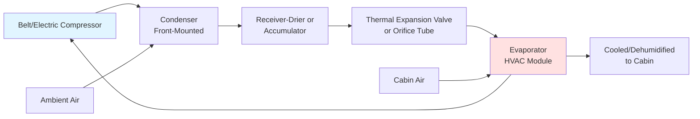
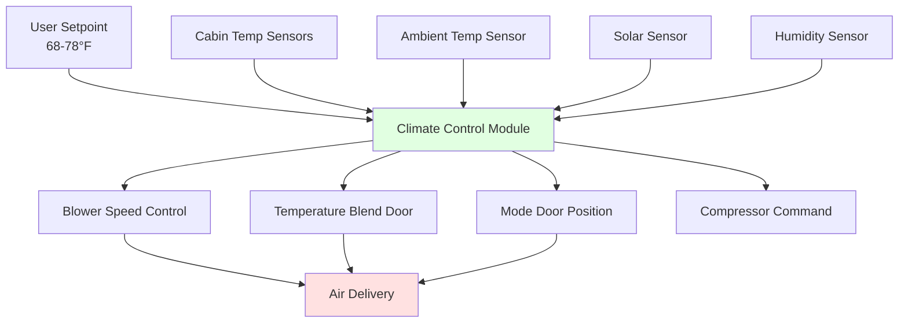

## Overview of Automotive HVAC Systems

Automotive HVAC systems operate under uniquely challenging conditions compared to stationary applications. The system must deliver thermal comfort within a constrained space while accommodating extreme ambient temperatures (-40°F to 140°F), variable solar loading (up to 1000 W/m²), frequent transient operation, and strict weight and packaging limitations. Modern automotive climate control integrates refrigeration, heating, ventilation, and dehumidification into a compact thermal management system.

## Fundamental Heat Load Analysis

The total thermal load on a vehicle cabin derives from multiple simultaneous sources:

$$Q_{total} = Q_{solar} + Q_{conduction} + Q_{ventilation} + Q_{occupants} + Q_{equipment}$$

**Solar Heat Gain** represents the dominant cooling load in stationary vehicles. Solar radiation penetrates through glazing and is absorbed by interior surfaces:

$$Q_{solar} = A_{glazing} \times SHGC \times I_{solar} \times \cos(\theta)$$

where $A_{glazing}$ is the glazing area (typically 20-30 ft² for passenger vehicles), $SHGC$ is the solar heat gain coefficient (0.3-0.7 for automotive glass), $I_{solar}$ is incident solar radiation, and $\theta$ is the angle of incidence.

**Conduction Load** through the vehicle envelope depends on surface area, thermal resistance, and temperature differential:

$$Q_{conduction} = \frac{A \times \Delta T}{R_{total}}$$

Vehicle bodies exhibit low thermal resistance (R-1 to R-3) compared to buildings, resulting in substantial conduction loads during extreme conditions.

**Ventilation Load** introduces outdoor air for air quality and pressurization:

$$Q_{ventilation} = \dot{m}_{air} \times c_p \times (T_{ambient} - T_{cabin}) + \dot{m}_{air} \times h_{fg} \times (W_{ambient} - W_{cabin})$$

Typical fresh air flow rates range from 10-30 CFM per occupant, with recirculation modes reducing this load by 70-90% during peak conditions.

## Vapor Compression System Architecture

Automotive air conditioning systems employ compact vapor compression cycles with specific adaptations for mobile operation:

### Key Component Characteristics

| Component | Automotive Specification | Design Consideration |
|-----------|--------------------------|---------------------|
| Compressor | Variable displacement or electric, 3-12 kW | Must survive 150,000+ cycles, wide speed range |
| Condenser | Microchannel, 0.5-1.5 m² | Maximizes frontal area, minimizes depth |
| Evaporator | Plate-fin, 0.3-0.6 m² | Integrated with heater core, condensate drainage |
| Refrigerant Charge | 400-900 g | Critical charge sensitivity ±50 g |
| Operating Range | -40°F to 130°F ambient | Wide pressure ratio (2:1 to 12:1) |

**Compressor Drive Methods** directly impact system efficiency:

- **Belt-Driven:** Mechanically coupled to engine, cycling clutch engagement, parasitic losses 2-5 HP
- **Electric:** Independent operation, variable speed control, enables heat pump operation, critical for EVs

## Heating System Integration

Automotive heating traditionally utilizes engine waste heat through a liquid-to-air heat exchanger (heater core):

$$Q_{heating} = \dot{m}_{coolant} \times c_{p,coolant} \times (T_{in} - T_{out}) = \dot{m}_{air} \times c_{p,air} \times (T_{out} - T_{in})$$

Engine coolant temperatures (180-220°F) provide sufficient heat delivery for ambient conditions above -20°F. The heater core effectiveness typically ranges from 0.6-0.8:

$$\epsilon = \frac{Q_{actual}}{Q_{maximum}} = \frac{T_{out} - T_{in}}{T_{coolant} - T_{in}}$$

### Electric Vehicle Thermal Challenges

EVs lack waste heat from internal combustion, necessitating alternative heating strategies. Positive Temperature Coefficient (PTC) resistive heaters provide immediate heat but consume 3-7 kW, directly reducing driving range by 20-40% in cold weather.

**Heat Pump Systems** offer superior efficiency by extracting heat from ambient air or drivetrain components:

$$COP_{heating} = \frac{Q_{heating}}{W_{compressor}} = \frac{h_{condenser,out} - h_{condenser,in}}{h_{compressor,out} - h_{compressor,in}}$$

Heat pump COP values of 2.0-3.5 are achievable above 20°F ambient, declining to 1.2-1.8 below 0°F. Many EV systems combine heat pumps with supplemental PTC heating for extreme cold conditions.

## Defrost and Defogging Physics

Windshield fogging occurs when interior glass temperature falls below the dew point of cabin air. The condensation rate follows:

$$\dot{m}_{condensation} = h_{mass} \times A_{glass} \times (W_{air} - W_{surface})$$

**Defrost Strategy** combines three mechanisms:

1. **Convective Heating:** High-velocity airflow (400-600 FPM) directed at windshield inner surface
2. **Dehumidification:** AC operation removes moisture, lowering dew point 10-20°F
3. **Maximum Temperature:** Delivers air at 120-140°F for rapid ice melting (external defrost)

SAE J902 specifies defrost performance requirements: 90% vision area cleared within 30 minutes at -20°F ambient with ice accumulation.

## Climate Control Architecture

Modern automatic climate control systems maintain thermal comfort through multi-zone temperature regulation:

The control algorithm calculates required air discharge temperature based on thermal load:

$$T_{discharge} = T_{setpoint} - \frac{Q_{load}}{\dot{m}_{air} \times c_p}$$

Blower speed modulation (1,500-6,000 CFM typical range) and temperature blend door position (mixing cold evaporator air with hot heater core air) achieve the target discharge temperature.

## Refrigerant Transitions and Environmental Impact

The automotive industry has undergone two major refrigerant transitions driven by environmental regulations:

| Refrigerant | Era | GWP | Characteristics |
|-------------|-----|-----|-----------------|
| R-12 (CFC) | 1950s-1994 | 10,900 | Ozone depleting, excellent performance |
| R-134a (HFC) | 1994-2021 | 1,430 | Zero ODP, high GWP, industry standard |
| R-1234yf (HFO) | 2017-present | <1 | Low GWP, mild flammability (A2L), higher cost |
| R-744 (CO₂) | Emerging | 1 | Natural refrigerant, high operating pressure (1,500 psi) |

**R-1234yf Transition** mandated by EPA and EU regulations (GWP <150) introduces system design changes:

- Reduced charge quantities (10-20% less than R-134a)
- Enhanced leak detection requirements (50 g/year maximum)
- Specialized service equipment for A2L refrigerants
- Performance parity achieved through optimized heat exchangers

SAE J2843 specifies R-1234yf service procedures and safety protocols for the mildly flammable refrigerant classification.

## Performance Metrics and Testing Standards

Automotive HVAC performance evaluation follows SAE standards:

- **SAE J2765:** Cooling capacity and efficiency testing procedures
- **SAE J2196:** Service hose specifications for HFC refrigerants
- **SAE J639:** Nomenclature for automotive air conditioning systems
- **SAE J2099:** Refrigerant purity and container standards

**Cool-Down Performance** measures the time to reduce cabin temperature from 125°F to 78°F at 95°F ambient with 50% RH. High-performance systems achieve this in 8-12 minutes with 4-6 kW cooling capacity.

The system coefficient of performance under steady-state conditions:

$$COP_{cooling} = \frac{Q_{evaporator}}{W_{compressor}} = \frac{h_{evaporator,out} - h_{evaporator,in}}{h_{compressor,out} - h_{compressor,in}}$$

Typical automotive AC systems achieve COP values of 1.5-2.5, lower than stationary systems due to compromised heat exchanger sizing and variable operating conditions.
