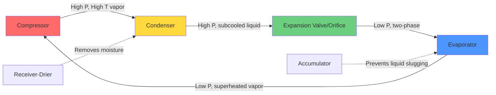
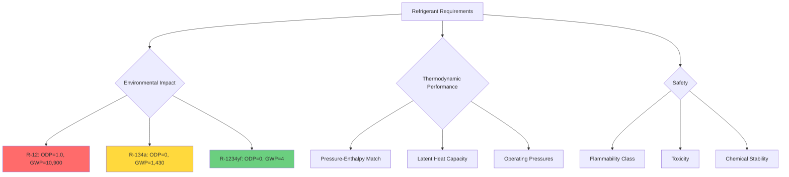

Automotive air conditioning systems represent a unique application of vapor-compression refrigeration, operating under severe constraints of variable engine speed, limited space, significant vibration, and widely varying ambient conditions. Modern automotive AC systems achieve cooling capacities between 3-6 kW while maintaining efficiency across engine speeds from 600-6000 RPM.

## Thermodynamic Challenges in Mobile Applications

Vehicle AC systems face distinct challenges compared to stationary HVAC equipment. The compressor operates at speeds dictated by engine RPM rather than optimal refrigeration cycle efficiency. At idle (600-800 RPM), cooling capacity drops dramatically, while at highway speeds (2000-3000 RPM), excessive refrigerant flow can cause system inefficiencies.

The fundamental cooling load equation for automotive applications accounts for transient solar radiation:

$$Q_{total} = Q_{conduction} + Q_{ventilation} + Q_{solar} + Q_{occupants}$$

where solar heat gain through glazing can exceed 1000 W/m² during peak conditions, creating pull-down loads that may reach 8-10 kW immediately after vehicle soak in direct sunlight.

## Refrigeration Cycle Components

### Compressor Technology

Automotive compressors have evolved from fixed-displacement reciprocating designs to sophisticated variable-capacity systems. The three primary types currently in use demonstrate different approaches to capacity modulation:

| Compressor Type | Displacement Control | Efficiency Range | Typical Application |
|----------------|---------------------|------------------|---------------------|
| Fixed Scroll | On/Off Cycling | 0.6-0.8 COP | Economy vehicles |
| Variable Displacement Piston | Swash plate angle | 0.7-1.2 COP | Mid-range vehicles |
| Electric Scroll | Speed modulation | 1.0-1.5 COP | Hybrid/Electric vehicles |

Variable displacement compressors adjust capacity by changing the swash plate angle, which modifies piston stroke. This mechanical feedback responds to evaporator pressure:

$$V_{displacement} = \frac{\pi D^2}{4} \times L \times n \times \cos(\theta)$$

where $\theta$ represents the swash plate angle (0-20 degrees from perpendicular), allowing capacity modulation from 2% to 100% without clutch cycling.

Electric compressors in hybrid and electric vehicles operate independently of engine speed, enabling precise capacity control through inverter-driven motor speed. The volumetric flow rate relationship:

$$\dot{m} = \rho \times V_{displacement} \times N \times \eta_v$$

shows that constant refrigerant mass flow ($\dot{m}$) can be maintained by varying compressor speed $N$ to compensate for density changes, optimizing efficiency across all operating conditions.

### Evaporator Design Constraints

Automotive evaporators must fit within instrument panel space constraints (typically 200-300 mm width, 180-250 mm height, 80-120 mm depth) while providing sufficient heat transfer surface area. Plate-and-fin designs dominate due to favorable surface area-to-volume ratios.

Heat transfer effectiveness depends on air-side and refrigerant-side coefficients:

$$\frac{1}{UA} = \frac{1}{h_a A_a} + \frac{t_{wall}}{k A_{wall}} + \frac{1}{h_r A_r}$$

Air-side resistance typically dominates (accounting for 70-80% of total thermal resistance), making fin geometry optimization critical. Modern evaporators use louvered fins with densities of 400-600 fins per meter to maximize surface area while managing condensate drainage.

The evaporator must also function as a dehumidifier. Moisture removal rate follows:

$$\dot{m}_{water} = \dot{m}_{air} \times (W_{in} - W_{sat,coil})$$

where $W$ represents humidity ratio. Condensate production can reach 2-3 liters per hour in high-humidity conditions, requiring effective drainage design to prevent water accumulation and microbial growth.

## Refrigerant Evolution and Thermophysical Properties

Automotive refrigerants have undergone three major transitions driven by environmental regulations and thermodynamic performance requirements.

### R-12 to R-134a Transition

R-12 (dichlorodifluoromethane) dominated automotive AC from the 1950s through the early 1990s. Its thermophysical properties matched automotive applications well:

- Evaporating pressure at 4°C: 290 kPa (suitable for hose/fitting design)
- Latent heat of vaporization: 165 kJ/kg
- Critical temperature: 112°C (adequate superheat margin)

The Montreal Protocol phase-out forced conversion to R-134a (1,1,1,2-tetrafluoroethane), which operates at higher pressures:

| Property | R-12 | R-134a | R-1234yf |
|----------|------|---------|----------|
| Evaporator Pressure (4°C) | 290 kPa | 292 kPa | 298 kPa |
| Condenser Pressure (55°C) | 1320 kPa | 1470 kPa | 1510 kPa |
| Latent Heat | 165 kJ/kg | 217 kJ/kg | 179 kJ/kg |
| GWP (100-year) | 10,900 | 1,430 | 4 |
| Flammability | Non-flammable | Non-flammable | A2L (mildly flammable) |

R-134a's higher latent heat provides greater cooling capacity per unit mass circulated, partially offsetting its 5-8% lower thermodynamic efficiency. The pressure-enthalpy relationship governs refrigeration effect:

$$q_{refrigeration} = h_{evap,out} - h_{evap,in}$$

### R-1234yf: Current Standard

SAE J2765 standardizes R-1234yf (2,3,3,3-tetrafluoropropene) for new automotive applications. With a GWP of 4 versus R-134a's 1,430, R-1234yf meets EU MAC Directive requirements (GWP < 150). The mild flammability (ASHRAE A2L classification) necessitates design modifications:

- Reduced refrigerant charge (typically 450-650 grams versus 650-900 grams for R-134a)
- Enhanced leak detection requirements per SAE J2913
- Modified service procedures under SAE J2843

Thermodynamically, R-1234yf performs nearly identically to R-134a. The coefficient of performance relationship:

$$COP = \frac{h_{evap,out} - h_{evap,in}}{h_{comp,out} - h_{comp,in}}$$

yields values within 2-3% between the two refrigerants under identical operating conditions, making R-1234yf a "drop-in" replacement with minimal system redesign.

## Expansion Device Technology

Automotive systems employ two primary expansion device strategies:

**Thermal Expansion Valve (TXV)**: Maintains constant superheat through mechanical feedback. The valve modulates refrigerant flow based on evaporator outlet temperature and pressure:

$$\Delta P_{valve} = P_{bulb} - P_{evap} - P_{spring}$$

TXV systems provide superior efficiency across varying loads but add cost and complexity.

**Fixed Orifice Tube**: Simple restriction that relies on refrigerant accumulator to prevent compressor liquid slugging. Mass flow follows:

$$\dot{m} = C_d A_{orifice} \sqrt{2\rho\Delta P}$$

Fixed orifice systems sacrifice some efficiency for reduced cost and improved reliability in severe vibration environments.

Modern systems increasingly use electronically-controlled expansion valves that optimize superheat based on multiple sensor inputs, achieving COP improvements of 10-15% compared to mechanical TXVs.

## Performance Standards and Testing

SAE J2765 specifies performance testing procedures for automotive AC systems. Standard conditions include:

- Ambient temperature: 35°C at 50% relative humidity
- Vehicle speed: 48 km/h (30 mph)
- Engine speed: 1500 RPM
- Vent temperature target: 7-10°C

Pull-down performance from 50°C interior to 25°C within 10 minutes represents a critical design metric, requiring transient cooling capacity significantly exceeding steady-state loads.

The unique constraints of automotive applications—variable compressor speed, packaging limitations, extreme operating conditions, and environmental regulations—drive continuous innovation in mobile air conditioning technology. Understanding the thermodynamic principles underlying component selection and refrigerant properties enables optimization of these complex, dynamic systems.
