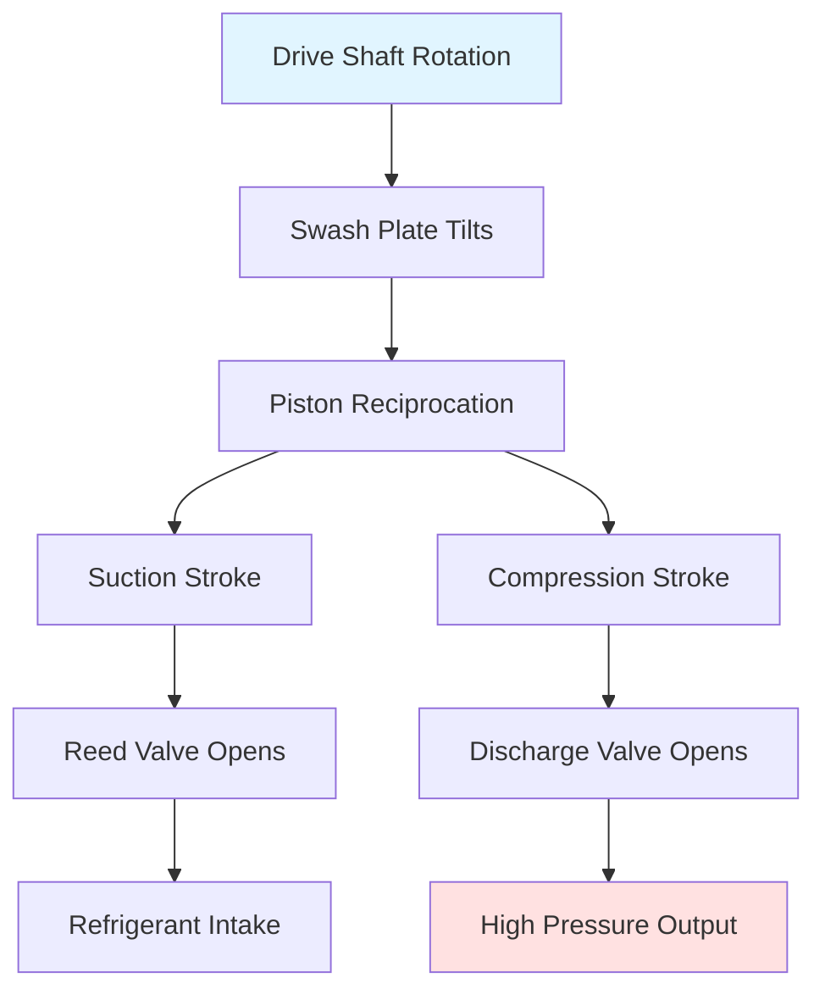

Automotive air conditioning compressors convert mechanical energy from the engine or electric motor into refrigerant pressure differential, enabling the vapor-compression refrigeration cycle. The compressor design directly impacts system efficiency, noise, vibration, and thermal management capability under highly variable operating conditions.

## Fundamental Operating Principles

Automotive compressors must operate across extreme speed ranges—from idle (600-900 rpm engine speed) to highway conditions (3000-6000 rpm), creating unique design challenges. The compression process follows:

$$W_{comp} = \dot{m} \cdot h_{discharge} - h_{suction}$$

where $W_{comp}$ represents compressor power consumption, $\dot{m}$ is refrigerant mass flow rate, and $h$ denotes specific enthalpy. For typical R-1234yf systems, suction pressures range from 1.5-3.0 bar with discharge pressures of 12-25 bar depending on ambient conditions.

The volumetric efficiency accounts for clearance volume and valve losses:

$$\eta_v = \frac{\dot{V}_{actual}}{\dot{V}_{displacement}} = 1 - C\left[\left(\frac{P_d}{P_s}\right)^{1/n} - 1\right]$$

where $C$ is the clearance factor, $P_d$ and $P_s$ are discharge and suction pressures, and $n$ is the polytropic exponent (typically 1.1-1.3 for refrigerants).

## Swash Plate Compressor Design

The swash plate (axial piston) compressor dominates automotive applications due to compact packaging and smooth operation. A tilted plate mounted on the drive shaft converts rotational motion into reciprocating piston movement.

### Fixed Displacement Swash Plate

The swash plate angle remains constant, typically 15-25°. Piston stroke $S$ relates to swash angle $\alpha$ and plate radius $r$:

$$S = 2r \cdot \tan(\alpha)$$

Displacement volume for $n$ cylinders with bore diameter $d$:

$$V_d = n \cdot \frac{\pi d^2}{4} \cdot S$$

Common configurations include 5, 6, 7, and 10-cylinder designs. The 7-cylinder arrangement provides excellent balance with minimal pulsation.

### Variable Displacement Control

Variable displacement compressors adjust cooling capacity by changing the swash plate angle from near 0° (minimum capacity) to maximum angle. This eliminates clutch cycling, reducing thermal shock and improving comfort.

The control mechanism balances three pressure regions:

$$P_{crank} = f(P_{suction}, P_{discharge}, P_{control})$$

A control valve modulates crankcase pressure by bleeding discharge gas. When cooling demand decreases, increasing crankcase pressure reduces the pressure differential across pistons, decreasing swash plate angle.

**Capacity modulation response:**

- Minimum displacement: 2-5% of maximum
- Transition time: 0.5-2.0 seconds
- Control pressure range: 3-8 bar

## Scroll Compressor Technology

Scroll compressors use two interleaved spiral elements—one fixed, one orbiting—to compress refrigerant continuously without valves. This design offers:

- Reduced noise (5-10 dB lower than reciprocating)
- Higher efficiency at partial loads
- Fewer moving parts
- Smoother torque delivery

The compression ratio develops progressively as gas pockets move from outer to inner radius:

$$r_c = \left(\frac{r_{outer}}{r_{inner}}\right)^2$$

For automotive applications, compression ratios of 3.5-6.0 are typical. The orbiting scroll radius $R_{orbit}$ determines displacement:

$$V_d = 2\pi h (R_{outer} - R_{inner}) \cdot R_{orbit}$$

where $h$ is scroll height.

Scroll compressors excel in hybrid and electric vehicles where continuous operation at fixed speeds enables optimal efficiency. SAE J2765 recognizes scroll advantages for electric drive systems.

## Electric Compressor Systems

Electric compressors eliminate belt drive dependence, critical for hybrid/electric vehicles and enabling climate control with the engine off. Three architectures exist:

| Architecture | Voltage | Power Range | Application |
|-------------|---------|-------------|-------------|
| High voltage DC | 200-400V | 3-7 kW | Battery EVs, PHEVs |
| 48V mild hybrid | 48V | 1.5-3 kW | Mild hybrids |
| 12V electric | 12V | 0.5-1.5 kW | Auxiliary/parked cooling |

The brushless DC motor efficiency:

$$\eta_{motor} = \frac{P_{mechanical}}{P_{electrical}} = \frac{\tau \cdot \omega}{V \cdot I}$$

Modern inverter controls achieve 85-92% motor efficiency across wide speed ranges (1000-8000 rpm), enabling precise capacity matching without mechanical displacement variation.

**Thermal management challenges:**

Electric compressors generate heat from motor losses and compression work. Oil cooling circuits or refrigerant injection cooling maintain motor temperatures below 120°C. The heat generation:

$$Q_{motor} = P_{electrical} \cdot (1 - \eta_{motor}) + W_{comp} \cdot (1 - \eta_{comp})$$

## Clutch Engagement Systems

Electromagnetic clutches couple the compressor to the engine serpentine belt system. The clutch consists of:

1. **Pulley assembly** - freewheels on bearing when disengaged
2. **Electromagnetic coil** - creates magnetic field (12V, 3-5A draw)
3. **Friction plate** - locks to pulley when energized
4. **Hub** - connects to compressor shaft

Engagement torque must overcome:

$$T_{engage} = T_{static} + T_{acceleration} + T_{compression}$$

Where static friction torque prevents initial rotation, acceleration torque brings the compressor to belt speed (typically 0.1-0.3 seconds), and compression torque maintains operation.

**Clutch cycling impacts:**

- On-off cycles: 3-10 per minute typical
- Temperature swing: ±5-8°C at evaporator
- Engagement shock: 20-40 Nm torque spike
- Wear: 50,000-100,000 cycle life expectancy

## Clutchless Variable Displacement

Modern systems eliminate the clutch by combining variable displacement with continuous operation at minimum capacity when cooling is not required. This approach:

- Reduces parasitic losses (minimum displacement consumes 0.2-0.5 kW)
- Eliminates engagement shock and noise
- Improves cabin comfort (no temperature cycling)
- Extends component life

The externally controlled variable displacement (ECVD) compressor uses pulse-width modulated control valves responding to electronic climate control signals, enabling integration with thermal management strategies optimizing overall vehicle efficiency.

## Performance Comparison

| Compressor Type | Efficiency | Noise (dBA) | Weight (kg) | Cost Factor |
|----------------|-----------|-------------|-------------|-------------|
| Fixed swash plate | 65-75% | 70-75 | 4.5-6.0 | 1.0x |
| Variable displacement | 70-80% | 68-73 | 5.5-7.0 | 1.3-1.5x |
| Scroll | 75-82% | 62-68 | 5.0-6.5 | 1.4-1.7x |
| Electric scroll | 78-85% | 60-65 | 6.5-8.5 | 2.0-2.5x |

Efficiency values represent isentropic efficiency under SAE J2765 test conditions (35°C ambient, 21°C cabin target).

## Application Selection Criteria

**Choose fixed displacement with clutch for:**
- Cost-sensitive applications
- Conventional ICE vehicles
- Moderate climates

**Choose variable displacement for:**
- Premium comfort requirements
- Extended idle operation
- Noise-sensitive vehicles

**Choose electric compressors for:**
- Hybrid and electric vehicles
- Advanced thermal management integration
- Maximum efficiency priority

The trend toward vehicle electrification drives adoption of high-voltage electric compressors with integrated inverters, while variable displacement remains dominant in conventional powertrains where belt-drive packaging and cost advantages persist.

## References

- SAE J2765: Procedure for Measuring System COP of a Mobile Air Conditioning System on a Test Bench
- SAE J639: Engine Cooling System Field Test (Alphanumeric Designation)
