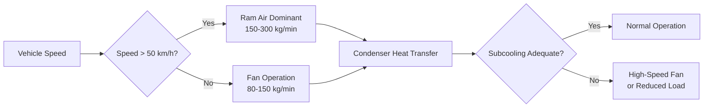
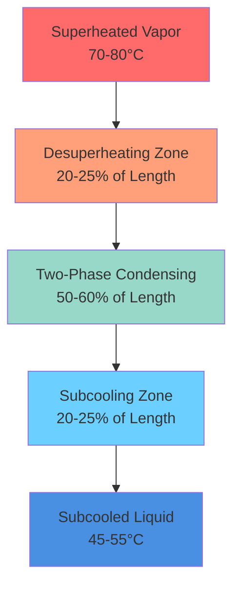

Automotive air conditioning condensers operate under continuously varying conditions that challenge traditional HVAC design principles. Unlike stationary systems, mobile condensers must reject heat effectively at vehicle speeds from 0 to 120+ km/h while occupying minimal frontal area and withstanding vibration, pressure pulsations, and corrosive environments.

## Condenser Design Configurations

### Parallel Flow Architecture

Parallel flow condensers route refrigerant through multiple vertical tubes simultaneously, with air moving perpendicular to refrigerant flow. This configuration reduces refrigerant charge while improving heat transfer efficiency through optimized flow distribution.

**Design characteristics:**
- Refrigerant flows vertically in 10-40 parallel paths
- Tube hydraulic diameter: 1.0-2.0 mm
- Face area: 0.3-0.6 m² for passenger vehicles
- Depth: 12-16 mm (single-pass microchannel)

Heat transfer occurs primarily through forced convection. The overall heat transfer coefficient $U$ depends on airside and refrigerant-side resistances:

$$\frac{1}{U} = \frac{1}{h_{\text{air}} \eta_{\text{fin}}} + \frac{t_{\text{wall}}}{k_{\text{Al}}} + \frac{1}{h_{\text{ref}}}$$

Where $\eta_{\text{fin}}$ represents fin efficiency, typically 0.75-0.85 for automotive louvered fins. The refrigerant-side coefficient $h_{\text{ref}}$ varies dramatically through the condenser as vapor condenses to liquid.

### Serpentine Configuration

Serpentine condensers use continuous tubing that snakes across the condenser face, forcing refrigerant through a single tortuous path. This design maintains higher refrigerant velocity but increases pressure drop and refrigerant charge.

**Comparative pressure drop:**

| Design Type | Refrigerant Pressure Drop | Refrigerant Charge | Airside Pressure Drop |
|-------------|---------------------------|--------------------|-----------------------|
| Parallel Flow | 20-40 kPa | 150-250 g | 80-120 Pa |
| Serpentine | 60-120 kPa | 400-600 g | 100-150 Pa |
| Tube-and-Fin | 40-80 kPa | 300-500 g | 60-100 Pa |

### Microchannel Technology

Microchannel condensers employ extruded aluminum tubes with internal hydraulic diameters of 0.5-1.5 mm. The small passages create turbulent flow even at low Reynolds numbers, enhancing condensation heat transfer while reducing refrigerant volume by 40-60% compared to conventional designs.

The condensation heat transfer coefficient in microchannels follows modified Nusselt-type correlations:

$$h_{\text{cond}} = 0.023 \, \text{Re}^{0.8} \, \text{Pr}^{0.4} \frac{k_{\text{ref}}}{D_h} \left(1 + \frac{2.5}{X_{tt}}\right)$$

Where $X_{tt}$ is the Martinelli parameter characterizing two-phase flow regime.

## Heat Rejection Calculations

The condenser must reject both the evaporator cooling load and compressor work input. Total heat rejection follows energy conservation:

$$Q_{\text{cond}} = Q_{\text{evap}} + W_{\text{comp}} = \dot{m}_{\text{ref}} (h_{\text{in}} - h_{\text{out}})$$

For a typical passenger vehicle system:
- Evaporator capacity: $Q_{\text{evap}}$ = 3.5-5.0 kW
- Compressor work: $W_{\text{comp}}$ = 1.2-2.0 kW
- Condenser rejection: $Q_{\text{cond}}$ = 4.7-7.0 kW

The required heat transfer area depends on the log-mean temperature difference (LMTD):

$$A_{\text{req}} = \frac{Q_{\text{cond}}}{U \cdot \text{LMTD}}$$

For R-134a condensing at 55°C with ambient air at 35°C:

$$\text{LMTD} = \frac{(55-35) - (48-40)}{\ln\left(\frac{55-35}{48-40}\right)} = 13.2 \, \text{K}$$

Where 48°C represents subcooled liquid temperature and 40°C represents air exit temperature.

## Airflow Dynamics and Vehicle Speed

Condenser airflow originates from two sources: ram air during vehicle motion and engine cooling fan when stationary or at low speeds.

Ram air velocity relates to vehicle speed through frontal area effectiveness:

$$\dot{m}_{\text{air}} = \rho_{\text{air}} \cdot v_{\text{vehicle}} \cdot A_{\text{frontal}} \cdot \eta_{\text{ram}}$$

Where $\eta_{\text{ram}}$ accounts for grille blockage and air bypass, typically 0.4-0.7. At 100 km/h with $A_{\text{frontal}}$ = 0.45 m²:

$$\dot{m}_{\text{air}} = 1.18 \times \frac{100}{3.6} \times 0.45 \times 0.6 = 8.9 \, \text{kg/s} = 534 \, \text{kg/min}$$

## Condenser Sizing Methodology

SAE J2765 provides standardized testing conditions for automotive AC systems. Condenser sizing must satisfy heat rejection requirements under worst-case conditions:

**Critical design points:**
- Ambient temperature: 46°C (Phoenix worst-case)
- Vehicle speed: 0 km/h (idle condition)
- Solar load: 1000 W/m²
- Passenger compartment load: maximum fresh air mode

The sizing process follows these steps:

1. **Calculate peak heat rejection:** Determine $Q_{\text{cond}}$ at maximum compressor speed and worst-case evaporator load
2. **Establish airflow:** Use minimum fan airflow at idle (conservative approach)
3. **Determine LMTD:** Based on maximum condensing temperature (65-70°C for R-134a) and ambient
4. **Calculate UA product:** $UA = Q_{\text{cond}} / \text{LMTD}$
5. **Select core geometry:** Choose fin density, tube configuration to achieve UA requirement
6. **Verify pressure drop:** Ensure refrigerant-side $\Delta P < 100$ kPa to maintain compressor efficiency

## Subcooling Requirements

Subcooling ensures liquid refrigerant enters the expansion device, preventing flash gas formation that reduces system capacity. Automotive systems target 5-10°C subcooling under normal conditions.

The subcooling section occupies the bottom 20-30% of parallel flow condensers:

$$Q_{\text{subcool}} = \dot{m}_{\text{ref}} \cdot c_{p,\text{liquid}} \cdot \Delta T_{\text{subcool}}$$

For R-134a with $c_p$ = 1.43 kJ/(kg·K) and 8°C subcooling at 40 g/s:

$$Q_{\text{subcool}} = 0.040 \times 1430 \times 8 = 458 \, \text{W}$$

This represents approximately 8-10% of total condenser capacity but critically affects expansion device performance and system stability.

Inadequate subcooling manifests as:
- Reduced evaporator capacity (flash gas occupies volume without cooling)
- Expansion valve instability and hunting
- Compressor noise from liquid slugging during acceleration
- Increased high-side pressure as system compensates

**Factors affecting subcooling:**
- Condenser airflow: directly proportional to subcooling magnitude
- Refrigerant charge: undercharge reduces subcooling first
- Condenser fouling: debris blocks airflow, reducing heat transfer
- Ambient temperature: higher ambient requires more face area for equivalent subcooling

Modern automotive systems monitor subcooling through pressure-temperature relationship at the condenser outlet, adjusting fan speed or compressor displacement to maintain target values across operating conditions.

## Components

- Parallel Flow Condenser
- Microchannel Condenser
- Tube And Fin Condenser
- Serpentine Condenser
- Front Mounted Condenser
- Condenser Airflow Ram Air
- Condenser Fan Operation
- Subcooling Section
- Receiver Drier Location
- Accumulator Location
