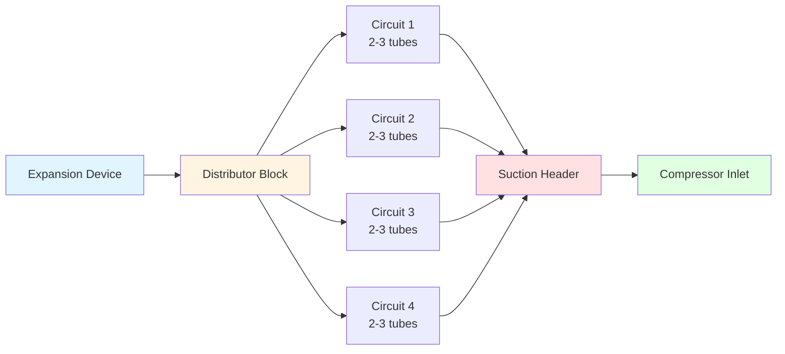
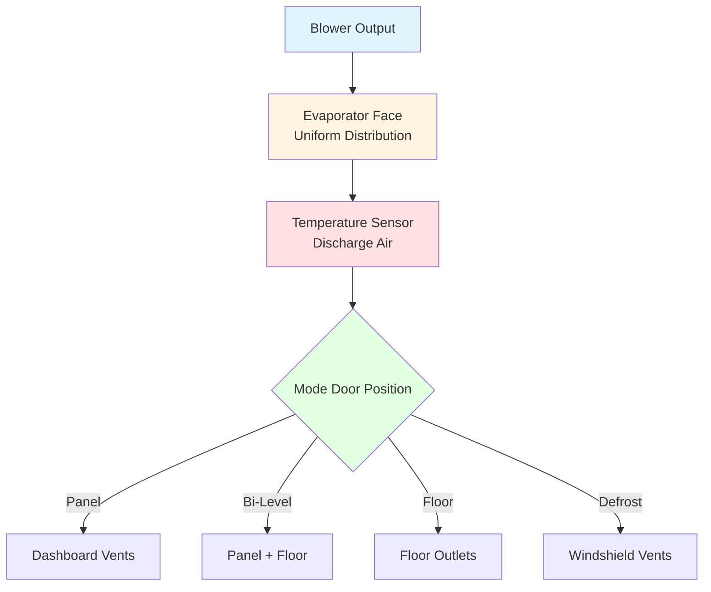

## Evaporator Heat Transfer Fundamentals

The automotive evaporator serves as the primary cooling component in mobile air conditioning systems, absorbing heat from cabin air through refrigerant evaporation. Located within the HVAC module behind the dashboard, the evaporator operates under challenging conditions including vibration, variable refrigerant flow, and cyclic operation.

The heat transfer process involves sensible and latent cooling as cabin air passes through the evaporator core. The total cooling capacity follows:

$$Q_{total} = Q_{sensible} + Q_{latent} = \dot{m}_{air} c_{p,air} (T_{in} - T_{out}) + \dot{m}_{air} \omega (h_{fg})$$

where $\dot{m}_{air}$ is the air mass flow rate (typically 150-400 kg/h), $c_{p,air}$ is the specific heat of air, $T_{in}$ and $T_{out}$ represent inlet and outlet air temperatures, $\omega$ is the moisture removal rate, and $h_{fg}$ is the latent heat of vaporization for water.

## Plate-Fin Evaporator Design

Plate-fin evaporators dominate automotive applications due to their compact geometry and high heat transfer effectiveness. The design consists of parallel refrigerant tubes with thin aluminum fins brazed between them, creating multiple air passages.

### Construction Elements

**Core Geometry:**
- Fin density: 8-14 fins per inch
- Fin thickness: 0.08-0.12 mm aluminum
- Tube spacing: 8-12 mm
- Typical core depth: 50-70 mm
- Face area: 0.15-0.25 m²

The plate-fin configuration maximizes the air-side surface area, which represents the controlling thermal resistance. The overall heat transfer coefficient depends on both air-side and refrigerant-side coefficients:

$$\frac{1}{UA_{overall}} = \frac{1}{\eta_{fin} h_{air} A_{air}} + \frac{t_{wall}}{k_{Al} A_{wall}} + \frac{1}{h_{ref} A_{ref}}$$

where $\eta_{fin}$ is the fin efficiency (typically 0.75-0.85), $h_{air}$ is the air-side convection coefficient (40-80 W/m²·K), $h_{ref}$ is the refrigerant boiling coefficient (800-1500 W/m²·K), and the respective surface areas account for geometry.

### Fin Efficiency Considerations

Fin efficiency decreases with fin length due to temperature gradient along the fin. For rectangular fins:

$$\eta_{fin} = \frac{\tanh(mL)}{mL}$$

where $m = \sqrt{\frac{2h_{air}}{k_{Al} t_{fin}}}$ and $L$ is the fin half-height. Thinner fins increase surface area but reduce efficiency, requiring optimization.

## Tube-Fin Evaporator Configuration

Tube-fin designs employ round or flattened tubes passing through corrugated fins. While less common than plate-fin in modern vehicles, tube-fin evaporators offer advantages in specific applications.

### Comparative Performance

| Parameter | Plate-Fin | Tube-Fin |
|-----------|-----------|----------|
| Air-side pressure drop | 80-120 Pa | 60-90 Pa |
| Refrigerant distribution | Uniform | Requires circuits |
| Weight (typical core) | 1.8-2.5 kg | 2.2-3.0 kg |
| Manufacturing cost | Lower | Higher |
| Vibration resistance | Good | Excellent |
| Fin density capability | 8-14 FPI | 6-10 FPI |

## Refrigerant Flow Distribution

Proper refrigerant distribution across the evaporator tubes ensures uniform cooling and prevents local frosting. Multi-pass designs with distributor tubes create parallel flow paths:

Maldistribution causes capacity loss and can be quantified by the distribution factor:

$$DF = \frac{\dot{m}_{max} - \dot{m}_{min}}{\dot{m}_{avg}}$$

Values below 0.15 indicate acceptable distribution. SAE J2765 provides testing protocols for distribution assessment.

## Condensate Drainage System

Moisture removal from cabin air creates 0.5-2.0 liters per hour of condensate that must drain efficiently to prevent water accumulation, odor, and microbial growth.

### Drainage Design Principles

The evaporator case includes a collection pan sloped at 2-5° toward the drain outlet. The drain tube penetrates the vehicle floor, utilizing gravity and air pressure differential:

$$\Delta P = \rho_{water} g h + \frac{1}{2} \rho_{air} v^2$$

where $h$ is the vertical drop height and $v$ is the vehicle speed creating ram air pressure. Minimum drain tube diameter is 12-15 mm to prevent clogging.

**Critical Design Features:**
- Drain pan slope ≥ 2° minimum
- Tube routing avoids sharp bends
- Exit positioned away from exhaust heat
- P-trap or check valve prevents debris entry
- Drain tube length minimized (< 500 mm typical)

## Microbial Growth Prevention

Condensate and organic debris on evaporator surfaces create conditions conducive to bacterial and fungal colonization, producing musty odors and potential health concerns.

### Growth Mechanism

Microbial proliferation requires three elements: moisture, nutrients (dust, pollen), and moderate temperatures (15-35°C). The evaporator surface provides all three during periods between operation cycles.

**Prevention Strategies:**

1. **Surface Coatings:** Antimicrobial treatments (silver ion, zinc pyrithione) applied to fins inhibit bacterial adhesion. Effectiveness duration: 2-3 years.

2. **Afterblow Operation:** Running the blower for 30-60 seconds after compressor shutdown dries the evaporator surface, removing moisture. This reduces relative humidity below the growth threshold (< 60% RH).

3. **Enhanced Drainage:** Hydrophilic coatings on fins promote water sheeting, preventing droplet retention. Contact angle reduced from 70-80° to 10-15°.

4. **UV Treatment:** Some systems incorporate UV-C LEDs (wavelength 260-280 nm) that sterilize surfaces during vehicle operation.

The moisture evaporation rate during afterblow follows:

$$\frac{dm}{dt} = h_{mass} A (\omega_{surface} - \omega_{air})$$

where $h_{mass}$ is the mass transfer coefficient and $\omega$ represents humidity ratios. Complete surface drying typically requires 1-2 minutes of airflow.

## Cabin Air Distribution Interface

The evaporator core integrates with the HVAC module's air distribution system, requiring optimized flow patterns to minimize pressure drop while ensuring uniform face velocity.

### Airflow Patterns

Face velocity should remain between 2.0-3.5 m/s to balance heat transfer effectiveness against pressure drop. Non-uniform velocity creates:

- **Low velocity zones:** Reduced heat transfer, potential frosting
- **High velocity zones:** Excessive pressure drop, noise generation, reduced dewpoint effectiveness

SAE J2765 specifies thermal performance testing including air-side effectiveness:

$$\varepsilon = \frac{T_{air,in} - T_{air,out}}{T_{air,in} - T_{evap}}$$

Target effectiveness values range from 0.65-0.80 depending on operating conditions.

## Temperature Control and Frost Prevention

Evaporator surface temperature must remain above 0°C to prevent ice formation, which blocks airflow and eliminates cooling capacity. Control methods include:

**Cycling Clutch (Fixed Orifice Tube Systems):**
- Compressor cycles on pressure switch (typically 172 kPa cut-in, 138 kPa cut-out)
- Evaporator temperature fluctuates 1-5°C
- Simple, low cost
- Reduced comfort during cycling

**Evaporator Pressure Regulator (EPR):**
- Maintains minimum evaporator pressure (typically 140-170 kPa for R-134a)
- Continuous compressor operation
- Stable discharge temperature
- Requires variable displacement or externally controlled compressor

The refrigerant saturation temperature at controlled pressure provides the thermal limit:

$$T_{sat} = f(P_{evap})$$

For R-134a, maintaining 170 kPa produces saturation temperature of approximately 2°C, providing safety margin above freezing.

## Performance Optimization

Modern evaporator designs incorporate several advanced features to enhance performance, durability, and occupant comfort while meeting environmental regulations.

**Emerging Technologies:**
- **Microchannel cores:** Tubes with 0.5-1.0 mm hydraulic diameter, reduced refrigerant charge by 40-60%
- **Louvered fins:** Enhanced air-side heat transfer coefficient, 15-25% capacity increase
- **Variable fin density:** Higher density in low-velocity regions for uniform thermal performance
- **Integrated sensors:** Embedded temperature sensors for precise control without added components

These advancements address evolving requirements including electric vehicle thermal management, R-1234yf refrigerant compatibility, and reduced environmental impact per SAE J2765, SAE J639, and SAE J2765 testing standards.
