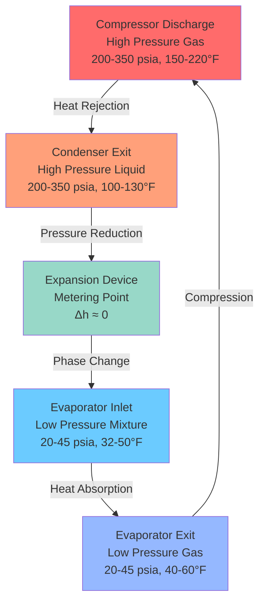
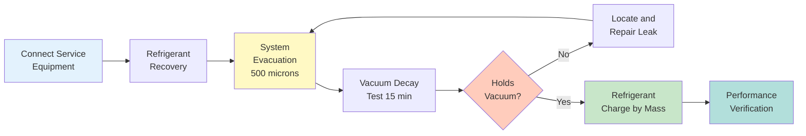

Automotive air conditioning systems operate under unique constraints that differentiate them from stationary HVAC applications. The refrigerant circuit must function across variable engine speeds, ambient temperatures ranging from -40°F to 140°F, and vehicle orientations that create dynamic oil return challenges. Understanding refrigerant properties and system design requirements is essential for proper service and performance optimization.

## Thermodynamic Properties and Selection Criteria

The transition from R-134a (1,1,1,2-tetrafluoroethane) to R-1234yf (2,3,3,3-tetrafluoropropene) represents the automotive industry's response to environmental regulations targeting high Global Warming Potential (GWP) refrigerants. This shift fundamentally alters service procedures while maintaining similar cooling performance.

### Refrigerant Property Comparison

| Property | R-134a | R-1234yf | Significance |
|----------|--------|----------|--------------|
| Molecular Weight | 102.03 g/mol | 114.04 g/mol | Affects pressure drop |
| Critical Temperature | 213.8°F (101°C) | 192.5°F (94.7°C) | Limits high-side performance |
| Critical Pressure | 588.7 psia | 519.2 psia | Design pressure requirement |
| GWP (100-year) | 1,430 | 4 | Environmental impact |
| ODP | 0 | 0 | Ozone safety |
| Flammability | A1 (non-flammable) | A2L (mildly flammable) | Safety classification |
| Saturation Pressure at 77°F | 87.7 psig | 91.5 psig | Similar operating range |

The lower critical temperature of R-1234yf reduces the available temperature differential between condensing and ambient conditions during extreme heat, requiring enhanced condenser design or larger heat exchange surface area to maintain equivalent subcooling.

### Vapor Compression Cycle Analysis

The refrigerant undergoes four fundamental state changes in the mobile AC system. The thermodynamic efficiency depends on the pressure-enthalpy relationship unique to each refrigerant.

The coefficient of performance (COP) for automotive systems typically ranges from 1.5 to 2.5, calculated as:

$$\text{COP}_{\text{cooling}} = \frac{Q_{\text{evap}}}{W_{\text{comp}}} = \frac{h_1 - h_4}{h_2 - h_1}$$

where $h_1$ is evaporator outlet enthalpy, $h_2$ is compressor discharge enthalpy, and $h_4$ is expansion device inlet enthalpy (all in BTU/lbm).

## Refrigerant Charge Requirements

Precise refrigerant charge is critical in automotive systems due to the small total charge quantity and tight tolerances. Undercharge reduces cooling capacity and can cause compressor damage from inadequate lubrication. Overcharge increases high-side pressure and reduces system efficiency.

### Charge Determination Methods

**Mass-Based Charging** (per SAE J2788): The most accurate method measures refrigerant mass directly using calibrated charging equipment. Typical passenger vehicle systems contain:

- **R-134a systems**: 18-32 oz (510-910 grams)
- **R-1234yf systems**: 16-28 oz (450-795 grams)

The reduced charge quantity in R-1234yf systems results from higher vapor density at operating conditions, allowing equivalent refrigerant mass flow with less total inventory.

**Pressure-Temperature Method**: Compares system pressures to saturation curves at ambient temperature. For R-134a at 80°F ambient with engine at 1,500 RPM:

- Low side: 28-32 psig (corresponding to 32-35°F evaporator temperature)
- High side: 180-220 psig (corresponding to 115-135°F condensing temperature)

The superheat at the evaporator outlet should be:

$$\Delta T_{\text{superheat}} = T_{\text{suction line}} - T_{\text{sat}}(P_{\text{low side}})$$

Target superheat: 8-15°F for TXV systems, 5-10°F for orifice tube systems.

### Refrigerant Migration and Oil Transport

Automotive systems face unique oil return challenges due to variable compressor speeds and vehicle orientation. PAG (polyalkylene glycol) oil used with R-134a is hygroscopic and non-compatible with R-1234yf systems, which require POE (polyol ester) oil.

Oil circulation rate (OCR) must remain between 1-3% of refrigerant mass flow:

$$\text{OCR} = \frac{\dot{m}_{\text{oil}}}{\dot{m}_{\text{refrigerant}}} \times 100\%$$

Insufficient oil return causes compressor bearing failure, while excessive oil reduces heat transfer efficiency by coating heat exchanger surfaces.

## System Components and Design

### Expansion Device Selection

**Thermostatic Expansion Valve (TXV)**: Modulates refrigerant flow based on evaporator outlet superheat. The valve opening force balance:

$$F_{\text{bulb}} = F_{\text{spring}} + F_{\text{evaporator}}$$

where bulb pressure creates opening force, spring provides closing force, and evaporator pressure acts on the bottom of the diaphragm.

**Fixed Orifice Tube**: Simple restriction creating pressure drop through flow area reduction. Pressure drop follows:

$$\Delta P = \frac{8\rho v^2}{C_d^2}\left(\frac{1}{A_2^2} - \frac{1}{A_1^2}\right)$$

where $C_d$ is discharge coefficient (typically 0.61-0.64), $A_1$ is upstream area, and $A_2$ is orifice area.

### Compressor Technologies

| Type | Displacement Control | Efficiency | Application |
|------|---------------------|------------|-------------|
| Fixed displacement | Clutch cycling | Moderate | Economy vehicles, R-134a |
| Variable displacement | Swashplate angle | High | Most modern systems |
| Electric scroll | Inverter-driven | Very high | Hybrid/electric vehicles |
| Electric variable | Speed modulation | Very high | Premium applications |

Variable displacement compressors adjust capacity from 2-100% by changing the swashplate angle, eliminating clutch cycling and providing smoother cabin temperature control.

## Service Procedures and Safety

### R-1234yf Service Requirements

SAE J2843 establishes service equipment requirements for R-1234yf due to its A2L flammability classification:

1. **Equipment certification**: Service machines must meet SAE J2843 standards with hydrocarbon sensors
2. **Leak detection sensitivity**: Minimum 0.15 oz/year (4.25 g/year) detection capability
3. **Ventilation**: Adequate airflow to prevent refrigerant accumulation below lower flammability limit (LFL = 6.2% by volume)
4. **Contamination prevention**: Dedicated service equipment prevents cross-contamination with R-134a

### Recovery and Evacuation

Proper evacuation removes non-condensables and moisture that degrade performance. Target vacuum: 29.5 inHg (500 microns) held for 15 minutes minimum.

Moisture content must remain below 10 ppm to prevent:
- Corrosion of aluminum components
- Formation of hydrofluoric acid
- Ice crystal formation at expansion device

## Performance Verification

After service, system performance should be verified under controlled conditions per SAE J2765:

**Test conditions**:
- Ambient temperature: 95°F
- Engine speed: 1,500 RPM
- Blower: Maximum speed
- Recirculation mode

**Acceptance criteria**:
- Center vent temperature: 38-45°F
- Temperature drop: 50-60°F below ambient
- High-side pressure: 200-250 psig
- Low-side pressure: 25-35 psig

The temperature differential across the evaporator indicates heat absorption capacity:

$$Q_{\text{evap}} = \dot{m}_{\text{air}} \times c_p \times (T_{\text{in}} - T_{\text{out}})$$

Typical automotive evaporators transfer 8,000-18,000 BTU/hr at rated conditions, providing rapid cabin cooldown essential for vehicle comfort.

## References

- SAE J2788: AC Refrigerant Recovery Equipment for HFO-1234yf
- SAE J2843: R-1234yf Service Hose Fittings
- SAE J2765: Procedure for Measuring System COP of Mobile Air Conditioning Systems
- SAE J639: Safety Standards for Motor Vehicle Refrigerant Vapor Compression Systems
