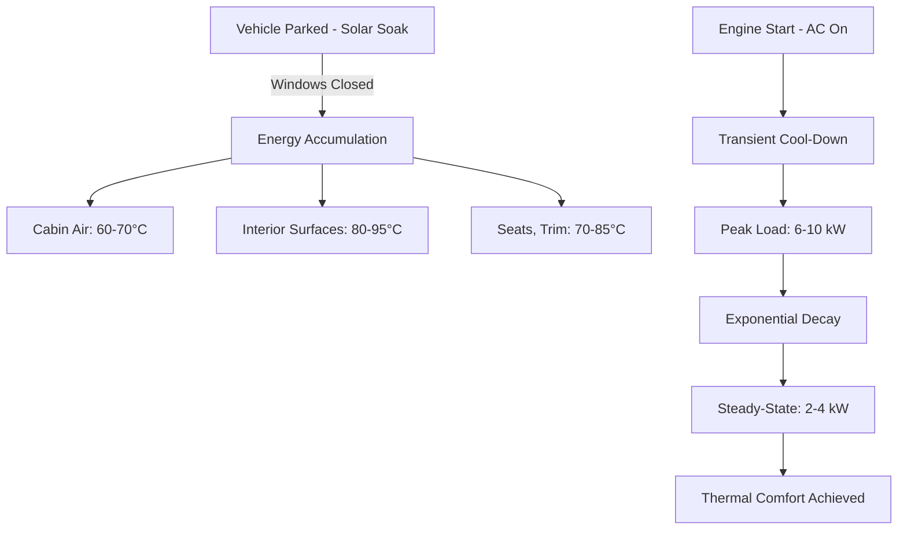

Vehicle cabin thermal loads represent the total heat energy that must be removed by the HVAC system to maintain occupant comfort. Unlike stationary buildings, automotive applications face extreme transient conditions, high solar loads relative to enclosed volume, and rapidly changing boundary conditions during operation.

## Total Cooling Load Calculation

The total instantaneous cooling load for a vehicle cabin is the sum of multiple heat transfer components:

$$Q_{total} = Q_{solar} + Q_{cond} + Q_{occupant} + Q_{equipment} + Q_{ventilation}$$

where all terms are expressed in watts or BTU/hr. This equation applies to both steady-state and transient analysis, though the magnitude and relative contribution of each term varies dramatically with operating conditions.

## Solar Heat Gain

Solar radiation dominates the thermal load profile in vehicles due to the high glass-to-volume ratio. The solar heat gain through glazing is calculated as:

$$Q_{solar} = \sum_{i} A_i \cdot SHGC_i \cdot I_i \cdot \cos(\theta_i)$$

where:
- $A_i$ = area of glazing surface $i$ (m²)
- $SHGC_i$ = solar heat gain coefficient (dimensionless, 0-1)
- $I_i$ = incident solar radiation intensity (W/m²)
- $\theta_i$ = angle of incidence relative to surface normal

The angle of incidence varies continuously with vehicle orientation, time of day, and latitude. Peak solar loads occur when the sun is positioned to directly irradiate large glass areas—typically low-angle sun through the windshield or side glass. SAE J2765 specifies standard solar loading conditions for testing, using 1000 W/m² total irradiance with spectral distribution matching air mass 1.5.

### Glazing Properties

| Glazing Type | SHGC | Visible Transmittance | U-Factor (W/m²·K) |
|--------------|------|----------------------|-------------------|
| Clear glass | 0.76 | 0.88 | 5.8 |
| Tinted | 0.62 | 0.65 | 5.6 |
| IR-reflective | 0.38 | 0.70 | 4.2 |
| Acoustic laminate | 0.55 | 0.75 | 5.2 |

Advanced glazing technologies significantly reduce solar heat gain without proportionally reducing visible light transmission, improving both thermal comfort and cooling load.

## Conduction Heat Transfer

Conduction occurs through all surfaces of the cabin envelope. The heat flux through each surface follows Fourier's law:

$$Q_{cond} = \sum_{i} U_i \cdot A_i \cdot (T_{ambient,i} - T_{cabin})$$

where:
- $U_i$ = overall heat transfer coefficient for surface $i$ (W/m²·K)
- $T_{ambient,i}$ = temperature of adjacent environment (°C)
- $T_{cabin}$ = interior air temperature (°C)

The ambient temperature varies by surface: roof and hood surfaces exposed to direct solar radiation reach temperatures 30-50°C above air temperature due to solar absorption. A dark-colored roof under 1000 W/m² solar load can exceed 80°C when air temperature is 35°C. This creates a substantial conductive load even when interior-exterior air temperature difference is moderate.

Underbody surfaces lose heat to cooler underbody air flow, while door panels and quarter panels experience intermediate conditions. Accurate load calculation requires surface-specific temperature boundary conditions rather than uniform ambient temperature.

## Occupant Heat Generation

Each occupant generates metabolic heat that must be removed by the HVAC system. The heat generation rate depends on activity level:

| Activity | Sensible Heat (W) | Latent Heat (W) | Total (W) |
|----------|-------------------|-----------------|-----------|
| Seated, resting | 60 | 40 | 100 |
| Light office work | 70 | 45 | 115 |
| Driving | 75 | 50 | 125 |

For a fully occupied five-passenger vehicle with driver and four passengers in moderate activity, the total occupant load is approximately 500-625 W. The latent heat component contributes to humidity buildup and must be addressed through adequate ventilation and dehumidification capacity.

## Equipment Heat Loads

Internal equipment generates additional sensible heat:
- **Instrument panel and displays**: 50-150 W depending on screen size and brightness
- **Power electronics**: 20-80 W from charging ports, amplifiers
- **Seat heaters/ventilation fans**: 10-30 W per seat when operating
- **Battery thermal management** (EVs): Can add 200-500 W during rapid charging if battery heat is rejected to cabin loop

## Ventilation Load

Ventilation brings outdoor air into the cabin for air quality and pressurization. The sensible and latent heat associated with this air mass is:

$$Q_{vent,sensible} = \dot{m} \cdot c_p \cdot (T_{outdoor} - T_{cabin})$$

$$Q_{vent,latent} = \dot{m} \cdot h_{fg} \cdot (\omega_{outdoor} - \omega_{cabin})$$

where:
- $\dot{m}$ = mass flow rate of ventilation air (kg/s)
- $c_p$ = specific heat of air (1005 J/kg·K)
- $h_{fg}$ = latent heat of vaporization (2.45 MJ/kg at 25°C)
- $\omega$ = humidity ratio (kg water/kg dry air)

SAE J1826 recommends minimum ventilation rates based on occupancy, typically 7-10 CFM per person.

## Soak Conditions and Transient Analysis

A critical design condition is the **heat soak scenario**: a vehicle parked in direct sunlight with all windows closed. During soak, cabin air temperature can reach 60-70°C while interior surfaces exceed 90°C. The total energy stored in the cabin mass is:

$$E_{stored} = \sum_{i} m_i \cdot c_{p,i} \cdot \Delta T_i$$

This stored energy must be removed during cool-down, creating a transient load far exceeding steady-state requirements. The initial peak load during cool-down can reach 6-10 kW for a mid-size sedan.

The transient cooling process follows an exponential decay as stored energy is removed and surface temperatures approach cabin air temperature. Cool-down time to achieve thermal comfort (cabin air 25°C, surface temperatures <35°C) typically requires 10-20 minutes depending on HVAC capacity and ventilation strategy.

## HVAC System Sizing

Automotive HVAC systems must be sized for the peak transient load, not steady-state conditions. Design guidelines include:

1. **Peak capacity**: 120-150 W per cubic meter of cabin volume
2. **Compressor sizing**: Typically 1.5-2.5 kW cooling capacity for passenger vehicles
3. **Airflow rate**: 300-500 CFM total for adequate air distribution
4. **Temperature pull-down**: Achieve 25°C cabin temperature within 15 minutes from 60°C soak condition per SAE J2765

The ratio of peak transient load to steady-state load is typically 2.5:1 to 3.5:1, necessitating significant oversizing relative to steady-state requirements.

### Load Component Comparison

| Component | Steady-State (W) | Peak Transient (W) | % of Peak Load |
|-----------|------------------|-------------------|----------------|
| Solar | 1200 | 1800 | 25% |
| Conduction | 600 | 1200 | 17% |
| Occupants | 500 | 500 | 7% |
| Equipment | 150 | 150 | 2% |
| Ventilation | 800 | 1200 | 17% |
| Stored energy removal | 0 | 2350 | 32% |
| **Total** | **3250** | **7200** | **100%** |

The stored energy component exists only during transient cool-down and represents the largest single contributor to peak load. This component drives the capacity requirement for compressor, evaporator, and blower sizing.

## Relevant Standards

- **SAE J2765**: Procedure for measuring system cool-down performance
- **SAE J1826**: Air conditioning system performance prediction
- **SAE J2842**: Cabin interior temperature measurement

Accurate thermal load calculation requires detailed knowledge of vehicle geometry, glazing properties, thermal mass distribution, and operating conditions. Computational fluid dynamics (CFD) and thermal network modeling tools enable prediction of both steady-state and transient thermal behavior for system optimization.
