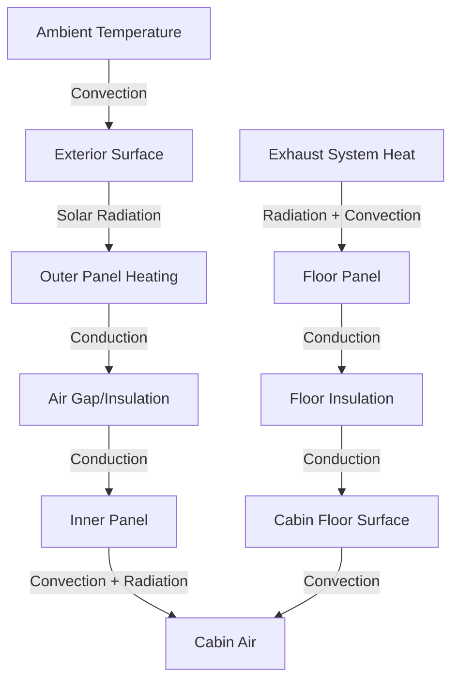

Conduction heat transfer through vehicle body panels represents a significant component of cabin thermal loads, particularly during solar soak conditions and in vehicles with limited insulation. The magnitude of conductive loads depends on exterior surface temperatures, material thermal conductivity, insulation effectiveness, and interior thermal mass.

## Fundamental Heat Conduction Analysis

Steady-state conductive heat transfer through vehicle body assemblies follows Fourier's law:

$$Q_{cond} = \frac{k \cdot A \cdot \Delta T}{L}$$

Where:
- $Q_{cond}$ = conductive heat transfer rate (W)
- $k$ = thermal conductivity of material (W/m·K)
- $A$ = surface area (m²)
- $\Delta T$ = temperature difference across material (K)
- $L$ = material thickness (m)

For multi-layer assemblies typical in automotive construction, the overall heat transfer coefficient accounts for combined thermal resistances:

$$U = \frac{1}{R_{total}} = \frac{1}{\frac{1}{h_o} + \frac{L_1}{k_1} + \frac{L_2}{k_2} + ... + \frac{1}{h_i}}$$

The conduction load through any surface becomes:

$$Q = U \cdot A \cdot (T_{exterior} - T_{interior})$$

## Body Panel Conduction Mechanisms

### Roof and Upper Body Panels

Roof assemblies experience the highest exterior surface temperatures due to direct solar exposure. During peak solar conditions, exterior metal surfaces can reach 70-80°C (158-176°F) when ambient temperature is only 35°C (95°F). The temperature difference drives substantial heat flux through the roof structure.

SAE J2765 specifies test conditions for thermal evaluation including solar intensity of 1000 W/m² and procedures for measuring surface temperatures. Without adequate insulation, roof conduction can contribute 400-800 W to cabin heat load in a mid-size sedan.

Modern headliners incorporate foam-backed textile materials providing thermal resistance of R = 0.15-0.25 m²·K/W. This insulation reduces heat flux by 60-75% compared to bare metal construction.

### Firewall Heat Transfer

The firewall separates the engine compartment from the passenger cabin and experiences elevated temperatures from engine heat and exhaust manifold radiation. Firewall surface temperatures on the engine side commonly reach 80-120°C (176-248°F) during highway operation.

Effective firewall insulation uses multi-layer construction:

| Layer | Material | Thickness (mm) | Thermal Conductivity (W/m·K) |
|-------|----------|----------------|------------------------------|
| Outer barrier | Aluminum foil | 0.05 | 237 |
| Primary insulation | Fiberglass mat | 12-20 | 0.04 |
| Inner barrier | Polymer film | 0.5 | 0.25 |
| Trim panel | ABS plastic | 2-3 | 0.18 |

This construction achieves overall U-values of 0.8-1.2 W/m²·K, limiting firewall heat gain to 150-300 W depending on vehicle size and engine compartment temperatures.

### Floor Panel Conduction

Floor panels receive heat from three primary sources:

1. **Exhaust system radiation** - Catalytic converters and exhaust pipes operating at 400-800°C radiate significant thermal energy to floor pan
2. **Road surface reflection** - Hot pavement reflects solar and thermal radiation upward
3. **Ambient convection** - Hot air beneath vehicle transfers heat to floor structure

Underbody heat shields constructed from stamped aluminum with air gaps provide the first line of thermal defense. These shields reduce radiant heat transfer by 70-85% but do not eliminate conduction through mounting points and structural connections.

Floor insulation materials include:

- **Jute/cotton composite pads** - R = 0.10-0.15 m²·K/W, cost-effective, absorbs moisture
- **Polyurethane foam** - R = 0.20-0.30 m²·K/W, moisture-resistant, higher cost
- **Aerogel composites** - R = 0.40-0.60 m²·K/W, premium applications, excellent performance in thin sections

### Door and Side Panel Conduction

Door assemblies typically include an air gap between outer and inner panels, providing natural thermal resistance. However, structural reinforcements and window mechanisms create thermal bridges that bypass this insulation.

Door trim panels add minimal thermal resistance (R = 0.05-0.08 m²·K/W) but contribute significantly to interior thermal mass.

## Thermal Mass Effects

Interior components store thermal energy during heat-up and release it during cool-down, creating transient behavior that differs substantially from steady-state analysis. The thermal capacitance of interior materials is:

$$C_{thermal} = m \cdot c_p$$

Where $m$ = mass (kg) and $c_p$ = specific heat (J/kg·K).

The time constant for thermal response becomes:

$$\tau = \frac{C_{thermal}}{U \cdot A}$$

This relationship explains why vehicles with heavy interior trim (leather seats, thick door panels, extensive sound deadening) require longer cool-down periods after solar soak.

### Parked Vehicle Soak Conditions

During solar soak with all windows closed, cabin air temperature can reach 60-75°C (140-167°F) when ambient is 35°C (95°F). Interior surface temperatures follow different equilibrium points:

| Surface | Typical Soak Temperature |
|---------|-------------------------|
| Dashboard (upper surface) | 90-100°C (194-212°F) |
| Steering wheel | 60-70°C (140-158°F) |
| Seat surfaces (cloth) | 50-60°C (122-140°F) |
| Seat surfaces (leather) | 55-65°C (131-149°F) |
| Floor carpet | 45-55°C (113-131°F) |
| Door trim panels | 50-60°C (122-140°F) |

These elevated surface temperatures create a substantial thermal mass that continues conducting heat to cabin air even after HVAC system activation. The stored energy in interior components can total 5-10 MJ in a mid-size vehicle, requiring 10-15 minutes of maximum cooling capacity to reduce cabin temperature to comfortable levels.

### Moving Vehicle Conditions

Vehicle motion fundamentally changes conductive heat transfer characteristics:

- **Increased exterior convection coefficient** - Airflow over body panels increases $h_o$ from 5-10 W/m²·K (stationary) to 25-50 W/m²·K (highway speed)
- **Reduced exterior surface temperatures** - Enhanced convective cooling lowers panel temperatures by 10-20°C
- **Underbody ventilation** - Air movement beneath vehicle reduces floor panel temperatures
- **Exhaust system heat distribution** - Exhaust gas velocity distributes heat over longer pipe length, reducing localized heating

These factors reduce conduction loads by 30-50% at highway speeds compared to stationary operation at identical ambient conditions.

## Design Strategies for Conduction Load Reduction

**Material selection** focuses on minimizing thermal conductivity while maintaining structural requirements and cost constraints. Advanced composites and plastic body panels offer thermal performance advantages but present manufacturing and repair challenges.

**Insulation placement** prioritizes areas with highest temperature differentials and largest surface areas. Cost-benefit analysis typically shows greatest return on investment for roof and firewall insulation.

**Thermal breaks** interrupt conductive paths through structural elements. Plastic mounting clips and isolators reduce thermal bridging through mechanical attachments.

**Reflective barriers** applied to interior surfaces of body panels reduce radiative coupling between hot exterior metal and cabin surfaces, particularly effective in roof assemblies.

**Ventilation strategies** including parked vehicle ventilation systems use solar-powered fans or battery power to exhaust hot cabin air during soak conditions, limiting temperature rise and subsequent conduction loads during cool-down.
