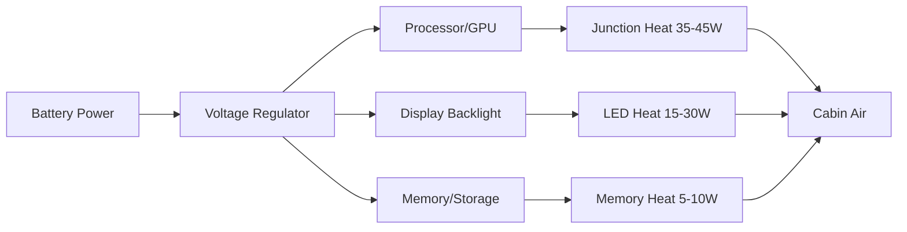
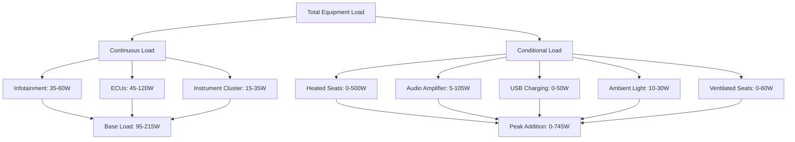

## Overview

Equipment heat loads represent an increasingly significant thermal challenge in modern vehicles. As electronic content proliferates—infotainment systems, advanced driver assistance systems (ADAS), heated/ventilated seats, and ambient lighting—the internal heat generation within the cabin has risen from approximately 100-150 W in vehicles from the 2000s to 300-600 W in contemporary luxury vehicles. This internal equipment load directly impacts HVAC sizing, energy consumption, and occupant thermal comfort.

## Heat Generation Mechanisms

Electronic equipment converts electrical energy to heat through resistive dissipation, semiconductor junction losses, and mechanical friction. The fundamental relationship governing equipment heat generation is:

$$Q_{equip} = P_{input} \times (1 - \eta)$$

where:
- $Q_{equip}$ = heat dissipated to cabin (W)
- $P_{input}$ = electrical power input (W)
- $\eta$ = conversion efficiency (fraction converted to useful work)

For most automotive electronics, efficiency ranges from 0.60 to 0.85, meaning 15-40% of input power becomes heat.

## Major Equipment Heat Sources

### Infotainment System and Displays

Modern infotainment head units contain processors, graphics chips, memory, and power supplies that dissipate 20-60 W depending on screen size and processing load. Display panels add thermal load through backlight power consumption:

$$Q_{display} = A_{screen} \times L_{brightness} \times (1/\eta_{LED})$$

Typical values:
- 10-inch display: 15-25 W
- 12-inch display: 25-40 W
- 17-inch display (luxury vehicles): 40-70 W

LED backlights operate at 25-35% efficiency, with remainder converted to heat at the panel edge and diffuser assembly.

### Audio Amplifiers

Class D amplifiers dominate automotive audio systems due to higher efficiency (75-90%) compared to Class AB designs (50-65%). Heat dissipation correlates with output power:

$$Q_{amp} = \frac{P_{audio,RMS}}{\eta_{amp}} - P_{audio,RMS}$$

For a typical 600 W RMS system with Class D amplifiers at 85% efficiency:

$$Q_{amp} = \frac{600}{0.85} - 600 = 105.9 \text{ W}$$

However, average listening levels utilize only 10-20% of rated power, reducing typical amplifier heat loads to 10-25 W during normal operation.

### Heated Seats

Heated seats represent the largest single equipment load when active. Resistive heating elements embedded in seat cushions and backrests provide direct Joule heating:

$$Q_{seat} = \frac{V^2}{R_{element}} \times N_{seats}$$

| Seat Type | Power per Seat | Duty Cycle | Average Load |
|-----------|----------------|------------|--------------|
| Standard heated seat | 60-100 W | 40-60% | 25-60 W |
| Rapid heating seat | 120-180 W | 60-80% initial, 20-30% maintain | 35-55 W |
| Multi-zone heated seat | 90-140 W | Variable by zone | 30-70 W |

In a five-passenger vehicle with all heated seats active, total load reaches 300-500 W during initial warm-up, then stabilizes at 125-275 W during steady-state operation as thermostatic control reduces duty cycle.

### Ventilated Seats

Seat ventilation systems use small fans (5-15 W each) to draw air through perforated seat surfaces. Unlike heated seats, these add continuous thermal load from motor inefficiency:

$$Q_{vent} = P_{fan} \times N_{seats} = 8 \text{ W} \times 4 = 32 \text{ W (typical)}$$

### USB Charging and Power Outlets

Fast-charging USB-C ports (45-100 W) and 12V outlets contribute heat through voltage conversion losses. Modern DC-DC converters operate at 88-94% efficiency:

$$Q_{USB} = P_{charge} \times (1 - \eta_{converter}) \times N_{ports}$$

For four USB-C ports each delivering 45 W at 90% efficiency:

$$Q_{USB} = 45 \times 0.10 \times 4 = 18 \text{ W}$$

### Instrument Cluster and Driver Information Displays

Digital instrument clusters with 12.3-inch TFT displays dissipate 15-35 W depending on brightness settings and graphics processing load. OLED displays reduce power consumption by 20-30% but concentrate heat in smaller areas.

### Electronic Control Modules

Body control modules, gateway modules, and telematics units maintain continuous operation, each dissipating 3-8 W. In vehicles with 15-25 electronic control units (ECUs) in or near the cabin:

$$Q_{ECU,total} = \sum_{i=1}^{N} P_{ECU,i} \approx 45-120 \text{ W}$$

### Ambient Lighting

LED ambient lighting systems consume 10-30 W depending on the number of zones (8-64 zones in luxury vehicles) and brightness settings. While LEDs are efficient light sources, their drivers and the light absorbed by interior surfaces converts to heat.

## Total Equipment Heat Load Calculation

Total equipment heat gain follows summation of individual component loads:

$$Q_{total,equip} = Q_{display} + Q_{amp} + Q_{seats} + Q_{vent} + Q_{USB} + Q_{cluster} + Q_{ECU} + Q_{lighting}$$

### Load Scenarios

| Scenario | Equipment Active | Total Load (W) |
|----------|------------------|----------------|
| Minimal use | Infotainment, ECUs, cluster | 95-215 |
| Moderate use | Above + audio, 2 heated seats, USB charging | 240-430 |
| Maximum use | All systems active including all heated seats | 450-750 |

## Impact on HVAC System Design

Equipment loads affect HVAC design through three mechanisms:

1. **Direct sensible heat addition** to cabin air requiring increased cooling capacity
2. **Localized hot spots** at seat surfaces, dashboard, and console requiring directed airflow
3. **Temporal variation** causing dynamic load changes as systems activate/deactivate

SAE J2765 recommends incorporating equipment loads into thermal comfort models by treating them as internal heat sources distributed across cabin zones. The standard suggests using 85th percentile usage patterns for HVAC sizing:

$$Q_{design,equip} = Q_{base} + 0.85 \times Q_{conditional}$$

For the moderate-use scenario above:

$$Q_{design,equip} = 155 + 0.85 \times 275 = 389 \text{ W}$$

## Heat Dissipation Pathways

Equipment heat transfers to cabin air through three modes:

1. **Convection to surrounding air** (60-75% of total)
2. **Conduction to mounting structures** then convection (15-25%)
3. **Radiation to interior surfaces** (10-15%)

The convective heat transfer coefficient for naturally ventilated electronics in cabin environments ranges from 5-12 W/m²·K. Forced convection from HVAC airflow increases this to 15-35 W/m²·K, substantially improving heat dissipation from hot components.

## Thermal Management Strategies

Designers employ several approaches to manage equipment heat:

- **Distributed placement** prevents localized hot zones
- **Ducted cooling** directs HVAC air to high-power modules
- **Thermal interface materials** improve conduction to vehicle structure
- **Duty cycle management** limits peak power during extreme conditions
- **Power budgeting algorithms** that reduce non-critical loads when HVAC capacity is constrained

## Standards and References

- **SAE J2765**: Procedure for measuring system COP of mobile air conditioning systems on a test bench
- **SAE J2234**: Equivalent temperature test procedure for климатthermal comfort evaluation
- **SAE J2719**: Information report on HVAC air quality

Modern HVAC control systems increasingly incorporate equipment load sensors and usage prediction to optimize compressor operation and airflow distribution, reducing energy consumption while maintaining thermal comfort despite rising electronic content.
