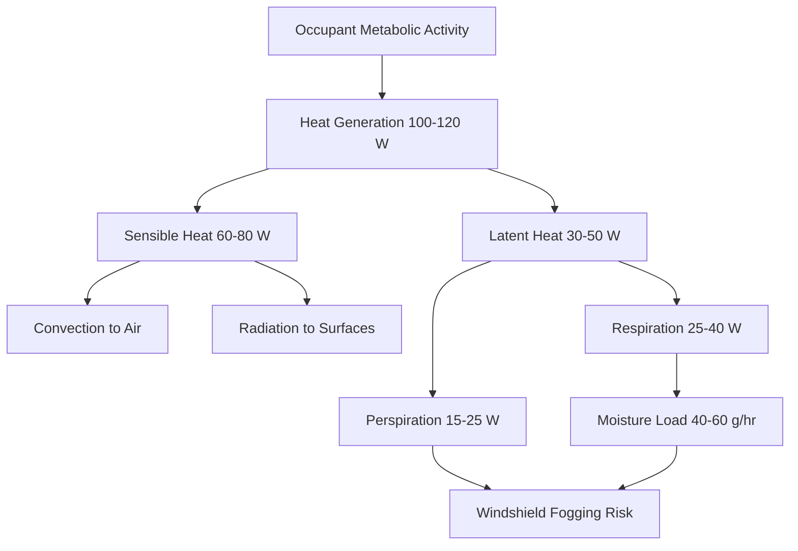
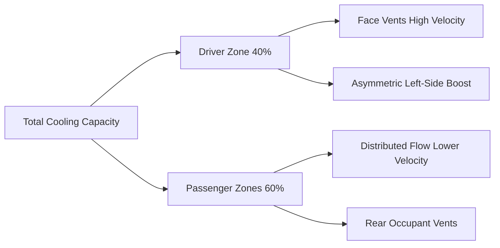

## Overview

Occupant thermal loads represent one of the most variable and significant components of automotive HVAC system design. Unlike building applications where occupant density remains relatively constant, vehicles experience dramatic variations in passenger count, activity level, and spatial distribution. Understanding the physics of human heat transfer enables accurate load calculations and optimal system sizing.

## Metabolic Heat Generation

The human body functions as a continuous heat source, converting chemical energy from metabolism into thermal energy. For automotive applications, metabolic rates are significantly lower than building occupants due to the sedentary nature of driving and riding.

### Fundamental Heat Generation

Total metabolic heat production follows the relationship:

$$Q_{met} = M \times A_{DuBois}$$

where:
- $Q_{met}$ = total metabolic heat (W)
- $M$ = metabolic rate per unit area (W/m²)
- $A_{DuBois}$ = body surface area (m²)

For seated vehicle occupants, SAE J2765 specifies typical metabolic rates of 58 W/m² for adults at rest, corresponding to approximately 100-120 W total heat output per person. This metabolic heat divides into sensible and latent components.

### Sensible and Latent Heat Components

The metabolic heat splits between sensible (temperature-driven) and latent (moisture-driven) components based on thermal conditions and activity level:

$$Q_{met} = Q_{sensible} + Q_{latent}$$

For automotive occupants, the sensible heat ratio (SHR) typically ranges from 0.60 to 0.75 depending on cabin temperature and humidity:

| Cabin Condition | Sensible Heat (W) | Latent Heat (W) | SHR |
|----------------|-------------------|-----------------|-----|
| Cool (20°C) | 80 | 30 | 0.73 |
| Moderate (24°C) | 70 | 40 | 0.64 |
| Warm (28°C) | 60 | 50 | 0.55 |

The sensible component transfers through convection and radiation to cabin surfaces and air. The latent component manifests as moisture from respiration and perspiration, requiring dehumidification capacity.

## Moisture Generation from Respiration

Respiratory moisture adds latent load to the cabin environment through water vapor in exhaled breath. The respiration rate directly correlates with metabolic activity and affects windshield fogging potential.

The latent heat from respiration calculates as:

$$Q_{resp} = \dot{m}_{vapor} \times h_{fg}$$

where:
- $\dot{m}_{vapor}$ = moisture generation rate (kg/s)
- $h_{fg}$ = latent heat of vaporization = 2,450 kJ/kg at 20°C

For seated adults, typical moisture generation rates range from 40-60 g/hr per person (11-17 mg/s), contributing approximately 25-40 W of latent load. Children generate proportionally less moisture based on smaller lung capacity and lower metabolic rates.

## Clothing Effects on Heat Transfer

Clothing insulation significantly impacts the rate of sensible heat transfer from occupants to the cabin environment. The thermal resistance of clothing modifies the effective heat transfer coefficient:

$$Q_{sensible} = \frac{T_{skin} - T_{air}}{R_{cl} + \frac{1}{h_{combined}}}$$

where:
- $T_{skin}$ = skin temperature ≈ 33°C
- $T_{air}$ = cabin air temperature (°C)
- $R_{cl}$ = clothing thermal resistance (m²·K/W)
- $h_{combined}$ = combined convection/radiation coefficient ≈ 8-12 W/m²·K

Typical clothing insulation values for automotive scenarios:

| Clothing Ensemble | Insulation (clo) | R-value (m²·K/W) |
|------------------|------------------|------------------|
| Light summer (shorts, t-shirt) | 0.3 | 0.047 |
| Business casual | 0.7 | 0.109 |
| Winter clothing | 1.2 | 0.186 |

Higher clothing insulation reduces sensible heat transfer, potentially increasing latent heat fraction as the body compensates through increased perspiration.

## Passenger Count Variations

Unlike buildings with relatively stable occupancy, vehicles experience frequent variations in passenger count from single-occupant commuting to fully-loaded family trips. This variability creates challenging design scenarios for HVAC systems.

### Load Calculation by Occupancy

Total occupant load scales linearly with passenger count:

$$Q_{total} = n \times (Q_{sensible,avg} + Q_{latent,avg})$$

| Vehicle Type | Max Occupants | Peak Load (W) | Typical Load (W) |
|-------------|---------------|---------------|------------------|
| Compact sedan | 5 | 500-600 | 200-240 (2 pax) |
| SUV/Minivan | 7-8 | 700-960 | 300-360 (3 pax) |
| Passenger van | 12-15 | 1200-1800 | 400-480 (4 pax) |

HVAC systems must handle the maximum occupancy condition during hot weather while avoiding excessive cycling and poor humidity control at partial loads.

## Driver vs Passenger Thermal Differences

The driver position experiences unique thermal conditions compared to passengers due to asymmetric solar loading, proximity to the instrument panel, and higher metabolic rates from active vehicle control.

### Driver-Specific Factors

**Metabolic Rate Differential:** Driver metabolic rates average 10-15% higher than passengers due to:
- Mental workload and stress response
- Muscle tension during steering and pedal operation
- Alertness requirements increasing base metabolism

**Asymmetric Solar Exposure:** The driver receives disproportionate solar radiation through the left-side window (in left-hand-drive vehicles), creating localized thermal discomfort even when cabin average temperature remains acceptable.

**Localized Heat Sources:** Proximity to:
- Instrument panel (30-50°C surface temperatures)
- Steering wheel (potentially 60°C+ in sun-soaked conditions)
- Center console electronics

### Load Distribution Strategy

Effective HVAC design accounts for driver-passenger differences through:

Zone-based temperature control systems allocate 35-45% of total airflow to the driver position despite representing only 20-25% of occupied space, compensating for elevated thermal stress.

## Design Implications

Accurate occupant load estimation affects multiple HVAC design parameters:

1. **Cooling Capacity Sizing:** Must accommodate maximum occupancy plus 20% safety factor
2. **Dehumidification Capacity:** Latent load at full occupancy determines evaporator coil selection
3. **Airflow Distribution:** Passenger positions require targeted delivery to manage local thermal plumes
4. **Transient Response:** High occupant-to-cabin volume ratio demands rapid HVAC response to load changes

SAE J2765 provides standardized test procedures for evaluating HVAC performance under controlled occupant loading conditions, using thermal manikins that simulate both sensible and latent heat generation.

The fundamental challenge in automotive occupant load management stems from the high thermal mass ratio of passengers relative to cabin volume. A fully-loaded sedan may have occupants representing 400-500 kg of thermal mass generating 500+ W continuous heat in a 3-4 m³ cabin volume, creating thermal time constants measured in minutes rather than hours typical of building applications.
