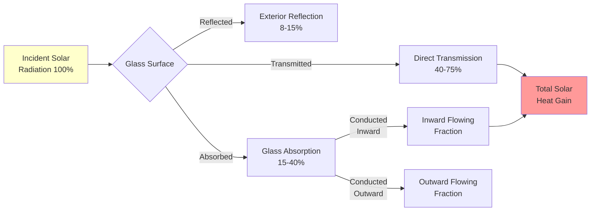
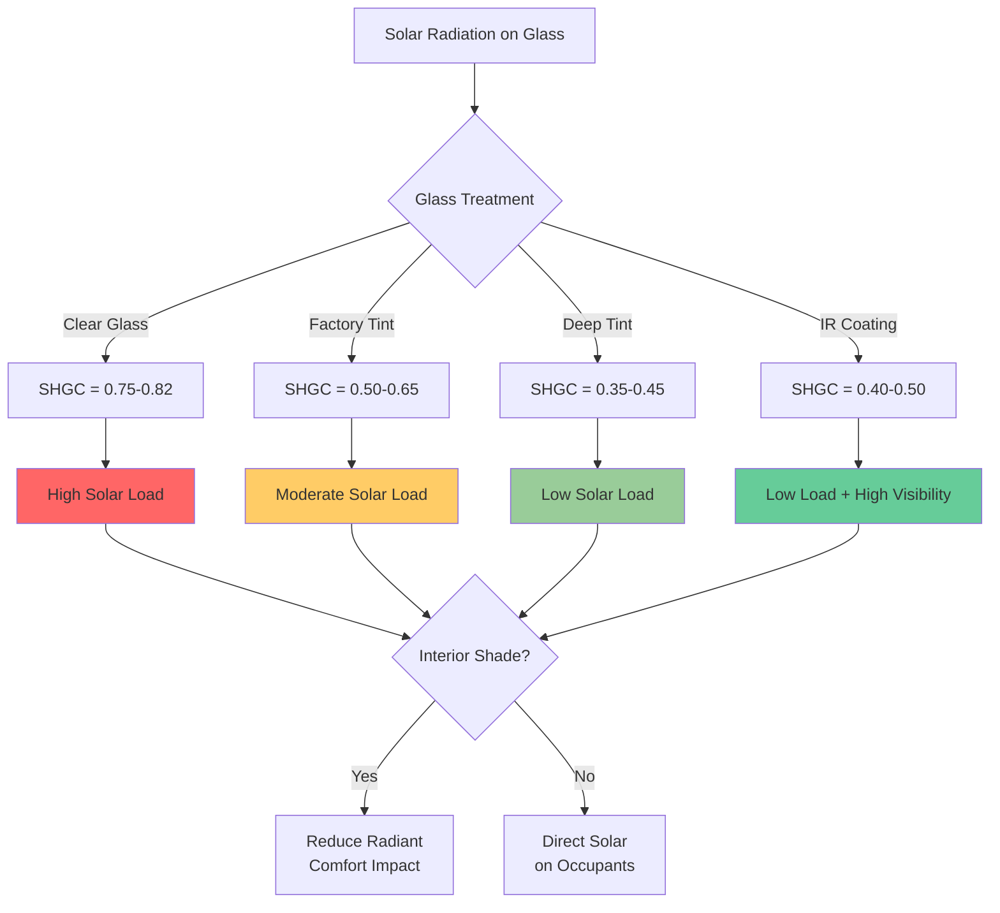

Solar radiation constitutes the largest single thermal load on vehicle cabins during peak summer conditions, often exceeding 1000 W for compact cars and reaching 2000+ W for SUVs and vehicles with large glass areas. Understanding the physics of solar transmission through automotive glazing is essential for accurate HVAC system sizing and thermal comfort prediction.

## Fundamentals of Solar Heat Gain

Solar radiation incident on vehicle glazing consists of three components: direct beam radiation, diffuse sky radiation, and ground-reflected radiation. The total solar heat gain entering the cabin depends on the solar heat gain coefficient (SHGC), glass area, incident angle, and solar intensity.

The fundamental equation for solar load through glazing:

$$Q_{solar} = A_{glass} \cdot I_{total} \cdot SHGC \cdot \cos(\theta)$$

where $A_{glass}$ is the effective glass area (m²), $I_{total}$ is the total incident solar radiation (W/m²), SHGC is the dimensionless solar heat gain coefficient, and $\theta$ is the incident angle from normal.

SAE J2765 specifies standard test conditions at 1000 W/m² total solar intensity (850 W/m² direct + 150 W/m² diffuse) at solar noon, representing worst-case summer conditions in temperate climates.

## Glass Transmission Characteristics

Automotive glazing exhibits fundamentally different transmission properties than architectural glass due to safety requirements, curvature, and manufacturing processes.

### Windshield Properties

Windshields use laminated glass construction: two layers of annealed glass bonded with a polyvinyl butyral (PVB) interlayer. This configuration provides:

- **Solar transmittance**: 0.70-0.78 for clear glass (70-78% of incident solar energy passes through)
- **SHGC**: 0.74-0.82 for standard clear laminated glass
- **UV blocking**: PVB interlayer blocks >95% of UV radiation (<400 nm)
- **IR transmission**: High transmission in near-infrared (700-2500 nm) where 50% of solar energy resides

The windshield typically maintains a higher SHGC than side glass because laminated construction requirements limit coating options.

### Side and Rear Glass Characteristics

Side and rear windows use tempered monolithic glass, enabling different coating strategies:

- **Solar transmittance**: 0.25-0.75 depending on tint level
- **SHGC**: 0.30-0.70 (lower values indicate better solar rejection)
- **Tempering process**: Allows uniform tinting throughout glass thickness

Deep tint side glass can reduce SHGC to 0.35-0.45, cutting solar heat gain by 40-50% compared to clear glass.

## Glass Type Comparison

| Glass Type | Visible Transmittance | Solar Transmittance | SHGC | Typical Application |
|------------|----------------------|---------------------|------|---------------------|
| Clear Laminated | 0.85-0.90 | 0.75-0.78 | 0.78-0.82 | Standard windshield |
| Solar Control Laminated | 0.70-0.80 | 0.45-0.55 | 0.50-0.60 | Premium windshield |
| Clear Tempered | 0.88-0.92 | 0.78-0.82 | 0.75-0.80 | Clear side glass |
| Light Tint Tempered | 0.60-0.75 | 0.50-0.65 | 0.55-0.68 | Factory tint |
| Deep Tint Tempered | 0.20-0.35 | 0.25-0.40 | 0.35-0.50 | Privacy glass |
| IR Reflective Coated | 0.70-0.80 | 0.35-0.50 | 0.40-0.55 | Premium solar control |

## Advanced Coating Technologies

Modern solar control glazing employs thin-film metallic or dielectric coatings that selectively reject infrared radiation while maintaining visible light transmission.

### Spectrally Selective Coatings

These coatings use nanometer-scale layers of silver, indium tin oxide, or other materials to:

1. Transmit visible light (400-700 nm) with minimal attenuation
2. Reflect near-infrared radiation (700-2500 nm) where solar heating occurs
3. Maintain low emissivity to reduce thermal radiation exchange

The selectivity ratio quantifies coating performance:

$$S = \frac{T_{visible}}{SHGC}$$

High-performance coatings achieve selectivity ratios of 1.5-1.8, compared to 1.0-1.1 for conventional tinted glass. This means 70% visible transmittance with SHGC of 0.40-0.45.

### Coating Durability

Automotive coatings must withstand:
- Temperature cycling: -40°C to +100°C glass surface temperatures
- Abrasion resistance: Tempered glass handling and installation
- Chemical resistance: Cleaning agents and environmental exposure
- Humidity: Preventing corrosion of metallic layers

## Sunroof Solar Loads

Sunroofs present unique thermal challenges due to their horizontal orientation and large effective area:

- **Peak incident angle**: Near-normal incidence at solar noon maximizes transmission ($\cos(\theta) \approx 1$)
- **Effective area**: 0.6-1.2 m² for typical panoramic sunroofs
- **Solar load contribution**: 250-600 W at peak conditions with clear glass
- **Occupant proximity**: Direct solar irradiation of head and upper body

Solar control is essential for sunroofs. Options include:

1. **Tinted glass**: SHGC 0.35-0.50, reduces load by 35-50%
2. **Interior shade**: Blocks transmitted radiation but glass still absorbs heat
3. **Ventilated sunroofs**: Exterior shade with air gap vents heat before entering cabin
4. **Electrochromic glass**: Variable tint adjusts SHGC from 0.05-0.40 on demand

## Solar Soaking Conditions

Solar soaking refers to the condition where a parked vehicle absorbs solar radiation with minimal heat rejection, resulting in extreme interior temperatures.

### Heat Soak Physics

During solar soak, the cabin reaches thermal equilibrium when heat gain equals heat loss:

$$Q_{solar} + Q_{conduction} = Q_{convection} + Q_{radiation} + Q_{ventilation}$$

With windows closed, ventilation is minimal, and the cabin can reach 60-80°C (140-176°F) with dashboard surfaces exceeding 90°C (194°F).

Peak soak-out loads occur when the HVAC system must remove:
1. **Stored thermal mass**: Seats, dashboard, door panels, carpeting (5-15 MJ stored energy)
2. **Ongoing solar gain**: Continues during initial cool-down period
3. **Conduction from hot surfaces**: Interior surfaces radiate to cabin air

SAE J2765 specifies a 60-minute solar soak at 1000 W/m² irradiance with 43°C ambient temperature as the standard test condition for maximum cooling capacity testing.

### Mitigating Solar Soak

Effective strategies include:

- **Reflective windshield shades**: Block 85-95% of solar gain through windshield
- **Ventilated parking**: Cracked windows reduce peak temperatures by 10-15°C
- **Low-E coatings**: Reduce infrared radiation exchange between glass and interior
- **Light-colored interiors**: Lower absorption coefficients reduce surface temperatures
- **Remote pre-cooling**: Start HVAC before occupant entry reduces perceived discomfort

## Calculation Methodology

Accurate solar load calculation requires integrating contributions from all glazing surfaces:

$$Q_{total} = \sum_{i=1}^{n} A_i \cdot I_i \cdot SHGC_i \cdot \cos(\theta_i)$$

For each surface $i$, account for:
- Orientation and tilt angle
- Shading from pillars and roof structure
- Time-dependent solar position
- Atmospheric attenuation

ASHRAE Handbook—Fundamentals Chapter 18 provides solar intensity data, while SAE J2765 and J1628 define automotive-specific calculation procedures and standardized conditions.

The total solar load typically ranges:
- **Compact sedan**: 600-1000 W peak
- **Mid-size sedan**: 800-1200 W peak
- **SUV/Minivan**: 1200-1800 W peak
- **Large SUV with sunroof**: 1500-2200 W peak

These values represent 40-60% of the total cooling load at design conditions, making solar control through advanced glazing technologies one of the most effective methods for reducing HVAC system requirements and improving fuel efficiency.
