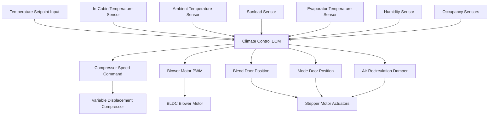

Automatic climate control systems represent the evolution from manual HVAC operation to closed-loop feedback control that maintains occupant thermal comfort with minimal user intervention. These systems integrate temperature sensors, sunload detectors, humidity sensors, and occupancy detection to modulate compressor speed, airflow distribution, and blend door position through electronic control modules (ECMs).

## Evolution from Manual to Automatic Control

### Manual HVAC Systems

Manual automotive climate control requires continuous occupant input through three primary interfaces:

- **Temperature dial**: Controls blend door position ($\theta_{blend}$) from 0° (full cold) to 90° (full heat)
- **Fan speed selector**: Sets blower motor voltage or PWM duty cycle
- **Mode selector**: Directs airflow through panel, floor, defrost, or mixed outlets

The thermal response in manual systems follows open-loop behavior where cabin temperature ($T_{cabin}$) changes according to:

$$\frac{dT_{cabin}}{dt} = \frac{1}{mc_p}\left[\dot{Q}_{HVAC} - \dot{Q}_{loss} - \dot{Q}_{solar}\right]$$

Where $m$ is cabin air mass, $c_p$ is specific heat at constant pressure, $\dot{Q}_{HVAC}$ is heating or cooling power delivered, $\dot{Q}_{loss}$ is heat loss through vehicle envelope, and $\dot{Q}_{solar}$ is solar heat gain.

### Automatic Climate Control Architecture

Automatic systems implement proportional-integral-derivative (PID) or model predictive control (MPC) algorithms to minimize the error between setpoint temperature ($T_{set}$) and measured cabin temperature:

$$e(t) = T_{set} - T_{cabin}(t)$$

The control algorithm adjusts actuator positions continuously:

$$u(t) = K_p e(t) + K_i \int_0^t e(\tau)d\tau + K_d \frac{de(t)}{dt}$$

Where $K_p$, $K_i$, and $K_d$ are proportional, integral, and derivative gains tuned for cabin thermal dynamics.

## Electronic Control Module (ECM) Architecture

The climate control ECM processes inputs from multiple sensors and commands HVAC actuators through a distributed network, typically CAN bus or LIN protocol per SAE J2602 standards.

### Sensor Integration and Measurement

Modern automatic climate control systems utilize the following sensor array:

| Sensor Type | Measurement Range | Accuracy | Response Time | Purpose |
|-------------|-------------------|----------|---------------|---------|
| Cabin Temperature | -40°C to 85°C | ±0.5°C | <5 seconds | Feedback control |
| Ambient Temperature | -40°C to 60°C | ±1.0°C | <10 seconds | Compensation |
| Sunload (IR) | 0-1200 W/m² | ±50 W/m² | <2 seconds | Solar compensation |
| Evaporator Temperature | -10°C to 40°C | ±0.3°C | <3 seconds | Freeze prevention |
| Relative Humidity | 0-100% RH | ±3% RH | <15 seconds | Defogging control |
| Occupancy (IR/Capacitive) | Binary/Multi-zone | N/A | <1 second | Zone control |

**Sunload Compensation Algorithm**

Solar radiation creates asymmetric heating that cabin temperature sensors cannot detect. The sunload sensor measures incident solar intensity ($I_{solar}$) and azimuth angle. The control algorithm adjusts effective setpoint:

$$T_{set,effective} = T_{set} - K_{sun} \cdot I_{solar} \cdot \cos(\phi)$$

Where $K_{sun}$ is the sunload compensation coefficient (typically 0.01-0.03 °C·m²/W) and $\phi$ is the angle between solar vector and sensor normal.

## Multi-Zone Climate Control

Dual-zone and tri-zone systems provide independent temperature control for driver, passenger, and rear compartments. This requires:

- **Separate temperature sensors** for each zone
- **Independent blend door actuators** to control air temperature per zone
- **Zone-specific airflow distribution** through mode doors
- **Thermal isolation** between zones using foam seals and air curtains

The thermal coupling between zones follows heat transfer through shared surfaces:

$$\dot{Q}_{coupling} = UA(T_{zone1} - T_{zone2})$$

Where $U$ is the overall heat transfer coefficient between zones and $A$ is the shared surface area. Effective multi-zone control requires $\dot{Q}_{coupling}$ to be less than 10% of zone HVAC capacity.

## Predictive Climate Control Algorithms

Advanced systems implement predictive algorithms that anticipate thermal loads based on:

### Route-Based Prediction

Using GPS and navigation data, the ECM predicts future solar loads based on vehicle heading and topography. For a known route with heading angle $\alpha(t)$:

$$\dot{Q}_{solar,predicted}(t+\Delta t) = A_{glass} \cdot I_{solar} \cdot \cos[\theta_{sun} - \alpha(t+\Delta t)]$$

Where $\theta_{sun}$ is solar azimuth angle calculated from date, time, and geographic position per ASHRAE solar position algorithms.

### Occupancy-Based Adaptation

Machine learning algorithms detect occupant thermal preferences by tracking setpoint adjustments over time. The system builds a thermal comfort model:

$$T_{preferred}(t_{day}, T_{ambient}, I_{solar}) = f(historical\ patterns)$$

This enables proactive adjustment before occupants manually intervene, reducing comfort complaints by 30-40% according to SAE J2765 thermal comfort metrics.

## Smart Preconditioning

Electric and plug-in hybrid vehicles implement cabin preconditioning while connected to external power, reducing battery energy consumption during driving. The preconditioning algorithm calculates required energy:

$$E_{precondition} = mc_p(T_{target} - T_{initial}) + \dot{Q}_{loss} \cdot t_{precondition}$$

The ECM schedules compressor or PTC heater operation to reach target temperature at departure time while minimizing grid energy consumption.

## Connected Vehicle Climate Features

Telematics integration enables remote climate control through smartphone applications:

- **Remote start with climate activation**: Initiates HVAC before occupant entry
- **Scheduled preconditioning**: Time-based or GPS geofence triggered
- **Energy usage analytics**: Tracks HVAC energy consumption patterns
- **Predictive maintenance**: Monitors refrigerant pressure, compressor current, blower motor performance

Communication follows SAE J2735 vehicle-to-infrastructure protocols for secure data transmission.

## Control Strategy Comparison

| Control Type | Response Time | Steady-State Error | Energy Efficiency | Complexity |
|--------------|---------------|-------------------|-------------------|------------|
| Manual (Open-Loop) | Immediate | ±5-10°C | Baseline | Low |
| PID (Closed-Loop) | 2-5 minutes | ±1-2°C | +15-20% | Medium |
| Model Predictive Control | 1-3 minutes | ±0.5°C | +25-30% | High |
| AI/ML Adaptive | 30-90 seconds | ±0.3°C | +30-40% | Very High |

## Diagnostic and Calibration

Automatic climate control systems require periodic calibration of:

- **Temperature sensor offset correction**: Verified against reference RTD sensors per SAE J1211
- **Blend door position feedback**: Calibrated using potentiometer or Hall-effect sensor output
- **Sunload sensor alignment**: Verified using reference pyranometer under controlled conditions
- **Control algorithm tuning**: PID gains adjusted for specific vehicle thermal mass and insulation

Diagnostic trouble codes (DTCs) follow SAE J2012 standards for sensor failures, actuator malfunctions, and communication errors.

## System Performance Metrics

Per SAE J2765 thermal comfort standards, automatic climate control performance is evaluated using:

- **Pulldown time**: Time to reach 25°C cabin temperature from 50°C soak (target: <15 minutes)
- **Temperature uniformity**: Maximum temperature variation across measurement points (target: <3°C)
- **Setpoint accuracy**: Steady-state error between setpoint and cabin average (target: ±1°C)
- **Blower noise**: A-weighted sound pressure level at maximum airflow (target: <60 dBA)

The integration of advanced sensors, predictive algorithms, and connectivity transforms automotive HVAC from reactive manual control to proactive thermal comfort management, reducing driver distraction while improving energy efficiency and occupant satisfaction.
