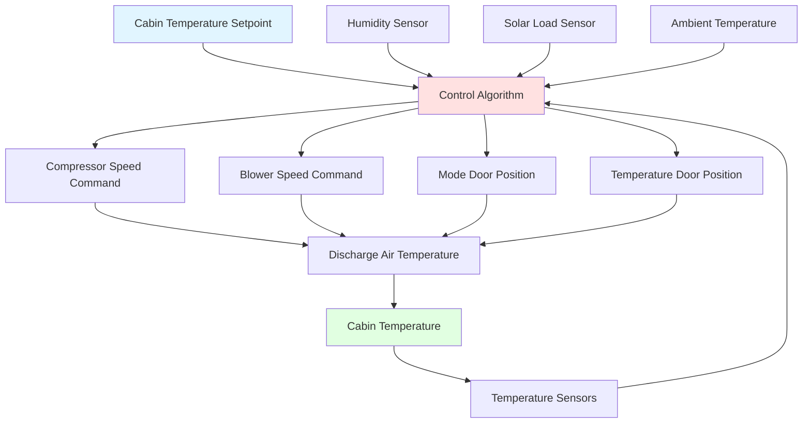
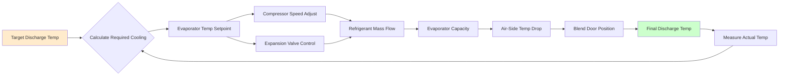
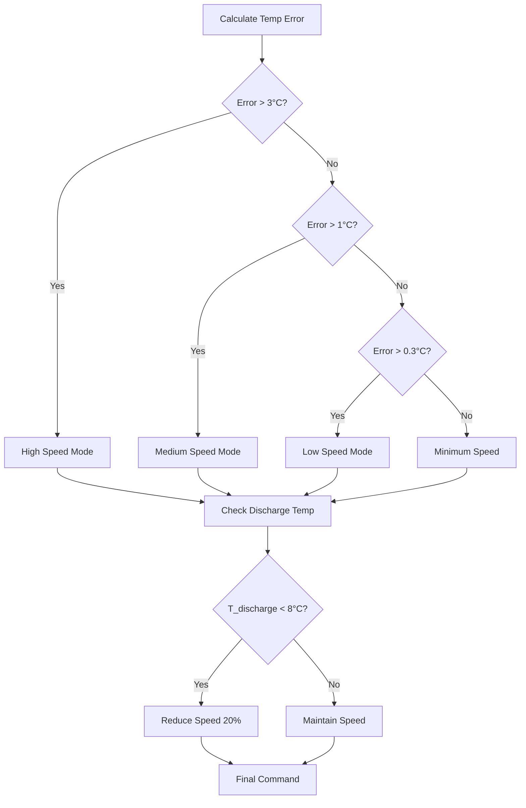

Automatic Temperature Control (ATC) systems represent closed-loop climate management architectures that maintain cabin thermal conditions at user-defined setpoints through continuous feedback, actuator modulation, and predictive compensation. These systems integrate multiple sensor inputs, apply control algorithms, and command variable-capacity HVAC components to minimize thermal error while optimizing energy consumption and occupant comfort.

## Fundamental Control Architecture

ATC systems operate on a multi-input, multi-output (MIMO) control paradigm where the Electronic Climate Control Module (ECCM) processes sensor data and commands actuators to achieve thermal equilibrium between heat gains and HVAC system cooling/heating capacity.

The primary energy balance governing cabin temperature control is:

$$Q_{HVAC} = Q_{solar} + Q_{ambient} + Q_{occupant} + Q_{equipment} + m_{vent}c_p(T_{ambient} - T_{cabin})$$

Where:
- $Q_{HVAC}$ = HVAC system capacity (W)
- $Q_{solar}$ = Solar radiation heat gain (W)
- $Q_{ambient}$ = Conductive/convective heat transfer through cabin envelope (W)
- $Q_{occupant}$ = Metabolic heat generation from occupants (typically 100-120 W per person)
- $Q_{equipment}$ = Heat from electronics and powertrain (W)
- $m_{vent}$ = Ventilation air mass flow rate (kg/s)
- $c_p$ = Specific heat of air (1.006 kJ/kg·K)

## Setpoint-Based Control Strategy

The ATC system establishes thermal targets based on occupant-selected setpoint temperatures (typically 18-32°C range). The control module calculates required discharge air temperature $T_{discharge}$ using:

$$T_{discharge} = T_{setpoint} - K_1(T_{cabin} - T_{setpoint}) - K_2\frac{dT_{cabin}}{dt} - K_3 Q_{solar}$$

Where $K_1$, $K_2$, and $K_3$ are calibrated gain coefficients for proportional, derivative, and solar compensation terms. This equation demonstrates feed-forward compensation (solar term) combined with feedback control (cabin temperature error and rate).

## Temperature Feedback Loop Implementation

The primary feedback mechanism employs multiple temperature sensors with weighted averaging based on occupant proximity and airflow patterns.

### Sensor Configuration and Weighting

| Sensor Location | Typical Weight | Response Time | Measurement Range |
|----------------|---------------|---------------|-------------------|
| Cabin Air (aspirated) | 0.50 | 10-15 seconds | -40°C to +85°C |
| Driver Vent | 0.20 | 5-8 seconds | -40°C to +100°C |
| Passenger Vent | 0.15 | 5-8 seconds | -40°C to +100°C |
| Rear Cabin | 0.15 | 15-20 seconds | -40°C to +85°C |

The effective cabin temperature used for control is:

$$T_{cabin,eff} = \sum_{i=1}^{n} w_i T_i$$

Where $w_i$ represents the weighting factor for each sensor location, with $\sum w_i = 1$.

## Discharge Air Temperature Control

Discharge air temperature regulation represents the inner control loop that executes faster than the cabin temperature loop. The target discharge temperature must satisfy:

$$\dot{m}_{air}c_p(T_{discharge} - T_{cabin}) \geq Q_{load}$$

For cooling mode, typical discharge temperatures range from 2°C to 18°C depending on cooling demand. The ECCM modulates temperature blend doors and evaporator temperature to achieve this target.

### Evaporator Temperature Management

Evaporator surface temperature $T_{evap}$ is controlled to prevent frost formation while maximizing latent cooling. The minimum evaporator temperature is constrained by:

$$T_{evap,min} = T_{dew,air} - \Delta T_{approach}$$

Where $\Delta T_{approach}$ typically equals 2-4°C. Per SAE J2765, evaporator temperature should be maintained above 2°C to prevent ice formation under normal operation.

## Variable Compressor Control

Modern ATC systems employ variable-displacement or variable-speed compressors to provide continuous capacity modulation rather than binary on/off cycling. The compressor capacity requirement is calculated from:

$$\dot{Q}_{evap} = \dot{m}_{ref}(h_{evap,out} - h_{evap,in})$$

The required refrigerant mass flow rate $\dot{m}_{ref}$ is achieved by adjusting compressor displacement (reciprocating) or rotational speed (scroll/electric). This enables:

- Precise capacity matching to thermal load
- Elimination of temperature oscillations from cycling
- Reduced power consumption at part-load conditions
- Improved humidity control through continuous operation

### Compressor Command Calculation

The ECCM determines compressor command using a PI (Proportional-Integral) controller:

$$u_{comp}(t) = K_p e(t) + K_i \int_0^t e(\tau)d\tau$$

Where:
- $u_{comp}$ = Compressor speed or displacement command (%)
- $e(t)$ = $T_{evap,target} - T_{evap,actual}$
- $K_p$ = Proportional gain
- $K_i$ = Integral gain

Typical $K_p$ values range from 5-15 %/°C, while $K_i$ ranges from 0.5-2 %/(°C·s).

## Blower Speed Modulation

Blower speed directly controls air-side mass flow rate, which governs both sensible cooling capacity and cabin air distribution. The relationship between blower voltage and airflow is nonlinear:

$$\dot{V}_{air} = K_{blower}V_{blower}^{1.8}$$

Where $K_{blower}$ is a system-specific constant determined by duct geometry and restriction.

The ECCM commands blower speed based on:

1. **Temperature error magnitude**: Higher error → higher airflow for faster response
2. **Discharge air temperature**: Lower discharge temperature → lower airflow to prevent overcooling sensation
3. **Mode selection**: Defrost requires maximum airflow regardless of temperature error
4. **Acoustic limits**: Speed limited to maintain noise below threshold (typically 50-55 dBA at ear level)

### Blower Speed Algorithm

## Thermal Comfort Algorithms

Advanced ATC systems incorporate Predicted Mean Vote (PMV) models based on ISO 7730 principles, adapted for automotive environments. The thermal comfort index accounts for:

$$PMV = f(T_{air}, T_{radiant}, v_{air}, RH, M_{metabolic}, I_{clothing})$$

For automotive applications, the metabolic rate $M$ is assumed constant (1.0-1.2 met for seated position), and clothing insulation $I_{clothing}$ is estimated seasonally (0.5-1.0 clo).

### Multi-Zone Comfort Optimization

Dual-zone and multi-zone systems maintain independent setpoints for driver and passenger regions. The challenge involves managing thermal coupling between zones while minimizing inter-zone airflow mixing.

The thermal coupling coefficient $\alpha$ between zones is:

$$\frac{dT_{zone1}}{dt} = \frac{Q_{HVAC1} - Q_{load1}}{m_{zone1}c_p} - \alpha(T_{zone1} - T_{zone2})$$

Typical $\alpha$ values range from 0.05-0.15 s⁻¹ depending on cabin geometry and partition effectiveness.

## Performance Metrics and Validation

Per SAE J2765 (Procedure for Measuring System COP of Mobile Air Conditioning Systems), ATC system performance is evaluated using:

| Metric | Target Value | Test Condition |
|--------|-------------|----------------|
| Pull-down time (35°C to 25°C) | < 10 minutes | Ambient 43°C, solar 1000 W/m² |
| Temperature accuracy | ±1.0°C steady-state | After 20 minutes operation |
| Temperature stability | ±0.5°C variation | Over 30-minute period |
| Discharge air temp control | ±2.0°C of target | All operating modes |

The system Coefficient of Performance (COP) should exceed 1.8 under standard cooling conditions (35°C ambient, 50% RH) per SAE J2765 requirements.

## Integration with Vehicle Systems

Modern ATC systems interface with vehicle networks (CAN, LIN, FlexRay) to optimize energy management. Integration includes:

- Engine load management (compressor clutch off during wide-open throttle)
- Battery state monitoring (reduced compressor load for hybrid/electric vehicles)
- GPS-based predictive control (tunnel detection, route-based solar prediction)
- Occupant detection (shutting off unoccupied zones)

This networked approach enables 10-15% energy savings compared to standalone ATC operation through coordinated optimization across vehicle systems.

## Components

- ATC System Operation
- Electronic Climate Control
- Temperature Sensor Cabin
- Temperature Sensor Ambient
- Temperature Sensor Evaporator
- Temperature Sensor Sunload
- Humidity Sensor Cabin
- Control Module HVAC
- PID Control Algorithm
- Fuzzy Logic Control
