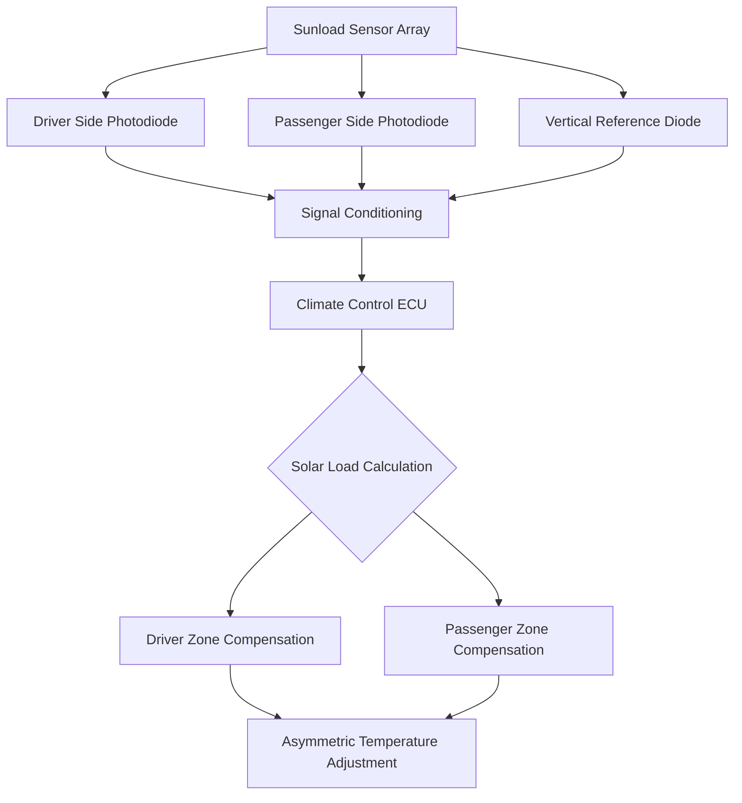
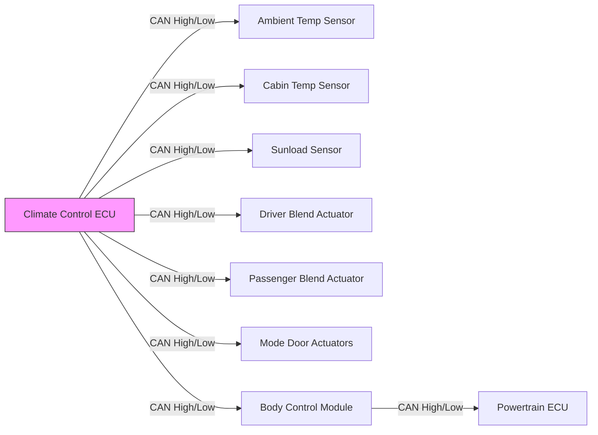

Automatic climate control systems achieve precision thermal regulation through integrated sensor networks and electromechanical actuators that continuously adjust airflow distribution and temperature mixing. The control algorithm processes multiple environmental inputs to maintain cabin comfort while compensating for solar radiation, ambient conditions, and occupant heat loads.

## Temperature Sensing Architecture

### Ambient Temperature Measurement

External air temperature sensing employs negative temperature coefficient (NTC) thermistors positioned in airflow-protected locations to prevent solar radiation bias and road heat contamination. The resistance-temperature relationship follows the Steinhart-Hart equation:

$$\frac{1}{T} = A + B \ln(R) + C (\ln(R))^3$$

where $T$ is absolute temperature (K), $R$ is resistance (Ω), and $A$, $B$, $C$ are calibration coefficients specific to the thermistor material composition.

**Typical NTC thermistor specifications:**

| Parameter | Value | Application Notes |
|-----------|-------|-------------------|
| Resistance at 25°C | 10 kΩ ± 1% | Reference point |
| Beta coefficient (β) | 3950 K | Determines sensitivity |
| Response time | 5-15 seconds | In moving air |
| Operating range | -40°C to 125°C | Automotive grade |
| Self-heating error | <0.1°C | At 1 mA excitation |

The simplified beta parameter equation provides adequate accuracy for automotive applications:

$$R_T = R_{25} \exp\left[\beta \left(\frac{1}{T} - \frac{1}{298.15}\right)\right]$$

### In-Cabin Temperature Sensing

Cabin temperature sensors integrate an aspirating fan that draws air across the thermistor element at approximately 0.5-1.0 m/s to ensure representative sampling and minimize thermal lag. The forced convection establishes a predictable heat transfer coefficient:

$$h = \frac{k \cdot Nu}{L}$$

where $Nu$ (Nusselt number) depends on Reynolds number and airflow geometry. Aspiration eliminates natural convection variations that would introduce measurement uncertainty of ±2-3°C.

The sensor typically mounts near the instrument cluster with perforated housing to prevent direct solar exposure while maintaining rapid response to actual cabin air temperature changes.

## Solar Radiation Detection

### Sunload Sensor Physics

Photodiode-based sunload sensors measure incident solar radiation intensity to compensate for asymmetric thermal loads on the cabin envelope. The photodiode generates current proportional to photon flux:

$$I_{ph} = q \eta A \Phi$$

where $q$ is elementary charge, $\eta$ is quantum efficiency, $A$ is active area, and $Φ$ is photon flux density.

Modern sensors incorporate multiple photodiodes with directional sensitivity to distinguish solar angle and intensity on driver versus passenger sides. The control algorithm applies asymmetric temperature corrections:

$$T_{setpoint,adj} = T_{setpoint} + K_{sun} \cdot I_{solar} \cdot \cos(\theta)$$

where $K_{sun}$ is the sunload compensation gain (typically 0.05-0.15°C per W/m²) and $θ$ is the angle between solar vector and surface normal.

### Humidity Sensing

Capacitive humidity sensors measure relative humidity by detecting dielectric constant changes in a polymer film:

$$C = \epsilon_0 \epsilon_r \frac{A}{d}$$

where $\epsilon_r$ varies with absorbed water vapor. The sensor enables automatic recirculation activation when external humidity exceeds windshield fogging thresholds, typically 70-80% RH at temperatures below 10°C.

## Electromechanical Actuators

### Stepper Motor Blend Door Control

Blend door actuators use permanent magnet stepper motors providing 12-64 microsteps per full step, achieving 0.5-2° angular resolution across the 90° blend door range. The position control operates open-loop without feedback sensors:

$$\theta_{actual} = \theta_{commanded} + \epsilon_{step}$$

where $\epsilon_{step}$ represents accumulated step error, typically <1° over the full range due to mechanical detent forces and friction.

**Stepper motor actuator comparison:**

| Specification | Bipolar Stepper | Unipolar Stepper | Servo Motor |
|--------------|----------------|------------------|-------------|
| Positioning accuracy | ±1° | ±2° | ±0.25° |
| Holding torque | 0.8-1.2 N⋅m | 0.5-0.8 N⋅m | 1.5-2.5 N⋅m |
| Power consumption (hold) | 2-3 W | 1.5-2 W | 0.5 W |
| Cost (relative) | 1.0× | 0.8× | 1.8× |
| Self-calibration | Required | Required | Continuous |
| Response time (90°) | 3-5 s | 4-6 s | 2-3 s |

### Mode Door Actuation

Mode doors direct airflow to defrost, panel, or floor outlets using identical stepper motor technology. The system maintains door position memory through power cycles by detecting mechanical end stops during initialization sequences.

The calibration routine applies constant current while monitoring step counter until stall detection:

$$I_{stall} > I_{nominal} + \Delta I_{threshold}$$

This establishes absolute position reference without dedicated Hall effect sensors or potentiometers.

## CAN Bus Integration

### Network Architecture

Climate control sensors and actuators communicate via Controller Area Network (CAN) bus conforming to SAE J1939 or proprietary protocols at 125-500 kbit/s data rates. The distributed architecture eliminates point-to-point wiring harnesses:

### Message Protocol

Sensor data transmits in periodic frames (50-200 ms intervals) containing identifier, data length code, and payload. The climate ECU implements PID control algorithms processing sensor inputs to generate actuator commands:

$$u(t) = K_p e(t) + K_i \int_0^t e(\tau)d\tau + K_d \frac{de(t)}{dt}$$

where $e(t) = T_{setpoint} - T_{measured}$ represents the thermal error signal.

Diagnostic trouble codes (DTCs) generate when sensor values exceed plausibility ranges (e.g., cabin temperature >70°C or <-40°C) or when actuators fail to reach commanded positions within timeout periods.

## Sensor Fusion Strategy

The climate control algorithm weights multiple temperature inputs to compute effective cabin temperature:

$$T_{effective} = w_1 T_{cabin} + w_2 T_{ambient} + w_3 f(I_{solar}) + w_4 T_{evaporator}$$

where weighting factors $w_i$ sum to unity and adapt based on operating mode (heating, cooling, ventilation). This multi-variable approach achieves ±0.5°C setpoint accuracy despite measurement uncertainties and thermal stratification within the cabin volume.

Advanced systems incorporate predictive algorithms that anticipate thermal loads based on GPS route data, enabling pre-conditioning before significant solar exposure or ambient temperature changes occur during the drive cycle.
