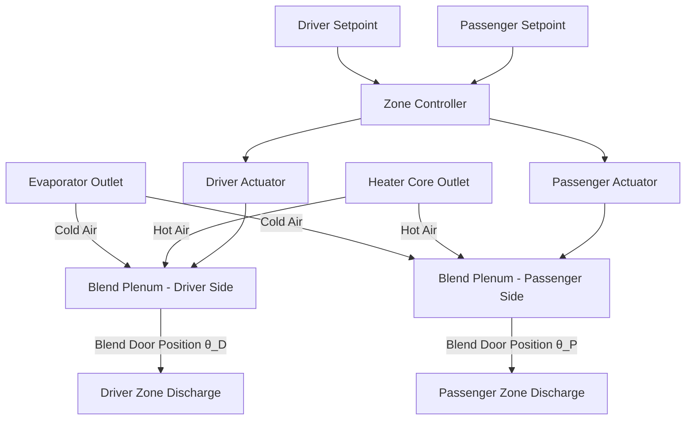
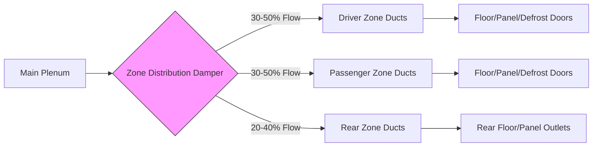
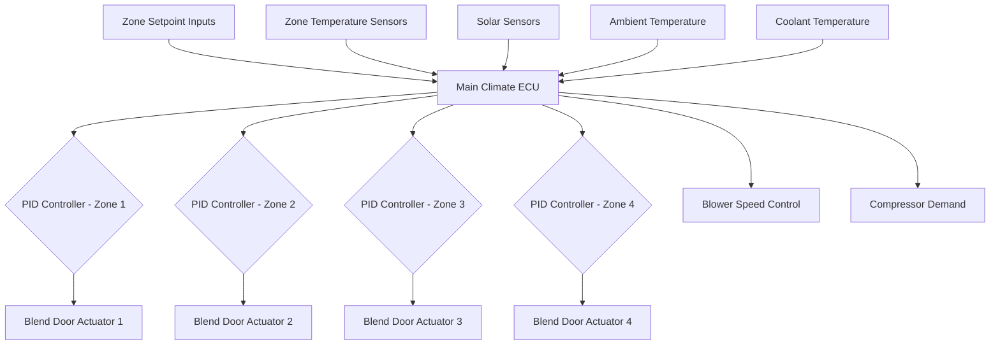

Automotive zone control systems enable independent temperature and airflow management for different cabin regions, addressing the thermal asymmetry inherent in vehicle environments. Advanced multi-zone systems partition the cabin into distinct control volumes, each regulated by dedicated actuators and temperature sensors operating within a centralized control algorithm.

## Thermal Partitioning Fundamentals

Zone control addresses the fundamental challenge that vehicle cabins experience non-uniform solar loading and occupant heat generation. The driver-side receives greater solar radiation in left-hand-drive vehicles traveling eastward in morning conditions, while rear zones experience reduced airflow due to duct pressure drop.

The heat transfer into each zone follows:

$$Q_{zone} = Q_{solar} + Q_{occupant} + Q_{conduction} - Q_{supply}$$

where $Q_{supply}$ must be independently controlled to maintain setpoint temperature despite varying $Q_{solar}$ and $Q_{occupant}$ for each zone.

## Dual-Zone Climate Control Architecture

Dual-zone systems partition the cabin into driver and passenger zones along the vehicle centerline. Each zone requires:

**Control Components:**
- Independent temperature setpoint interface
- Zone-specific discharge air temperature sensor
- Dedicated blend door actuator (or shared actuator with differential positioning)
- Air distribution mode doors (may be shared or independent)

The supply air temperature for each zone is calculated:

$$T_{supply,zone} = T_{setpoint,zone} - \frac{Q_{load,zone}}{\dot{m}_{zone} \cdot c_p}$$

where $\dot{m}_{zone}$ is the mass flow rate to that zone and $c_p$ is the specific heat of air (1.006 kJ/kg·K).

### Blend Door Control Strategy

Most dual-zone systems employ either:

1. **Dual blend door configuration** - Independent blend doors for left/right sides mixing cold evaporator air with hot heater core air
2. **Split-plenum design** - Single blend door with partitioned plenum chamber creating temperature differential

The blend door position $\theta$ controls the ratio of hot to cold air mixing:

$$T_{discharge} = T_{cold} + (T_{hot} - T_{cold}) \cdot \sin(\theta)$$

for a typical rotary blend door, where $\theta$ ranges from 0° (maximum cooling) to 90° (maximum heating).

## Tri-Zone and Quad-Zone Systems

Luxury vehicles implement tri-zone (driver, passenger, rear) or quad-zone (driver, passenger, left-rear, right-rear) control to accommodate rear-seat occupants with independent climate preferences.

### Zone Configuration Comparison

| System Type | Control Zones | Typical Actuators | Airflow Distribution | Sensor Count | Applications |
|------------|---------------|-------------------|---------------------|--------------|--------------|
| Single-Zone | 1 (entire cabin) | 1 blend door | Uniform | 1 cabin temp | Economy vehicles |
| Dual-Zone | 2 (driver/passenger) | 2 blend doors | Left/right split | 2-3 sensors | Mid-range sedans/SUVs |
| Tri-Zone | 3 (front + rear) | 3 blend doors | Front split + rear | 3-4 sensors | Luxury sedans, SUVs |
| Quad-Zone | 4 (all corners) | 4 blend doors | Independent corners | 4-5 sensors | Premium SUVs, executive sedans |

### Rear Zone Control Challenges

Rear zones face additional complexity due to:

**Duct Pressure Drop:** Extended ductwork to rear reduces available static pressure. For a 2-meter duct run:

$$\Delta P = f \cdot \frac{L}{D} \cdot \frac{\rho V^2}{2}$$

where friction factor $f \approx 0.02$ for smooth HVAC ducting. At typical velocities of 8 m/s, pressure drop can exceed 50 Pa, reducing airflow by 15-25% compared to front zones.

**Solution:** Dedicated rear blower motors (common in tri-zone+ systems) or larger duct diameters to maintain $\Delta P < 100$ Pa.

**Thermal Lag:** Rear discharge air travels through longer ducts, experiencing heat gain/loss:

$$Q_{duct} = U \cdot A_{duct} \cdot (T_{ambient} - T_{air})$$

where $U \approx 2-4$ W/m²·K for insulated automotive ducts. This necessitates feed-forward temperature compensation in the control algorithm.

## Zone Actuator Technology

### Blend Door Actuators

Modern zone systems use stepper motor or DC gear motor actuators with position feedback:

- **Stepper motors:** 0.9° to 1.8° step angle, providing 200-400 steps across 90° travel
- **Resolution:** Temperature control precision of ±0.5°C requires actuator resolution better than 2° for typical blend door characteristics
- **Response time:** 5-15 seconds for full stroke (max cooling to max heating)

The relationship between actuator position error and temperature error:

$$\Delta T_{discharge} = \frac{dT}{d\theta} \cdot \Delta \theta$$

where $\frac{dT}{d\theta}$ typically ranges from 0.3-0.8°C per degree of actuator position, depending on evaporator and heater core temperatures.

### Zone Damper Systems

Air distribution between zones uses:

1. **Rotary drum dampers** - Single rotating cylinder with ports directing airflow to different zones
2. **Butterfly dampers** - Multiple hinged doors controlling zone airflow ratios
3. **Proportional dampers** - Modulating dampers allowing continuous airflow adjustment between zones

## Advanced Zone Control Features

### Luxury Vehicle Implementations

Premium multi-zone systems incorporate:

**Solar Radiation Compensation:** Photosensors on dashboard detect asymmetric solar loading. The control algorithm adjusts zone temperatures:

$$T_{setpoint,corrected} = T_{setpoint,user} - K_{solar} \cdot I_{solar}$$

where $K_{solar} \approx 0.02-0.05$ °C/(W/m²) and $I_{solar}$ is measured irradiance (0-1000 W/m²).

**Occupancy Detection:** Infrared or capacitive sensors detect occupied zones, allowing the system to reduce airflow to unoccupied zones, improving efficiency by 10-15%.

**Individual Mode Selection:** High-end quad-zone systems allow each zone to independently select floor, panel, or defrost modes—requiring up to 12 mode door actuators (3 modes × 4 zones).

**Rear Control Panels:** Physical or touchscreen interfaces in rear center consoles or armrests provide direct setpoint adjustment without front-seat intermediary.

## Control Algorithm Architecture

Multi-zone systems employ distributed control:

Each zone operates an independent PID control loop with typical gains:
- Proportional: $K_p = 5-10$ (actuator degrees per °C error)
- Integral: $K_i = 0.5-2$ (addresses steady-state offset)
- Derivative: $K_d = 1-3$ (damping rapid temperature changes)

## Standards and Performance Criteria

SAE J2765 establishes test procedures for multi-zone climate control system evaluation, specifying:

- **Zone temperature deviation:** < 3°C from setpoint under steady-state conditions
- **Cross-zone interference:** < 2°C temperature change in adjacent zone when neighboring zone setpoint changes by 10°C
- **Pull-down performance:** Each zone must achieve setpoint within 15 minutes from 55°C soak temperature
- **Humidity control:** Evaporator operation must maintain < 60% RH in all zones simultaneously

Multi-zone systems represent the convergence of precise thermal control, sophisticated actuation, and intelligent algorithms to overcome the inherently non-uniform thermal environment of automotive cabins.
