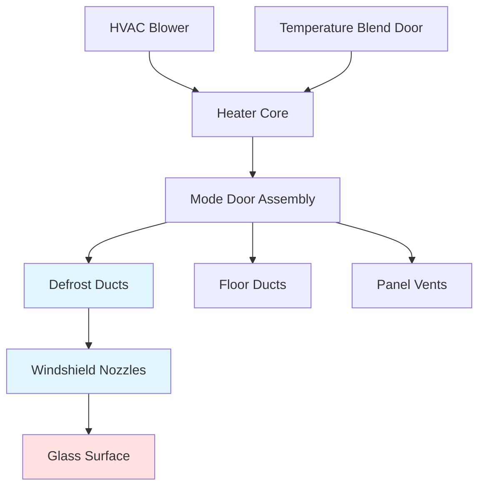
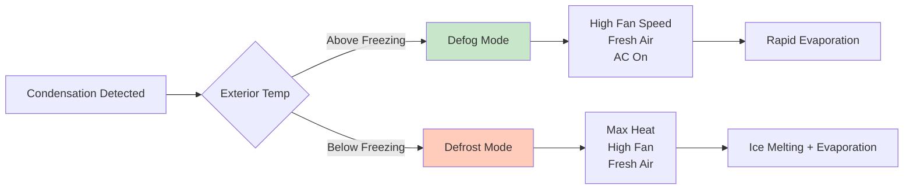

# Automotive Defrost and Defogging Systems

Defrost and defogging systems constitute critical safety elements in automotive HVAC design, directly impacting driver visibility under adverse weather conditions. These systems address two distinct physical phenomena: ice formation on exterior glass surfaces and condensation on interior surfaces, each requiring different thermal and fluid dynamic strategies.

## Physical Principles of Frost and Fog Formation

### Ice Formation Mechanisms

Frost develops on exterior glass surfaces when the surface temperature drops below the dew point of ambient air and subsequently below 32°F (0°C). The heat transfer rate through automotive glass follows:

$$Q = \frac{kA(T_{int} - T_{ext})}{L}$$

Where $Q$ is heat transfer rate (BTU/hr), $k$ is glass thermal conductivity (0.5-0.7 BTU/hr·ft·°F), $A$ is surface area (ft²), and $L$ is glass thickness (typically 0.15-0.25 inches).

Single-pane automotive glass presents minimal thermal resistance, allowing rapid surface temperature equilibration with outdoor conditions. This necessitates substantial heat input to maintain surface temperatures above freezing.

### Condensation Physics

Interior condensation occurs when warm, moisture-laden cabin air contacts cold glass surfaces. The saturation vapor pressure relationship governs this process:

$$P_{sat} = P_{ref} \cdot e^{\frac{L_v}{R_v}(\frac{1}{T_{ref}} - \frac{1}{T})}$$

Where $L_v$ is latent heat of vaporization (2,501 kJ/kg at 0°C), $R_v$ is the gas constant for water vapor (461 J/kg·K), and $T$ is absolute temperature (K).

The critical insight: condensation initiates when local glass surface temperature falls below the cabin air dew point temperature. This typically occurs with high cabin humidity (>60% RH) and exterior temperatures below 40°F.

## Regulatory Framework

### FMVSS 103 Requirements

Federal Motor Vehicle Safety Standard 103 mandates specific defrosting and defogging performance criteria. The standard requires:

- **Defrost zone coverage**: Minimum cleared area on windshield defined by test pattern A (driver's viewing area) and pattern B (passenger viewing area)
- **Time requirements**: 40 minutes maximum to achieve specified visibility through ice-covered windshield at -20°F ambient
- **Defogging performance**: 6 minutes maximum to clear condensation from interior windshield surface

### SAE Standards

SAE J902 defines test procedures for evaluating defrost system performance under controlled laboratory conditions, specifying:

- Ice thickness: 1/32 inch uniform coating
- Ambient temperature: -20°F ± 3°F
- Cabin pre-conditioning requirements
- Measurement methodologies for cleared area

## HVAC-Based Defrost Systems

### Air Distribution Architecture

Defrost mode directs heated air exclusively or primarily to windshield and side window outlets. The system must satisfy competing requirements:

**Thermal delivery**: Sufficient heat flux to melt ice and evaporate condensation
**Air velocity**: Adequate mass flow to sweep moisture away from glass surface
**Distribution uniformity**: Even coverage across entire windshield area

### Heat Transfer Requirements

The required heat input to defrost an ice-covered windshield combines:

$$Q_{total} = Q_{sensible} + Q_{latent} + Q_{transmission}$$

Where:
- $Q_{sensible} = m \cdot c_p \cdot \Delta T$ (heat to raise ice temperature to 32°F)
- $Q_{latent} = m \cdot h_{fg}$ (heat of fusion to melt ice, 144 BTU/lb)
- $Q_{transmission}$ = ongoing heat loss through glass to ambient

For a typical windshield (15 ft²) with 1/32 inch ice layer:

$$m = \rho \cdot V = 57.2 \, \text{lb/ft}^3 \cdot 15 \, \text{ft}^2 \cdot \frac{1}{32 \cdot 12} \, \text{ft} = 0.224 \, \text{lb}$$

$$Q_{latent} = 0.224 \, \text{lb} \cdot 144 \, \text{BTU/lb} = 32.3 \, \text{BTU}$$

### Airflow Distribution Strategy

| Parameter | Defrost Mode | Typical Values |
|-----------|--------------|----------------|
| Discharge Temperature | 130-160°F | Maximum available |
| Volumetric Flow Rate | 150-250 CFM | 60-80% of total capacity |
| Air Velocity at Nozzle | 800-1200 fpm | High momentum for sweeping |
| Nozzle Angle | 30-45° to glass | Optimized for coverage |
| Recirculation Setting | Fresh air | Prevents humidity buildup |

High-velocity discharge creates a turbulent boundary layer at the glass surface, enhancing convective heat transfer coefficient from typical free convection values of 1-2 BTU/hr·ft²·°F to forced convection values of 5-10 BTU/hr·ft²·°F.

## Heated Glass Technologies

### Resistive Heating Elements

Electrically conductive elements embedded in or applied to glass surfaces provide direct surface heating. These systems employ either:

**Fine wire grids**: Tungsten or silver alloy wires (0.001-0.002 inch diameter) laminated between glass layers
**Transparent conductive coatings**: Indium tin oxide (ITO) or silver-based coatings with sheet resistance of 5-15 ohms/square

Power requirements for heated windshields typically range from 500-1500 watts, yielding heat flux of 0.3-0.6 W/cm² across the glass surface.

### Thermal Performance Comparison

| Technology | Defrost Time | Power Consumption | Advantages | Limitations |
|------------|--------------|-------------------|------------|-------------|
| HVAC Air | 15-25 min | 100-150W (blower) | No additional hardware | Slow response, engine-dependent |
| Heated Glass | 3-8 min | 500-1500W | Rapid clearing, uniform | High electrical load, cost |
| Combined System | 2-5 min | 600-1650W | Optimal performance | Complexity, dual power draw |

### Electrical System Impact

The instantaneous power demand from heated glass systems impacts vehicle electrical architecture:

$$I = \frac{P}{V} = \frac{1200 \, \text{W}}{13.5 \, \text{V}} = 88.9 \, \text{A}$$

This substantial current draw (approximately 7.5% of typical 100-150A alternator capacity) requires dedicated relay circuits and appropriately sized conductors (minimum 10 AWG).

## Defogging Strategies

### Moisture Management

Interior defogging addresses condensation through three mechanisms:

**Surface heating**: Raising glass temperature above cabin dew point
**Humidity dilution**: Introducing dry outside air to reduce cabin moisture content
**Forced evaporation**: High-velocity air sweeping condensate from surface

The psychrometric relationship for defogging effectiveness:

$$\omega_{mix} = \frac{\dot{m}_{recirc} \cdot \omega_{cabin} + \dot{m}_{fresh} \cdot \omega_{ambient}}{\dot{m}_{total}}$$

Where $\omega$ represents humidity ratio (lb water/lb dry air). Maximum defogging performance occurs with 100% fresh air mode, minimum cabin humidity ratio.

### Defrost vs. Defog Mode Distinctions

Air conditioning operation during defog mode reduces air humidity through cooling coil condensation, even while reheating air to comfortable discharge temperatures. This dual process (dehumidification + heating) provides the fastest condensation clearing.

## System Integration and Control

Modern vehicles employ automatic climate control logic to optimize defrost/defog performance based on sensor inputs:

- **Interior humidity sensors**: Detect elevated moisture levels triggering defog mode
- **Exterior temperature sensors**: Activate defrost strategies below freezing
- **Solar load sensors**: Anticipate windshield heating from solar radiation
- **Glass temperature sensors**: Directly measure surface conditions

Predictive algorithms can initiate defrost cycles before visible ice formation, maintaining continuous visibility during operation.

## Conclusion

Automotive defrost and defogging systems integrate thermodynamic principles, fluid mechanics, and electrical heating technologies to maintain critical driver visibility. Compliance with FMVSS 103 requirements establishes minimum performance baselines, while advanced heated glass technologies and intelligent control strategies deliver superior real-world performance. The fundamental challenge remains: delivering sufficient thermal energy to glass surfaces while managing cabin comfort and vehicle electrical load constraints.

