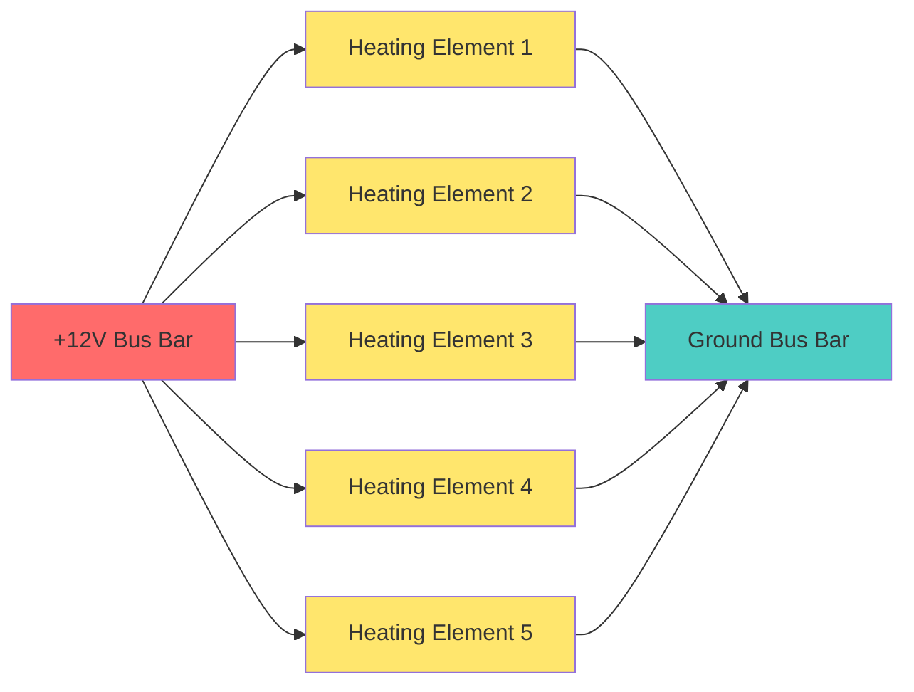
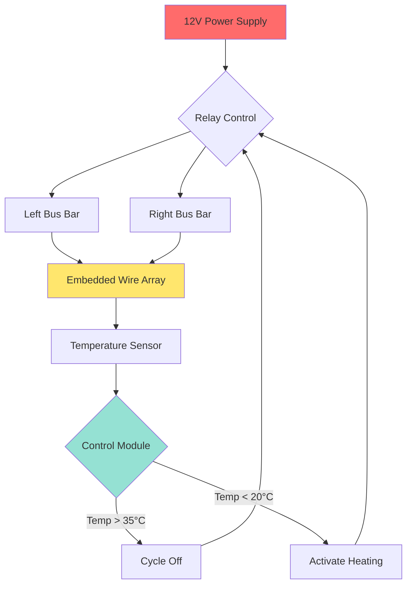
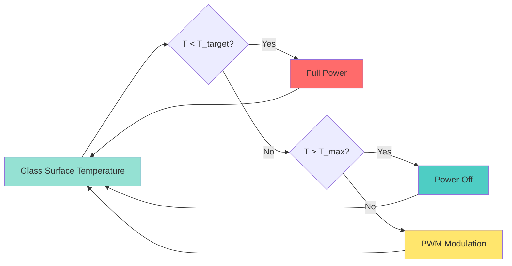

## Physics of Heated Glass Systems

Heated glass systems provide rapid defrost and defogging capability through direct electrical resistance heating of the glass surface. Unlike forced-air defrost systems that rely on convective heat transfer, heated glass systems generate heat directly at the condensation or frost interface, achieving significantly faster clearing times and improved energy efficiency for localized applications.

### Heat Transfer Mechanism

The fundamental heating process follows Joule's first law, where electrical resistance converts current flow into thermal energy:

$$Q = I^2 R t = \frac{V^2}{R} t$$

where:
- $Q$ = heat generated (J)
- $I$ = current (A)
- $R$ = resistance of heating element (Ω)
- $V$ = applied voltage (V)
- $t$ = time (s)

The required heat flux to clear frost or condensation depends on the ice mass and latent heat of fusion:

$$q = \frac{\dot{m}_{ice} \cdot h_{fg}}{A}$$

where $\dot{m}_{ice}$ is the ice sublimation/melting rate (kg/s), $h_{fg}$ is the latent heat of fusion (334 kJ/kg for ice), and $A$ is the heated surface area (m²).

## Rear Window Defroster Grid Design

### Grid Configuration

Rear window defrosters utilize resistive wire grids embedded in or applied to the glass surface. The typical configuration consists of horizontal conductors spanning the window width, connected to vertical bus bars at each edge.

### Wire Spacing and Heat Distribution

Element spacing directly affects clearing performance. Optimal spacing balances coverage against resistance requirements:

| Wire Spacing | Typical Application | Power Density | Clearing Time |
|--------------|---------------------|---------------|---------------|
| 25-30 mm | Standard rear windows | 300-400 W/m² | 3-5 minutes |
| 15-20 mm | High-performance systems | 500-700 W/m² | 1-3 minutes |
| 40-50 mm | Economy applications | 200-300 W/m² | 5-8 minutes |

The temperature distribution between heating elements follows a decaying exponential pattern. Maximum temperature occurs at the wire, with minimum temperature midway between wires:

$$T(y) = T_{wire} + (T_{mid} - T_{wire}) \cdot \cos\left(\frac{\pi y}{s}\right)$$

where $s$ is the wire spacing and $y$ is the distance from the wire centerline.

### Electrical Specifications

Typical rear window defroster grids operate at vehicle battery voltage with the following characteristics:

**Standard Passenger Vehicle:**
- Voltage: 12-14.5 VDC
- Total current: 10-15 A
- Total power: 120-220 W
- Wire resistance: 0.8-1.2 Ω per meter
- Grid resistance: 0.8-1.5 Ω (total)

**Heavy-Duty/Large Vehicles:**
- Voltage: 24-28 VDC
- Total current: 8-12 A
- Total power: 200-340 W
- Grid resistance: 2.0-3.5 Ω (total)

The resistance of each heating element must be precisely controlled during manufacturing to ensure uniform current distribution and prevent hotspots that could stress the glass thermally.

## Heated Windshield Technology

### Conductive Coating Systems

Modern heated windshields employ transparent conductive coatings applied to the inner glass surface. These systems use thin-film technologies to achieve optical transparency while maintaining sufficient electrical conductivity for heating.

**Material Properties:**

| Coating Type | Sheet Resistance | Visible Transmission | Typical Thickness |
|--------------|------------------|----------------------|-------------------|
| Indium Tin Oxide (ITO) | 5-15 Ω/sq | 85-90% | 100-300 nm |
| Fluorine-Doped Tin Oxide (FTO) | 8-20 Ω/sq | 80-85% | 300-500 nm |
| Silver nanowire | 10-30 Ω/sq | 85-92% | 50-200 nm |

Sheet resistance ($R_s$) relates to the coating's volumetric resistivity ($\rho$) and thickness ($t$):

$$R_s = \frac{\rho}{t}$$

Power density for a conductive coating system with applied voltage $V$ across dimension $L$:

$$P = \frac{V^2 \cdot W}{R_s \cdot L}$$

where $W$ is the perpendicular dimension (width).

### Fine Wire Embedded Systems

An alternative heated windshield design embeds extremely fine tungsten wires (20-40 μm diameter) in the laminate interlayer. These wires are spaced 10-15 mm apart vertically across the windshield.

**Wire System Advantages:**
- Higher power density capability (up to 1000 W/m²)
- Faster defrost times (30-90 seconds for full clearing)
- Localized heating zones possible
- Minimal optical distortion

**Design Constraints:**
- Wire visibility in certain lighting conditions
- Higher manufacturing complexity
- Increased laminate thickness (0.1-0.2 mm)

## Wiper Park Heater Systems

### Design Objective

Wiper park heaters prevent ice bonding at the windshield base where wipers rest. This localized heating zone ensures wiper blade release in cold conditions and prevents frozen wiper mechanism damage.

### Configuration

Wiper park heaters typically consist of:

1. **Heating Element:** Resistive wire or printed circuit heater (50-100 W)
2. **Thermal Insulation:** Prevents heat loss to vehicle structure
3. **Temperature Sensor:** Limits maximum surface temperature (typically 60-70°C)
4. **Control Relay:** Activated with rear defroster or independently

The heating element spans the full wiper travel width (typically 800-1200 mm) with concentrated power density at the park position:

$$P_{zone} = \frac{P_{total} \cdot L_{park}}{L_{total}}$$

## Power Requirements and System Design

### Electrical Load Analysis

Heated glass systems represent significant electrical loads on vehicle power systems. Total defrost load for a fully-equipped vehicle:

| System Component | Power Draw | Duty Cycle |
|------------------|------------|------------|
| Rear window defroster | 120-220 W | Continuous (3-10 min) |
| Heated windshield | 400-700 W | Continuous (1-5 min) |
| Wiper park heater | 50-100 W | Continuous (variable) |
| Heated side mirrors | 30-60 W | Continuous (3-10 min) |
| **Total Peak Load** | **600-1080 W** | **50-90 A at 12V** |

### Thermal Management

Surface temperature must be controlled to prevent thermal stress in laminated glass. The maximum safe temperature differential across glass thickness:

$$\Delta T_{max} = \frac{\sigma_{allow} \cdot (1-\nu)}{E \cdot \alpha}$$

where:
- $\sigma_{allow}$ = allowable tensile stress (typically 40-50 MPa for tempered glass)
- $\nu$ = Poisson's ratio (0.22 for soda-lime glass)
- $E$ = Young's modulus (70 GPa for glass)
- $\alpha$ = thermal expansion coefficient (9 × 10⁻⁶ K⁻¹)

For automotive glass, limiting surface temperatures to 60-70°C prevents thermal stress cracking while providing adequate defrost performance.

### Defrost Performance Metrics

Per SAE J953 (Passenger Car Windshield Defrosting Systems), heated windshield systems should clear minimum zones within specified timeframes:

**Clearing Requirements:**
- Zone A (driver critical viewing): 80% cleared in 40 seconds
- Zone B (full forward viewing): 80% cleared in 10 minutes
- Maximum surface temperature: 85°C

Heated windshield systems significantly exceed these requirements, typically achieving Zone A clearing in 30-60 seconds.

## Control Strategies

### Temperature-Based Control

Advanced systems employ closed-loop temperature control to optimize power consumption and prevent overheating:

Pulse-width modulation (PWM) maintains target temperature once initial clearing is achieved, reducing average power consumption by 40-60%.

### Ambient-Based Activation

Intelligent systems activate heated glass based on multiple inputs:

- Exterior temperature < 5°C
- Interior humidity > 70% RH
- Rain sensor detection
- Automatic climate control call

This predictive activation prevents frost formation rather than requiring reactive clearing.

## Comparative Performance

### Heated Glass vs. Forced Air Defrost

| Performance Metric | Heated Glass | Forced Air (HVAC) |
|-------------------|--------------|-------------------|
| Initial clearing time | 1-3 minutes | 5-15 minutes |
| Power consumption | 400-700 W | 800-2000 W (blower + heat) |
| Energy efficiency | High (direct heating) | Moderate (convective losses) |
| Coverage area | Limited to glass surface | Full windshield possible |
| Cold start capability | Immediate | Requires engine warmup |
| Complexity | Low (electrical only) | High (thermal management) |

**Optimal Application:** Heated glass systems excel for rear windows and provide supplemental front windshield defrost, while forced-air systems remain necessary for comprehensive interior dehumidification.

## Design Considerations

### Glass Thermal Stress

The thermal stress induced by non-uniform heating:

$$\sigma = \frac{E \cdot \alpha \cdot \Delta T}{1-\nu}$$

For a 30°C temperature differential (typical during defrost operation):

$$\sigma = \frac{70 \times 10^9 \cdot 9 \times 10^{-6} \cdot 30}{1-0.22} = 24.2 \text{ MPa}$$

This stress level remains well below the 40-50 MPa tensile strength of tempered automotive glass, providing adequate safety margin.

### Electromagnetic Compatibility

Conductive coatings and wire grids can interfere with radio frequency systems. Design mitigation strategies include:

- Gap zones for antenna mounting locations
- RF transparent coating formulations
- Filtered power supply connections to minimize conducted emissions

SAE J551 specifies electromagnetic compatibility requirements for automotive electrical systems, including maximum radiated emissions from heated glass systems.

## Conclusion

Heated glass systems provide rapid, energy-efficient defrost capability through direct resistive heating at the glass surface. The physics-based design of wire grid spacing, conductive coating properties, and power delivery ensures effective ice and fog removal while maintaining glass structural integrity and optical quality. Integration of intelligent controls optimizes performance while minimizing electrical system loads, making heated glass technology essential for modern vehicle visibility and safety systems.
