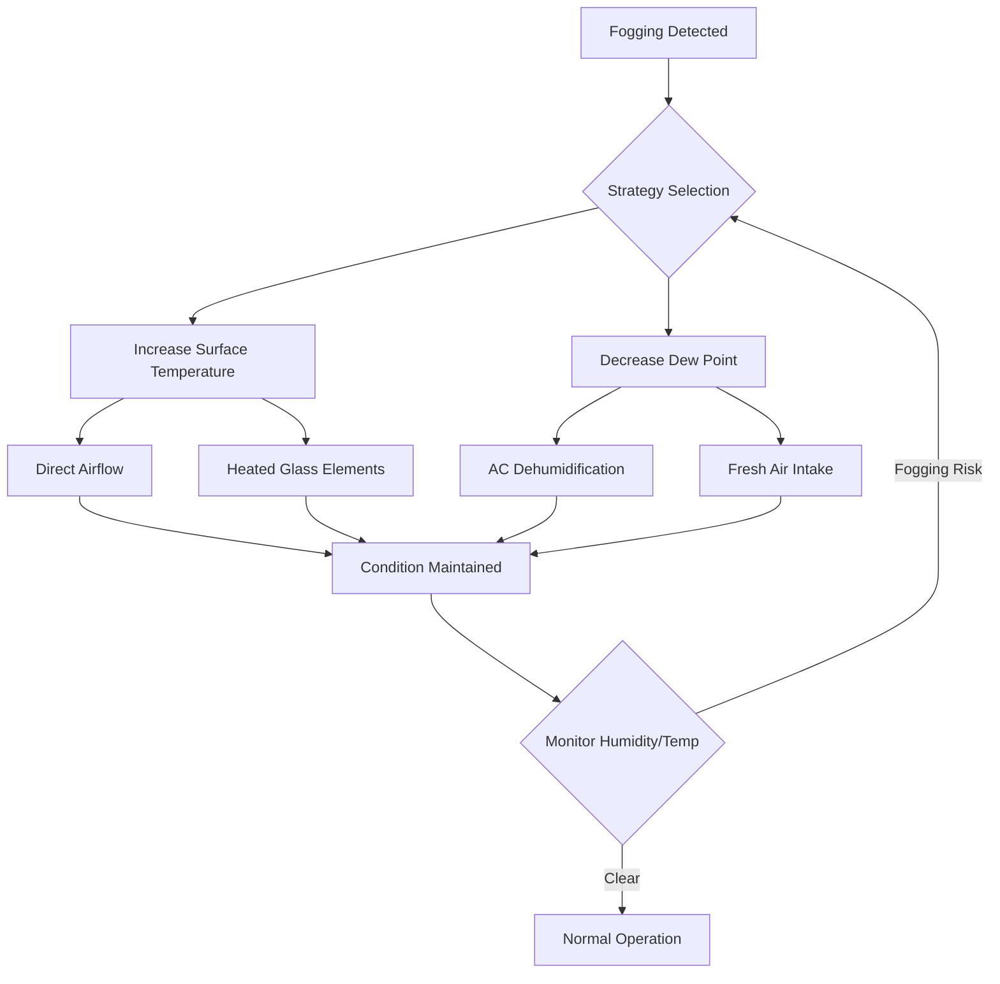
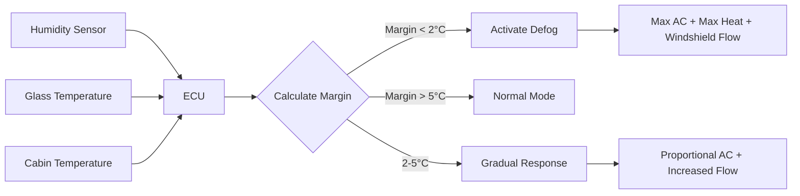

## Overview

Window defogging in automotive applications represents a critical safety function where psychrometric control prevents condensation that obscures driver visibility. Unlike defrosting, which removes ice from exterior surfaces, defogging addresses interior moisture condensation on glass surfaces when the surface temperature falls below the dew point of cabin air.

## Condensation Physics

### Dew Point Fundamentals

Condensation occurs when glass surface temperature $T_s$ drops below the dew point temperature $T_{dp}$ of adjacent air. The relationship is governed by:

$$T_{dp} = T_{db} - \frac{100 - RH}{5}$$

Where:
- $T_{dp}$ = Dew point temperature (°C)
- $T_{db}$ = Dry bulb temperature (°C)
- $RH$ = Relative humidity (%)

This approximation is valid for typical automotive cabin conditions (0-30°C, 30-90% RH).

### Heat Transfer at Glass Surface

The surface temperature depends on heat transfer from both cabin air and outdoor environment:

$$q = \frac{T_{cabin} - T_{outdoor}}{R_{total}}$$

Where:

$$R_{total} = \frac{1}{h_i} + \frac{t}{k} + \frac{1}{h_o}$$

For automotive glass:
- $h_i$ = Interior convection coefficient (5-15 W/m²·K depending on airflow)
- $t$ = Glass thickness (typically 4-5 mm)
- $k$ = Glass thermal conductivity (≈1.0 W/m·K)
- $h_o$ = Exterior convection coefficient (20-100 W/m²·K at highway speeds)

The interior surface temperature is:

$$T_s = T_{cabin} - q \cdot \frac{1}{h_i}$$

## Defogging Strategies

### Strategy 1: Surface Temperature Elevation

**Direct Airflow Method**

Directing heated air at the windshield increases both $T_s$ and $h_i$. SAE J902 specifies minimum airflow rates of 150-200 CFM for windshield defog in passenger vehicles. The convection coefficient increases approximately with:

$$h_i \approx 5.7 + 3.8V$$

Where $V$ is air velocity (m/s) at the glass surface.

**Heated Glass Elements**

Rear windows and side mirrors employ resistive heating grids. Power density typically ranges 0.3-0.5 W/cm² of heated area. For a standard rear window (0.8 m²):

$$P = 0.4 \times 8000 = 3200 \text{ W}$$

Timer circuits limit operation to 10-20 minutes to prevent excessive battery drain.

### Strategy 2: Dew Point Reduction

**AC Evaporator Dehumidification**

The most effective defogging method combines heating with air conditioning. As cabin air passes over the evaporator coil (typically 2-5°C), moisture condenses and drains away. The dehumidification capacity follows:

$$\dot{m}_w = \dot{m}_a (W_1 - W_2)$$

Where:
- $\dot{m}_w$ = Moisture removal rate (kg/s)
- $\dot{m}_a$ = Air mass flow rate (kg/s)
- $W_1, W_2$ = Humidity ratios before/after evaporator (kg water/kg dry air)

For typical defog mode operation:
- Evaporator coil temperature: 3-6°C
- Supply air humidity ratio reduction: 0.004-0.008 kg/kg
- Airflow: 300-500 CFM (0.14-0.24 kg/s)

This yields moisture removal rates of 0.56-1.92 g/s.

**Fresh Air Intake**

In cold weather, outdoor air has lower absolute humidity despite high relative humidity. Introducing fresh air at -5°C and 80% RH (humidity ratio ≈0.002 kg/kg) and heating it to 20°C drops relative humidity to approximately 13%, significantly reducing fogging tendency.

## Automatic Defogging Systems

Modern vehicles employ sensor-based automatic systems compliant with SAE J1503 recommendations.

### Humidity Sensing Technology

**Capacitive Humidity Sensors**

Mounted on windshield or within HVAC housing, these sensors measure relative humidity with ±2-3% accuracy. The sensor signal triggers defog mode when:

$$RH > f(T_{glass}, T_{cabin})$$

Where $f$ is a calibrated function accounting for glass thermal lag.

**Optical Condensation Sensors**

Advanced systems use infrared reflectance to detect actual condensation onset. An LED emits IR light at the glass-air interface; the reflected intensity changes when condensation forms due to altered refractive index boundary conditions.

### Control Logic

The margin calculation is:

$$\Delta T = T_{glass} - T_{dp,cabin}$$

Automatic systems typically activate when $\Delta T < 2-3°C$ to prevent condensation before it forms.

## Performance Comparison

| Method | Effectiveness | Response Time | Energy (W) | Application |
|--------|---------------|---------------|------------|-------------|
| Heated air only | Moderate | 2-5 min | 1500-3000 | Front windshield |
| AC + Heat | Excellent | 1-3 min | 2500-5000 | All glass surfaces |
| Heated glass | Excellent | 3-8 min | 1200-3200 | Rear window, mirrors |
| Fresh air | Good (cold climates) | 4-6 min | 1500-2000 | Preventive |

## Side Window Defogging Challenges

Side windows receive limited direct airflow compared to the windshield. SAE J902 requires adequate airflow to front side windows, but physics constraints limit effectiveness:

- Dashboard airflow distribution: 60-70% windshield, 15-20% each side window
- Longer airflow path increases temperature drop before reaching glass
- Corner stagnation zones create low $h_i$ regions prone to persistent fogging

Solutions include:
- Dedicated side window vents positioned at A-pillar base
- Heated glass elements (luxury vehicles)
- Door-mounted supplementary fans (rare)

## Design Considerations

**Power Management**

Total defog power can exceed 5 kW. Electrical system implications:

$$I = \frac{P}{V} = \frac{5000}{14} \approx 360 \text{ A}$$

This requires:
- High-output alternator (150+ A)
- Battery state-of-charge monitoring
- Load shedding algorithms during idle

**Noise Control**

Maximum defog airflow generates 55-65 dBA at driver position. HVAC blower must operate efficiently at 4000-6000 RPM without excessive noise.

**SAE Standards Compliance**

- **SAE J902**: Passenger car windshield defrosting systems
- **SAE J1503**: Humidity and temperature measurement in automotive applications
- **SAE J1376**: Automotive refrigerant recovery equipment

## System Optimization

Optimal defog performance requires balancing multiple parameters. The objective function minimizes clearing time while constraining power:

$$\min \left( t_{clear} \right) \text{ subject to } P_{total} \leq P_{max}$$

Solutions typically involve:
- Immediate AC compressor activation (dehumidification priority)
- Maximum airflow to windshield (raise $h_i$)
- Recirculation mode disabled initially (purge high-humidity cabin air)
- Gradual transition to fresh air once dew point drops

Advanced systems use model predictive control, forecasting condensation risk based on weather data and optimizing HVAC operation 5-10 minutes ahead.

## Components

- Side Window Defog
- Rear Window Defogger
- Electric Grid Defroster
- Heated Rear Glass
- Power Consumption Rear Defog
- Timer Control Rear Defog
- Heated Side Mirrors
- Condensation Prevention
