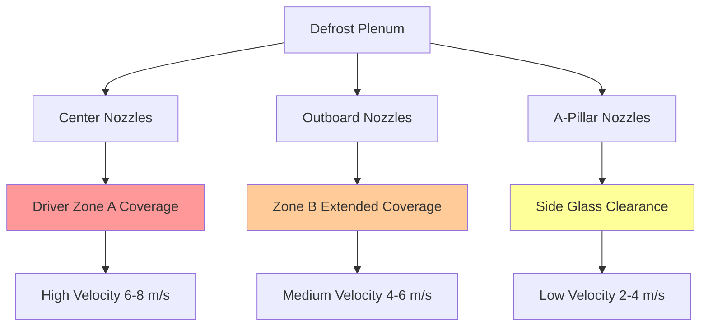
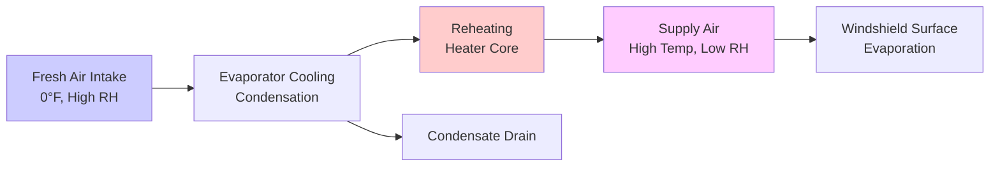

Windshield defrost systems represent a critical safety function in automotive HVAC design, governed by Federal Motor Vehicle Safety Standard 103 (FMVSS 103). These systems must rapidly remove frost and fog from the windshield by delivering heated, dehumidified air across the glass surface while managing condensation through precise control of temperature, humidity, and airflow distribution.

## FMVSS 103 Requirements

FMVSS 103 establishes performance criteria for defrost and defogging systems to ensure driver visibility under specified environmental conditions.

### Visibility Clearance Specifications

The standard mandates clearance zones measured at the driver's eyepoint:

| Zone | Width | Height | Maximum Time to Clear |
|------|-------|--------|----------------------|
| A (Driver direct view) | 6 inches | Full height | 10 minutes |
| B (Extended driver view) | 12 inches | Full height | 20 minutes |
| C (Passenger side) | Variable | Full height | 40 minutes |

Testing conditions specify ambient temperature of 0°F (-18°C) with relative humidity creating frost accumulation on the interior glass surface.

### Test Protocol Requirements

SAE J902 provides the detailed test methodology for FMVSS 103 compliance. The vehicle must achieve specified clearance within the time limits while operating in defrost mode with maximum heat and airflow settings.

## Heat Transfer Fundamentals

Windshield defrost effectiveness depends on three simultaneous heat transfer mechanisms operating at the glass-air interface.

### Convective Heat Transfer

The primary mechanism for frost removal is forced convection from heated air impinging on the glass surface. The convective heat flux is expressed as:

$$q_{conv} = h \cdot A \cdot (T_{air} - T_{glass})$$

Where:
- $q_{conv}$ = convective heat transfer rate (W)
- $h$ = convective heat transfer coefficient (W/m²·K)
- $A$ = windshield area (m²)
- $T_{air}$ = supply air temperature (K)
- $T_{glass}$ = glass surface temperature (K)

The heat transfer coefficient $h$ depends critically on airflow velocity and turbulence at the glass surface. Typical values range from 15-45 W/m²·K for defrost air velocities between 3-8 m/s.

### Mass Transfer for Defogging

Fog removal requires evaporation of condensed moisture, governed by the mass transfer coefficient:

$$\dot{m}_{evap} = h_m \cdot A \cdot (C_{sat} - C_{air})$$

Where:
- $\dot{m}_{evap}$ = evaporation rate (kg/s)
- $h_m$ = mass transfer coefficient (m/s)
- $C_{sat}$ = saturation moisture concentration at glass temperature (kg/m³)
- $C_{air}$ = moisture concentration in supply air (kg/m³)

The Lewis relation connects heat and mass transfer: $h_m = h/(ρ \cdot c_p \cdot Le^{2/3})$, where $Le$ is the Lewis number (approximately 0.9 for air-water vapor).

### Sublimation Energy Requirements

Frost removal requires sublimation energy, significantly higher than evaporation. The total energy required to clear frost is:

$$Q_{total} = m_{frost} \cdot L_{sub} + m_{frost} \cdot c_p \cdot \Delta T$$

Where:
- $m_{frost}$ = mass of frost deposit (kg)
- $L_{sub}$ = latent heat of sublimation (2838 kJ/kg at 0°C)
- $c_p$ = specific heat of water vapor (1.86 kJ/kg·K)
- $\Delta T$ = temperature rise from frost temperature to room temperature

## Defrost Nozzle Design

Nozzle geometry controls airflow distribution across the windshield, determining clearance pattern and time-to-clear performance.

### Airflow Distribution Patterns

### Nozzle Velocity Profiles

The optimal nozzle design balances velocity and coverage. High velocity increases $h$ but may cause excessive noise and reduced coverage area. The discharge velocity is:

$$V_{nozzle} = \frac{\dot{V}_{total}}{n \cdot A_{nozzle}}$$

Where:
- $V_{nozzle}$ = nozzle exit velocity (m/s)
- $\dot{V}_{total}$ = total volumetric flow rate (m³/s)
- $n$ = number of nozzles
- $A_{nozzle}$ = individual nozzle area (m²)

Typical defrost systems use 5-7 nozzles with total flow rates of 180-250 CFM (85-118 L/s).

### Attachment and Spread Angles

Nozzle jet attachment to the windshield depends on the Coanda effect and jet momentum. The attachment distance is:

$$L_{attach} = \frac{V_{nozzle} \cdot d}{\beta \cdot g \cdot \sin(\theta)}$$

Where:
- $L_{attach}$ = attachment distance (m)
- $d$ = nozzle diameter (m)
- $\beta$ = buoyancy parameter
- $\theta$ = windshield angle from horizontal

Optimal spread angles range from 40-60° to maximize coverage while maintaining sufficient impingement velocity.

## Fresh Air Mode and Dehumidification

Effective defrosting requires dehumidified air to establish a moisture concentration gradient favoring evaporation.

### Moisture Removal Strategy

The psychrometric process for defrost air preparation involves:

### AC Compressor Operation During Defrost

Modern systems activate the AC compressor during defrost mode to reduce supply air humidity ratio. The moisture removal capacity is:

$$\dot{m}_{water} = \dot{m}_{air} \cdot (W_{in} - W_{out})$$

Where:
- $\dot{m}_{water}$ = water removal rate (kg/s)
- $\dot{m}_{air}$ = dry air mass flow rate (kg/s)
- $W_{in}$ = inlet humidity ratio (kg water/kg dry air)
- $W_{out}$ = outlet humidity ratio after evaporator

Typical evaporator operation at 0°F ambient reduces humidity ratio from 0.0008 to 0.0003 kg/kg, then reheating to 130-150°F provides supply air with relative humidity below 10%.

### Recirculation Disable Logic

Defrost mode disables recirculation to prevent moisture accumulation from occupants' respiration. Each occupant generates approximately 40-60 g/hr of moisture through breathing. With recirculation, this moisture saturates the cabin air, eliminating the driving force for fog evaporation.

## Time to Clear Analysis

Clearance time depends on frost mass, supply air conditions, and airflow distribution effectiveness.

### Transient Heat Transfer Model

The windshield temperature evolution follows:

$$m_{glass} \cdot c_{p,glass} \cdot \frac{dT_{glass}}{dt} = q_{conv} - q_{cond,out} - q_{sublimation}$$

Where:
- $m_{glass}$ = windshield mass (kg)
- $c_{p,glass}$ = specific heat of glass (840 J/kg·K)
- $q_{cond,out}$ = conduction to exterior environment (W)
- $q_{sublimation}$ = energy consumed by frost sublimation (W)

### Performance Parameters

Key factors affecting clearance time:

| Parameter | Typical Range | Effect on Clear Time |
|-----------|---------------|---------------------|
| Supply air temperature | 130-160°F | -2 min per 10°F increase |
| Airflow rate | 180-250 CFM | -1.5 min per 20 CFM increase |
| Initial frost thickness | 0.5-2.0 mm | +3 min per mm |
| Ambient temperature | -20 to 20°F | +1 min per 5°F decrease |
| Windshield angle | 25-35° | -0.5 min per 5° increase |

### Rapid Defrost Strategies

Advanced systems employ several techniques to reduce clearance time:

1. **Maximum heat/maximum blower activation**: Immediately establishes highest convective coefficient
2. **Heated windshield elements**: Supplemental resistive heating (400-1000W) embedded in glass
3. **Optimized nozzle targeting**: Prioritizes Zone A coverage with 40-50% of total airflow
4. **AC compressor pre-activation**: Begins dehumidification before occupant entry
5. **Rear window defrost coordination**: Prevents moisture migration from rear to front

## Design Verification Testing

Beyond FMVSS 103 compliance, manufacturers conduct additional validation:

- **Cold soak testing**: Vehicle stabilized at test temperature for 4+ hours
- **Frost thickness measurement**: Optical or capacitive sensors verify uniform deposition
- **Clearance pattern documentation**: High-speed imaging captures progression
- **Noise level assessment**: Microphone measurements at occupant ear position
- **Energy consumption analysis**: Electrical load and fuel consumption impact

The physics-based design approach ensures windshield defrost systems achieve regulatory compliance while optimizing occupant comfort, energy efficiency, and clearing performance across diverse environmental conditions.

## Components

- Defrost Mode Operation
- Maximum Airflow Defrost
- Maximum Heat Defrost
- Windshield Air Distribution
- Defrost Nozzle Design
- Demist Demist Pattern
- Defroster Ducts
- Recirculation Disable Defrost
- Rapid Defrost Strategies
