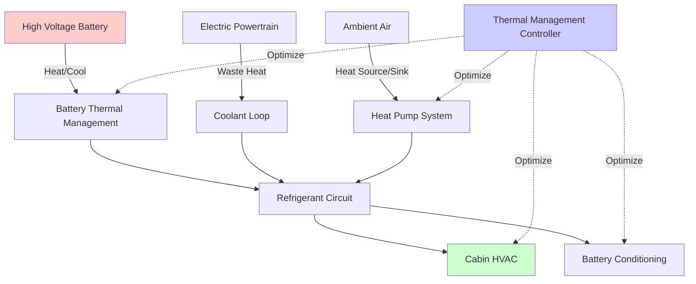

Electric vehicle HVAC systems represent a fundamental departure from conventional automotive climate control due to the absence of waste engine heat. Every watt consumed by the HVAC system directly reduces driving range, making thermal management one of the most critical engineering challenges in EV design. Modern EV thermal systems integrate cabin conditioning, battery temperature management, and powertrain cooling into unified architectures that optimize energy usage across all thermal loads.

## Fundamental Energy Constraints

The energy penalty for HVAC in electric vehicles differs drastically from internal combustion engine vehicles. In conventional vehicles, the engine rejects approximately 60-70% of fuel energy as waste heat, providing abundant thermal energy for cabin heating at minimal efficiency cost. Electric powertrains operate at 85-95% efficiency, producing minimal waste heat while requiring battery energy for all thermal loads.

The energy consumption relationship follows:

$$E_{HVAC} = \frac{Q_{thermal}}{\eta_{system}} = \frac{Q_{heating}}{COP_{heat}} + \frac{Q_{cooling}}{EER_{cool}}$$

where $E_{HVAC}$ represents electrical energy consumed, $Q_{thermal}$ is the thermal load, $COP_{heat}$ is the coefficient of performance for heating, and $EER_{cool}$ is energy efficiency ratio for cooling.

For a typical heating load of 5 kW in cold weather:
- Resistive heating: $E = 5 kW / 1.0 = 5 kW$ electrical consumption
- Heat pump (COP = 2.5): $E = 5 kW / 2.5 = 2 kW$ electrical consumption

This 60% energy savings translates directly to driving range preservation.

## Heat Pump vs Resistive Heating

Electric vehicles employ two primary heating strategies, each with distinct performance characteristics and efficiency profiles.

| Parameter | Resistive (PTC) Heating | Heat Pump System |
|-----------|------------------------|------------------|
| **COP Range** | 0.95-1.0 | 1.5-4.0 (temperature dependent) |
| **Low Temperature Performance** | Consistent | Degrades below -10°C |
| **System Complexity** | Minimal | High (reversible refrigeration) |
| **Capital Cost** | Low | 3-5× higher |
| **Warm-up Time** | Fast (seconds) | Moderate (1-3 minutes) |
| **Efficiency at -20°C** | 100% of rated | 40-60% of peak COP |

### Resistive Heating Physics

Positive Temperature Coefficient (PTC) heaters operate on Joule heating principles:

$$Q = I^2 R t$$

The PTC characteristic provides self-regulating behavior—as temperature increases, resistance increases, reducing current flow and preventing thermal runaway. PTC heaters deliver instant heat with unity efficiency but consume battery energy at a 1:1 ratio.

### Heat Pump Operation

EV heat pumps extract thermal energy from ambient air, battery coolant, or powertrain components using a vapor-compression refrigeration cycle operating in reverse. The fundamental thermodynamic relationship:

$$COP_{heating} = \frac{Q_H}{W_{comp}} = \frac{T_H}{T_H - T_C}$$

where $T_H$ is the hot side absolute temperature, $T_C$ is the cold side absolute temperature, and $W_{comp}$ is compressor work input. This Carnot limit demonstrates why COP degrades at low ambient temperatures—the temperature differential increases, requiring more compression work per unit heat delivered.

Modern EV heat pumps employ several techniques to maintain performance in cold climates:
- **Vapor injection** increases refrigerant mass flow and superheat control
- **Multiple heat source integration** scavenges waste heat from battery and power electronics
- **Flash gas bypass** improves low-temperature capacity
- **Variable-speed scroll compressors** optimize efficiency across operating conditions

## Integrated Thermal Management Architecture

Advanced EVs unify cabin HVAC, battery conditioning, and powertrain cooling into integrated thermal management systems (ITMS) that optimize total system efficiency.

### Battery Thermal Management Integration

Lithium-ion batteries require temperature maintenance within 15-35°C for optimal performance and longevity. The battery thermal management system must:

**Heating Mode:** Pre-condition cold batteries before charging or driving to improve power delivery and reduce lithium plating risk. Heat sources include:
- PTC heaters in coolant loop
- Heat pump heat exchanger (chiller operating in reverse)
- Recovered waste heat from powertrain

**Cooling Mode:** Remove heat generated during fast charging or high-power discharge:

$$Q_{battery} = I^2 R_{internal} + I \cdot V_{polarization}$$

For an 800V battery charging at 250 kW with 2% internal resistance losses, heat generation reaches 5 kW, requiring active liquid cooling to prevent thermal runaway.

### Multi-Source Heat Recovery

Integrated systems capture waste heat from multiple sources:

| Heat Source | Temperature Range | Typical Power Available |
|-------------|------------------|------------------------|
| Power Electronics | 60-80°C | 1-3 kW (highway driving) |
| Electric Motor | 70-90°C | 2-5 kW (continuous load) |
| Battery Resistive Losses | 25-45°C | 0.5-5 kW (charge/discharge dependent) |
| Cabin Occupant/Solar | 20-40°C | 0.3-1 kW |

Heat recovery effectiveness follows:

$$\epsilon = \frac{Q_{recovered}}{Q_{available}} = \frac{C_{min}(T_{h,in} - T_{c,out})}{C_{min}(T_{h,in} - T_{c,in})}$$

where $C_{min}$ is the minimum heat capacity rate between hot and cold streams.

## Energy Efficiency Strategies

Range preservation requires aggressive efficiency optimization across all operating conditions:

**Zonal Heating:** Direct cabin heating using radiant panels, heated seats, and steering wheel reduces air heating loads by 30-50%. The metabolic comfort equation:

$$M - W = Q_{conv} + Q_{rad} + Q_{evap} + Q_{resp}$$

demonstrates that comfort depends on total thermal balance, not air temperature alone. Radiant heating at 60-80 W/m² allows cabin air temperature reduction from 22°C to 18°C while maintaining equivalent comfort.

**Thermal Preconditioning:** Conditioning the cabin and battery while connected to grid power eliminates the energy penalty during driving. For a typical vehicle requiring 3 kWh to warm from -10°C to 20°C, preconditioning preserves 15-25 km of winter driving range.

**Predictive Thermal Management:** Route-based thermal optimization uses navigation data to anticipate charging stops and adjust battery temperature proactively, ensuring optimal charge acceptance rates without excess energy consumption.

**Refrigerant Selection:** Low-GWP refrigerants (R-1234yf, R-744/CO₂) provide environmental benefits. R-744 systems offer superior cold-weather heating capacity due to higher pressure ratios and enthalpy differentials but require specialized high-pressure components rated to 140 bar.

## Standards and Design References

EV HVAC system design follows SAE J2765 (battery cooling requirements), SAE J2889 (battery thermal measurement), and SAE J2946 (HVAC system performance testing). Testing protocols account for ambient temperature effects on both HVAC efficiency and battery performance, using composite drive cycles that represent real-world energy consumption patterns.

The thermal management system represents 20-30% of total vehicle energy consumption in extreme climates, making HVAC optimization critical to achieving acceptable all-weather driving range and customer satisfaction.
