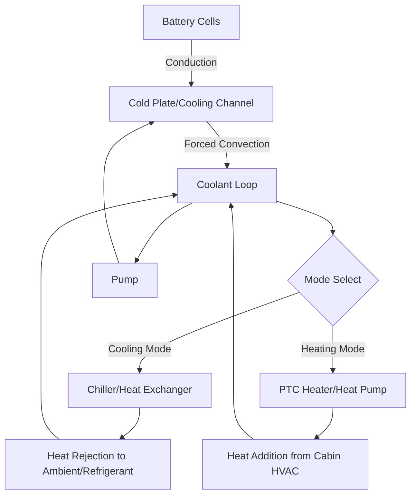
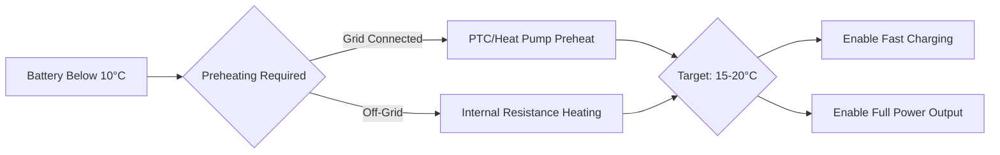

Battery thermal management systems (BTMS) represent the critical interface between electrochemical energy storage and vehicle climate control. Maintaining lithium-ion cells within their optimal temperature window of 20-40°C directly impacts power delivery, charging acceptance, cycle life, and safety margins.

## Thermal Load Characteristics

Battery pack heat generation stems from two sources: irreversible resistive heating and reversible entropic effects. The total heat generation rate follows:

$$Q_{total} = I^2 R_{internal} + IT\frac{dU}{dT}$$

Where $I$ is current, $R_{internal}$ is cell internal resistance, $T$ is absolute temperature, and $\frac{dU}{dT}$ is the entropy coefficient. During high-rate discharge (acceleration) or fast charging, resistive heating dominates. A typical 75 kWh pack drawing 200 kW can generate 4-8 kW of waste heat.

**Temperature-dependent performance effects:**

| Temperature Range | Capacity Retention | Power Capability | Degradation Rate |
|-------------------|-------------------|------------------|------------------|
| -20°C to 0°C | 60-80% | 40-60% | Lithium plating risk |
| 0°C to 20°C | 85-95% | 70-90% | Minimal |
| 20°C to 40°C | 95-100% | 95-100% | 0.5-1% per year |
| 40°C to 60°C | 90-98% | 100% | 3-8% per year |
| Above 60°C | Variable | Variable | Accelerated aging |

## Liquid Cooling System Architecture

Liquid-based BTMS uses a coolant loop (typically 50:50 water-glycol) circulating through cold plates or cooling channels integrated into the battery pack structure. Heat transfer occurs through three resistances in series:

$$\frac{1}{U_{overall}} = \frac{1}{h_{cell}} + \frac{t_{plate}}{k_{aluminum}} + \frac{1}{h_{coolant}}$$

Where $U_{overall}$ is the overall heat transfer coefficient, $h_{cell}$ is the convection coefficient at the cell surface, $t_{plate}$ is cold plate thickness, $k_{aluminum}$ is thermal conductivity, and $h_{coolant}$ is the coolant-side convection coefficient.

**Liquid cooling system performance:**

- **Coolant flow rate**: 10-30 L/min typical for 60-100 kWh packs
- **Temperature differential**: 3-8°C inlet to outlet at moderate load
- **Pumping power**: 100-400 W (0.3-1% of pack discharge power)
- **Thermal response time**: 5-15 minutes to stabilize after thermal event

## Refrigerant-Based Direct Cooling

Advanced BTMS integrates battery cooling directly into the vehicle's refrigeration circuit. The evaporator wraps around or interposes between cell modules, eliminating the intermediate coolant loop. Heat absorption occurs at the refrigerant saturation temperature:

$$Q_{evap} = \dot{m}_{ref} \cdot h_{fg}$$

Where $\dot{m}_{ref}$ is refrigerant mass flow rate and $h_{fg}$ is the enthalpy of vaporization.

**Comparison: Liquid vs. Refrigerant Cooling**

| Parameter | Liquid Coolant | Direct Refrigerant |
|-----------|---------------|-------------------|
| Heat transfer coefficient | 500-1500 W/m²·K | 2000-5000 W/m²·K |
| System complexity | Moderate | High |
| Cooling capacity | 3-6 kW typical | 6-12 kW typical |
| Low temperature capability | Limited by freeze point | Down to -20°C |
| Weight | Higher (coolant mass) | Lower (no coolant) |
| Cost | Lower | 15-25% higher |
| Parasitic power | 200-400 W | 800-1500 W |

Direct refrigerant cooling excels during DC fast charging, where heat generation can reach 10-15 kW sustained. The superior heat transfer coefficient maintains cell temperatures below 45°C even at 3C charge rates.

## Cold Weather Preheating Strategies

Lithium-ion cells exhibit severely degraded performance below 10°C due to increased electrolyte viscosity and reduced lithium-ion mobility. The charge transfer resistance increases exponentially:

$$R_{ct} = R_{ct,ref} \cdot exp\left[\frac{E_a}{R}\left(\frac{1}{T} - \frac{1}{T_{ref}}\right)\right]$$

Where $E_a$ is activation energy (typically 35-55 kJ/mol for lithium-ion), $R$ is the gas constant, and $T$ is absolute temperature.

**Preheating methods:**

1. **PTC resistive heating**: 2-6 kW electric heaters warm coolant loop
   - Energy cost: 0.5-1.5 kWh to raise pack from -10°C to 20°C
   - Time required: 15-30 minutes depending on pack thermal mass

2. **Heat pump integration**: Extracts heat from ambient or waste heat sources
   - COP: 1.5-2.5 at moderate outdoor temperatures
   - Energy cost: 0.3-0.8 kWh for same temperature rise

3. **Internal resistance heating**: Controlled charge-discharge cycling
   - Generates heat internally: $P = I^2 R_{internal}$
   - Used when external power unavailable

## Fast Charging Thermal Requirements

DC fast charging at rates above 2C generates substantial heat that must be continuously removed. The thermal design must satisfy:

$$Q_{removal} \geq P_{charge} \cdot (1 - \eta_{charge})$$

For an 800V, 250 kW charger operating at 95% efficiency, 12.5 kW must be rejected. SAE J2954 and J1772 standards specify maximum cell temperature limits during charging.

**Fast charge thermal management requirements:**

- **Peak cooling capacity**: 8-15 kW for 150-350 kW chargers
- **Temperature rise limit**: Less than 10°C during charge session
- **Maximum cell temperature**: 45°C per SAE guidelines
- **Coolant inlet temperature**: 15-25°C optimal
- **Pre-cooling time**: 2-5 minutes before initiating charge

Active pre-cooling using the chiller before fast charging begins reduces peak temperatures by 5-8°C and increases charge acceptance throughout the session.

## Impact on Battery Longevity

Capacity fade follows an Arrhenius relationship with temperature:

$$\frac{dC}{dt} = -A \cdot exp\left(-\frac{E_a}{RT}\right)$$

Operating continuously at 40°C versus 25°C approximately doubles the degradation rate. Thermal management directly determines warranty compliance and residual value.

**Thermal management impact on cycle life:**

- **Maintained at 25°C**: 1500-2000 cycles to 80% capacity
- **Maintained at 35°C**: 1000-1400 cycles to 80% capacity
- **Maintained at 45°C**: 500-800 cycles to 80% capacity
- **Temperature cycling (0-40°C)**: Adds 10-20% degradation versus isothermal

Peak cell temperature during operation matters more than average temperature. Effective BTMS limits temperature excursions, reducing mechanical stress from thermal expansion mismatch between cell components.

## Integration with Cabin HVAC

Modern EVs employ integrated thermal architectures where battery, cabin, and powertrain cooling share components. A four-way valve network routes refrigerant between evaporators and condensers, enabling:

- Heat pump operation using battery waste heat for cabin warming
- Cabin cooling rejection to battery coolant loop when ambient is cold
- Coordinated preconditioning using grid power before departure

This integration improves overall vehicle efficiency by 8-15% versus independent systems, particularly during cold weather operation where heat pump COP benefits from battery waste heat availability.
