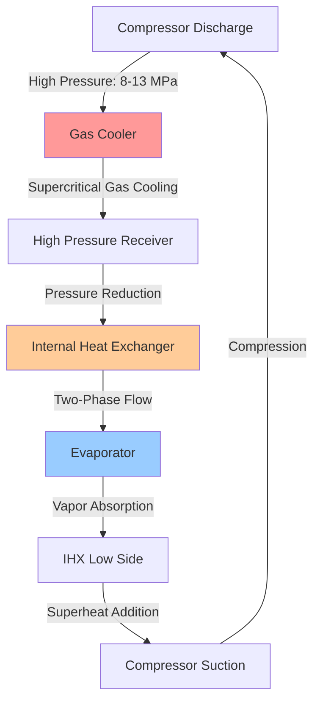
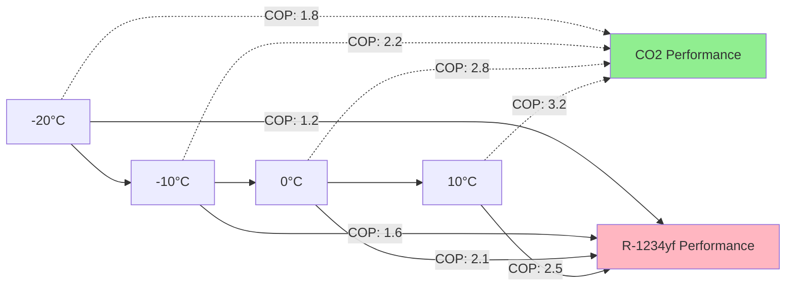

## R-744 Carbon Dioxide Properties

CO2 (R-744) operates as a natural refrigerant with unique thermodynamic properties that differentiate it from conventional synthetic refrigerants in automotive applications.

**Critical Point Characteristics:**

| Property | Value | Comparison to R-134a |
|----------|-------|----------------------|
| Critical Temperature | 31.1°C (88°F) | 101.1°C (214°F) |
| Critical Pressure | 7.38 MPa (1070 psi) | 4.06 MPa (589 psi) |
| Triple Point | -56.6°C @ 0.518 MPa | -103.3°C @ 0.0039 kPa |
| GWP (100-year) | 1 | 1430 |
| ODP | 0 | 0 |
| Flammability | A1 (non-flammable) | A1 (non-flammable) |

The critical temperature of 31.1°C means CO2 operates in a transcritical cycle under typical ambient conditions, fundamentally changing the heat rejection process from condensation to gas cooling.

## Transcritical CO2 Cycle Operation

The transcritical cycle operates above the critical pressure during heat rejection, eliminating the isothermal condensation process found in subcritical systems.

**Pressure-Enthalpy Relationship:**

In the supercritical region, the gas cooler outlet temperature varies non-linearly with pressure. The optimum high-side pressure maximizes COP:

$$P_{opt} = 2.778 \cdot T_{gc,out} - 0.0065 \cdot T_{gc,out}^2$$

where $P_{opt}$ is in MPa and $T_{gc,out}$ is the gas cooler outlet temperature in °C (Liao et al., SAE 2000-01-0968).

The transcritical COP is:

$$COP_{cooling} = \frac{h_1 - h_4}{h_2 - h_1}$$

where:
- $h_1$ = compressor suction enthalpy (kJ/kg)
- $h_2$ = compressor discharge enthalpy (kJ/kg)
- $h_4$ = expansion valve inlet enthalpy (kJ/kg)

## High Pressure Design Considerations

Operating pressures in CO2 systems significantly exceed conventional automotive HVAC systems, requiring specialized component design.

**Typical Operating Pressures:**

| Operating Mode | Low Side Pressure | High Side Pressure |
|----------------|-------------------|--------------------|
| Cooling (35°C ambient) | 3.5-4.5 MPa (508-653 psi) | 9-11 MPa (1305-1595 psi) |
| Heating (-10°C ambient) | 2.0-3.0 MPa (290-435 psi) | 8-10 MPa (1160-1450 psi) |
| Maximum Design | 5.5 MPa (798 psi) | 14 MPa (2030 psi) |

**Tube Wall Thickness Calculation:**

For high-pressure tubing, the minimum wall thickness follows:

$$t = \frac{P \cdot D}{2 \cdot \sigma_{allow} \cdot \eta - P}$$

where:
- $t$ = minimum wall thickness (mm)
- $P$ = maximum working pressure (MPa)
- $D$ = outer diameter (mm)
- $\sigma_{allow}$ = allowable stress (MPa)
- $\eta$ = weld joint efficiency (typically 1.0 for seamless)

For copper-nickel alloy tubing rated for 14 MPa with $\sigma_{allow}$ = 200 MPa and 8 mm OD:

$$t = \frac{14 \cdot 8}{2 \cdot 200 \cdot 1.0 - 14} = \frac{112}{386} = 0.29 \text{ mm}$$

Practical wall thickness includes safety factors, typically 1.0-1.5 mm for automotive applications.

## Gas Cooler Design vs. Conventional Condenser

The gas cooler replaces the condenser in transcritical CO2 systems, operating fundamentally differently due to supercritical heat rejection.

**Heat Transfer Comparison:**

| Parameter | Subcritical Condenser | Supercritical Gas Cooler |
|-----------|----------------------|--------------------------|
| Heat rejection process | Isothermal phase change | Continuous temperature glide |
| Temperature approach | 3-8°C subcooling | 2-5°C approach to ambient |
| Heat transfer coefficient | 3000-5000 W/m²·K | 1500-3000 W/m²·K |
| Pressure drop sensitivity | Low impact on capacity | Critical for performance |
| Optimum control | Superheat/subcool | High-side pressure |

The gas cooler heat rejection rate:

$$\dot{Q}_{gc} = \dot{m} \cdot (h_{comp,out} - h_{gc,out}) = \dot{m} \cdot c_p \cdot \Delta T_{glide}$$

where the specific heat $c_p$ varies significantly in the supercritical region, reaching peak values near the critical point.

## Internal Heat Exchanger (IHX) Importance

The IHX is essential in CO2 systems, providing 5-15% COP improvement by subcooling high-side refrigerant while superheating suction gas.

**IHX Effectiveness:**

$$\varepsilon_{IHX} = \frac{h_{gc,out} - h_{exp,in}}{h_{gc,out} - h_{evap,out}} = \frac{T_{gc,out} - T_{exp,in}}{T_{gc,out} - T_{evap,out}}$$

Typical automotive CO2 IHX effectiveness ranges from 0.6 to 0.8. The capacity gain:

$$\Delta \dot{Q}_{evap} = \dot{m} \cdot (h_{exp,in,no-IHX} - h_{exp,in,with-IHX})$$

## CO2 Heat Pump Mode Efficiency

CO2 systems demonstrate superior heating performance in cold climates compared to R-134a or R-1234yf due to favorable thermophysical properties.

**Cold Weather Heating COP:**

**Heating COP at -10°C Ambient:**

$$COP_{heating} = \frac{h_2 - h_3}{h_2 - h_1} = \frac{Q_{heating}}{W_{comp}}$$

For a typical EV CO2 heat pump at -10°C ambient, 35°C cabin supply:
- Compressor discharge: 90-100°C
- Heating capacity: 3.5-5.0 kW
- COP: 2.0-2.4
- Range impact: 15-20% vs. PTC heater

## Optimum High-Side Pressure Control

Transcritical CO2 systems require active high-side pressure control to maximize efficiency across varying ambient conditions.

**Control Strategies:**

| Method | Implementation | Efficiency | Complexity |
|--------|----------------|------------|------------|
| Electronic expansion valve | Modulate valve opening | Good | Low |
| Variable displacement compressor | Adjust refrigerant flow | Better | Medium |
| Gas cooler fan control | Vary airflow rate | Best | Medium |
| Integrated control | All methods combined | Optimal | High |

The optimum pressure correlation (Kim et al., SAE 2004-01-0450):

$$P_{opt} = a + b \cdot T_{gc,out} + c \cdot T_{evap,out}$$

Typical coefficients for automotive applications:
- $a$ = 0.8-1.2 MPa
- $b$ = 0.26-0.32 MPa/°C
- $c$ = 0.02-0.05 MPa/°C

## Environmental Benefits and Regulatory Compliance

CO2 provides significant environmental advantages over synthetic refrigerants, driving adoption in European and Asian automotive markets.

**Environmental Comparison:**

| Refrigerant | GWP (AR5) | Charge (kg) | CO2 Equivalent (kg) | EU F-Gas Compliance |
|-------------|-----------|-------------|---------------------|---------------------|
| R-744 (CO2) | 1 | 0.7-1.2 | 0.7-1.2 | Fully compliant |
| R-1234yf | 4 | 0.5-0.8 | 2.0-3.2 | Compliant |
| R-134a | 1430 | 0.6-1.0 | 858-1430 | Phase-out 2017 |

The total equivalent warming impact (TEWI) includes direct and indirect emissions:

$$TEWI = GWP \cdot L_{annual} \cdot n + GWP \cdot m \cdot (1-\alpha_{recovery}) + n \cdot E_{annual} \cdot \beta$$

where:
- $L_{annual}$ = annual leakage rate (kg/year)
- $n$ = system lifetime (years)
- $m$ = refrigerant charge (kg)
- $\alpha_{recovery}$ = end-of-life recovery rate
- $E_{annual}$ = annual energy consumption (kWh)
- $\beta$ = CO2 emission factor (kg CO2/kWh)

## Safety Advantages

Despite high operating pressures, CO2 offers safety benefits as a natural, non-toxic, non-flammable refrigerant (ASHRAE 34 Class A1).

**Safety Characteristics:**

- No flammability risk (unlike R-290, R-152a)
- Non-toxic at concentrations below 3% (30,000 ppm)
- Odorant not required (detectable by humans at 3-5%)
- High-pressure components tested to 2-3× working pressure
- Minimal environmental release impact (natural atmospheric constituent)
- Compatible with standard lubricants (POE oils)

**Cabin Concentration After Full Charge Release:**

For a typical passenger vehicle interior volume of 3.5 m³ and 1.0 kg CO2 charge:

$$C_{CO2} = \frac{m_{refrigerant}}{V_{cabin} \cdot \rho_{air}} \times 10^6$$

$$C_{CO2} = \frac{1000 \text{ g}}{3.5 \text{ m}^3 \cdot 1.2 \text{ kg/m}^3} \times 10^6 = 238,000 \text{ ppm} = 23.8\%$$

This exceeds safe limits (5% TWA), but rapid ventilation with open windows reduces concentration to safe levels within 30-60 seconds. Modern systems include leak detection and automatic ventilation activation.

## CO2 System Component Specifications

**Compressor Requirements:**

- Type: Swash plate, scroll, or electric scroll
- Displacement: 15-40 cc/rev
- Maximum speed: 8000-12,000 RPM
- Discharge pressure rating: 14 MPa minimum
- Efficiency: Isentropic efficiency 0.65-0.75
- Lubrication: PAG or POE oil, 120-200 cc charge

**Gas Cooler Specifications:**

- Core construction: Aluminum microchannel
- Tube diameter: 1.0-2.0 mm hydraulic diameter
- Frontal area: 0.3-0.5 m²
- Air-side face velocity: 2.5-4.0 m/s
- Heat rejection: 5-12 kW at design conditions
- Pressure drop limit: 0.2-0.4 MPa refrigerant side

**Evaporator Design:**

- Type: Plate-fin or microchannel
- Capacity: 3-6 kW cooling
- Evaporation temperature: -5 to 10°C
- Superheat control: 5-8°C at compressor suction
- Frosting protection: Defrost cycle integration
- Air-side effectiveness: 0.6-0.75

These specifications enable CO2 systems to deliver equivalent or superior climate control performance to conventional refrigerants while providing significant environmental benefits and cold-weather heating advantages critical for electric vehicle range preservation.

---

**References:**
- SAE J2765: Procedure for Measuring System COP of a Mobile Air Conditioning System on a Test Bench
- SAE J2842: R-744 (CO2) Recovery/Recycling/Recharging Equipment
- ASHRAE Standard 34: Designation and Safety Classification of Refrigerants
