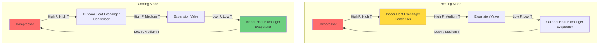
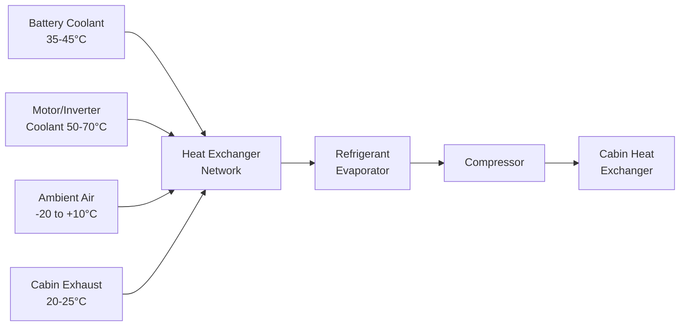
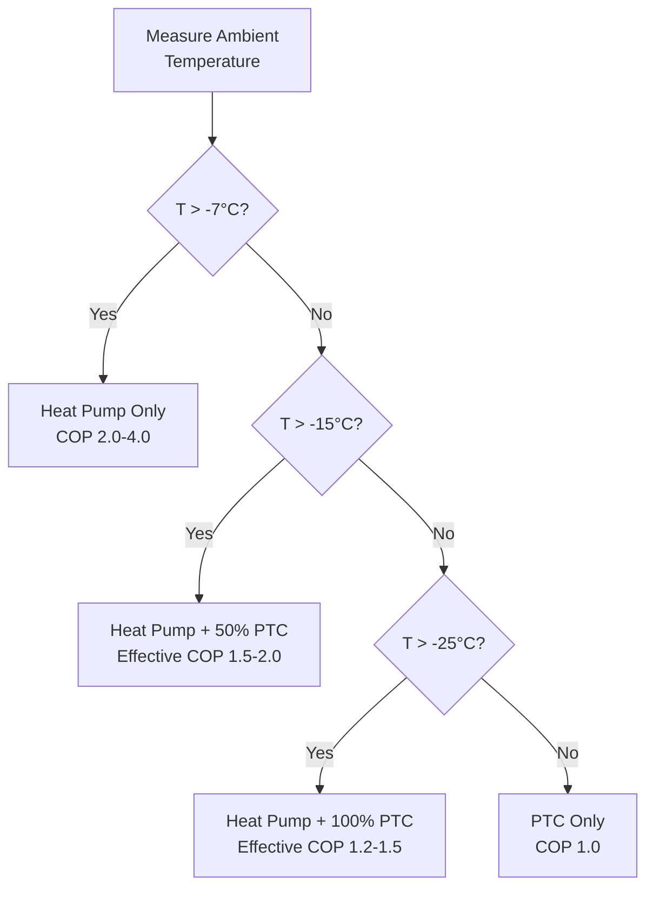

## Reversible Vapor Compression Heat Pump

Electric vehicle heat pumps utilize reversible refrigerant cycles to provide both cabin heating and cooling from a single system, maximizing energy efficiency and extending driving range. Unlike conventional resistance heating, heat pumps move thermal energy rather than generate it through electrical resistance.

### Fundamental Operating Principle

The heat pump operates on the vapor compression cycle with reversible refrigerant flow controlled by a four-way valve. The coefficient of performance (COP) quantifies efficiency:

$$COP_{heating} = \frac{Q_H}{W_{comp}}$$

Where $Q_H$ is heating capacity (kW) and $W_{comp}$ is compressor work input (kW). Typical EV heat pumps achieve COP of 2.5-4.0 at moderate ambient temperatures, delivering 2.5-4.0 kW of heat per kW of electrical input.

### Carnot Efficiency Limit

The theoretical maximum COP for heating mode follows Carnot cycle efficiency:

$$COP_{Carnot} = \frac{T_H}{T_H - T_L}$$

Where $T_H$ is condenser absolute temperature (K) and $T_L$ is evaporator absolute temperature (K). Real systems achieve 40-60% of Carnot efficiency due to irreversibilities.

## Reversible Refrigerant Flow Architecture

The four-way reversing valve redirects refrigerant flow to switch heat exchanger roles between condenser and evaporator functions. SAE J2765 provides standardized test procedures for EV HVAC performance validation.

## CO2 (R-744) Heat Pump Systems

Carbon dioxide refrigerant offers advantages for EV applications due to superior low-temperature performance and environmental properties (GWP=1, ODP=0).

### Transcritical CO2 Cycle

CO2 heat pumps operate in transcritical cycle when ambient temperatures exceed critical point (31.1°C, 73.8 bar). Heat rejection occurs above critical pressure:

$$Q_{gc} = \dot{m} \cdot (h_{gc,out} - h_{gc,in})$$

Where $\dot{m}$ is refrigerant mass flow rate, $h_{gc,out}$ and $h_{gc,in}$ are gas cooler outlet and inlet specific enthalpies (kJ/kg).

### Cold Weather Advantage

CO2 maintains higher vapor pressure at low temperatures compared to R-134a or R-1234yf:

| Refrigerant | Vapor Pressure at -20°C | Vapor Pressure at 0°C |
|-------------|------------------------|----------------------|
| R-744 (CO2) | 19.7 bar | 34.9 bar |
| R-134a | 1.06 bar | 2.93 bar |
| R-1234yf | 0.96 bar | 2.73 bar |

Higher vapor pressure enables efficient compression and heat pumping at sub-freezing temperatures where conventional refrigerants struggle.

## Waste Heat Recovery Integration

Modern EV heat pumps integrate multiple heat sources to maximize COP and minimize battery depletion:

### Heat Recovery Effectiveness

Heat exchanger effectiveness quantifies waste heat recovery performance:

$$\varepsilon = \frac{Q_{actual}}{Q_{max}} = \frac{\dot{m}_c c_{p,c}(T_{c,in} - T_{c,out})}{\dot{m}_{min} c_p (T_{c,in} - T_{r,in})}$$

Where subscripts $c$ and $r$ denote coolant and refrigerant streams. Typical effectiveness ranges 0.6-0.8 for compact brazed plate heat exchangers.

## Cold Temperature Performance

Heat pump COP degrades as outdoor temperature decreases due to reduced temperature lift and evaporator capacity:

| Ambient Temperature | Heating COP | Heating Capacity | Notes |
|---------------------|-------------|------------------|-------|
| +10°C | 3.5-4.0 | 4.5-5.5 kW | Optimal performance |
| 0°C | 2.5-3.2 | 3.5-4.5 kW | Good efficiency maintained |
| -10°C | 1.8-2.5 | 2.5-3.5 kW | Moderate degradation |
| -20°C | 1.2-1.8 | 1.5-2.5 kW | Significant capacity loss |
| -30°C | 0.8-1.2 | 0.8-1.5 kW | Supplemental heat required |

Performance values per SAE J2765 steady-state testing protocols.

### Capacity Reduction Physics

Evaporator capacity decreases with temperature due to reduced density and enthalpy differential:

$$Q_{evap} = \dot{m} \cdot (h_{evap,out} - h_{evap,in}) = \rho \cdot \dot{V} \cdot \Delta h$$

Lower air temperatures reduce both refrigerant density $\rho$ and enthalpy change $\Delta h$, necessitating higher volumetric flow rates $\dot{V}$ or supplemental heating.

## Supplemental Heating Integration

Below balance point temperature (typically -7 to -10°C), heat pump capacity becomes insufficient, requiring supplemental heating:

### PTC Heater Backup

Positive temperature coefficient ceramic heaters provide rapid heating response:

$$Q_{PTC} = \frac{V^2}{R(T)} = V \cdot I$$

Where resistance $R(T)$ increases with temperature, providing self-regulating behavior. PTC heaters operate at COP=1.0 but ensure adequate heating at extreme temperatures.

### Hybrid Control Strategy

Optimal control minimizes PTC usage while maintaining cabin comfort per SAE J2765 thermal comfort criteria.

## Energy Efficiency vs PTC Heaters

### Comparative Energy Consumption

For 3 kW heating load over 1-hour operation:

| System Type | Ambient Temp | COP | Energy Required | Range Impact |
|-------------|--------------|-----|-----------------|--------------|
| Heat Pump | +5°C | 3.5 | 0.86 kWh | Minimal |
| Heat Pump | -5°C | 2.3 | 1.30 kWh | Moderate |
| Heat Pump | -15°C | 1.6 | 1.88 kWh | Significant |
| PTC Heater | Any | 1.0 | 3.00 kWh | Maximum |

Heat pump systems reduce HVAC energy consumption by 40-70% compared to PTC heaters at typical winter temperatures.

### Range Extension Calculation

For 60 kWh battery with 250 km EPA range:

$$\Delta Range = \frac{(E_{PTC} - E_{HP}) \cdot t_{drive}}{E_{battery}} \cdot Range_{EPA}$$

Operating heat pump vs PTC for 2-hour drive at 0°C:
- Energy savings: $(3.0 - 1.3) \times 2 = 3.4$ kWh
- Range extension: $\frac{3.4}{60} \times 250 = 14.2$ km

Heat pump systems can extend winter driving range by 10-20% compared to resistive heating alone.

## System Design Considerations

Key engineering parameters for EV heat pump design:

**Compressor Selection**: Variable speed scroll or electric compressor with 2,000-8,000 rpm operating range, capacity modulation 20-100%.

**Refrigerant Charge**: Critical optimization for transcritical CO2 systems; typically 800-1,200 g for passenger vehicles.

**Heat Exchanger Sizing**: Outdoor coil area 0.8-1.2 m², indoor coil 0.4-0.6 m² with enhanced fin geometry for frost tolerance.

**Controls Architecture**: Model predictive control (MPC) with 30-second update cycles, integrating battery thermal management and cabin preconditioning.

SAE J2765 and SAE J2953 establish standardized test procedures for thermal performance validation and energy consumption measurement.
