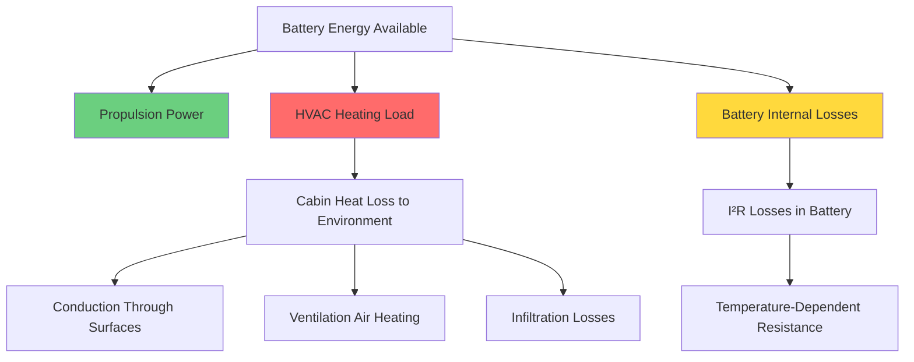
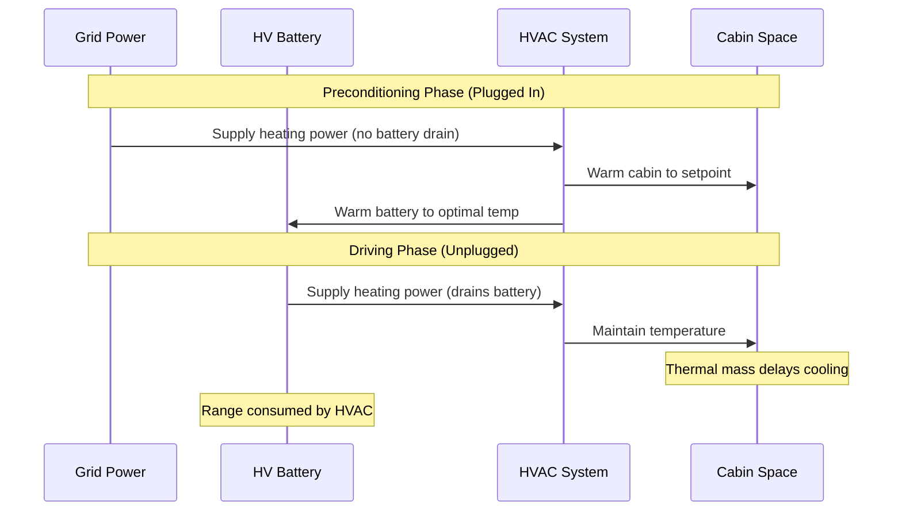

Electric vehicle HVAC systems represent the largest auxiliary power draw on the battery after propulsion, fundamentally limiting driving range through direct energy consumption. Unlike internal combustion vehicles that utilize waste engine heat, EVs must generate thermal energy from battery-stored electrical power, creating a direct trade-off between cabin comfort and vehicle range.

## Heating System Power Consumption

Resistive heating elements in EVs consume **3-6 kW** of electrical power during steady-state cabin heating, with peak loads reaching 8 kW during cold starts. This power draw directly reduces available propulsion energy.

The instantaneous range impact can be quantified through energy balance:

$$P_{\text{total}} = P_{\text{propulsion}} + P_{\text{HVAC}} + P_{\text{accessories}}$$

For a vehicle traveling at highway speed (30 m/s) with baseline efficiency of 250 Wh/mi:

$$\text{Range}_{\text{HVAC on}} = \frac{E_{\text{battery}}}{P_{\text{propulsion}} + P_{\text{HVAC}}} \times v$$

Where $E_{\text{battery}}$ is usable battery capacity (kWh), $v$ is velocity, and power terms are in kW.

### Cold Weather Range Reduction

Field data from SAE J2951 testing demonstrates **30-50% range reduction** at temperatures below -7°C (20°F) compared to 23°C (73°F) baseline conditions. This degradation results from three coupled mechanisms:

| Temperature | Range Reduction | Primary Factors |
|-------------|-----------------|-----------------|
| 10°C to 0°C | 15-20% | Moderate heating load, battery resistance increase |
| 0°C to -10°C | 25-35% | High heating load (4-6 kW), elevated battery impedance |
| Below -10°C | 35-50% | Maximum heating load (6-8 kW), severe battery degradation |

The cabin heating load follows transient heat transfer principles:

$$Q_{\text{heating}} = UA(T_{\text{cabin}} - T_{\text{ambient}}) + \dot{m}c_p(T_{\text{cabin}} - T_{\text{ambient}})$$

Where $UA$ represents the overall thermal conductance of the cabin envelope (typically 50-80 W/K), and $\dot{m}$ is the ventilation mass flow rate.

## Heat Pump Systems: Efficiency Advantages

Heat pump systems achieve coefficient of performance (COP) values of 2-3 under moderate conditions, reducing electrical consumption compared to resistive heating:

$$\text{COP} = \frac{Q_{\text{delivered}}}{W_{\text{electrical}}}$$

A heat pump delivering 4 kW of cabin heating at COP = 2.5 consumes only 1.6 kW of electrical power, compared to 4 kW for resistive heating. This 60% power reduction translates to proportional range extension.

However, heat pump performance degrades severely below -10°C as refrigerant saturation pressure limits become restrictive and frost formation on outdoor coils requires defrost cycles. The effective COP relationship follows:

$$\text{COP}_{\text{actual}} = \text{COP}_{\text{ideal}} \times \eta_{\text{compressor}} \times \eta_{\text{defrost}} \times \eta_{\text{cycle}}$$

## Cooling System Energy Consumption

Air conditioning systems consume **1-3 kW** during cooling operation, representing a more modest range impact than heating. At 65 kPa compressor load and 25°C ambient, typical range reduction is **10-20%**.

| Operating Condition | AC Power Draw | Range Impact |
|---------------------|---------------|--------------|
| Recirculation mode, moderate ambient | 1.0-1.5 kW | 10-15% |
| Fresh air mode, high ambient (>35°C) | 2-3 kW | 15-20% |
| Max AC during hot soak | 3-4 kW (peak) | 20-25% (transient) |

The refrigeration cycle efficiency determines cooling power requirements:

$$\text{EER} = \frac{Q_{\text{cooling}}}{W_{\text{compressor}}}$$

Modern EV AC systems achieve Energy Efficiency Ratio (EER) values of 8-12 BTU/Wh (2.3-3.5 W/W) under rated conditions.

## Preconditioning Strategy

Preconditioning while connected to grid power eliminates HVAC range penalty during initial driving phases. The thermal mass of the cabin and battery pack determine preconditioning effectiveness:

$$Q_{\text{stored}} = mc_p\Delta T$$

For a typical cabin with effective thermal mass of 150 kg and specific heat capacity of 1000 J/kg·K, pre-heating from -10°C to 20°C stores:

$$Q_{\text{stored}} = 150 \times 1000 \times 30 = 4.5 \text{ MJ} = 1.25 \text{ kWh}$$

This stored thermal energy delays the onset of battery-powered heating, extending effective range during short trips.

## Energy Management Strategies

Advanced thermal management systems employ hierarchical control strategies to minimize HVAC energy consumption:

1. **Zone heating prioritization**: Direct heated air to occupied zones only, reducing average cabin temperature setpoint by 3-5°C
2. **Surface heating preference**: Utilize seat heaters (50-100 W) and steering wheel heaters (30-50 W) to maintain occupant comfort at lower air temperatures
3. **Eco-mode operation**: Reduce blower speed and accept wider temperature deadbands (±2°C vs ±0.5°C)
4. **Predictive thermal management**: Pre-cool or pre-heat based on navigation route data and ambient forecast

The relative efficiency of localized heating methods demonstrates significant energy savings:

| Heating Method | Power Consumption | Equivalent Air Temperature Increase |
|----------------|-------------------|-------------------------------------|
| Cabin air heating | 4000 W | 20°C → 22°C (full cabin) |
| Seat heating (both front) | 150 W | Thermal comfort equivalent to +3°C air |
| Steering wheel heating | 40 W | Hand comfort maintained |
| Radiant panel heating | 800 W | Occupant zone equivalent to +4°C air |

These localized strategies achieve thermal comfort while consuming 85-95% less power than full cabin air heating, directly translating to proportional range extension in cold weather operation.

## Components

- Hvac Energy Consumption
- Heating Range Reduction
- Cooling Range Reduction
- Climate Control Efficiency
- Eco Mode Climate Control
- Seat Heating Efficiency
- Steering Wheel Heating
- Radiant Heating Cabin
- Zone Heating Strategies
- Preconditioning While Charging
