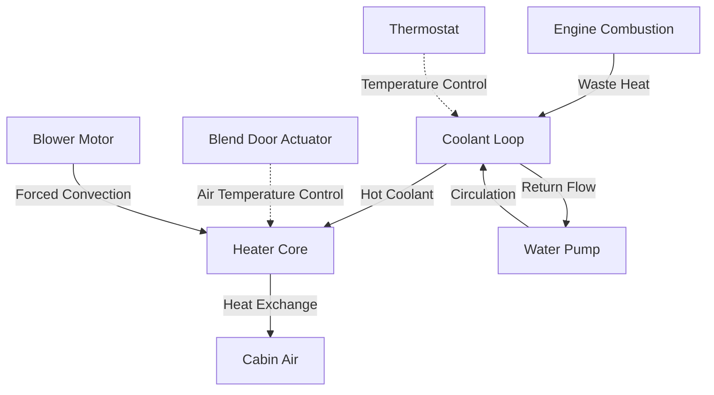

Automotive heating systems provide thermal comfort for vehicle occupants through three primary technologies: engine coolant-based heating, positive temperature coefficient (PTC) electric heaters, and heat pump systems. The fundamental challenge in automotive heating differs from stationary HVAC applications due to transient operating conditions, limited energy availability, and stringent packaging constraints.

## Engine Coolant-Based Heating

### Operating Principles

Traditional internal combustion engine (ICE) vehicles utilize waste heat from the engine cooling system. The heat transfer pathway involves:

1. **Heat generation** in the combustion chamber and friction surfaces
2. **Coolant absorption** of engine waste heat
3. **Forced convection** through the heater core
4. **Air-side heat transfer** to cabin air

The heating capacity available from engine coolant follows the relationship:

$$Q_{available} = \dot{m}_c \cdot c_{p,c} \cdot (T_{engine} - T_{return})$$

Where:
- $Q_{available}$ = available heating capacity (W)
- $\dot{m}_c$ = coolant mass flow rate (kg/s)
- $c_{p,c}$ = specific heat of coolant, typically 3.5-4.0 kJ/(kg·K) for ethylene glycol mixtures
- $T_{engine}$ = engine outlet temperature (85-95°C)
- $T_{return}$ = heater core return temperature (°C)

### Heater Core Performance

The heater core functions as a liquid-to-air heat exchanger, typically employing a serpentine tube-and-fin design. The effectiveness-NTU method characterizes performance:

$$\epsilon = \frac{Q_{actual}}{Q_{max}} = \frac{1 - e^{-NTU(1-C_r)}}{1 - C_r \cdot e^{-NTU(1-C_r)}}$$

Where $C_r$ is the heat capacity ratio and $NTU$ is the number of transfer units. Typical heater cores achieve $\epsilon$ = 0.65-0.80 with air-side heat transfer coefficients of 40-80 W/(m²·K).

**Critical design parameters:**

| Parameter | Typical Range | Design Impact |
|-----------|---------------|---------------|
| Core face area | 0.15-0.30 m² | Pressure drop vs capacity trade-off |
| Fin density | 8-12 fins/inch | Heat transfer vs airflow resistance |
| Coolant flow rate | 10-20 L/min | Pump power vs response time |
| Air velocity | 3-8 m/s | Noise vs heat transfer coefficient |

### Cold Start Challenge

The primary limitation of coolant-based heating is the thermal inertia during cold starts. Engine warm-up time follows an exponential relationship:

$$T_{engine}(t) = T_{ambient} + (T_{operating} - T_{ambient})(1 - e^{-t/\tau})$$

Where $\tau$ is the thermal time constant (typically 5-15 minutes depending on ambient conditions and drive cycle). This delay creates passenger discomfort during the first 5-10 minutes of operation.



## PTC Electric Heaters

### Physics of PTC Materials

Positive temperature coefficient heaters utilize ceramic materials (typically barium titanate) that exhibit sharply increasing electrical resistance above the Curie temperature. This self-regulating behavior prevents overheating without external controls.

The resistivity-temperature relationship follows:

$$\rho(T) = \rho_0 \cdot e^{\beta(T - T_c)}$$

Where $T_c$ is the Curie temperature (typically 60-120°C for automotive applications) and $\beta$ is the material-specific temperature coefficient.

### Power Delivery and Control

PTC heaters provide immediate heat output without engine warm-up delay. Typical automotive PTC systems deliver 2-6 kW through multiple heating elements activated sequentially based on heating demand.

**PTC heater specifications:**

| Characteristic | Range | Notes |
|----------------|-------|-------|
| Power output | 2-6 kW | Staged activation (1-3 kW per stage) |
| Operating voltage | 200-400 VDC | High-voltage systems only |
| Surface temperature | 180-220°C | Self-limiting via PTC effect |
| Thermal response | <30 seconds | Near-instantaneous compared to coolant |
| Efficiency | 95-98% | Resistive heating efficiency |

The primary limitation is energy consumption. For a battery electric vehicle (BEV), heating energy directly reduces driving range:

$$\Delta Range = \frac{P_{heater} \cdot t_{operation}}{E_{battery}} \cdot Range_{total}$$

A 3 kW PTC heater operating for 1 hour consumes 3 kWh, which may reduce range by 15-25 km in a typical EV.

## Heat Pump Systems for EVs and Hybrids

### Thermodynamic Advantages

Heat pumps transfer thermal energy from ambient air (or drivetrain components) to the cabin, providing heating with a coefficient of performance (COP) significantly greater than unity:

$$COP_{heating} = \frac{Q_{heating}}{W_{compressor}} = \frac{T_{condensing}}{T_{condensing} - T_{evaporating}}$$

For a heat pump operating with $T_{condensing}$ = 50°C (323 K) and $T_{evaporating}$ = 0°C (273 K), the ideal Carnot COP = 6.46. Real-world systems achieve COP = 2.0-3.5 depending on ambient conditions.

**Heat pump vs PTC comparison:**

| Condition | Heat Pump COP | Energy Saving vs PTC |
|-----------|---------------|----------------------|
| +10°C ambient | 3.0-3.5 | 65-70% reduction |
| 0°C ambient | 2.2-2.8 | 55-65% reduction |
| -10°C ambient | 1.5-2.0 | 33-50% reduction |
| -20°C ambient | 1.0-1.5 | 0-33% reduction |

### System Architecture

Modern EV heat pumps employ multiple heat sources:

- **Ambient air** (primary source)
- **Battery waste heat** (during charging/discharging)
- **Power electronics cooling loop** (inverter, motor, charger)
- **Exhaust heat recovery** (for hybrid vehicles)

```mermaid
graph LR
    A[Compressor] -->|High P, High T| B[Condenser/Cabin Heater]
    B -->|Heat to Cabin| C[Expansion Valve]
    C -->|Low P, Low T| D[Evaporator]
    D -->|Heat from Ambient| A
    E[Battery Loop] -.->|Heat Recovery| D
    F[Power Electronics| -.->|Waste Heat| D
    G[Refrigerant: R-134a or R-1234yf] -.-> A
```

### Low-Temperature Performance

Heat pump capacity degrades at low ambient temperatures due to:

1. **Reduced refrigerant mass flow** from lower evaporating pressure
2. **Increased compression ratio** reducing volumetric efficiency
3. **Frost formation** on outdoor coil requiring defrost cycles

Below -10°C, most systems supplement with PTC heating or switch entirely to resistive heating. SAE J2765 standard specifies test procedures for automotive heat pump performance evaluation across ambient conditions.

## Temperature Control Strategies

### Blend Door Modulation

Cabin temperature control in ICE vehicles typically uses a blend door that mixes heated air from the heater core with bypass air:

$$T_{supply} = T_{heater} \cdot x + T_{bypass} \cdot (1-x)$$

Where $x$ is the blend door position (0 = full cold, 1 = full hot). This provides proportional control without modulating coolant flow.

### PID Control Implementation

Modern automotive HVAC systems employ PID (Proportional-Integral-Derivative) control with the following structure:

$$u(t) = K_p \cdot e(t) + K_i \int_0^t e(\tau)d\tau + K_d \frac{de(t)}{dt}$$

Where $e(t) = T_{setpoint} - T_{cabin}$ is the temperature error. Typical tuning parameters for automotive applications:
- $K_p$ = 0.5-1.5 (proportional gain)
- $K_i$ = 0.1-0.3 (integral gain)
- $K_d$ = 0.05-0.15 (derivative gain)

### Cabin Thermal Modeling

Accurate control requires modeling the cabin as a thermal system:

$$C_{cabin} \frac{dT_{cabin}}{dt} = Q_{HVAC} - UA(T_{cabin} - T_{ambient}) - Q_{solar} - Q_{occupants}$$

Where:
- $C_{cabin}$ = thermal capacitance of cabin air and interior surfaces (kJ/K)
- $UA$ = overall heat transfer coefficient-area product (W/K)
- $Q_{solar}$ = solar heat gain through glazing (W)
- $Q_{occupants}$ = metabolic heat from passengers (~100 W per person)

## Passenger Comfort Requirements

### Thermal Comfort Metrics

Automotive thermal comfort extends beyond air temperature to include:

- **Mean radiant temperature** from sun-heated surfaces
- **Air velocity** at occupant level (0.2-0.5 m/s preferred)
- **Relative humidity** (40-60% optimal)
- **Surface temperatures** of contacted materials (steering wheel, seats)

SAE J2765 specifies comfort evaluation procedures including:
- Soak test at 35°C ambient
- Cool-down rate measurement
- Steady-state temperature distribution

### Heating Performance Targets

Industry benchmarks for heating performance:

| Metric | Target | Test Condition |
|--------|--------|----------------|
| Warm-up time to 20°C | <10 minutes | -18°C ambient, engine start |
| Supply air temperature | 50-70°C | Maximum heat demand |
| Temperature uniformity | ±2°C | Between front left/right zones |
| Defrost time (full windshield) | <5 minutes | -18°C ambient, SAE J902 |

The defrost requirement often drives heater core sizing due to the large glass surface area and high heat loss coefficient of windshields (U ≈ 5-6 W/(m²·K) for modern laminated glass).

## Conclusion

Automotive heating system design represents a complex optimization of energy efficiency, thermal comfort, and cost. Engine coolant systems provide zero marginal energy cost but suffer from warm-up delay. PTC heaters offer instant heat but consume significant electrical power. Heat pumps deliver superior efficiency in moderate climates but require supplemental heating in extreme cold. The trend toward vehicle electrification continues to drive innovation in heat pump technology and thermal energy storage solutions to minimize range impact while maintaining passenger comfort across all operating conditions.
