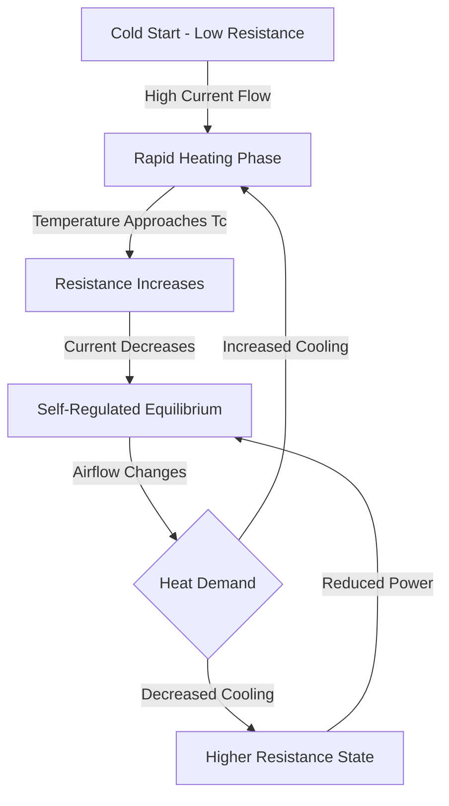
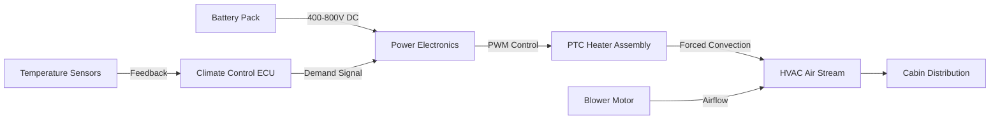

Electric heating systems have become essential components in modern automotive HVAC, particularly for battery electric vehicles (BEVs) and plug-in hybrid electric vehicles (PHEVs) that lack sufficient waste heat from internal combustion engines. These systems provide instantaneous cabin heating through direct electrical energy conversion, operating at voltage levels ranging from 12V DC for supplemental applications to 800V DC in high-performance EV architectures.

## Physical Principles of Electric Heating

Electric heating in automotive applications relies on Joule heating, where electrical current flowing through a resistive element generates thermal energy according to:

$$P = I^2 R = \frac{V^2}{R}$$

Where $P$ is power dissipated as heat (W), $I$ is current (A), $R$ is resistance (Ω), and $V$ is applied voltage (V). The thermal energy produced directly heats airflow passing over the element surface, with heat transfer governed by forced convection:

$$Q = h \cdot A \cdot (T_s - T_{\infty})$$

Where $Q$ is convective heat transfer rate (W), $h$ is convective heat transfer coefficient (W/m²·K), $A$ is surface area (m²), $T_s$ is surface temperature (K), and $T_{\infty}$ is airstream temperature (K). The coefficient $h$ depends strongly on air velocity, typically ranging from 25-250 W/m²·K for automotive HVAC applications.

## PTC Heater Technology

Positive Temperature Coefficient (PTC) heaters utilize ceramic semiconductor materials (typically barium titanate doped with rare earth elements) that exhibit exponentially increasing resistance with temperature. This self-regulating characteristic provides inherent thermal safety and power modulation.

### PTC Material Behavior

The resistance-temperature relationship follows:

$$R(T) = R_0 \cdot e^{\beta(T - T_c)}$$

Where $R_0$ is baseline resistance (Ω), $\beta$ is material constant (K⁻¹), $T$ is operating temperature (K), and $T_c$ is Curie temperature (K). As the PTC element heats beyond $T_c$, resistance increases dramatically, limiting current flow and preventing thermal runaway.

### PTC Element Construction

Modern automotive PTC heaters consist of multiple ceramic wafers sandwiched between aluminum heat exchanger fins. The assembly provides:

- **Electrical contact**: Conductive electrodes bonded to PTC ceramic faces
- **Heat transfer enhancement**: Extended fin surfaces increase convective area
- **Structural integrity**: Compression frames maintain contact pressure
- **Electrical isolation**: Insulating layers prevent chassis shorts

Typical PTC wafer dimensions range from 15-25 mm square with 3-5 mm thickness. Switching temperature ($T_c$) specifications vary from 120°C to 280°C depending on application requirements per SAE J2842.

## High-Voltage Heating Systems

Battery electric vehicles employ high-voltage heating systems (200-800V DC) to minimize current requirements and resistive losses in distribution wiring. Power capacity scales with voltage according to $P = V \cdot I$, enabling compact, lightweight designs.

### Voltage Architecture Comparison

| System Voltage | Typical Power | Current Draw | Cable Gauge | Application |
|----------------|---------------|--------------|-------------|-------------|
| 12V DC | 150-300 W | 12-25 A | 10-12 AWG | Seat heaters, mirrors |
| 48V DC | 1-2 kW | 20-40 A | 6-8 AWG | Mild hybrids, supplemental |
| 400V DC | 5-7 kW | 12-18 A | 10-12 AWG | BEV/PHEV primary heating |
| 800V DC | 7-10 kW | 9-12 A | 12-14 AWG | High-performance BEV |

Higher voltage operation reduces $I^2 R$ losses in distribution wiring. For a 5 kW heater, cable loss at 400V versus 12V:

At 400V: $I = 5000/400 = 12.5$ A, Cable loss (0.01 Ω) = $12.5^2 \times 0.01 = 1.56$ W

At 12V: $I = 5000/12 = 417$ A, Cable loss (0.001 Ω) = $417^2 \times 0.001 = 174$ W

The 400V system reduces wiring loss by 99% while enabling smaller conductors.

## Power Consumption and Heating Capacity

Electric heating efficiency is fundamentally limited by the conversion of chemical energy (battery) to thermal energy. The coefficient of performance (COP) for pure resistive heating is:

$$\text{COP} = \frac{Q_{\text{out}}}{W_{\text{in}}} \approx 1.0$$

This contrasts with heat pump systems achieving COP values of 2-4. However, electric heaters provide advantages in:

- **Instant response**: No warm-up delay (< 30 seconds to full output)
- **Simplicity**: Fewer components than heat pump systems
- **Low-temperature capability**: Effective operation below -20°C where heat pumps lose capacity
- **Cost**: Lower initial system cost

Typical heating loads for passenger vehicles range from 3-7 kW depending on ambient conditions and cabin volume. Energy consumption directly impacts driving range in BEVs:

$$\Delta \text{Range} = \frac{P_{\text{heat}} \cdot t}{\text{Battery Capacity} \times \text{Efficiency}} \times \text{EPA Range}$$

Operating a 5 kW heater for 1 hour in a 75 kWh BEV (300 mile range) reduces range by approximately:

$$\Delta \text{Range} = \frac{5 \times 1}{75 \times 0.9} \times 300 = 22 \text{ miles}$$

## Thermal Response Characteristics

Electric heating systems provide rapid thermal response compared to engine-based heating. The time constant for cabin temperature rise follows first-order dynamics:

$$T_{\text{cabin}}(t) = T_{\infty} + (T_0 - T_{\infty}) \cdot e^{-t/\tau}$$

Where $\tau$ is thermal time constant (s), $T_0$ is initial temperature (°C), and $T_{\infty}$ is steady-state temperature (°C). The time constant depends on:

$$\tau = \frac{m \cdot c_p}{h \cdot A + \dot{m}_{\text{air}} \cdot c_{p,\text{air}}}$$

Where $m$ is cabin thermal mass (kg), $c_p$ is specific heat capacity (J/kg·K), and $\dot{m}_{\text{air}}$ is ventilation rate (kg/s). Typical automotive cabins exhibit time constants of 300-600 seconds.

## Hybrid and EV Application Strategies

Modern electrified vehicles employ sophisticated heating strategies to balance comfort and efficiency:

**Battery Electric Vehicles (BEVs)**:
- High-voltage PTC heaters as primary heat source (5-7 kW)
- Heat pump systems for mild conditions (improving overall efficiency)
- Resistive heating for extreme cold (guaranteed capacity)
- Battery thermal preconditioning while charging

**Plug-in Hybrid Electric Vehicles (PHEVs)**:
- Supplemental electric heating during EV mode operation
- Engine coolant heating when ICE operates
- Blended control strategies optimizing fuel vs. electrical energy

**Mild Hybrids (48V)**:
- Supplemental heating to accelerate warm-up
- Reduced engine idling for cabin heating
- Enhanced defrost capability

Per SAE J2954 and J2907, electric heating systems must coordinate with battery thermal management to prevent excessive discharge rates during cold weather operation. Modern systems implement predictive cabin preconditioning while connected to grid power, minimizing range impact.

The fundamental trade-off in electric vehicle heating remains energy density: gasoline contains 33.7 kWh/gal of chemical energy, while battery packs provide 150-200 Wh/kg. Efficient heating strategies directly influence vehicle utility in cold climates.
